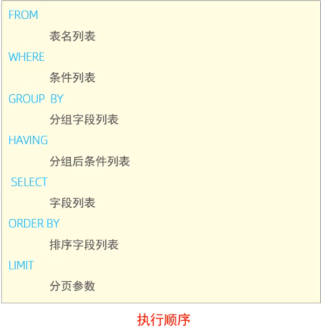

## SQL支持的数据类型

###    1.整数

​     bigint：用8个字节来存储正负数，范围：-2^63 到 2^63 -1

​     int：用4个字节来存储正负数，范围：-2^31 到 2^31 -1

​     smallint：用2 个字节来存储正负数，范围：-2^15 到 2^15 -1

​     tinyint：用1字节来存储正整数，范围：0 到 2^8-1

​     bit：值只能是0或1，当输入0以外的其他值时，系统均默认为是1

###    2.精确数值数据

​    decimal：存储从 -10^38+1 到 10^38-1 固定精度和范围的数据；必须指定范围和精度

​					例如，decimal(10,2)

### 3.浮点数值数据

​     float：用4个字节存储数据，最多可为53位

​     double：用8个字节存储数据

### 4.字符串数据

​     char：char(n) 固定的、长度为n个字符的字符串，不足的长度用空格补上

​     varchar：varchar(n)  可变的、最长长度为n个字符的字符串，如果有多余的空格则去掉

###     5.日期时间类型

| 类&nbsp;&nbsp;&nbsp;&nbsp;&nbsp;型 | 大&nbsp;小 | 范围                                       | 格式                   | 描述                     |
| ---------------------------------- | ---------- | ------------------------------------------ | ---------------------- | ------------------------ |
| DATE                               | 3          | 1000-01-01 至 9999-12-31                   | YYYY-MM-DD             | 日期值                   |
| TIME                               | 3          | -838:59:59 至 838:59:59                    | HH:MM:SS               | 时间值或持续时间         |
| YEAR                               | 1          | 1901 至 2155                               | YYYY                   | 年份值                   |
| DATETIME                           | 8          | 1000-01-01 00:00:00 至 9999-12-31 23:59:59 | YYYY-MM-DD	HH:MM:SS | 混合日期和时间值         |
| TIMESTAMP                          | 4          | 1970-01-01 00:00:01 至 2038-01-19 03:14:07 | YYYY-MM-DD HH:MM:SS    | 混合日期和时间值，时间戳 |


## SQL语句

### 分类

DDL：Date Definition Language      数据定义语言，&nbsp;&nbsp;&nbsp;&nbsp;用来定义数据对象(数据库，表，字段)

DML：Data Manipulation Language   数据操作语言，用来对数据表中的数据进行增删改

DCL：Data Control Language   数据控制语言，用来创建数据库用户，控制数据库的访问权限

DQL：Data Query Language   数据查询语言，用来查询数据表中的记录

 


### DDL

#### 数据库操作

   查询所有数据库

```mysql
show databases;
```

   创建数据库

```mysql
create database [ if not exists ]  数据库名  [ default charset 字符集 ]  [ collate 排序规则 ] ;
```

   删除数据库

```mysql
drop database [ if exists ]  数据库名 ;   #如果删除一个不存在的数据库，将会报错。
```

  切换/使用数据库

```mysql
use  数据库名;
```


#### 表结构操作

#####     创建与查询

  查询当前数据库中的所有表

```mysql
show  tables;
```

  查看某个表的结构    

```mysql
desc  表名;      #可以查看到指定表的字段，字段的类型、是否可以为NULL，是否存在默认值等信息。   
```

   查询指定表的建表语句     

```mysql
show  create  table  表名;   #在建表时未指定的参数也可以查出，结果是数据库的默认值。
```

   创建表结构

```mysql
create table 表名(

    字段1 字段1类型 [ comment 字段1注释 ],

    字段2 字段2类型 [comment 字段2注释 ],

    字段3 字段3类型 [comment 字段3注释 ],

    ......

    字段n 字段n类型 [comment 字段n注释 ]

) [ comment 表注释 ] ;    #最后一个字段后面没有逗号
```

#####   修改与删除

​      修改表名

```mysql
alter table 表名 rename to 新表名;
```

​      删除表

```mysql
drop table [if exists] 表名;
```

​     删除指定表，并重新创建该表

```mysql 
truncate table 表名;     #在删除表的时候，表中的全部数据也都会被删除。
```

​     添加字段

```mysql
alter table 表名 add 字段名 类型 (长度) [ comment 注释 ] [ 约束 ]; 
```

​      修改某字段的数据类型

```mysql
alter table  表名  modify  字段名 新数据类型 (长度); 
```

​       修改字段名和字段类型

```mysql
alter table 表名 change 旧字段名 新字段名 类型 (长度) [ COMMENT 注释 ] [ 约束 ]; 
```

​       删除字段

```mysql
alter table 表名 drop 字段名;
```


### DML

#### 添加数据

​    给指定字段添加数据

```mysql 
insert into  表名 (字段名1, 字段名2, ...) values (值1, 值2, ...); 
```

​    给所有字段添加数据

```mysql
insert into 表名 values (值1, 值2, ...);  #如果添加的数据包含所有字段的话字段名称可以省略
```

​    批量添加数据

```mysql
insert into  表名 (字段名1, 字段名2, ...) VALUES (值1, 值2, ...), (值1, 值2, ...), (值1, 值2, ...) ;
```

```mysql
insert into  表名 values (值1, 值2, ...), (值1, 值2, ...), (值1, 值2, ...) ; 
```

​    注意事项:

​       1.插入数据时，指定的字段顺序与给定的值的顺序是一一对应的。

​       2.插入时，指定的字段名的顺序可与表定义中的顺序不一致

​       3.如果只指定部分属性列，则插入的记录在其余属性列上取NULL

​       4.字符串和日期型数据应该包含在引号中。

​       5.插入的数据大小，应该在字段的规定范围内。


#### 修改数据

```mysql
update  表名 set 字段名1 = 值1 , 字段名2 = 值2 , .... [ where 条件 ] ;  #没有where子句表示修改所有的记录
```

​     例：

```mysql
#修改语句的条件可以有，也可以没有，如果没有条件，则会修改整张表的所有数据。

#修改id为1的数据, 将name修改为小昭, gender修改为 女
 
 update employee set name = '小昭' , gender = '女' where id = 1; 

#将所有的员工入职日期修改为 2028-01-01
 
 update employee set entrydate = '2028-01-01'; 
```


#### 删除数据

```mysql
delete from 表名 [ where 条件 ] ; 
```

   如果想要限制删除的行数，则可以使用limit子句，但要配合order by 子句使用，否则删除的可能不是预期的数据。

   例：

​      删除gender为女的员工

```mysql
delete from employee where gender = '女'; 
```

​     删除所有员工

```mysql
delete from employee; 
```

​    注意事项：

​        1.delete语句的条件可以有，也可以没有，如果没有条件，则会删除整张表的所有数据。

​        2.delete语句不能删除某一个字段的值，但可以使用update，将该字段值置为null即可。


### DQL

#### 分类

   基本查询（不带任何条件）

   条件查询（where）

   聚合函数（count、max、min、avg、sum）

   分组查询（group by）

   排序查询（order by）

   分页查询（limit）

#### 基础查询

  在基本查询的DQL语句中，不带任何的查询条件，查询的语法如下

   查询多个字段

```mysql
select 字段1, 字段2, 字段3 ... from  表名 ; 
```

   查询结果中将字段设置为其他名称

```mysql
select  字段1 [ as 别名1 ] , 字段2 [ as 别名2 ] ... from  表名; 

select  字段1 [ 别名1 ] , 字段2 [ 别名2 ] ... from  表名; 
```

   去除重复记录

```mysql
select distinct  字段列表  from  表名; 
```

   distinct注意事项：

​      1.如果列具有null值，并且对该列使用distinct子句，MySQL将保留一个null值，因为distinct子句将所有null值视为相同的值。

​      2.在与聚合函数结合使用时，MySQL在**将聚合函数应用于结果集之前删除重复的行**。

 例：要计算美国客户的唯一state列的值

```mysql
select 

    count(distinct state)
    
from

    customers
    
where

    country = 'USA';
```

​      3.如果要将distinct子句与limit子句一起使用，MySQL会在查找到limit子句中指定的行数时立即停止。 

​         即，如果想要查询三条数据，但三条数据中有两条是重复的，则结果就会只显示两条数据，不会再继续查找。

​      4.distinct还可以根据多个字段的组合来进行去重操作，确保多个字段的组合是唯一的：

​         distinct 字段1,字段2,字段3,...


#### 条件查询

```mysql
select 字段列表 from 表名 where 条件列表 ; 
```

  条件：

  常用的比较运算符：

| 比较运算符         | 功能                                                         |
| :----------------- | :----------------------------------------------------------- |
| >                  | 大于                                                         |
| >=                 | 大于等于                                                     |
| <                  | 小于                                                         |
| <=                 | 小于等于                                                     |
| =                  | 等于                                                         |
| <> 或 !=           | 不等于                                                       |
| between  x  and  y | 在某个范围内（包含最小值、最大值）                           |
| in(a,b,c...)       | 选择一个in之后的列表中的值，多选一                           |
| like  '占位符'     | 模糊匹配，**下划线_匹配单个任意字符, %匹配任意个任意字符**，只在where子句中使用 |
| is null            | 要求字段为null                                               |
| is not null        | 要求字段不为null                                             |

​		  			 

  常用逻辑运算符：      

| 逻辑运算符 | 功能                         |
| :--------- | :--------------------------- |
| and 或 &&  | 并且（多个条件同时成立）     |
| or 或 \|\| | 或者（多个条件任意一个成立） |
| not 或 !   | 非，不是                     |

   多字段使用in查询

   语法：

```mysql
select * from t where (a,c) in ((a1,c1),(a2,c2));


-- 该语法也支持子查询:

 select * from t where (a,c) in (select n.a,n.c from n );
```

​    例：

​    查询有身份证号的员工信息------非空

```mysql
select * from emp where idcard is not null;    #is not null  代表非空
```

​    查询年龄不等于30的员工的信息-----不等于

```mysql
#等价写法
select * from emp where age != 88;

select * from emp where age <> 88;
```

​    查询年龄在25岁(包含) 到 30岁(包含)之间的员工信息-----指定范围

```mysql
#等价写法
select * from emp where age >= 25 && age <= 30;

select * from emp where age >= 25 and age <= 30;

select * from emp where age between 25 and 30;
```

​    查询年龄等于18 或 20 或 40 的员工信息-----多选一

```mysql
#等价写法
select * from emp where age = 18 or age = 20 or age =40;

select * from emp where age in(18,20,40);
```

​    查询姓名为两个字的员工的信息-----匹配字符

```mysql
select * from emp where name like '__';    #使用like关键字，下划线匹配单个任意字符
```

​	查询身份证号最后一位是X的员工信息

```mysql
select * from emp where idcard like '%X';   # %匹配任意个任意字符

select * from emp where idcard like '_________________X';  #下划线匹配单个字符
```

   查询身份证第四位是4且最后一位是0的员工

```mysql
select * from emp where idcard like '___4%0';  #三个下划线匹配三个任意字符，第四位是4，然后匹配任意个字符，最后一位是			  
```


#### 聚合函数

   **将一列数据作为一个整体，进行纵向计算。**

​    即，计算表中记录的总数、计算某个字段列下数据的总和，以及计算表中某个字段下的最大值、最小值或者平均值。

​    **也可以对SQL语句的返回结果使用这些函数。**

​       函数                		作用

​       avg()             	返回某列的平均值

​       count()         	 返回某列的行数

​       max( )           	返回某列的最大值

​       min( )           	 返回某列的最小值

​       sum( )           	返回某列的和

  语法：

```mysql
 select  聚合函数(字段列表)  from  表名 ;   #NULL值不参与所有聚合函数的运算。
```

 1.count( )函数

​	 统计数据表中包含的记录的总数，或者统计返回的查询结果中的数据总行数。

​     count(*)    计算表中的总行数，不管某列是否有数值或者为空行

```mysql
select count(*) as stu_num from students;
```

​     count(字段名)    计算指定字段下总的行数，计算时将忽略空值的行。

```mysql
select count(idcard) from employee;  #统计的是idcard字段不为null的记录数
```

​    

 2.sum( )函数  

​    返回指定列的总和

​    统计西安地区员工的年龄之和

```mysql
select sum(age) from emp where workaddress = '西安'; 
```

​    可以与group by一起使用，来计算每个分组的总和

```mysql
select sum(age) from emp group by gender;  #将员工按照性别分组，并计算每组员工的年龄总和
```

​     

 3.avg( )函数

​    通过计算返回的行数和每一行数据的和，求得指定字段下数据的平均值。

​    可以与group by一起使用，来计算每个分组的平均值。

​    avg函数会忽略值为null的行。

```mysql
select avg(age) as 年龄 from emp group by gender;  #计算每组员工的年龄平均值，并将查询字段显示为'年龄'
```


 4.max( )和min( )   

   返回指定字段中的最大值和最小值，都可以联合group by进行使用

```mysql
select max(age) as 年龄 from emp group by gender;
```

   也可以对字符串类型的数据进行比较，按照ASCII码的大小进行比较。


#### 分组查询

 1.语法

```mysql
select 字段列表 from 表名 [ where 条件 ] group by 分组字段名 [ having 分组后过滤条件 ];
```

 2.where与having的区别

​    执行时机不同：where是分组之前进行过滤，不满足where条件，不参与分组，且**where后面不能使用聚合函数**；

​                        而having是分组之后再对结果进行过滤。

​                        即，**where过滤掉的是记录，having过滤掉的是分组。**

​    判断条件不同：where不能对聚合函数进行判断，而having可以。

​    注意：

​       1.**分组之后，查询的字段一般为聚合函数和分组字段，查询其他字段无任何意义。**   

​       2.**执行顺序：where > group by > 聚合函数 > having 。**

​       3.**支持多字段分组, 具体语法为 : group by columnA,columnB**

   例：

​      根据性别分组 , 统计男性员工 和 女性员工的平均年龄

```mysql
select gender, avg(age) from emp group by gender ;   #查询的字段为gender和聚合函数   gender为分组字段  
```

​      查询年龄小于45的员工 , 并根据工作地址分组 , 获取员工数量大于等于3的工作地址

```mysql
select wordaddress count(*) address_count from emp where age<45 group by workaddress having  
   
   address_count>=3
   
#先执行where语句过滤掉一部分数据，然后执行group by语句，将剩下的数据按照wordaddress分组,再执行聚合函数，

#计算出每个分组中数据的总行数，将结果赋给address_count,最后执行having语句，过滤掉数据总行数小于3的分组。

```

​      统计各个工作地址上班的男性及女性员工的数量-----使用多字段分组

```mysql
select workaddress, gender, count(*) '数量' from emp group by gender,workaddress;

/*
 使用多字段分组，因为gender在前，所以分组结果是先按gender将员工分成两个大组，
 
  然后在两个大组中按照workaddress的不同再将两个大组分成多个小组。
  
结果:
gender   workaddress    数量
 女	      上海			     1
 女		    北京					 4
 女		    天津					 1
 女		    西安					 1
 男	      上海					 2
 男		    北京		 			 4
 男		    江苏					 2
 男		    西安					 1
 
如果是select workaddress, gender, count(*) '数量' from emp group by workaddress,gender; 那么结果是:

workaddress   gender     数量
   上海	      	女					1
   上海		  		男					2
   北京		  		女					4
   北京		  		男					4
   天津		  		女					1
   江苏		  		男					2
   西安		  		女					1
   西安	  	  	男					1

即，先按照workaddress的不同分成大组，然后按照gender的不同再分成小组。

selec后面两个词的顺序影响的是展示结果的顺序。

*/
```


#### 排序查询

 1.语法

```mysql
select  字段列表 from  表名 order by 字段1 排序方式1 , 字段2 排序方式2 ; 
```

 2.排序方式

​    ASC：升序（默认值）

​    DESC：降序

 3.注意事项

​    •  如果是升序, 可以不指定排序方式 ;

​    •  如果是多字段排序，当第一个字段值相同时，才会根据第二个字段进行排序，以此类推 ;

​    例：

​       根据年龄对公司的员工进行升序排序

```mysql
select * from emp order by age asc;

select * from emp order by age;
```

​      根据入职时间, 对员工进行降序排序

```mysql
select * from emp order by entrydate desc; 
```

​      根据年龄对公司的员工进行升序排序 , 如果年龄相同 , 再按照入职时间进行降序排序

```mysql
select * from emp order by age asc , entrydate desc; 
```

