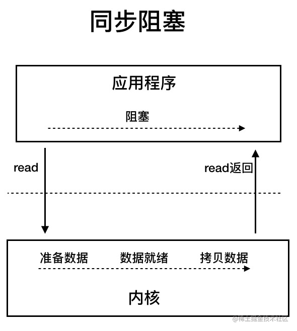

<!-- permalink: /    -->

## 定义

   应用程序并不存在实质的IO过程，真正的IO过程是操作系统的事，这里把应用程序的IO操作分为两种：IO调用和IO执行。

   IO调用是由进程发起，IO执行是操作系统的工作。因此，更准确些来说，此时所说的**IO是应用程序对操作系统IO功能的一次触发，即IO调用。**

   IO调用的目的是将进程的内部数据迁移到外部(输出)，或者是将外部数据迁移到进程内部(输入)。

   UNIX 系统下， IO 模型一共有 5 种： **同步阻塞 I/O**、**同步非阻塞 I/O**、**I/O 多路复用**、**信号驱动 I/O** 和 **异步 I/O**。

## 阻塞和非阻塞

   **阻塞和非阻塞强调的是进程对于操作系统IO是否处于就绪状态的处理方式。**

   进程的IO调用是否能得到立即执行是需要操作系统IO处于就绪状态的，对于读取数据的操作，如果操作系统IO处于

   未就绪状态，**当前进程或线程如果一直等待直到其就绪，该种IO方式为阻塞IO。**

   **如果进程或线程并不一直等待其就绪，而是可以做其他事情，这种方式为非阻塞IO。**

   所以对于非阻塞IO，编程时需要经常去轮询就绪状态。

### 阻塞(Blocking I/O)

 应用程序中，进程在发起IO调用后至内核执行IO操作返回结果之前，若发起系统调用的进程一直处于等待状态 ，则此次IO操作为阻塞IO。

​	 

### 非阻塞

内核接收到请求后，就会立即返回，然后用户进程通过轮询的方式来拉取处理结果。

​     	

非阻塞IO虽然相对于阻塞IO大幅提升了性能，其依然存在性能问题，也就是频繁的轮询导致频繁的系统调用，会耗费大量的CPU资源。

## IO多路复用

### select/poll

  解决NIO的思路就是减少无效的系统调用，**Select是内核提供的系统调用，它支持一次查询多个系统调用的可用状态**，

  当任意一个结果状态可用时就会返回，用户进程再发起一次系统调用进行数据读取。

换句话说，就是NIO中N次的系统调用，借助Select，只需要发起一次系统调用就够了。

**它可以让单个进程具有处理多个 I/O 事件的能力。又被称为 Event Driven I/O，即事件驱动 I/O。**

​	

​	但是，select有一个限制，就是存在连接数限制，针对于此，又提出了**poll。其与select相比，主要是解决了连接限制**。

   select/poll 虽然解决了NIO重复无效系统调用用的问题，但同时又引入了新的问题。问题是：

​       &ensp;1。用户空间和内核空间之间进行大量的数据拷贝

​       &ensp;2。内核循环遍历IO状态，浪费CPU时间

   换句话说，**select/poll虽然减少了用户进程发起的系统调用，但内核的工作量只增不减**。在高并发的情况下，内核的性能

   问题依旧。所以**select/poll的问题本质是：内核存在无效的循环遍历**。

### epoll

   

​	epoll相较于select/poll，多了两次系统调用，其中epoll_create建立与内核的连接，epoll_ctl注册事件，epoll_wait阻塞

​    用户进程，等待IO事件。

​		

## 信号驱动I/O

   信号驱动IO与BIO和NIO最大的区别就在于，**在IO执行的数据准备阶段，不会阻塞用户进程。**

   当用户进程需要等待数据的时候，会向内核发送一个信号，告诉内核我要什么数据，然后用户进程就继续做别的事情去了，而当内核中

​      的数据准备好之后，内核立马发给用户进程一个信号，说”数据准备好了，快来查收“，用户进程收到信号之后，立马调用

​      recvfrom，去查收数据。

​	  

​    	       

   乍一看，信号驱动式I/O模型有种异步操作的感觉，但是在IO执行的第二阶段，也就是将数据从内核空间复制到用户空间

​    这个阶段，用户进程还是被阻塞的。

   综上，不管是BIO还是NIO还是SIGIO，它们最终都会被阻塞在IO执行的第二阶段。

## 异步I/O

​	异步IO真正实现了IO全流程的非阻塞。用户进程发出系统调用后立即返回，内核等待数据准备完成，然后将数据拷贝到

   用户进程缓冲区，然后发送信号告诉用户进程**IO操作执行完毕。**

   **与SIGIO相比，一个是发送信号告诉用户进程数据准备完毕，一个是IO执行完毕。**

​		

​		所以，**之所以称为异步IO，取决于IO执行的第二阶段是否阻塞**。**因此BIO，NIO和SIGIO均为同步IO。**

​		

## 对比

​		

## Java中3种常见 IO 模型

### BIO(Blocking I/O)

   **BIO 属于同步阻塞 IO 模型** 。

   同步阻塞 IO 模型中，**应用程序发起 read 调用后，会一直阻塞，直到内核把数据拷贝到用户空间。**

​		  

​	在客户端连接数量不高的情况下，是没问题的。但是，当面对十万甚至百万级连接时，传统的 BIO 模型是无能为力的。

### NIO 

**(Non-blocking/New I/O)**

Java 中的 NIO 于 Java 1.4 中引入，对应 `java.nio` 包，提供了 `Channel` ， `Selector`，`Buffer` 等抽象类。

NIO 中的 N 可以理解为 Non-blocking，不单纯是 New。

**它是支持面向缓冲的，基于通道的 I/O 操作方法。** 对于高负载、高并发的(网络)应用，应使用 NIO 。

Java 中的 NIO 可以看作是 **I/O 多路复用模型**。也有很多人认为，Java 中的 NIO 属于同步非阻塞 IO 模型。

​	     

​     同步非阻塞 IO 模型中，应用程序会一直发起 read 调用，等待数据从内核空间拷贝到用户空间的这段时间里，

​     线程依然是阻塞的，直到内核把数据拷贝到用户空间。

​     相比于同步阻塞 IO 模型，同步非阻塞 IO 模型确实有了很大改进。通过轮询操作，避免了一直阻塞。

​     但是，这种 IO 模型同样存在问题：**应用程序不断进行 I/O 系统调用轮询数据是否已经准备好的过程十分消耗 CPU 资源。**

​		     

​	  IO 多路复用模型中，线程首先发起 select 调用，询问内核数据是否准备就绪，等内核把数据准备好了，用户线程

​      再发起 read 调用。read 调用的过程（数据从内核空间 -> 用户空间）还是阻塞的。

> 目前支持 IO 多路复用的系统调用，有 select，epoll 等等。select 系统调用，目前几乎所有的操作系统上都支持。
>
> - **select 调用** ：内核提供的系统调用，它支持一次查询多个系统调用的可用状态。几乎所有的操作系统都支持。
> - **epoll 调用** ：linux 2.6 内核，属于 select 调用的增强版本，优化了 IO 的执行效率。

​	  **IO 多路复用模型，通过减少无效的系统调用，减少了对 CPU 资源的消耗。**

​	  Java 中的 NIO ，有一个非常重要的**选择器 ( Selector )** 的概念，也可以被称为 **多路复用器**。

​     通过它，只需要一个线程便可以管理多个客户端连接。当客户端数据到了之后，才会为其服务。

​         

### AIO

   Asynchronous I/O，AIO 也就是 NIO 2。Java 7 中引入了 NIO 的改进版 NIO 2，它是异步 IO 模型。

   异步 IO 是基于事件和回调机制实现的，也就是应用操作之后会直接返回，不会阻塞在那里，当后台处理完成，

   操作系统会通知相应的线程继续后续的操作。

​     

​	     

### 对比

​	  

