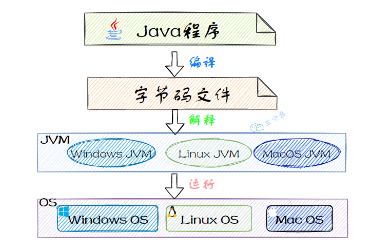
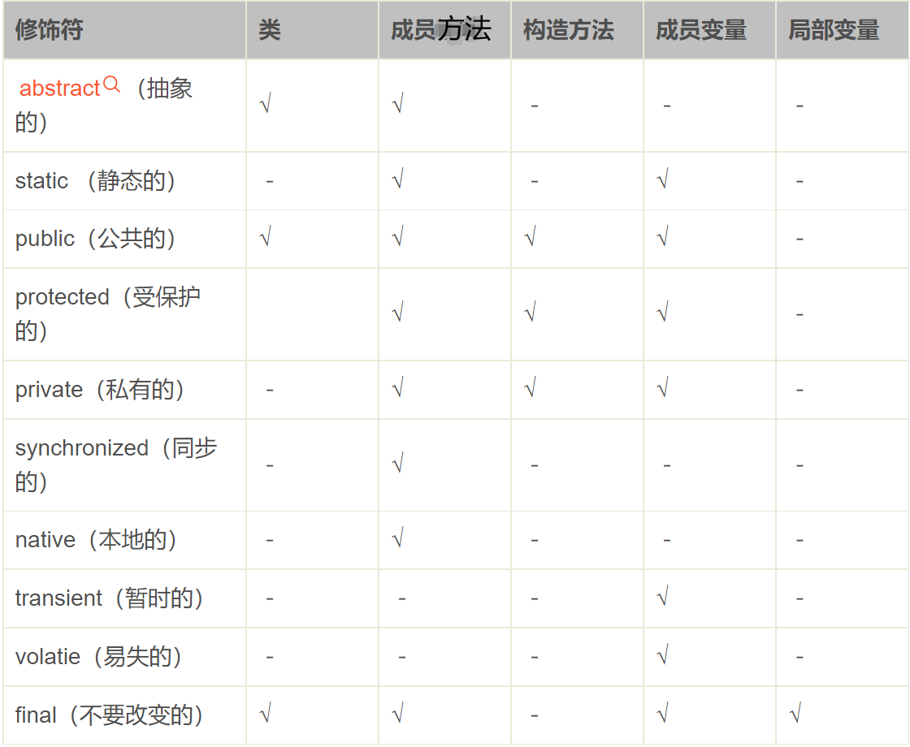
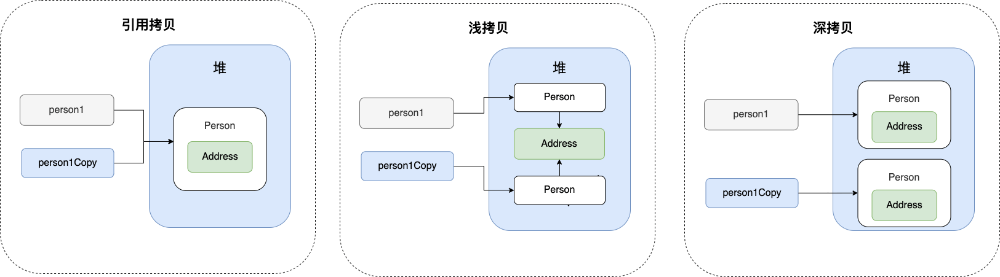
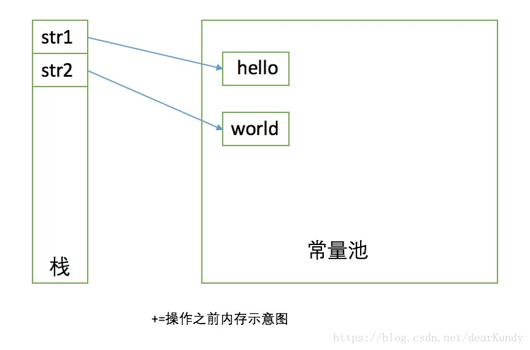
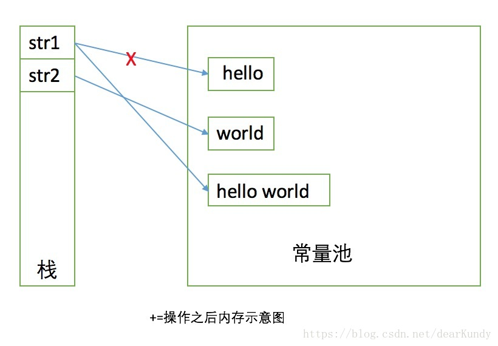

<!-- permalink: /面试/Java/Java基础 -->

#### **1.为什么说 Java 语言“编译与解释并存”？**

这是因为 Java 语言既具有编译型语言的特征，也具有解释型语言的特征。

因为 Java 程序要经过先编译，后解释两个步骤，由 Java 编写的程序需要先经过编译步骤，生成字节码文件，

这种字节码文件必须由 Java 解释器来解释执行。

  **编译型** ：编译型语言会通过编译器将源代码一次性翻译成可被该平台执行的机器码。

​    &emsp;&emsp;&emsp;&emsp;一般情况下，编译语言的执行速度比较快，开发效率比较低。常见的编译性语言有 C、C++、Go、Rust 等等。

  **解释型** ：解释型语言会通过解释器一句一句的将代码解释（interpret）为机器代码后再执行。

  &emsp;&ensp;&emsp;&emsp;&emsp;解释型语言开发效率比较快，执行速度比较慢。常见的解释性语言有 Python、JavaScript、PHP 等等。

  JDK 9 引入了一种新的编译模式 AOT(Ahead of Time Compilation)，它是直接将字节码编译成机器码，这样就避免了 JIT 预热等各方面的开销。

   JDK 支持分层编译和 AOT 协作使用。

​      


#### **2.字符型常量和字符串常量的区别**

1. 形式：字符常量是单引号引起的一个字符，字符串常量是双引号引起的 0 个或若干个字符。

2. 含义：字符常量相当于一个整型值( ASCII 码)，可以参加表达式运算; 字符串常量代表一个地址(字符串在内存中的位置)

3. 占内存大小：字符常量只占 2 个字节; 字符串常量占若干个字节。

4. 注意：**char类型 在 Java 中占两个字节**

    

#### **3.静态方法为什么不能调用非静态成员?**

1. 静态方法是属于类的，在类加载的时候就会分配内存，可以通过类名直接访问。而非静态成员属于实例对象，只有在对象实例化之后才存在，需要通过类的实例对象去访问。

2. 在类的非静态成员不存在的时候静态方法就已经存在了，此时调用在内存中还不存在的非静态成员，属于非法操作。

3. **可以在静态方法中创建该方法所属类的实例对象，然后通过实例对象调用非静态变量和方法。**

     

#### **4.重载和重写**

重载：方法名必须相同，参数类型不同、个数不同、顺序不同，方法返回值和访问修饰符可以不同。

  &ensp;&ensp;&ensp;&ensp;&ensp;&ensp;发生在同一个类中 或父类和子类之间(不使用@Overload注解，直接定义相同的方法名)，发生在编译时。

重写：

1. 方法名、参数列表必须相同，子类方法返回值类型应小于等于父类方法返回值类型，抛出的异常范围小于等于父类，

   访问修饰符的范围要大于等于父类。**（总结：一大两小两同，发生在运行时）**

&ensp;&ensp;  说明：**如果方法的返回类型是 void 和基本数据类型，则方法重写时返回值类型不可修改。**

  &ensp;&ensp;&ensp;&ensp;&ensp;&ensp;&ensp;&ensp;&ensp;&ensp;**但是如果方法的返回值是引用类型，重写时可以返回该引用类型的子类。**

2. 如果父类方法的访问修饰符为 private则无法被继承，如果是final 或 static，则只能继承不能重写，但可以在子类中定义与父类重名的方法。

3. 构造方法无法被重写。

>**小知识**：
>
>在父类中定义了一个方法，如果想在子类中进行重写，可以使用@Override注解，重写时遵循重写的规则；
>
>如果不使用@Override注解，则也可以定义一个重名的方法，此时，该方法与父类中原方法没有任何关系，返回值类型、
>
>访问权限、异常范围和参数类型都可以和原方法不同。

  **对比：**       

| 区别点     | 重写方法                           | 重载方法 |
| ---------- | ---------------------------------- | -------- |
| 方法名     | 不能修改                           | 不能修改 |
| 参数列表   | 不能修改                           | 必须修改 |
| 返回类型   | 和父类相同或者是父类返回类型的子类 | 可以修改 |
| 访问修饰符 | 可以扩大但不能缩小                 | 可以修改 |
| 异常       | 不能抛出新的或者范围更大的异常     | 可以修改 |

为什么说方法重载发生在编译时，方法重写发生在运行时？

1. 在java中，方法调用被翻译成字节码指令，并且在编译时期就已经确定了调用的方法。当java编译器遇到一个方法调用

   时，它会根据传递给方法的参数类型来决定调用哪个重载方法。如果找到匹配的方法，编译器就会生成对应的字节

   码，并把它写入到.class文件中。

   因此，**java中的方法重载是静态绑定的，因为编译器在编译时期就已经决定了调用哪个方法。**          

2. 当使用父类变量引用子类对象并调用该方法时，编译器无法确定调用哪个方法，因为一个对象的类型可能是其本身或

   其子类类型。因此，在运行时，Java 虚拟机根据对象的实际类型动态地查找该方法的实现版本，以便执行正确的

   方法。这个过程就是动态绑定。 

   因此，方法重写发生在运行时，也就是说，在编译时编译器并不知道对象的实际类型。**在方法调用时，Java 编译器会查找对象的实际类型，然后根据实际类型去动态选择匹配的方法。**         


#### **5.==和equals的区别**

  == ： 基本数据类型使用" == " 比较的是值，引用数据类型使用"=="比较的是内存地址

  equals() ： 一般有两种使用情况：

​	&ensp;&ensp;情况1：类没有重写 equals() 方法。则通过 equals() 比较该类的两个对象时，比较的是两个对象的内存地址。

​	&ensp;&ensp;情况2：类重写了 equals() 方法。一般会重写 equals() 方法来比较两个对象的内容是否相等；若它们的内容相等，

&ensp;&ensp;&ensp;&ensp;&ensp;&ensp;&ensp;&ensp;&ensp;  则返回 true。 (即，认为这两个对象相等)                   

#### **6.基本类型和包装类型的区别**

- 作为成员变量时，包装类型不赋值就是 `null` ，而基本类型有默认值且不是 `null`。

- 包装类型可用于泛型，而基本类型不可以。

- 基本数据类型的局部变量存放在 Java 虚拟机栈中的局部变量表中，基本数据类型的成员变量(未被 `static` 修饰)存放在 Java 虚拟机的堆中。包装类型属于对象类型，几乎所有对象实例都存放在堆中。

- 相比于对象类型， 基本数据类型占用的空间非常小。

####  **7.包装类型的缓存机制**

  `Byte`，`Short`，`Integer`，`Long` 这 4 种包装类默认创建了数值 **[-128，127]** 的相应类型的缓存数据，

   `Character` 类创建了数值在 **[0,127]** 范围的缓存数据，`Boolean` 直接返回 `True` 或 `False`。

#### **8.&和&&的区别**

   &是逻辑与运算，&&是短路与运算。

   共同点：都需要两边的表达式为true整个表达式的值才是true。

   不同点：如果&&左边的表达式的值为false，则会直接结束判断，右边的表达式不会进行运算，如同被直接短路掉。

   逻辑或运算符（|）和短路或运算符（||）的差别也是如此。


#### **9.switch 作用在 byte/long/String 上**

   Java5 以前 switch(expr)中，expr 只能是 byte、short、char、int。

   从 Java 5 开始，Java 中引入了枚举类型， expr 也可以是 enum 类型。

   从 Java 7 开始，expr 还可以是字符串(String)，但是长整型(long)在目前所有的版本中都是不可以的。

   即，switch表达式值的类型可以为：char, byte, short, int, Character, Byte, Short, Integer, String,  enum。

#### **10.JVM的处理异常**

编译后的字节码文件中会包含一个Exception Table，即异常表。表中包含了一个或多个异常处理者(Exception Handler)的信息：

- **from** 可能发生异常的起始点
- **to** 可能发生异常的结束点
- **target**  上述from和to之间发生异常后的异常处理者的位置
- **type**  异常处理者能处理的异常类信息

过程：

​	1.JVM会在当前出现异常的方法中查找异常表，寻找是否有合适的处理者来处理异常。

​    2.如果当前方法异常表不为空，并且异常符合处理者的from和to节点，并且type也匹配，则JVM会target找到异常处理者来处理这个异常。

​    3.如果在第二步没有找到合适的处理者，则继续查找异常表中的剩余条目。

​    4.如果当前方法的异常表无法处理，则向上查找（弹栈处理）刚刚调用该方法的调用处，并重复上面的操作。

​    5.如果所有的栈帧被弹出，仍然没有处理，则抛给当前的Thread，Thread则会终止。

​    6.如果当前Thread为最后一个非守护线程，且未处理异常，则会导致JVM终止运行。

#### **11.Object类的常见方法总结**

```java
public final native Class<?> getClass()
//native方法，用于返回当前运行时对象的Class对象，使用了final关键字修饰，故不允许子类重写。
    
public native int hashCode() 
//native方法，用于返回对象的哈希码，主要使用在哈希表中，比如JDK中的HashMap。
    
public boolean equals(Object obj)
//用于比较2个对象的内存地址是否相等，String类对该方法进行了重写用于比较字符串的值是否相等。
    
protected native Object clone() throws CloneNotSupportedException
//native方法，用于创建并返回当前对象的一份拷贝。
//一般情况下，对于任何对象 x，表达式 x.clone() != x 为true，x.clone().getClass()== x.getClass() 为true。
//Object本身没有实现Cloneable接口，所以不重写clone方法并且进行调用的话会发生CloneNotSupportedException异常。
    
public String toString()
//返回 "对象所属类的名称"+ "@" + "实例的哈希码的16进制字符串"。例:com.vkls.List_Test@74a14482
//建议Object所有的子类都重写这个方法。
    
public final native void notify()
//native方法，不能重写。唤醒一个在此对象监视器上等待的线程(监视器相当于锁的概念)。如果有多个线程等待只会任意唤醒一个。
    
public final native void notifyAll()
//native方法，并且不能重写。跟notify一样，唯一的区别就是会唤醒在此对象监视器上等待的所有线程，而不是一个线程。
    
public final native void wait(long timeout) throws InterruptedException
//native方法，不能重写。暂停线程的执行。注意：sleep方法没有释放锁，而wait方法释放了锁。timeout是等待时间。
    
public final void wait(long timeout, int nanos) throws InterruptedException
//多了nanos参数，这个参数表示额外时间（以毫微秒为单位，范围是 0-999999）。 所以超时的时间还需要加上nanos毫秒。
    
public final void wait() throws InterruptedException
//与上面两个wait方法一样，只不过该方法会一直等待，没有超时时间这个概念。
    
protected void finalize() throws Throwable { }
//实例被垃圾回收器回收的时候触发的操作
```


#### **12.访问修饰符**

- **public**：对所有类可见。可以修饰类、接口、方法、变量。

- **default**(默认，什么也不写)：在同一包内可见，不使用任何修饰符。可以修饰类、接口、方法、变量。

- **protected** : 可以修饰变量、方法；对同一包内的类和所有子类可见。

  &ensp;  包内可见：如果是静态变量，则在其他类中可以通过类名访问；如果不是静态变量，则在其他类中，可以通过该类的实例对象进行访问。

    &ensp;&ensp;包外子类可见：如果包外的其他类继承了该类，则可以通过子类的实例对象访问，但不能被通过多态的方式创建的实例对象访问。

  &ensp;&ensp;**注意：不能修饰外部类；如果一个类想要在包外被其他类继承，则只能用public修饰。**

- **private** : 在同一类内可见。可以修饰变量、方法。**注意：不能修饰外部类**

#### **13.非访问修饰符**

- **abstract**

​    修饰类-----抽象类

​    &ensp;&ensp;抽象类不能用来实例化对象，声明抽象类的唯一目的是为了将来对该类进行扩充。

​    &ensp;&ensp;**如果一个类包含抽象方法，那么该类一定要声明为抽象类，否则将出现编译错误。**

​     &ensp;&ensp;**抽象类可以包含抽象方法和非抽象方法。抽象类也可以不包含抽象方法。**

​	  &ensp;&ensp;抽象类不能直接实例化，但可以参照多态的方式，通过父类引用指向子类对象的方式实现实例化。

​    修饰方法----抽象方法

​    &ensp;&ensp;抽象方法是一种没有任何实现的方法，该方法的具体实现由子类提供。

​     &ensp;&ensp;**抽象方法不能被声明为 final 和 static。**

​     &ensp;&ensp;**任何继承抽象类的子类必须实现父类的所有抽象方法(使用@Override注解)，除非该子类也是抽象类。**

​    抽象类和普通类的区别：

​       &ensp;&ensp;1、抽象类的存在是为了被继承，不能实例化，而普通类的存在是为了实例化一个对象。

​       &ensp;&ensp;2、抽象类的子类必须重写抽象类中的抽象方法，而普通类可以选择重写父类的方法，也可以直接调用父类的方法。

​		&ensp;&ensp;3、**抽象类也可以含有普通成员属性和普通方法。**

  &ensp;&ensp;&ensp;&ensp;&ensp;&ensp;抽象类也可以有构造方法，当被子类继承时，该构造方法的调用时机和被继承的普通父类一样。

​		&ensp;&ensp;4、**普通类和抽象类都可以继承别的类或者被别的类继承。**

​		&ensp;&ensp;5、普通类和抽象类的属性和方法都可以通过子类对象来调用。

​    接口中的变量和方法： 

​    &ensp;&ensp;1、接口中的变量默认都被public final static 修饰，无法修改。

​    &ensp;&ensp;2、接口中的方法默认是public修饰，不能有具体实现；如果方法被default修饰，则可以在接口中实现该方法。


- **final**

​     用来修饰类、方法和变量

​     final 修饰的类不能够被继承，final类中的成员变量可以根据需要设为final，final类中的所有成员方法都会被隐式地指定为final方法。

​     final修饰的方法可以被子类继承，但不能被子类重写。

​     **final修饰的变量不可修改，如果修饰的是引用类型的变量(例如，数组)，则不能再让其指向另一个对象，但对象中的内容可以修改；** 

​     **被final修饰的变量必须显式指定初始值：**

​      &ensp;&ensp;可以在定义变量时赋值；也可以在非静态代码块中对变量进行赋值；还可以在构造方法中对变量进行赋值；

​       &ensp;&ensp;如果该变量同时还被static修饰，则还可以在静态代码块中进行赋值。

​     **final 修饰的变量一般和 static 联用，因为该变量无法修改，所以没有必要在每个对象里都保存一份。**

​          **定义在方法中的局部变量只能被final修饰。**

​     


- **finally**

​    当在 `try` 块或 `catch` 块中遇到 `return` 语句时，`finally` 语句块将在方法返回之前被执行。

​    **不要在 finally 语句块中使用 return**：当 try 块和 finally 块中都有 return 语句时，try 语句块中的 return 语句会被忽略。

​    &ensp;&ensp;这是因为 try 语句中的 return 返回值会**先被暂存在一个本地变量中**，当执行到 finally 语句中的 return 之后，这个本地

&ensp;&ensp;&ensp;变量的值就变为了 finally 语句中的 return 返回值。

​    finally不会执行的情况：

​    &ensp;&ensp;1、在finally语句块中发生了异常。

​    &ensp;&ensp;2、在前面的代码中用了System.exit()退出程序。

​    &ensp;&ensp;3、程序所在的线程死亡。

​    &ensp;&ensp;4、关闭CPU。

#### **13.多态**

 实现多态的前提：

1. 有继承/实现的关系

2. 有方法重写

3. 有父类/接口类引用指向子类/实现类对象   

​      &ensp;&ensp;例：Animal  A=new Cat( );    //Cat类是Animal类的子类

  多态中成员访问特点：

1. 成员变量

​    &ensp;&ensp;编译看左边，执行看左边 (即，如果Animal类中有该变量，则编译成功，且执行时也是用的Animal中该变量的值)

2. 成员方法

​    &ensp;&ensp;编译看左边，执行看右边 (即，如果Animal类中有该方法，则编译成功；但执行时是看Cat类中该方法的具体实现；

​                                 &ensp;&ensp;&ensp;&ensp;如果Cat类中没有该方法，则执行父类中的方法)    

&ensp; **3. 但不能让A执行一个父类中没有而子类中独有的方法。**


#### **14.成员变量与局部变量的区别**

1. 从语法形式上看：

   成员变量是属于类的，而局部变量是在方法中定义的变量或是方法的参数；成员变量可以被 public , private , static 等修饰符所修饰，而局部变量不能被访问控制修饰符及 static 所修饰；

   但是，**成员变量和局部变量都能被 final 所修饰**。

2. 从变量在内存中的存储方式来看：

   如果成员变量是使用 static 修饰的，那么这个成员变量是属于类的，如果没有使用 static 修饰，这个成员变量是属于实例的。

   对象存储在堆内存，如果局部变量类型为基本数据类型，那么存储在栈内存；如果为引用数据类型，那么栈内存中存放的是指向堆内存中对象的引用地址或者是指向常量池中的地址。

3. 从变量在内存中的生存时间上看：

   成员变量是对象的⼀部分，它随着对象的创建而存在，而局部变量随着方法调用的结束而自动消失。

4. 赋予初始值：

   成员变量如果没有被赋初值，则会自动以类型的默认值而赋值（例外：被 final 修饰的成员变量也必须显式赋值），

   而局部变量必须手动赋予初始值。

#### **15.接口和抽象类有什么共同点和区别？**

**共同点** ：

- 都不能被实例化。
- 都可以包含抽象方法。
- 都可以有默认实现的方法（Java 8 可以用 `default` 关键字在接口中定义默认方法）。

**区别** ：

- 接口主要用于对类的行为进行约束，你实现了某个接口就具有了对应的行为。抽象类主要用于代码复用，强调的是所属关系。

- 接口中的方法默认是 public，所有方法在接口中不能有实现(从Java 8 开始，接口中可以定义default方法），抽象类可以有非抽象的方法。

- 一个类只能继承一个类，但是可以实现多个接口。

- 一个类实现接口的话要实现接口的所有方法，如果继承抽象类，要实现抽象类中的所有抽象方法。

- 接口中的成员变量只能是 `public static final` 类型的，不能被修改且必须有初始值，而抽象类的成员变量默认为default，可在子类中被重新定义，也可被重新赋值。


#### **16.深拷贝和浅拷贝**

   浅拷贝：**浅拷贝会在堆上创建一个新的对象**(区别于引用拷贝的一点)。但是，如果原对象内部的属性是引用类型的话，

​     &ensp;&ensp;&ensp;&ensp;&ensp;&ensp;&ensp;&ensp;浅拷贝会直接复制内部对象的引用地址，也就是说拷贝对象和原对象共用同一个内部对象。

   深拷贝 ：深拷贝会完全复制整个对象，包括这个对象所包含的内部对象。

​    


#### **17.HashCode**

1. 当把对象加入 `HashSet` 时，`HashSet` 会先计算对象的 `hashCode` 值来判断对象加入的位置，同时也会与其他已经

   加入的对象的`hashCode` 值作比较，如果没有相等的 `hashCode`，`HashSet` 会认为对象没有重复出现。

2. 但是如果发现有相同 `hashCode` 值的对象，就会调用 `equals()` 方法来判断 `hashCode` 相等的对象是否真的相同。

 &ensp;&ensp;&ensp;如果两者相同，`HashSet` 就不会让其加入。如果不同的话，就会重新散列到其他位置。

3. `Object` 的 `hashCode()` 方法是本地方法，是用 C 或 C++ 实现的，**该方法通常用来将对象的内存地址转换为整数之后返回。**

4. **在一些容器(比如 HashMap、HashSet)中，有了 hashCode() 之后，判断元素是否在对应容器中的效率会更高。**

  **重写 equals() 时必须重写 hashCode() 方法**：

  &ensp;&ensp;因为两个相等的对象的 `hashCode` 值必须是相等的。

&ensp;&ensp;即，如果 `equals` 方法将两个对象判断为是相等的，那么这两个对象的 `hashCode` 值也要相等.      

​     &ensp;&ensp;如果重写 `equals()` 时没有重写 `hashCode()`就可能会导致 `equals` 判断是相等的两个对象`hashCode` 值却不相等


#### **18.String类不可变的原因**

1. 保存字符串的char型数组被 `private final` 修饰，并且`String` 类没有提供修改这个数组(数组是引用类，是可以修改其中的内容的)的方法。

   但是在StringBuilder中提供了相应的方法让可以去修改value数组中的元素，这也是StringBuilder的可变的原因。

2. `String` 类被 `final` 修饰导致其不能被继承，从而避免了子类破坏 `String` 的不可变。

3. String类的拼接操作(+)以及concat方法和replace方法都不会对原来的对象产生影响，都会返回一个新的对象。

   例：

   ```java
   String str1 = "hello";
           
   // 打印str1的内存地址   str1的内存地址：1922154895          
   System.out.println("str1的内存地址：" + System.identityHashCode(str1));
           
   String str2 = "world";
           
   str1 += str2; 
           
   // str1的内存地址已经改变了   执行+=后str1的内存地址：883049899       
   System.out.println("执行+=后str1的内存地址：" + System.identityHashCode(str1));
   // 拼接之后str1的值：helloworld        
   System.out.println("拼接之后str1的值：" + str1);
   ```

   分析： 

   &ensp;&ensp;str1+=str2 实际上是执行了str1= new StringBuilder(str1).append(str2).toString()  前后实际产生了一个

   &ensp;&ensp;StringBuilder对象和一个helloworld的字符串常量。

   ​			  

​                      

4. 通过反射可以改变String的内容。

   ```java
   public static void main(String[] args) throws Exception {
           
       String str = "Hello World";
           
       System.out.println("修改前的str:" + str);
           
       System.out.println("修改前的str的内存地址" + System.identityHashCode(str));
           
       // 通过反射获取String类中的value字段        
       Field valueField = String.class.getDeclaredField("value");
           
       // 改变value属性的访问权限        
       valueField.setAccessible(true);
           
       // 获取str对象上value属性的值        
       char[] value = (char[]) valueField.get(str);
          
       // 改变value数组中的字符        
       value[3] = '?';
           
       System.out.println("修改后的str:" + str);
           
       System.out.println("修改前的str的内存地址" + System.identityHashCode(str));    
   }
   
   /*
   修改前的str:Hello World
   修改前的str的内存地址1922154895
   
   修改后的str:Hel?o World
   修改前的str的内存地址1922154895
   */
   ```

   

#### **19.实参的传递方式**

**值传递**

1. 如果参数是基本类型的话，传递的就是基本类型的字面量值的拷贝，会创建副本。

2. 如果参数是引用类型，传递的就是实参所引用的对象在堆中地址值的拷贝，**同样也会创建副本**。

    **即，如果是引用类型进行传递，则会将对象的地址值复制一份进行传递，这样传递后就会有两个变量指向同一个地址**

  例1：

```java
public static void main(String[] args) {

    int[] arr = { 1, 2, 3, 4, 5 };   

    change(arr);

    System.out.println(arr[0]);  //输出0
}

public static void change(int[] array) {

    //将数组的第⼀个元素变为0
    array[0] = 0;
    
    System.out.println(array[0]); //输出0
}
```

  array和 arr 指向的是同一个数组对象。因此，外部对引用对象的改变会反映到所对应的对象上。


  例2：

```java
public static void main(String[] args) {

    // TODO Auto-generated method stub
    Student s1 = new Student("⼩张");

    Student s2 = new Student("⼩李");

    Test.swap(s1, s2);

    System.out.println("s1:" + s1.getName());

    System.out.println("s2:" + s2.getName());
}

public static void swap(Student x, Student y) {

    Student temp = x;

    x = y;

    y = temp;
    
    System.out.println("x:" + x.getName());

    System.out.println("y:" + y.getName());
}

//输出
x:⼩李
y:⼩张
    
s1:⼩张
s2:⼩李
```

  交换之前s1和x(s1的拷贝)都指向name为小张的student对象，s2和y(s2的拷贝)都指向name为小李的student对象；

  交换之后，x指向了name为小李的student对象，y指向了name为小张的student对象。

  由此可得，**swap方法并没有改变存储在变量s1和s2中的对象引用，swap方法的参数x和y被初始化为两个对象引用的拷贝，即，创建了副本。**

​     **这个方法交换的是x和y两个变量指向的地址，而不是交换的s1和s2两个变量指向的地址，x和y就是创建的副本。**


#### **20.intern方法的作用**

  `String.intern()` 是一个 native 方法，其作用是**将指定的字符串对象的引用保存到字符串常量池中**，可以简单分为两种情况：

- 如果字符串常量池中保存了对应的字符串对象的引用，就直接返回该引用。
- 如果字符串常量池中没有保存对应的字符串对象的引用，那就在常量池中创建一个指向该字符串对象的引用并返回。

```java
// 在堆中创建字符串对象"Java"
// 且，会将字符串对象"Java"的引用保存在字符串常量池中
String s1 = "Java";

// 直接返回字符串常量池中字符串对象"Java"的引用
String s2 = s1.intern();

// 会在堆中再单独创建一个字符串对象
String s3 = new String("Java");

// 直接返回字符串常量池中字符串对象"java"的引用
String s4 = s3.intern();

// s1 和 s2 指向的是堆中的同一个对象
System.out.println(s1 == s2); // true

// s3 和 s4 指向的是堆中不同的对象，因为在执行s3.intern()时，字符串常量池中已经有了对字符串对象"Java"的引用，
// 所以会直接返回该引用，所以s4是指向了堆中的s1对象
System.out.println(s3 == s4); // false

// s1 和 s4 指向的是堆中的同一个对象
System.out.println(s1 == s4); //true
```

