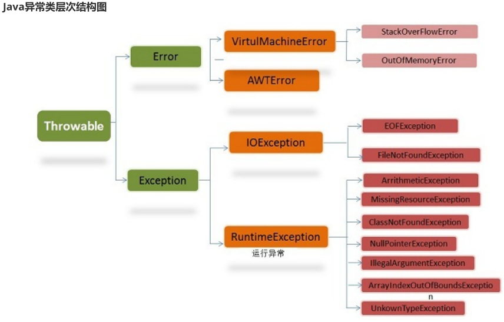

<!-- permalink: /面试/Java/异常和序列化  -->

## 异常类

​    

### Exception和Error的区别

在 Java 中，所有的异常都有一个共同的祖先： `java.lang` 包中的 `Throwable` 类。

`Throwable` 类有两个重要的子类：

- **`Exception`**：程序本身可以处理的异常，可以通过 `catch` 来进行捕获。`Exception` 又可以分为 Checked Exception (受检查异常，必须处理) 和 Unchecked Exception (不受检查异常，可以不处理)。

- **`Error`**：Error 属于程序无法处理的错误 ，也可以通过 `catch` 来进行捕获，但不建议通过`catch`捕获 。

   &ensp;&ensp;例如， Java 虚拟机运行错误(`Virtual MachineError`)、虚拟机内存不够错误(`OutOfMemoryError`)、

   &ensp;&ensp;类定义错误(`NoClassDefFoundError`)等 。这些异常发生时，Java 虚拟机（JVM）一般会选择线程终止。

  

 **Checked Exception 和 Unchecked Exception** 

&ensp; Checked Exception 即 受检查异常 ，又称为编译期异常，Java 代码在编译过程中，如果受检查异常没有被

&ensp; `catch`或者`throws` 关键字处理的话，就没办法通过编译。

 &ensp;&ensp;常见的有IOException、ClassNotFoundException、SQLException、FileNotFountException...

​     **除了RuntimeException 及其子类以外，其他的 Exception 类及其子类都属于受检查异常。**

&ensp;Unchecked Exception 即 **不受检查异常** ，Java 代码在编译过程中 ，即使不处理不受检查异常也可以正常通过编译。

  ` RuntimeException` (存放在java.lang 包中)及其子类都统称为非受检查异常，常见的有：

- `NullPointerException`(空指针异常)

- `IllegalArgumentException`(参数异常 比如，方法传入参数类型错误)

- `NumberFormatException`（字符串转换为数字格式异常，`IllegalArgumentException`的子类）

- `ArrayIndexOutOfBoundsException`（数组越界异常）

- `ClassCastException`（类型转换异常）

- `ArithmeticException`（算术运算异常）

- `SecurityException` （安全异常比如权限不够）

   

### Throwable 类常用方法

- `String getMessage()`： 返回异常发生时的简要描述

- `String toString()`： 返回异常发生时的详细信息

- `String getLocalizedMessage()`： 返回异常对象的本地化信息。使用 `Throwable` 的子类覆盖这个方法，可以生成本地化信息。如果子类没有覆盖该方法，则该方法返回的信息与 `getMessage()`返回的结果相同。

- `void printStackTrace()`： 在控制台上打印 `Throwable` 对象封装的异常信息。

  

### 异常的处理

   

​	

1. **throws 用在方法上，后面跟的是异常类，可以跟多个；而 throw 用在方法内，后面跟的是异常对象。**

​    &ensp;1.使用throws声明抛出异常的思路是，当前方法不知道如何处理这种类型的异常，该异常应该由上一级调用者处理；

​    &ensp;&ensp;&ensp;如果main方法也不知道如何处理这种类型的异常，也可以使用throws声明抛出异常，该异常将交给JVM处理。

​    &ensp;&ensp;&ensp;JVM对异常的处理方法是，打印异常的跟踪栈信息，并中止程序运行。

  &ensp;&ensp;2.当Java运行时接收到开发者自行抛出的异常时，同样会中止当前的执行流，跳到该异常对应的catch块，由该catch块来处理该异常。

&ensp;&ensp;&ensp;&ensp;即，不管是系统自动抛出的异常，还是程序员手动抛出的异常，Java运行时环境对异常的处理没有差别。

```java
public static void main(String[] args) throws Exception {
        
    try {
            
        int a=Integer.parseInt(args[0]);
            
        int b=Integer.parseInt(args[1]);
            
        int c=a/b;
            
        if(b==0)
                
           throw new Exception("除数不能为0");
                                
        System.out.println("您输入的两个数相除的结果是"+c);
        
    }catch(Exception e) {
            
        System.out.println("未知异常");        
    }    
}
```


2. **try catch 捕获异常**

   在 catch 语句块中捕获发生的异常，并进行处理。

```java
try {
            
  //包含可能会出现异常的代码以及声明异常的方法
        
}catch(ExceptionName1 e){

  //当产生ExceptionName1异常时的处理措施

}catch(ExceptionName2 e){

  //当产生ExceptionName2异常时的处理措施
    
}finally {                                                       
            
  //可选，无论是否捕捉到异常都会执行
        
}
```

三个语句块的问题：

1. try、catch、finally三个语句块均不能单独使用，三者可以组成 try...catch...finally、try...catch、try...finally三种结构，

   catch语句可以有一个或多个，finally语句最多一个。

2. try、catch、finally三个代码块中变量的作用域为代码块内部，分别独立而不能相互访问。

   如果要在三个块中都可以访问，则需要将变量定义到这些块的外面。

3. **有多个catch块的时候，只会匹配其中一个异常类然后执行该catch块中的代码，而不会再执行其它的catch块，**

   **且匹配catch语句的顺序为从上到下(即，书写顺序)，也有可能所有的catch块都没有被执行。**

4. **先Catch子类异常再Catch父类异常，即，先小后大。**


例1：

```java
public static void main(String[] args) {
        
   try {
                    
       int a=Integer.parseInt(args[0]);
                    
       int b=Integer.parseInt(args[1]);
                    
       int c=a/b;
                    
       System.out.println("您输入的两个数相除的结果是"+c);    
       
    }catch(IndexOutOfBoundsException e) {
                  
       System.out.println("数组越界，运行时参数不够");
        
    }catch(NumberFormatException e) {
            
       System.out.println("数字格式异常");
        
    }catch(ArithmeticException e) {
            
       System.out.println("算术异常");
    
    //父类异常放在后面    
    }catch(Exception e) {
            
       System.out.println("未知异常");        
   }   
}
//先Catch子类异常再Catch父类异常，如果把Exception e 放在前面，则具体的异常信息就无法知道了。
```

  

**在Java7之前，每个catch块只能捕获一个异常，Java7之后，每个catch块可以捕获多种类型的异常。**

例2：

```java
public static void main(String[] args) {
        
    try {
            
        int a=Integer.parseInt(args[0]);
            
        int b=Integer.parseInt(args[1]);
            
        int c=a/b;
            
        System.out.println("您输入的两个数相除的结果是"+c);
        
     }catch(IndexOutOfBoundsException | NumberFormatException | ArithmeticException e) {
            
        System.out.println("数组越界，数字格式异常，算术异常");
        
     }catch(Exception e) {
            
        System.out.println("未知异常");        
    }    
}
```


## 序列化

### 定义

- **序列化**： 将数据结构或对象转换成二进制字节流的过程
- **反序列化**：将在序列化过程中所生成的二进制字节流转换成数据结构或者对象的过程

序列化和反序列化常见应用场景：

- 对象在进行**网络传输**（比如远程方法调用 RPC 的时候）之前需要先被序列化，接收到序列化的对象之后需要再进行反序列化；

- 将对象**存储到文件**之前需要进行序列化，将对象从文件中读取出来需要进行反序列化；

- 将对象**存储到数据库**（如 Redis）之前需要用到序列化，将对象从缓存数据库中读取出来需要反序列化；

- 将对象**存储到内存**之前需要进行序列化，从内存中读取出来之后需要进行反序列化。

  **序列化的主要目的是通过网络传输对象或者说是将对象存储到文件系统、数据库、内存中。**

**对应的网络协议**

   OSI 七层协议模型中，表示层做的事情主要就是对应用层的用户数据进行处理转换为二进制流。反过来的话，就是将二进制流转换成应用层的用户数据。就是对应的序列化和反序列化。

### 常见的序列化协议

   JDK 自带的序列化方式一般不会用 ，因为序列化效率低并且存在安全问题。

​    比较常用的序列化协议有 Hessian、Kryo、Protobuf、ProtoStuff，这些都是基于二进制的序列化协议。

​    像 JSON 和 XML 这种属于文本类序列化方式。虽然可读性比较好，但是性能较差，一般不会选择。

#### **JDK自带**

   JDK 自带的序列化，只需实现 `java.io.Serializable`接口即可。

```java
@AllArgsConstructor
@NoArgsConstructor
@Getter
@Builder
@ToString
public class RpcRequest implements Serializable {
    private static final long serialVersionUID = 1905122041950251207L;
    private String requestId;
    private String interfaceName;
    private String methodName;
    private Object[] parameters;
    private Class<?>[] paramTypes;
    private RpcMessageTypeEnum rpcMessageTypeEnum;
}
```

#####   **serialVersionUID 作用**

​	 序列化号 `serialVersionUID` 属于版本控制的作用。

​	 反序列化时，会检查 `serialVersionUID` 是否和当前类的 `serialVersionUID` 一致。

​	 如果 `serialVersionUID` 不一致则会抛出 `InvalidClassException` 异常。强烈推荐每个序列化类都手动指定其

​        `serialVersionUID`，如果不手动指定，那么编译器会动态生成默认的 `serialVersionUID`。

#####   **static修饰的变量**

​	 `static` 修饰的变量是静态变量，位于方法区，本身是不会被序列化的。 `static` 变量是属于类的而不是对象。

​	 反序列之后，`static` 变量的值就像是默认赋予给了对象一样，看着就像是 `static` 变量被序列化，实际只是假象。

#####   **transient**

​	 作用：对象实例中用此关键字修饰的的变量不会被序列化；当对象被反序列化时，被 `transient` 修饰的变量值不会被序列化和恢复。

​	 关于 `transient` 还有几点注意：

- `transient` 只能修饰变量，不能修饰类和方法。
- `transient` 修饰的变量，在反序列化后变量值将会被置成类型的默认值。例如，如果是修饰 `int` 类型，那么反序列后结果就是 `0`。
- `static` 变量因为不属于任何对象，所以无论有没有 `transient` 关键字修饰，均不会被序列化。

**不推荐的原因**

​	**不支持跨语言调用**：如果调用的是其他语言开发的服务的时候就不支持了。

​	**性能差**：相比于其他序列化框架性能更低，主要原因是序列化之后的字节数组体积较大，导致传输成本加大。

​	**存在安全问题**：序列化和反序列化本身并不存在问题。但当输入的反序列化的数据可被用户控制，那么攻击者即可通过构造恶意输入让反序列化产生非预期的对象，在此过程中执行构造的任意代码。

#### **Kryo**

   Kryo 是一个高性能的序列化/反序列化工具，由于其变长存储特性并使用了字节码生成机制，拥有较高的运行速度和较小的字节码体积。

   另外，Kryo 已经是一种非常成熟的序列化实现了，已经在 Twitter、Groupon、Yahoo 以及多个著名开源项目（如 Hive、Storm）中广泛的使用。

#### **Protobuf**

  Protobuf 出自于 Google，性能还比较优秀，也支持多种语言，同时还是跨平台的。

  就是在使用中过于繁琐，因为需要自己定义 IDL 文件和生成对应的序列化代码。这样虽然不灵活，但是，另一方面导致 protobuf 没有序列化漏洞的风险。Protobuf 包含序列化格式的定义、各种语言的库以及一个 IDL 编译器。

正常情况下需要定义 proto 文件，然后使用 IDL 编译器编译成需要的语言。

 


