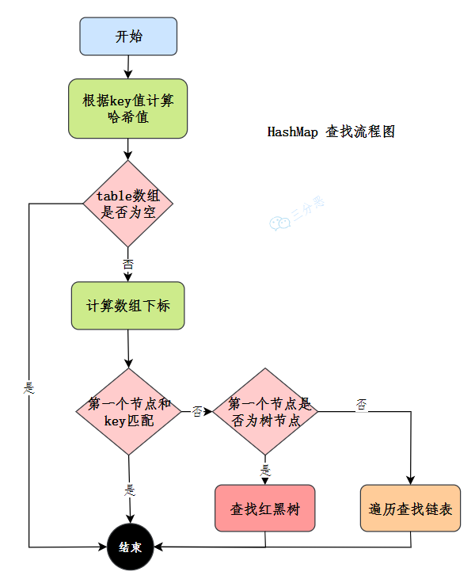
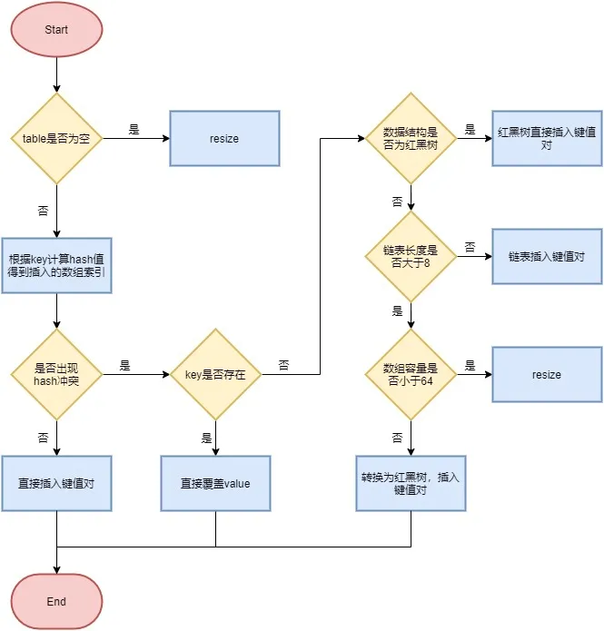

<!--permalink: /面试/Java/集合框架  -->


## 继承关系


   


## 底层数据结构

#### **List**

- `ArrayList`： Object[] 数组，允许存入null元素

- `Vector`：Object[] 数组
- `LinkedList`： 双向链表(**JDK1.6 之前为双向循环链表，JDK1.7 取消了循环**)

#### **Set**

  `  HashSet`(无序，唯一)： 基于 `HashMap` 实现的，底层采用 `HashMap` 来保存元素

  `LinkedHashSet`： `LinkedHashSet` 是 `HashSet` 的子类，并且其内部是通过 `LinkedHashMap` 来实现的。

&ensp;&ensp;&ensp;&ensp;有点类似于 `LinkedHashMap` 其内部是基于 `HashMap` 实现一样。

  `TreeSet`(有序，唯一)： 红黑树(自平衡的排序二叉树)

#### **Queue**

- `PriorityQueue`： Object[]数组来实现二叉堆

- `ArrayQueue`： Object[] 数组 + 双指针

#### **Map**

- HashMap： 

  JDK1.8 之前 `HashMap` 由数组+链表组成，数组是 `HashMap` 的主体，链表则是为了解决哈希冲突("拉链法")。

  JDK1.8 以后在解决哈希冲突时有了较大的变化，**当链表长度大于阈值(默认为 8)且当前数组的长度大于 64时，**

  **会将链表转化为红黑树，以减少搜索时间。如果数组长度小于64，则会进行扩容。**

- LinkedHashMap： 

  `LinkedHashMap` 继承自 `HashMap`，所以它的底层仍然是基于拉链式的散列结构，即，由数组和链表或红黑树组成。

  另外，`LinkedHashMap` 在上面结构的基础上，增加了一条双向链表，使得上面的结构可以保持键值对的插入顺序。

  同时通过对链表进行相应的操作，实现了访问顺序相关逻辑。

- Hashtable： 数组+链表组成的，数组是 Hashtable 的主体，链表则是为了解决哈希冲突。

- TreeMap： 红黑树(自平衡的排序二叉树)

## Collection

### List实现类

**1.ArrayList 和 Vector 的区别**

- `ArrayList` 是 `List` 的主要实现类，底层使用 `Object[]`存储，适用于频繁的查找工作，线程不安全 ；

- `Vector` 是 `List` 的古老实现类，底层使用`Object[]` 存储，是线程安全的；

**2.ArrayList 与 LinkedList 区别**

- **是否保证线程安全：** `ArrayList` 和 `LinkedList` 都是不同步的，也就是不保证线程安全；

- **底层数据结构：** `ArrayList` 底层使用的是 **`Object` 数组**；`LinkedList` 底层使用的是 **双向链表** 

- 插入和删除是否受元素位置的影响：

  - `ArrayList` 采用数组存储，所以插入和删除元素的时间复杂度受元素位置的影响。 比如：执行`add(E e)`方法时， 

    `ArrayList` 会默认将指定的元素追加到此列表的末尾，这种情况时间复杂度就是 O(1)。

    但是如果要**在指定位置 i 插入和删除元素的话**(`add(int index, E element)`)**时间复杂度就为 O(n-i)。**

       因为在进行上述操作的时候，集合中第 i 和第 i 个元素之后的(n-i)个元素都要向后/向前移动一位。

  - `LinkedList` 采用链表存储，所以，如果是在头尾插入或者删除元素，则不受元素位置的影响

    (`add(E e)`、`addFirst(E e)`、`addLast(E e)`、`removeFirst()` 、 `removeLast()`)，时间复杂度为 O(1)，

    如果是要**在指定位置插入和删除元素**的话(`add(int index, E element)`，`remove(Object o)`)， **时间复杂度为 O(n)**
    
    **因为需要先移动到指定位置再插入**。

- **是否支持快速随机访问：** ArrayList(实现了RandomAccess接口)支持高效的随机元素访问，LinkedList 不支持。

  ​            &ensp;&ensp;快速随机访问就是通过元素的序号快速获取元素对象(对应于`get(int index)`方法)。

- **内存空间占用：** 

  ArrayList 的空间浪费主要体现在在 list 列表的结尾会预留一定的容量空间，而 LinkedList 的空间花费则体现在

  它的每一个元素都需要消耗比 ArrayList 更多的空间(因为要存放直接后继和直接前驱以及数据)


**3.ArrayList的扩容机制**

   &ensp;&ensp;ArrayList是基于数组的集合，数组的容量是在定义的时候确定的，如果数组满了，再插入，就会发生溢出。

   &ensp;&ensp;所以在插入时候，会先检查是否需要扩容，如果当前容量+1超过数组长度，就会进行扩容。

   &ensp;&ensp;ArrayList的扩容是创建一个**1.5倍**的新数组，然后把原数组的值拷贝过去。


**4.快速失败(fail-fast)和安全失败(fail-safe)**

   &ensp;**快速失败(fail—fast)：** 快速失败是Java集合的一种错误检测机制

- 在用迭代器遍历一个集合对象时，如果线程A遍历过程中，线程B对集合对象的内容进行了修改(增加、删除、修改)，

  则会抛出Concurrent Modification Exception。

- 原理：迭代器在遍历时直接访问集合中的内容，并且在遍历过程中使用一个 `modCount` 变量。集合在被遍历期间，

  如果内容发生变化，就会改变`modCount`的值。每当迭代器使用hashNext()/next()遍历下一个元素之前，

  都会检测modCount变量是否为expectedmodCount值，是的话就返回遍历；否则抛出异常，终止遍历。

- 注意：这里异常的抛出条件是检测到 modCount != expectedmodCount 这个条件。如果集合发生变化时，

     &ensp;&ensp;将modCount值刚好又设置为了expectedmodCount值，则异常不会抛出。

  &ensp;&ensp;因此，不能依赖于这个异常是否抛出而进行并发操作的编程，这个异常只建议用于检测并发修改的bug。

  

&ensp;**安全失败(fail—safe)**

- 采用安全失败机制的集合容器，在遍历时不是直接在集合内容上访问的，而是**先复制原有集合内容，在拷贝的集合上进行遍历**。

- 原理：由于迭代时是对原集合的拷贝进行遍历，所以在遍历过程中对原集合所作的修改并不能被迭代器检测到，所以不会触发Concurrent Modification Exception。

- 缺点：虽然避免了Concurrent Modification Exception，但同样地，迭代器并不能访问到修改后的内容，

  ​	&ensp;&ensp;即：**迭代器遍历的是开始遍历那一刻拿到的集合拷贝，在遍历期间原集合发生的修改迭代器是不知道的。**


#### **5.CopyOnWriteArrayList**

   CopyOnWriteArrayList是线程安全版的ArrayList。

   CopyOnWriteArrayList采用了一种读写分离的并发策略，容器允许并发读，读操作是无锁的，性能较高。

   在进行写操作(比如添加一个元素)时，会**先将当前容器复制一份，然后在新副本上执行写操作**，**结束之后再将原容器的引用指向新容器。**

​      


### Set实现类

#### **1.Comparable 和 Comparator 的区别**

- `Comparable` 接口出自java.lang包，它有一个 `compareTo(Object obj)`方法用来排序

- `Comparator` 接口出自 java.util 包，它有一个`compare(Object obj1, Object obj2)`方法用来排序

 例：重写 compareTo 方法实现按年龄来排序

```java
@Data
public  class Person implements Comparable<Person> {
    private String name;
    private int age;
    
    /**
     * T重写compareTo方法实现按年龄来排序
     */
    //大于时返回1，则按升序排列；如果大于时返回-1，则按降序排列
    @Override
    public int compareTo(Person o) {
        
        if (this.age > o.getAge()) {
            return 1;
        }
        
        if (this.age < o.getAge()) {
            return -1;
        }
        
        return 0;
    }
}
```

#### **2.HashSet、LinkedHashSet 和 TreeSet 三者的异同**

- `HashSet`、`LinkedHashSet` 和 `TreeSet` 都是 `Set` 接口的实现类，都能保证元素唯一，并且**都是线程不安全的**。

- `HashSet`、`LinkedHashSet` 和 `TreeSet` 的主要区别在于底层数据结构不同。

  `HashSet` 的底层数据结构是哈希表(基于 `HashMap` 实现)。

  `LinkedHashSet` 的底层数据结构是链表和哈希表，元素的插入和取出顺序满足 FIFO。

  `TreeSet` 底层数据结构是红黑树，元素是有序的，排序的方式有自然排序和定制排序。

- 底层数据结构的不同又导致这三者的应用场景不同。

  HashSet用于不需要保证元素插入和取出顺序的场景，LinkedHashSet用于保证元素的插入和取出顺序满足FIFO的场景，

  TreeSet用于支持对元素自定义排序规则的场景。

### Queue

#### **1.Queue 与 Deque 的区别**

- `Queue` 是单端队列，只能从一端插入元素，另一端删除元素，实现上一般遵循 **先进先出(FIFO)** 规则。

  `Queue` 扩展了 `Collection` 的接口，根据 **因为容量问题而导致操作失败后处理方式的不同** 可以分为两类方法： 

  一种在操作失败后会抛出异常，另一种则会返回特殊值。

|  Queue 接口  | 抛出异常  | 返回特殊值 |
| :----------: | :-------: | :--------: |
|   插入队尾   | add(E e)  | offer(E e) |
|   删除队首   | remove()  |   poll()   |
| 查询队首元素 | element() |   peek()   |

- **`Deque` 是双端队列，在队列的两端均可以插入或删除元素。**

  `Deque` 扩展了 `Queue` 的接口, 增加了在队首和队尾进行插入和删除的方法，同样根据失败后处理方式的不同分为两类：

|  Deque接口   |   抛出异常    |   返回特殊值    |
| :----------: | :-----------: | :-------------: |
|   插入队首   | addFirst(E e) | offerFirst(E e) |
|   插入队尾   | addLast(E e)  | offerLast(E e)  |
|   删除队首   | removeFirst() |   pollFirst()   |
|   删除队尾   | removeLast()  |   pollLast()    |
| 查询队首元素 |  getFirst()   |   peekFirst()   |
| 查询队尾元素 |   getLast()   |   peekLast()    |

`Deque` 还提供有 `push()` 和 `pop()` 等其他方法，可用于模拟栈。


#### **2.ArrayDeque 与 LinkedList 的区别**

`ArrayDeque` 和 `LinkedList` 都实现了 `Deque` 接口，两者都具有队列的功能。

- `ArrayDeque` 是基于可变长的数组和双指针来实现，而 `LinkedList` 则通过链表来实现。

- `ArrayDeque` 不支持存储 `NULL` 数据，但 `LinkedList` 支持。

- `ArrayDeque` 插入时可能存在扩容过程， 不过均摊后的插入操作依然为 O(1)。

  虽然 `LinkedList` 不需要扩容，但是每次插入数据时均需要申请新的堆空间，均摊性能相比更慢。

 从性能的角度上，选用 `ArrayDeque` 来实现队列要比 `LinkedList` 更好。此外，`ArrayDeque` 也可以用于实现栈。


#### **3.PriorityQueue**

  `PriorityQueue` 与 `Queue` 的区别在于元素出队顺序是与优先级相关的，即总是优先级最高的元素先出队。

其相关的一些要点：

- `PriorityQueue` 利用了二叉堆的数据结构来实现的，底层使用可变长的数组来存储数据

- `PriorityQueue` 通过堆元素的上浮和下沉，实现了在 O(logn) 的时间复杂度内插入元素和删除堆顶元素。
- `PriorityQueue` 是非线程安全的，且不支持存储 `NULL` 和 `non-comparable` 的对象。
- `PriorityQueue` 默认是小顶堆，但可以接收一个 `Comparator` 作为构造参数，从而来自定义元素优先级的判定。


## Map

### HashMap

#### **1.HashMap 和 Hashtable 的区别**

- 线程是否安全：

  `HashMap` 是非线程安全的，`Hashtable` 是线程安全的，

  因为 `Hashtable` 内部的方法基本都经过`synchronized` 修饰。(如果要保证线程安全的话就使用 `ConcurrentHashMap` )；

- 效率： 因为线程安全的问题，`HashMap` 要比 `Hashtable` 效率高一点。

- 对 Null key 和 Null value 的支持： 

  ​    HashMap 可以存储 null 的 key 和 value，但 null 作为键只能有一个，null 作为值可以有多个；

  ​    Hashtable 不允许有 null 键和 null 值，否则会抛出 `NullPointerException`。

- 初始容量大小和每次扩充容量大小的不同 ： 

  ① 创建时如果不指定容量初始值，Hashtable 默认的初始大小为 11，之后每次扩充，容量变为原来的 2n+1。

  ​      &ensp;&ensp;  **HashMap 默认的初始化大小为 16，之后每次扩充，容量变为原来的 2 倍。**

    ② 创建时如果给定了容量初始值，那么 Hashtable 会直接使用给定的大小， HashMap 会将其扩充为 2 的幂次方大小，

  ​     &ensp;&ensp;&ensp;(`HashMap` 中的`tableSizeFor()`方法实现这个功能，例，tableSizeFor(10) = 16，tableSizeFor(20) = 32)。

  ​      &ensp;&ensp;&ensp;**即， HashMap 总是使用 2 的幂作为哈希表的大小。**

- **底层数据结构：** 

  JDK1.8 以后的 `HashMap` 在解决哈希冲突时有了较大的变化，当链表长度大于阈值(默认为 8)时，将链表转化为红黑树。

  

    其中，桶数组是用来存储数据元素，链表是用来解决冲突，红黑树是为了提高查询的效率。

  - 数据元素通过映射关系，也就是散列函数，映射到桶数组对应索引的位置
  
  - 如果发生冲突，从冲突的位置拉一个链表，插入冲突的元素
  - 如果链表长度>=8 & 数组长度>=64，链表转为红黑树
  - 如果链表长度大于8，但数组长度小于64，则先将数组进行扩容
  - 如果红黑树节点个数<=6 ，则再次转回为链表


#### **2.HashMap 和 HashSet 区别**

`HashSet` 底层就是基于 `HashMap` 实现的。

`HashSet` 的源码非常非常少，因为除了 `clone()`、`writeObject()`、`readObject()`是`HashSet` 不得不自己实现之外，其他方法都是直接调用 `HashMap` 中的方法。

|             HashMap             |                           HashSet                            |
| :-----------------------------: | :----------------------------------------------------------: |
|         实现了 Map 接口         |                        实现 Set 接口                         |
|           存储键值对            |                          仅存储对象                          |
|   调用 put()向 map 中添加元素   |                调用 add()方法向 Set中添加元素                |
| HashMap使用键(Key)计算 hashcode | HashSet使用成员对象来计算 hashcode值，对于两个对象来说 hashcode 可能相同，所以equals()方法用来判断对象的相等性 |


#### **3.HashMap查找元素及插入元素**

   查找元素：

​       

​     插入元素：

​         


#### **4.HashMap的哈希函数**

   **哈希值的计算过程**

​      &ensp;&ensp;HashMap的哈希函数是先拿到 key 的hashcode，是一个32位的int类型的数值，然后让hashcode的高16位和低16位

​     &ensp;&ensp;&ensp;进行异或操作。这么设计是为了降低哈希碰撞的概率。

```java
static final int hash(Object key) {
             
  int h;        
      
  // key的hashCode和key的hashCode右移16位做异或运算              
  return (key == null) ? 0 : (h = key.hashCode()) ^ (h >>> 16);
       
}
```

  **存储下标的计算过程**

​     key.hashCode() 函数调用的是key键值类型自带的哈希函数，返回 int 型散列值。

​     int 值范围为 **-2147483648~2147483647**，加起来大概 40 亿的映射空间。只要哈希函数映射得比较均匀松散，一般应用

​     是很难出现碰撞的。但问题是一个 40 亿长度的数组，内存是放不下的。

​     假如 HashMap 数组的初始大小才 16，就需要**对数组的长度进行取模运算，得到的余数才能用来访问数组下标**。

​     源码中**模运算就是把散列值和 (数组长度 - 1) 做一个 "`&`" 操作**，位运算比取余 % 运算要快，并且结果是相同的。

```java
bucketIndex = indexFor(hash, table.length);

static int indexFor(int h, int length) {
     
  return h & (length-1);
  
}
```

   这也是 HashMap 的数组长度要取 2 的整数幂的原因。因为这样(数组长度 - 1)正好相当于一个 “低位掩码”。

   **与 操作的结果就是散列值的高位全部归零，只保留低位值，用来做数组下标访问。**

​    以初始长度 16 为例，16-1=15。2 进制表示是` 0000 0000 0000 0000 0000 0000 0000 1111`。

​    和某个散列值做 `与` 操作如下，结果就是截取了最低的四位值。

​       

  但是这样就算散列值分布再松散，要是只取最后几位的话，碰撞也会很严重。这时候就要用到 `扰动函数` 了。

​     

   右移 16 位，正好是 32bit 的一半，自己的高半区和低半区做异或，就是为了混合原始哈希码的高位和低位，以此来加大低位的随机性。而且混合后的低位掺杂了高位的部分特征，这样高位的信息也被变相保留下来。


#### **5.哈希冲突的解决方法**

1. 链地址法

​     &ensp;&ensp;在冲突的位置拉一个链表，把冲突的元素放进去。

2. 开放定址法

​      &ensp;&ensp;开放定址法就是从冲突的位置再接着往下找，给冲突元素找个空位。

​      &ensp;&ensp;找到空闲位置的方法也有很多种：

​       &ensp;&ensp;&ensp;线行探查法: 从冲突的位置开始，依次判断下一个位置是否空闲，直至找到空闲位置

​      &ensp;&ensp;&ensp;平方探查法: 从冲突的位置x开始，第一次增加`1^2`个位置，第二次增加`2^2`…，直至找到空闲的位置

3. 再哈希法

​      &ensp;&ensp;换种哈希函数，重新计算冲突元素的地址。

4. 建立公共溢出区

​      &ensp;&ensp;将哈希表分为公共表和溢出表，当溢出发生时，将所有溢出数据统一放到溢出区。

​       


#### **6.HashMap的线程安全问题**

   HashMap不是线程安全的，可能会发生这些问题：

- **多线程下扩容死循环**。JDK1.7 中的 HashMap 使用头插法插入元素，在多线程的环境下，扩容的时候有可能导致

  环形链表的出现，形成死循环。因此，**JDK1.8 使用尾插法插入元素**，在扩容时会保持链表元素原本的顺序，不会出现环形链表的问题。

- **多线程下的put操作可能导致元素的丢失**。多线程同时执行 put 操作，如果计算出来的索引位置是相同的，

  就会造成前一个 key 被后一个 key 覆盖，从而导致元素的丢失。此问题在 JDK 1.7 和 JDK 1.8 中都存在。

- **put 和 get操作并发时，可能导致get到的数据为null**。线程 1 执行 put 时，因为元素个数超出 threshold 

  而导致 rehash，线程 2 此时执行get操作，有可能导致这个问题，因为此时元素还没有转移到新的表中。

  这个问题在 JDK 1.7 和 JDK 1.8 中都存在。
  
     **rehash：Hash表在扩容之后，会将原来的对象重新计算下标然后分配到新的数组中。**

**解决：**

   Java 中有 HashTable、Collections.synchronizedMap、以及 ConcurrentHashMap 可以实现线程安全的 Map。

- HashTable 是直接在操作方法上加 synchronized 关键字，锁住整个table数组，粒度比较大；

- Collections.synchronizedMap 是使用 Collections 集合工具的内部类，通过传入Map封装出一个SynchronizedMap对象

  内部定义了一个对象锁，方法内通过对象锁实现；

- ConcurrentHashMap 在jdk1.7中使用分段锁，在jdk1.8中使用CAS+synchronized。


#### **7.加载因子**

 哈希表这样的数据结构容易产生两个问题：

- 数组的容量过小，经过哈希计算后的下标，容易出现冲突；

- 数组的容量过大，导致空间利用率不高。

 加载因子是用来表示 HashMap 中数据的填满程度：**加载因子 = 填入哈希表中的数据个数 / 哈希表的长度**

 这就意味着：

- 加载因子越小，填充的数据就越少，哈希冲突的几率就减少了，但浪费了空间，而且还会提高扩容的触发几率；

- 加载因子越大，填充的数据就越多，空间利用率就高，但哈希冲突的几率就变大了。

 HashMap 是通过拉链法来解决哈希冲突的，为了减少冲突发生的概率，当 HashMap 的数组长度达到一个**临界值**的时候，

   就会触发扩容，扩容后会将之前小数组中的元素转移到大数组中，这是一个相当耗时的操作。

   这个临界值由什么来确定呢？

> 临界值 = 初始容量 * 加载因子

  例，一开始，HashMap 的容量是 16，加载因子是 0.75，即，当 容量达到 16*0.75=12 时，会触发扩容机制。


#### **8.计算key的hashcode**

  计算键的哈希码(HashCode)是实现哈希表的关键步骤，可以使用以下方法来计算：

1. 对于基本数据类型：

   - 对于整数类型，直接将该整数作为哈希码。

   - 对于浮点数类型，可以使用Float.floatToIntBits(floatValue)或 Double.doubleToLongBits(doubleValue)方法来获取位级的表示，并将其作为哈希码。

   - 对于字符类型，可以使用charAt(0)方法获取字符对应的ASCII码作为哈希码。

2. 对于引用类型：

   - 对于字符串类型，可以使用String类提供的hashCode()方法来获取哈希码。

   - 对于其他引用类型，如果类重写了hashCode()方法，则可以直接调用该方法获取哈希码。

     ​    否则，将该引用类型的内存地址作为哈希码。

3. 自定义类：

   - 如果是自定义类，通常需要重写hashCode()方法。在hashCode()方法中，可以根据类的属性计算哈希码。

   - 通常会基于类的每个属性计算哈希码，并结合异或、加法等运算来不断累加结果，以产生唯一的哈希码。

     **确保具有不同属性的对象生成不同的哈希码，以避免冲突。**

 哈希码应该满足以下要求：

- 对于相同的对象，始终返回相同的哈希码。

- 对于不同的对象，如果可能的话，应该返回不同的哈希码，以减少哈希冲突的概率。
- 哈希码应该在整个哈希表的范围内分布均匀，以获取更好的性能。


### ConcurrentHashMap

**底层数据结构：**

&ensp;&ensp; JDK1.7 的 `ConcurrentHashMap` 底层采用 **分段的数组+链表** 实现，JDK1.8 采用的数据结构跟 HashMap1.8的结构一样，

   &ensp;&ensp;&ensp;数组+链表/红黑二叉树。

**实现线程安全的方式：**

- 在 JDK1.7 的时候，`ConcurrentHashMap` 对整个桶数组进行了分割分段(`Segment`，分段锁)，每一把锁只锁容器

  中的一部分数据，多线程访问容器里不同数据段的数据，就不会存在锁竞争，提高并发访问率。

  首先将数据分为一段一段(这个“段”就是 `Segment`)的存储，然后给每一段数据配一把锁，当一个线程占用锁访问其中一个段数据时，其他段的数据也能被其他线程访问。

  **ConcurrentHashMap 是由 Segment 数组结构和 HashEntry 数组结构组成**。

  `Segment` 继承了 `ReentrantLock`，所以 `Segment` 是一种可重入锁，扮演锁的角色。`HashEntry` 用于存储键值对数据。

  一个 `ConcurrentHashMap` 里包含一个 `Segment` 数组，`Segment` 的个数一旦**初始化就不能改变**。

  `Segment` 数组的大小默认是16，也就是说默认可以同时支持 16 个线程并发写。

  ​        

  ​    


​					            


- 到了 JDK1.8 的时候，`ConcurrentHashMap` 已经抛弃了 `Segment` 的概念，而是直接用 `Node` 数组+链表+红黑树的

  数据结构来实现，并发控制使用 synchronized 和 CAS 来操作。整个看起来就像是优化过且线程安全的 `HashMap`。

​		

​		

​         


​                  


​		`ConcurrentHashMap` 取消了 `Segment` 分段锁，采用 `Node + CAS + synchronized` 来保证并发安全。

​        数据结构跟 `HashMap` 1.8 的结构类似，数组+链表/红黑二叉树。


**为什么是线程安全的**

  ConcurrentHashMap是线程安全的，因为它使用了锁分离技术，即将一个大的锁分成多个小的锁，每个小的锁只锁定

   一个桶(bucket)或一组桶，不同的线程可以同时访问不同的桶或一组桶，从而提高了并发性能。

   此外，ConcurrentHashMap还使用了CAS(Compare andSwap)算法来保证线程安全，CAS是一种无锁算法，可以避免锁的竞争，提高并发性能。


### 注意

1. 不要在 foreach 循环里进行元素的 remove/add 操作。remove 元素请使用 Iterator 方式，如果并发操作，需要对

   Iterator 对象加锁。foreach 语法底层其实还是依赖 `Iterator` 。不过， `remove/add` 操作直接调用的是集合自己的
   
   方法，而不是 `Iterator` 的 `remove/add`方法。这就导致 `Iterator` 发现自己有元素被 `remove/add` ，会抛出一个 

​       &ensp;`ConcurrentModificationException` 来提示用户发生了并发修改异常。这就是单线程状态下产生的 **fail-fast 机制**。

2. **判断所有集合内部的元素是否为空，使用 `isEmpty()` 方法，而不是 `size()==0` 的方式。**

3. **使用集合转数组的方法，必须使用集合的 `toArray(T[] array)`，传入的是类型完全一致、长度为 0 的空数组**

4. 使用工具类 `Arrays.asList()` 把数组转换成集合时，不能使用其修改集合相关的方法， 它的 `add/remove/clear` 方法会抛出 `UnsupportedOperationException` 异常。


