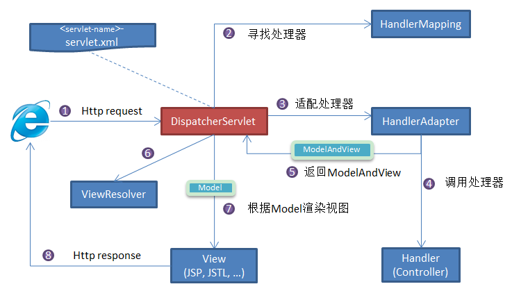

## SpringMVC

### 什么是MVC

  Spring MVC是一个基于Java的实现了MVC设计模式的请求驱动类型的轻量级Web框架，通过把模型-视图-控制器分离，

  将web层进行职责解耦，把复杂的web应用分成逻辑清晰的几部分，简化开发，方便组内开发人员之间的配合。

  优点：

​	 Spring 家族原生产品，与 IoC 容器等基础设施无缝对接；

​	基于原生的Servlet，通过功能强大的前端控制器DispatcherServlet 对请求和响应进行统一处理；

​	支持各种请求资源的映射策略；

​	代码清新简洁，大幅度提升开发效率；

​	内部组件化程度高，可插拔式组件即插即用，想要什么功能配置相应组件即可；

​	性能卓著，尤其适合现代大型、超大型互联网项目要求；

### 主要组件

1. 前端控制器 DispatcherServlet(不需要程序员开发)

​        &ensp;&ensp;作用：统一处理请求和响应，整个流程控制的中心，由它调用其它组件处理用户的请求，减少了其它组件之间的耦合度

2. 处理器映射器HandlerMapping(不需要程序员开发)

​     &ensp;&ensp;作用：根据请求的url、method等信息查找Handler，即控制器方法

3. 处理器适配器HandlerAdapter(框架提供)

​        &ensp;&ensp;作用：在编写Handler的时候要按照HandlerAdapter要求的规则去编写，这样适配器HandlerAdapter才可以正确的

​        &ensp;&ensp;&ensp;&ensp;&ensp;&ensp;&ensp;&ensp;去执行Handler。

4. 处理器Handler(需要程序员开发)

​		&ensp;&ensp;作用：在DispatcherServlet的控制下Handler对具体的用户请求进行处理。

5. 视图解析器 ViewResolver(不需要程序员开发)

​	&ensp;&ensp;作用：根据 Handler 返回的逻辑视图 / 视图，解析并渲染真正的视图，并传递给 `DispatcherServlet` 响应客户端。

6. 视图View(需要程序员开发jsp)

​		&ensp;&ensp;View是一个接口， 它的实现类支持不同的视图类型(jsp，freemarker，pdf等等)

### 原理

​	

### MVC的工作流程

(1)用户发送请求至前端控制器DispatcherServlet；

(2) DispatcherServlet收到请求后，调用HandlerMapping处理器映射器，请求获取Handler；

(3)处理器映射器根据请求url找到具体的处理器，生成处理器对象及处理器拦截器(如果有则生成)一并返回给DispatcherServlet；

(4)DispatcherServlet 调用 HandlerAdapter处理器适配器执行具体处理器(Handler，也叫后端控制器)；

(5)Handler执行完成返回ModelAndView；

(6)HandlerAdapter将ModelAndView返回给DispatcherServlet；

(7)DispatcherServlet将ModelAndView传给ViewResolver视图解析器进行解析，ViewResolver解析后返回具体View；

(8)DispatcherServlet对View进行渲染视图(即将模型数据填充至视图中)

(9)DispatcherServlet将View返回给请求者。


### 拦截器

**配置**

 Spring MVC 也可以使用拦截器对请求进行拦截处理，用户可以自定义拦截器来实现特定的功能，

 自定义的拦截器必须实现 HandlerInterceptor 接口

 1。preHandle()：这个方法在业务处理器处理请求之前被调用，在该方法中对用户请求进行处理。 

​                  &ensp;&ensp;&ensp;如果决定该拦截器对请求进行拦截处理后还要调用其他的拦截器，或者是业务处理器去进行处理，则返回 true ；

​                 &ensp;&ensp;&ensp;如果不需要再调用其他的组件去处理请求，则返回 false。 

 2。postHandle()： 这个方法在业务处理器处理完请求后，DispatcherServlet 向客户端返回响应前被调用，在该方法中

​           &ensp;&ensp;&ensp;对用户请求request 进行处理。

 3。afterCompletion()：该方法在DispatcherServlet 完全处理完请求后被调用，可以在该方法中进行一些资源清理的操作。

### 多个拦截器的执行顺序

 a>若每个拦截器的preHandle()都返回true

 &ensp;&ensp;&ensp;此时多个拦截器的执行顺序和拦截器在SpringMVC的配置文件的配置顺序有关：

​     &ensp;&ensp;&ensp;&ensp;preHandle()会按照配置的顺序执行，而postHandle()和afterCompletion()会按照配置顺序的反序执行。 

  b>若某个拦截器的preHandle()返回了false

   &ensp;&ensp;&ensp;返回false 的拦截器和它之前的拦截器的preHandle()都会执行，所有的postHandle()都不执行，返回false的拦截器之前

  &ensp;&ensp;&ensp;的拦截器的afterCompletion()会执行。


### RequestMapping注解

#### **功能**

  将请求和处理请求的控制器方法关联起来，建立映射关系。

  SpringMVC 接收到指定的请求，就会来找到在映射关系中对应的控制器方法来处理这个请求。

#### **value和method属性**

   value属性通过请求的请求地址匹配请求映射，value属性是一个字符串类型的数组，表示该映射能够匹配多个请求地址所对应的请求。

   method属性通过请求的请求方式(get或post)匹配映射，method属性是一个RequestMethod类型的数组，表示该映射能够匹配多种请求方式的请求。

   若当前请求的请求地址满足请求映射的value属性，但是请求方式不满足method属性，则浏览器报错。

#### **路径中的占位符**

   将想要传输到服务器中的参数当做路径的一部分拼接在请求路径中。

   将某些数据通过路径的方式传输到服务器中，就可以在相应的@RequestMapping注解的value属性中通过占位符{xxx}接收

   传输的数据，再通过@PathVariable注解，将占位符所接收的数据赋值给控制器方法的形参。

```java
<a th:href="@{/testRest/1/admin}">测试路径中的占位符-->/testRest</a><br>

@RequestMapping("/testRest/{id}/{username}")
public String testRest(@PathVariable("id") String id, @PathVariable("username") String username){
 
    System.out.println("id:"+id+",username:"+username);
 
    return "success";
}
//@PathVariable 注解中的id和username必须和@RequestMapping注解中的id和username保持一致
//最终输出的内容为-->id:1,username:admin
```

#### **获取请求参数**

**通过ServletAPI获取**

  将HttpServletRequest对象作为控制器方法的形参，此时request就表示当前请求。

```java
@RequestMapping("/testParam")
public String testParam(HttpServletRequest request){
 
    String username = request.getParameter("username");
 
    String password = request.getParameter("password");

    System.out.println("username:"+username+",password:"+password);
 
    return "success";
}
```

**通过控制器方法的形参获取请求参数**

  在控制器方法的形参位置， 设置和请求参数同名的形参 ，当浏览器发送请求，匹配到请求映射时，在DispatcherServlet中就会将请求参数赋值给相应的形参。

**@RequestParam**

   @RequestParam是将请求参数和控制器方法中的形参形成映射关系

   @RequestParam注解一共有三个属性：

​       &ensp;&ensp;value：指定对应形参的请求参数名

​       &ensp;&ensp;required：设置是否必须传输此请求参数，默认值为true

​      &ensp;&ensp;defaultValue：不管required属性值为true或false，当value所指定的请求参数没有传输或传输的值为""时，则使用默认值

​        &ensp;&ensp;&ensp;&ensp;&ensp;&ensp;&ensp;&ensp;&ensp;&ensp;&ensp;&ensp;&ensp;&ensp;&ensp;对其进行赋值。

#### **通过POJO获取请求参数**

  将一个实体类对象作为方法的形参，若浏览器传输的请求参数的参数名和对象中的属性名一致，那么该对象的属性值就等于该请求参数。


### Restful的实现

  具体说，就是 HTTP 协议里面，四个表示操作方式的动词：GET、POST、PUT、DELETE。

  它们分别对应四种基本操作：GET 用来获取资源，POST 用来新建资源，PUT 用来更新资源，DELETE用来删除资源。

   REST 风格提倡 URL 地址使用统一的风格设计，从前到后各个单词使用斜杠分开，不使用问号键值对方式携带请求参数，

   而是**将要发送给服务器的数据作为 URL 地址的一部分，以保证整体风格的一致性。**

   **不同的请求方式做不同的事，路径可以相同，参数也可以相同。**


