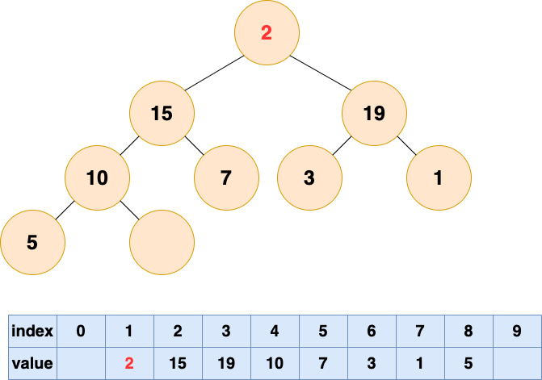

<!-- permalink: /面试/数据结构/    -->

## 定义

1. 完全二叉树：若二叉树的深度为h，除第h层外，其他层的结点全部达到最大值，且第h层的所有结点都集中在左子树。

2. 满二叉树：满二叉树是一种特殊的的完全二叉树，所有层的结点都是最大值。

 **堆是一种满足以下条件的树：堆中的每一个父节点的值都大于等于(或小于等于)子树上所有节点的值。**

 注意：

&ensp;&ensp;堆的根节点中存放的是最大或者最小元素，但是其他节点的排序顺序是未知的。

&ensp;&ensp;例如，在一个最大堆中，最大的那一个元素总是位于 index 0 的位置，但是最小的元素则未必是最后一个元素。

 &ensp;&ensp;&ensp;&ensp;唯一能够保证的是最小的元素是一个叶节点，但是不确定是哪一个。

## 堆与二叉搜索树的区别

**节点的顺序：**

   在二叉搜索树中，左子节点必须比父节点小，右子节点必须比父节点大。但是在堆中并非如此。

   在最大堆中两个子节点都必须比父节点小，而在最小堆中，它们都必须比父节点大。

**内存占用：**

   普通树占用的内存空间比它们存储的数据要多。必须为节点对象以及左/右子节点指针分配内存。

   堆仅仅使用一个数组来存储数据，且不使用指针。

 **平衡：**

​    二叉搜索树必须是“平衡”的情况下，其大部分操作的复杂度才能达到O(logn)。可以按任意顺序位置插入/删除数据，

​    或者使用 AVL 树或者红黑树，但是在堆中实际上不需要整棵树都是有序的。只需要满足堆属性即可，所以在堆中平衡不是问题。

​    因为堆中数据的组织方式可以保证O(logn)的性能。

 **搜索：**

​    在二叉树中搜索会很快，但是在堆中搜索会很慢。在堆中搜索不是第一优先级，因为使用堆的目的是将最大(或者最小)的节点放在

​    最前面，从而快速的进行相关插入、删除操作。

 

#### 用途

  当我们只关心所有数据中的最大值或者最小值，存在多次获取最大值或者最小值，多次插入或删除数据时，就可以使用堆。

  **相对于有序数组而言，堆的主要优势在于插入和删除数据效率较高。** 因为堆是基于完全二叉树实现的，所以在插入和删除数据时，

​     只需要在二叉树中上下移动节点，时间复杂度为 `O(log(n))`，相比有序数组的 `O(n)`，效率更高。

  需要注意的是：Heap 初始化的时间复杂度为 `O(n)`，而非`O(nlogn)`。

#### 分类

堆分为 最大堆 和 最小堆。二者的区别在于节点的排序方式。

- **最大堆**：堆中的每一个节点的值都大于等于子树中所有节点的值

- **最小堆**：堆中的每一个节点的值都小于等于子树中所有节点的值

  图 1 是最大堆，图 2 是最小堆

​     

#### 存储

  由于完全二叉树的优秀性质，利用数组存储二叉树既节省空间，又方便索引。

​     若根结点的序号为 1，那么对于树中任意节点 i，其左子节点序号为 `2*i`，右子节点序号为 `2*i+1`。

  为了方便存储和索引，（二叉）堆可以用完全二叉树的形式进行存储。存储的方式如下图所示

​      

  **在堆中，在当前层级所有的节点都已经填满之前不允许开始下一层的填充，所以堆总是有这样的形状：**

​     

#### 操作

**插入元素：**

  1.将要插入的元素放到最后

​       

   2.从底向上，如果父结点比该元素小，则该节点和父结点交换，直到无法交换

​        

​       

**删除堆顶元素**

  根据堆的性质可知，最大堆的堆顶元素为所有元素中最大的，最小堆的堆顶元素是所有元素中最小的。

  当我们需要多次查找最大元素或者最小元素的时候，可以利用堆来实现。

  删除堆顶元素后，为了保持堆的性质，需要对堆的结构进行调整，我们将这个过程称之为"**堆化**"，堆化的方法分为两种：

- 一种是自底向上的堆化，上述的插入元素所使用的就是自底向上的堆化，元素从最底部向上移动。

- 另一种是自顶向下堆化，元素由最顶部向下移动。

  自底向上堆化：

​     

​      

​       

​       数组中出现了“气泡”，这会导致存储空间的浪费。

  自顶向下堆化：

​     自顶向下的堆化用一个词形容就是“石沉大海”，那么第一件事情，就是把石头抬起来，从海面扔下去。

​     这个石头就是堆的最后一个元素，先将最后一个元素移动到堆顶。

​        

   然后开始将这个石头沉入海底，不停与左右子节点的值进行比较，和较大的子节点交换位置，直到无法交换位置。

​       

​        

#### 堆排序

 堆排序的过程分为两步：

- 第一步是建堆，将一个无序的数组建立为一个堆
- 第二步是排序，将堆顶元素取出，然后对剩下的元素进行堆化，反复迭代，直到所有元素被取出为止。

 **建堆**

​    建堆的过程就是一个对所有非叶节点的自顶向下堆化过程。

​    首先要了解哪些是非叶节点，最后一个节点的父结点及它之前的元素，都是非叶节点。也就是说，如果节点个数为 n，

​    那么我们需要对 n/2 到 1 的节点进行自顶向下（沉底）堆化。

具体过程如下图：

​     

​    将初始的无序数组抽象为一棵树，图中的节点个数为 6，所以 4,5,6 节点为叶节点，1,2,3 节点为非叶节点，所以要对 1-3 号节点

​    进行自顶向下（沉底）堆化，注意，顺序是从后往前堆化，从 3 号节点开始，一直到 1 号节点。 3 号节点堆化结果：

​       

​        

​        

​     

  **排序**

​    由于堆顶元素是所有元素中最大的，所以我们重复取出堆顶元素，将这个最大的堆顶元素放至数组末尾，并对剩下的元素进行堆化即可。

​    我们**需要执行自顶向下（沉底）堆化，这个堆化一开始要将末尾元素移动至堆顶，这个时候末尾的位置就空出来了，**

​    由于堆中元素已经减小，这个位置不会再被使用，所以我们可以将取出的元素放在末尾。

​    **这其实是做了一次交换操作，将堆顶和末尾元素调换位置。**

​       

​        

​        

​        

​        

​      

 
