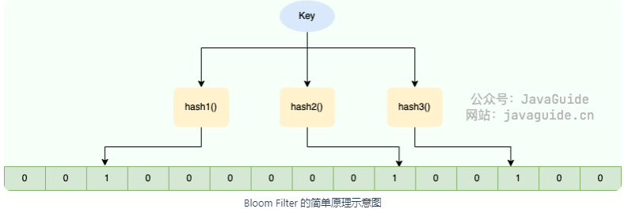

<!-- permalink: /面试/数据结构/    -->


## 定义

  布隆过滤器(Bloom Filter)可以看作是**由二进制向量(或者说位数组)和一系列随机映射函数(哈希函数)两部分组成的数据结构**

  相比于 List、Map、Set 等数据结构，它**占用空间更少并且效率更高，但缺点是其返回的结果是概率性的，不是非常准确**。

  理论情况下**添加到集合中的元素越多，误报的可能性就越大**。并且，**存放在布隆过滤器的数据不容易删除**。

  Bloom Filter 会使用一个较大的 bit 数组来保存所有的数据，数组中的每个元素都只占用 1 bit ，并且每个元素只能是

  &ensp;&ensp;0 或者 1 (代表 false 或者 true），这也是 Bloom Filter 节省内存的核心所在。

  即，**可用它来检索元素是否在给定的大集合中。**

  **优点：**

&ensp;&ensp;时间复杂度低，增加和查询元素的时间复杂为O(N)，(N为哈希函数的个数)

&ensp;&ensp;保密性强，布隆过滤器不存储元素本身

&ensp;&ensp;存储空间小

  **缺点：**

&ensp;&ensp;有一定的误判率，但是可以通过调整参数来降低

 &ensp;&ensp;无法获取元素本身

&ensp;&ensp;很难删除元素

## 原理

当一个元素加入布隆过滤器中的时候，会进行如下操作：

1. 使用布隆过滤器中的哈希函数对元素值进行计算，得到哈希值(有几个哈希函数得到几个哈希值)。

2. 根据得到的哈希值，在位数组中把对应下标的值置为 1。

当需要判断一个元素是否存在于布隆过滤器中的时候，会进行如下操作：

1. 对给定元素再次进行相同的哈希计算；

2. 得到值之后判断位数组中的每个元素是否都为 1，如果值都为 1，说明该元素存在，如果有一个值不为 1，说明该元素不存在。

​       

  如图所示，当要将字符串加入到布隆过滤器中时，该字符串首先由多个哈希函数生成不同的哈希值，然后将对应的位数组

  &ensp;&ensp;的下标置为 1(当位数组初始化时，所有位置均为 0)。当第二次存储相同字符串时，因为先前的对应位置已设置为 1，

  &ensp;&ensp;所以很容易知道此值已经存在（去重非常方便）。

  如果我们需要判断某个字符串是否在布隆过滤器中时，只需要对给定字符串再次进行相同的哈希计算，得到值之后

  &ensp;&ensp;判断位数组中的每个元素是否都为 1，如果值都为 1，那么说明这个值在布隆过滤器中，如果存在一个值不为 1，

  &ensp;&ensp;说明该元素不在布隆过滤器中。

  **不同的字符串可能哈希出来的位置相同，这种情况可以适当增加位数组大小或者调整哈希函数。**

   综上，可以得出：**布隆过滤器说某个元素存在，小概率会误判；如果说某个元素不存在，那么这个元素一定不存在。**

**空间计算：**

   在布隆过滤器增加元素之前，首先需要初始化布隆过滤器的空间，也就是二进制数组，除此之外还需要计算Hash函数的个数。

   布隆过滤器提供了两个参数，分别是预计加入元素的大小n，运行的错误率f。

   布隆过滤器中有算法会根据这两个参数计算出二进制数组的大小l，以及Hash函数的个数k。

   它们之间的关系比较简单：

&ensp;&ensp; 错误率越低，位数组越长，空间占用较大

&ensp;&ensp; 错误率越低，Hash函数越多，计算耗时较长


## 使用场景

1. 判断给定数据是否存在：

   比如判断一个数字是否存在于包含大量数字的数字集中(数字集很大)、 防止缓存穿透(判断请求的数据是否存在)、

   邮箱的垃圾邮件过滤(判断一个邮件地址是否在垃圾邮件列表中)、黑名单功能(判断一个IP地址或手机号码是否在

   黑名单中)等等。

2. 去重

   比如爬给定网址的时候对已经爬取过的 URL 去重、对巨量的 QQ号/订单号去重。

   去重场景也需要用到判断给定数据是否存在，因此布隆过滤器主要是为了解决海量数据的存在性问题。


## 实现

### Java手动实现

```java
import java.util.BitSet;

public class MyBloomFilter {

  //位数组的大小
  private static final int DEFAULT_SIZE = 2 << 24;
    
  //通过这个数组可以创建 6 个不同的哈希函数
  private static final int[] SEEDS = new int[]{3, 13, 46, 71, 91, 134};

  //位数组。数组中的元素只能是 0 或者 1
  private BitSet bits = new BitSet(DEFAULT_SIZE);

  //存放包含 hash 函数的类的数组  SimpleHash是一个自定义类
  private SimpleHash[] func = new SimpleHash[SEEDS.length];

  //初始化多个包含 hash 函数的类的数组，每个类中的 hash 函数都不一样 
  public MyBloomFilter() {
        
    // 初始化多个不同的 Hash 函数    
    for (int i = 0; i < SEEDS.length; i++) {
            
      func[i] = new SimpleHash(DEFAULT_SIZE, SEEDS[i]);       
    }   
  }

  //添加元素到位数组  
  public void add(Object value) {
        
    for (SimpleHash f : func) {
            
      bits.set(f.hash(value), true);        
    }    
  }

  //判断指定元素是否存在于位数组 
  public boolean contains(Object value) {
        
    boolean ret = true;
        
    for (SimpleHash f : func) {
            
      ret = ret && bits.get(f.hash(value));       
    }        
    return ret;    
  }

  //静态内部类。用于 hash 操作 
  public static class SimpleHash {
        
    private int cap;
        
    private int seed;
        
    public SimpleHash(int cap, int seed) {
            
      this.cap = cap;
            
      this.seed = seed;        
    }
        
    //计算 hash 值   
    public int hash(Object value) {
            
      int h;
            
      return (value == null) ? 0:Math.abs(seed * (cap - 1)&((h = value.hashCode()) ^ (h >>> 16)));       
    }    
  }
}
```


### 使用谷歌guava包

1. 引入pom依赖

```xml
<dependency>
  <groupId>com.google.guava</groupId>
  <artifactId>guava</artifactId>
  <version>29.0-jre</version>
</dependency>
```

2. 测试代码

```java
package com.vkls.test;
 
import com.google.common.hash.BloomFilter;

import com.google.common.hash.Funnels;
 
public class BloomFilterTest {
     
  /** 预计插入的数据 */    
  private static Integer expectedInsertions = 10000000;
    
  /** 误判率 */    
  private static Double fpp = 0.01;
    
  /** 创建布隆过滤器 */    
  private static BloomFilter<Integer> bloomFilter = BloomFilter.create(Funnels.integerFunnel(), 
                                                                       expectedInsertions, fpp); 
  
  public static void main(String[] args) {
        
    //插入1千万个数据  数字0-1千万-1        
    for (int i = 0; i < expectedInsertions; i++) {
            
      bloomFilter.put(i);        
    }
         
    //用1千万个数据测试误判率  数字1千万到2千万-1        
    int count = 0;
        
    for (int i = expectedInsertions; i < expectedInsertions *2; i++) {
            
      if (bloomFilter.mightContain(i)) {
                
        count++;            
      }        
    }        
    System.out.println("一共误判了：" + count);    
  }
}
```

 参数说明：

 构造一个BloomFilter对象有四个参数：

​	&ensp;&ensp;Funnel funnel：数据类型，由Funnels类指定即可

​    &ensp;&ensp;long expectedInsertions：预期插入的值的数量

​	&ensp;&ensp;fpp：错误率

​	&ensp;&ensp;BloomFilter.Strategy：hash算法

- 当预计插入的值的数量不变时，偏差值fpp越小，位数组越大，hash函数的个数越多

- 当偏差值不变时，预计插入的中的数量越大，位数组越大，hash函数并没有变化


## Redis中的过滤器

### 常用方法

  bf.add key item   &ensp;&ensp;&ensp;添加一个元素到过滤器中，如果过滤器不存在则创建过滤器， 添加成功返回1

​     &ensp;&ensp;例：bf.add  name vkls    &ensp;&ensp;&ensp;name为过滤器名称

  bf.madd key item1 item2	&ensp;&ensp;&ensp;添加多个元素到过滤器中

​     &ensp;&ensp;例：bf.madd  name  vkls mtgd 

  bf.exists  key item                 &ensp;&ensp;&ensp;判断一个元素是否存在于过滤器中，存在则返回1，不存在返回0

  bf.mexists key item1 item2	  &ensp;&ensp;&ensp;判断多个元素是否存在于过滤器中 ，存在的返回1，不存在的返回0

  bf.reserve {key} {error_rate} {capacity} [EXPANSION expansion]

​      &ensp;&ensp;key：布隆过滤器的名称

​      &ensp;&ensp;error_rate : 期望的误报率。该值必须介于 0 到 1 之间。

&ensp;&ensp;&ensp;&ensp;例如，对于期望的误报率 0.1％（1000 中为 1），error_rate 应该设置为 0.001。

&ensp;&ensp;&ensp;&ensp;&ensp;&ensp;该数字越接近零，则每个项目的内存消耗越大，并且每个操作的 CPU 使用率越高。

​      &ensp;&ensp;capacity: 过滤器的容量。当实际存储的元素个数超过该值之后，性能将开始下降。实际的降级将取决于超出限制的程度

&ensp;&ensp;&ensp;&ensp;&ensp;&ensp;&ensp;&ensp;&ensp;&ensp;&ensp;随着过滤器元素数量呈指数增长，性能将线性下降。

   &ensp;&ensp;可选参数：

​    &ensp;&ensp;&ensp;&ensp;expansion：如果创建了一个新的子过滤器，则其大小将是当前过滤器的大小乘以`expansion`。默认扩展值为 2。

​    &ensp;&ensp;&ensp;&ensp;&ensp;&ensp;这意味着每个后续子过滤器将是前一个子过滤器的两倍.

### Java中使用Redis布隆过滤器

1. 引入pom依赖

```xml
<dependency>
  <groupId>org.redisson</groupId>
  <artifactId>redisson-spring-boot-starter</artifactId>
  <version>3.16.0</version>
</dependency>
```

2. 编写测试代码

```java
import org.redisson.Redisson;
import org.redisson.api.RBloomFilter;
import org.redisson.api.RedissonClient;
import org.redisson.config.Config;
 
public class RedisBloomFilterTest {
 
    
  /** 预计插入的数据 */    
  private static Integer expectedInsertions = 10000;
    
  /** 误判率 */    
  private static Double fpp = 0.01;
     
  public static void main(String[] args) {
        
    // Redis连接配置，无密码        
    Config config = new Config();
        
    config.useSingleServer().setAddress("redis://192.168.211.108:6379");
        
    // config.useSingleServer().setPassword("123456");        
    // 初始化布隆过滤器        
    RedissonClient client = Redisson.create(config);
        
    RBloomFilter<Object> bloomFilter = client.getBloomFilter("user");
        
    bloomFilter.tryInit(expectedInsertions, fpp);
         
    // 布隆过滤器增加元素        
    for (Integer i = 0; i < expectedInsertions; i++) {
            
      bloomFilter.add(i);        
    }
         
    // 统计元素        
    int count = 0;
        
    for (int i = expectedInsertions; i < expectedInsertions*2; i++) {
            
      if (bloomFilter.contains(i)) {
                
        count++;            
      }       
    }        
    System.out.println("误判次数" + count);    
  } 
}
```


