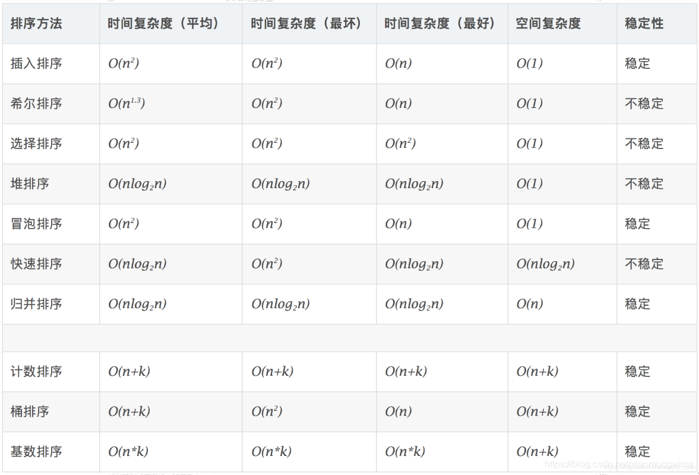
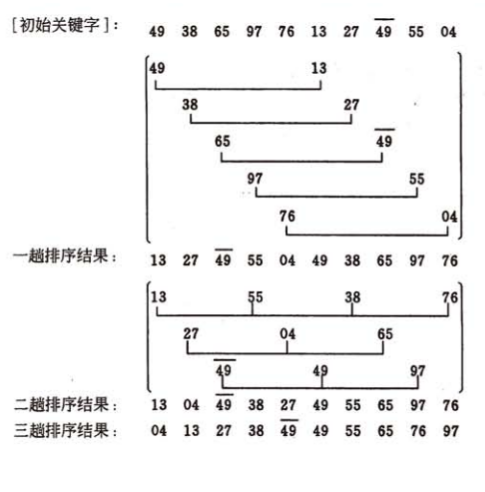
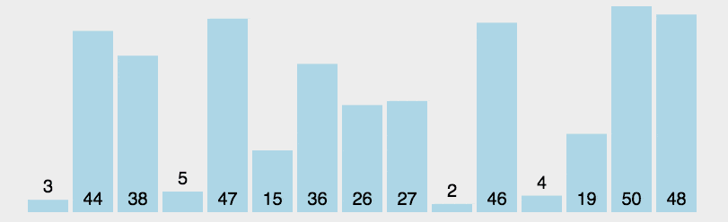
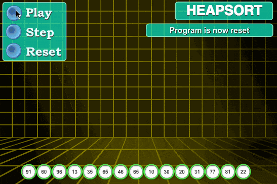
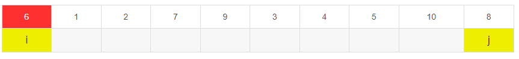
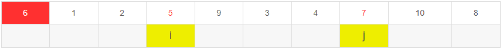
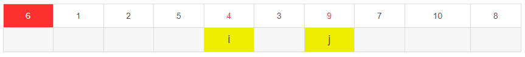
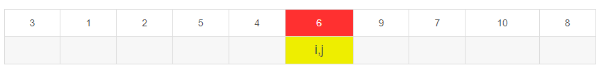

<!-- permalink: /面试/数据结构/    -->


## 定义

  **通过比较来决定元素间的相对次序，由于其时间复杂度不能突破O(nlogn)，因此也称为非线性时间比较类排序。**

## 复杂度对比

​     


## 插入排序

### 直接插入排序

 特点：稳定，适用于顺序存储和链式存储的线性表

 复杂度：时间复杂度为O(n^2)，空间复杂度O(1)

 比较：**比较次数与序列初态有关，为 O(n)~O(n^2)**

 **步骤：**

​      &ensp;1.从第一个元素开始，该元素可以认为已经被排序；

​      &ensp;2.取出下一个元素，在已经排序的元素序列中**从后向前扫描；**

​      &ensp;3.**如果扫描到的元素(已排序)大于新元素，将该元素移动到下一个位置；**

​      &ensp;4.重复步骤 3，直到找到已排序的元素中小于或等于新元素的元素；

​      &ensp;5.将新元素插入到该元素的后面；

​      &ensp;6.重复步骤 2~5

​           

​    代码：

```java
public static int[] insertionSort(int[] arr) {
  
  //从第二个数开始插入，默认第一个数已经有序
  for (int i = 1; i < arr.length; i++) {
    
    //将要插入的元素前面都是已经有序的，从有序元素的由后往前开始判断
    int preIndex = i - 1;
    
    //current为要插入的元素
    int current = arr[i];
        
    while (preIndex >= 0 && arr[preIndex > current]) {
      
      //当前元素大于要插入的元素，将当前元素向后移动一个位置
      arr[preIndex + 1] = arr[preIndex];
            
      preIndex -= 1;        
    } 
    
    //执行完while循环，说明找到了小于等于新元素的元素，则将新元素插入在该元素后面
    arr[preIndex + 1] = current;     
  }    
  return arr;
}
```


### 折半插入排序

   特点：稳定，适用于顺序表

   复杂度：时间复杂度O(n2) 

   比较：**比较次数与序列初态无关，取决于元素个数n，为O(nlog2n)；**  当low>hight时，停止比较。

   

### 希尔排序

  特点：不稳定，适用于线性表的顺序存储 

  复杂度：平均时间复杂度：O(Nlog2N)   空间复杂度：O(1)

  思想：先将整个待排序的记录序列分割成为若干子序列(由一些相隔某个"增量"的元素组成)**分别进行直接插入排序**，

​      &ensp;&ensp;然后依次缩减增量再进行排序，待整个序列中的元素基本有序(增量足够小)时，再对全体元素进行一次直接插入排序。

​       &ensp;&ensp;直接插入排序在元素基本有序的情况下（接近最好情况），效率是很高的。       

  例：

​     

  **步骤：**

​    &ensp;① 先取一个小于n的整数d1作为第一个增量，把全部记录分成d1个组。

​    &ensp;② 所有距离为d1的倍数的记录放在同一个组中，在各组内进行直接插入排序。

​    &ensp;③ 取第二个增量d2小于d1重复上述的分组和排序，直至所取的增量dt=1，即所有记录放在同一组中进行直接插入排序为止。

​    先将整个待排序的记录序列分割成为若干子序列分别进行直接插入排序，具体算法描述：

- 选择一个增量序列 `{t1, t2, …, tk}`，其中 `(ti>tj, i<j, tk=1)`；

- 按增量序列个数 k，对序列进行 k 趟排序；

- 每趟排序，根据对应的增量 `t`，将待排序列分割成若干长度为 `m` 的子序列，分别对各子表进行直接插入排序。

  当增量因子为 1 时，整个序列作为一个表来处理，表长度即为整个序列的长度

​        

```java
public static int[]  insertionSort(int[] arr){
    
  if(arr == null || arr.length <= 1)
        
    return arr;
        
  //升序排序 d为增量，每轮将其缩小一半，直到等于1 
  for (int d = arr.length/2;d>0;d/= 2){ 
    
    //相当于跳跃排序
    //例，假设d=3，数组元素共有14个，i的取值为3到13，
    for (int i = d; i < arr.length; i++){ 
            
      //前三轮for循环中，i的取值为3,4,5，分别和数组中下标为0,1,2的元素进行比较并交换
      //在第四轮中，i=6，则j=3，即，下标为6和3的元素进行比较，然后j-3=0，即，下标0和3的元素再次进行了比较
      //此时，下标为0、3、6的三个元素大小应该是递增的，
      //在第五轮中，i=7，则j=4，即下标为7和4的元素进行比较，然后j-3=1，即，下标为1和4的元素进行了比较
      //此时，下标为1、4、7的三个元素的大小应该是递增的
      //以此类推，i代表着想要插入的元素，在每个子序列内部是使用直接插入排序的
      //所以j需要从后往前进行遍历
      for (int j = i-d; j>=0; j-=d){ 
                
        if (arr[j] > arr[j + d]) {
                    
          //符合条件，插入元素（交换位置）                    
          int temp = arr[j];
                    
          arr[j] = arr[j + d];
                    
          arr[j + d] = temp;                
        }            
      }        
    }     
  }    
  return arr;
}
```


## 选择排序

### 简单选择排序

  特点：不稳定

  复杂度：时间复杂度O(n^2)   空间复杂度O(1)

  比较：**元素比较次数与初始状态无关，始终是n(n-1)/2**

  移动：**元素的移动次数不会超过3(n-1)次**

  思想：首先在未排序序列中找到最小(大)元素，存放到排序序列的起始位置，然后，再从剩余未排序元素中继续寻找

   &ensp;&ensp;&ensp;&ensp;&ensp;&ensp;最小(大)元素，然后放到已排序序列的末尾。以此类推，直到所有元素均排序完毕。

  **步骤：**

​     &ensp;1.首先在未排序序列中找到最小(大)元素，存放到排序序列的起始位置

​     &ensp;2.再从剩余未排序元素中继续寻找最小(大)元素，然后放到已排序序列的末尾。

​     &ensp;3.重复第 2 步，直到所有元素均排序完毕。

​        

  代码：

```java
public static int[] selectionSort(int[] arr) {
  
  //也可以理解为：要确定数组第一个位置放置哪个元素，所以将第一个元素和它后面的所有元素进行比较，然后确定第二个位置应该
  //放置哪个元素，所以将第二个元素和它后面的所有元素进行比较，以此类推。
  for (int i = 0; i < arr.length - 1; i++) {
    
    //记录这一轮比较中的最小元素的索引
    int minIndex = i;
        
    for (int j = i + 1; j < arr.length; j++) {
            
      if (arr[j] < arr[minIndex]) {
                
        minIndex = j;            
      }        
    }
    
    //交换位置，即，找到的最小元素和第一个元素交换位置，第二小元素和第二个元素交换位置，以此类推。
    if (minIndex != i) {
            
      int tmp = arr[i];
            
      arr[i] = arr[minIndex];
            
      arr[minIndex] = tmp;
        
    }    
  }    
  return arr;
}
```


### 堆排序

  如果想升序排序就使用大顶堆，反之使用小顶堆。原因是堆顶元素需要交换到序列尾部。

  **构建：**

  先直接使用线性数组来表示一个堆，由初始的无序序列建成一个堆就需要自底向上从第一个非叶元素开始挨个调整，直到成为一个堆。

  **排序：**

  首先是将堆顶元素和最后一个元素交换。然后比较当前堆顶元素的左右孩子节点，因为除了当前的堆顶元素，

  左右孩子堆均满足条件，这时需要将当前堆顶元素与左右孩子节点中的较大者(大顶堆)交换，直至叶子节点。

  从一个无序序列建堆的过程就是一个反复筛选的过程。若将此序列看成是一个完全二叉树，则最后一个非终端节点是

  &ensp;&ensp;下标为n/2(向下取整)的元素。

  特点：不稳定

  复杂度：时间复杂度：最佳：O(nlogn)， 最差：O(nlogn)， 平均：O(nlogn)   空间复杂度：O(1)

  **步骤：**

​     &ensp;1.将初始待排序列 `(R1, R2, ……, Rn)` 构建成大顶堆，此堆为初始的无序区；

​     &ensp;2.将堆顶元素 `R[1]` 与最后一个元素 `R[n]` 交换，此时得到新的无序区 `(R1, R2, ……, Rn-1)` 和新的有序区 (Rn)，

​        &ensp;&ensp;&ensp;且满足 `R[1, 2, ……, n-1]<=R[n]`；

​     &ensp;3.由于交换后新的堆顶 `R[1]` 可能违反堆的性质，因此需要对当前无序区 `(R1, R2, ……, Rn-1)` 调整为新堆，然后再次将 

​     &ensp;&ensp;&ensp;R[1]与无序区最后一个元素交换，得到新的无序区 `(R1, R2, ……, Rn-2)` 和新的有序区 `(Rn-1, Rn)`。

​     &ensp;4.不断重复此过程，直到有序区的元素个数为 `n-1`，则整个排序过程完成。

​          

  代码：

```java
//记录初始数组的长度
static int heapLen;

//交换数组中两个位置的元素
private static void swap(int[] arr, int i, int j) {
    int tmp = arr[i];
    arr[i] = arr[j];
    arr[j] = tmp;
}

//构造大根堆
private static void buildMaxHeap(int[] arr) {
  
  //因为堆按照完全二叉树的形式存储，所以第一个非叶子结点的下标是len/2-1
  for (int i = arr.length / 2 - 1; i >= 0; i--) {
        
    heapify(arr, i);    
  }
}

//调整元素的位置，使其符合堆的定义
private static void heapify(int[] arr, int i) {
  
  //求出要调整节点的左右子节点的下标
  int left = 2 * i + 1;
    
  int right = 2 * i + 2;
    
  int largest = i;
  
  //找到两个子节点中的较大值
  if (right < heapLen && arr[right] > arr[largest]) 
        
    largest = right;    
    
  if (left < heapLen && arr[left] > arr[largest]) 
        
    largest = left;
      
  //如果子节点的值比父节点大，则交换两个节点的位置  
  if (largest != i) {
        
    swap(arr, largest, i);
    
    //继续调整交换后的节点
    heapify(arr, largest);    
  }
}

//堆排序
public static int[] heapSort(int[] arr) {
    
  //堆的大小  
  heapLen = arr.length;
    
  //构建堆    
  buildMaxHeap(arr);
    
  for (int i = arr.length - 1; i > 0; i--) {
        
    //交换第一个元素和最后一个元素，以此类推     
    swap(arr, 0, i);
    
    //将长度减1
    heapLen -= 1;
        
    heapify(arr, 0);      
  }    
  
  return arr;
}
```


## 交换排序

### 冒泡排序

  特点：稳定

  复杂度：时间复杂度O(n^2) (最好为O(n)，最坏为O(n^2) )  空间复杂度O(1)：

  比较：第i趟排序要进行n-i次关键字的比较，**每趟排序都会将一个元素放到其最终的位置上**

   &ensp;&ensp;&ensp;&ensp;&ensp;&ensp;**若在一次冒泡中没有发生元素交换，则算法结束**。

  **步骤：** 

​     1.比较相邻的元素。如果第一个比第二个大，就交换它们两个；

​     2.对每一对相邻元素作同样的工作，从开始第一对到结尾的最后一对，这样在最后的元素应该会是最大的数；

​     3.针对所有的元素重复以上的步骤，除了最后一个；

​     4.重复步骤 1~3，直到排序完成。

​        

  代码：

```java
public static int[] bubbleSort(int[] arr) {
    
  for (int i = 1; i < arr.length; i++) {
                    
    boolean flag = true;
    
    //第一轮冒泡j会取到倒数第二个元素的下标，第二轮冒泡，j会取到倒数第三个元素的下标
    for (int j = 0; j < arr.length - i; j++) {
      
      //如果前一个元素大于后一个元素，则交换位置，每次冒泡都能找到剩余元素中最大的那个
      if (arr[j] > arr[j + 1]) {
                
        int tmp = arr[j];
                
        arr[j] = arr[j + 1];
                
        arr[j + 1] = tmp;
       
        //如果发生了交换，则将标志置为false              
        flag = false;            
      }        
    }
    
    //如果此次冒泡没有发生交换，则说明所有的元素都已经有序，则可以直接结束
    if (flag) {
            
      break;        
    }    
  }
    
  return arr;
}
```


### 快速排序

基本思想：

&ensp;&ensp;通过一趟排序将待排序列分隔成独立的两部分，其中一部分记录的元素均比另一部分的元素小，则可分别对这两部分

&ensp;&ensp;子序列继续进行排序，以达到整个序列有序。

特点：

​     &ensp;不稳定

​     &ensp;需要调用一个递归工作栈，平均情况下，栈的深度为O(nlog2n)

​     &ensp;递归次数与各元素的初始排列有关，与划分分区后的处理顺序无关

​     &ensp;不产生有序子序列;

​     &ensp;每趟排序后会将基准元素放到其最终的位置上，第i趟完成时，会有i个以上的元素出现在它最终的位置上

比较次数：最好: an = a⌊(n-1/2)⌋+a⌈(n-1/2)⌉ + n – 1 (a1=0 a2=1 a3=2)  &ensp;&ensp;最差:n*(n-1)/2

   复杂度：时间复杂度：最佳：O(nlogn)， 最差：O(nlogn)，平均：O(nlogn)   空间复杂度：O(logn)

**步骤：**

 快速排序使用分治法(Divide and conquer)策略来把一个序列分为较小和较大的 2 个子序列，然后递回地排序两个子序列。

 具体算法描述如下:

1. 从序列中挑出一个元素，做为"基准"(`pivot`)元素；

2. 重新排列序列，将所有比基准元素小的元素放在基准元素前面，所有比基准元素大的放在基准元素的后面(相同的数

   可以到任一边)。在这个操作结束之后，该基准元素就处于数列的中间位置。这个称为分区（partition）操作；

3. 递归地把小于基准元素的子序列和大于基准元素的子序列进行快速排序。

​              

   代码：

```java
public static void Quick_Sort(int[] arr, int begin, int end){
        
  if(begin > end)
            
    return;
        
  //以要排序数组的第一个元素为基准元素        
  int tmp = arr[begin];
        
  //i和j为双指针，i从前往后，寻找大于tmp的元素，j从后往前，寻找小于tmp的元素        
  int i = begin;
        
  int j = end;
        
  while(i != j){
            
    //每次都要j先移动 找到小于tmp的元素时停止            
    while(arr[j] >= tmp && j > i)
                
      j--;
            
    //j找到小于tmp的元素后，i再向后寻找大于tmp的元素            
    while(arr[i] <= tmp && j > i)
                
      i++;
            
    //两个元素都找到后，交换两个元素            
    if(j > i){
                
      int t = arr[i];
                
      arr[i] = arr[j];
                
      arr[j] = t;            
    }        
  }
        
  //当i等于j时退出循环，此时i和j的位置就是tmp应该存放的位置        
  arr[begin] = arr[i];
        
  arr[i] = tmp;
        
  //递归       
  Quick_Sort(arr, begin, i-1);
        
  Quick_Sort(arr, i+1, end);    
}
```


例：

   假设对以下10个数进行快速排序：6,1,2,7,9,3,4,5,10,8

1. 在这个序列中随便找一个数作为基准数，通常为了方便，以第一个数作为基准数。

   在初始状态下，数字6在序列的第1位。目标是寻找到位置k，以第k位为分界点，左边的数都小于等于6，右边的数都

   大于等于6，将6挪到k的位置。

2. 快速排序是分别从两端开始”探测”的，先从右往左找一个小于6的数，再从左往右找一个大于6的数，然后交换他们。

   这里可以用两个变量 i 和 j，分别指向序列最左边和最右边。

​                 

3. 哨兵 j 一步一步地向左挪动(即 j = j − 1 )，直到找到一个小于6的数停下来。接下来哨兵 i 再一步一步向右挪动

   (即i = i + 1)，直到找到一个数大于6的数停下来。最后哨兵j停在了数字5面前，哨兵 i 停在了数字7面前，

   交换i和j所指向的元素。  

​        

4. i和j再次出发，再找到符合的元素并交换。

​        

5. 然后i和j再次移动，直到在元素3的位置相遇，则此处就是基准元素6应该存放的位置。

​         

6. 然后再递归排序基准元素两边的元素。


### 归并排序

  归并排序是建立在归并操作上的一种有效的排序算法。该算法是采用分治法(Divide and Conquer)的一个非常典型的应用。

  归并排序是一种稳定的排序方法。将已有序的子序列合并，得到完全有序的序列；即先使每个子序列有序，再使子序列段间有序。

  若将两个有序表合并成一个有序表，称为 2 - 路归并。

  归并排序的性能不受输入数据的影响，但表现比选择排序好的多，因为始终都是 `O(nlogn)` 的时间复杂度。代价是需要额外的内存空间。

  特点：稳定  

  复杂度：时间复杂度为 O(nlog2n)  空间复杂度O(n)

  比较：每趟归并的时间复杂度为O(n)，共需进行log2n(取上限)(二路)趟归并

  **一般而言，对N个元素进行k路归并排序时，排序的趟数m=logkN (取上限)**

  步骤：

​    归并排序算法是一个递归过程，**边界条件为当输入序列仅有一个元素时，直接返回**，具体过程如下：

1. 如果数组内只有一个元素，则直接返回，否则将长度为 `n` 的输入序列分成两个长度为 `n/2` 的子序列；

2. 分别对这两个子序列进行归并排序，使子序列变为有序状态；

3. 设定两个指针，分别指向两个已经排好序的子序列的起始位置；

4. 比较两个指针所指向的元素，选择相对小的元素放入到合并空间（用于存放排序结果），并移动指针到下一位置；

5. 重复步骤 3~4 直到某一指针达到序列尾；

6. 将另一序列剩下的所有元素直接复制到合并序列的尾部

​      

  代码：

```java
public static int[] mergeSort(int[] arr) {
    
  if (arr.length <= 1) 
        
    return arr;
    
      
  int middle = arr.length / 2;
  
  //将原数组分为两个子数组
  int[] arr_1 = Arrays.copyOfRange(arr, 0, middle);
    
  int[] arr_2 = Arrays.copyOfRange(arr, middle, arr.length);
  
  //递归调用归并算法
  return merge(mergeSort(arr_1), mergeSort(arr_2));
}

//合并两个数组
public static int[] merge(int[] arr_1, int[] arr_2) {
    
  int[] sorted_arr = new int[arr_1.length + arr_2.length];
    
  int idx = 0, idx_1 = 0, idx_2 = 0;
    
  while (idx_1 < arr_1.length && idx_2 < arr_2.length) {
        
    if (arr_1[idx_1] < arr_2[idx_2]) {
            
      sorted_arr[idx] = arr_1[idx_1];
            
      idx_1 += 1;
        
    } else {
            
      sorted_arr[idx] = arr_2[idx_2];
            
      idx_2 += 1;        
    }
        
    idx += 1;    
  }
    
  if (idx_1 < arr_1.length) {
        
    while (idx_1 < arr_1.length) {
            
      sorted_arr[idx] = arr_1[idx_1];
            
      idx_1 += 1;
            
      idx += 1;        
    }
    
  } else {
        
    while (idx_2 < arr_2.length) {
            
      sorted_arr[idx] = arr_2[idx_2];
            
      idx_2 += 1;
            
      idx += 1;        
    }
    
  }
    
  return sorted_arr;
}
```


### 


