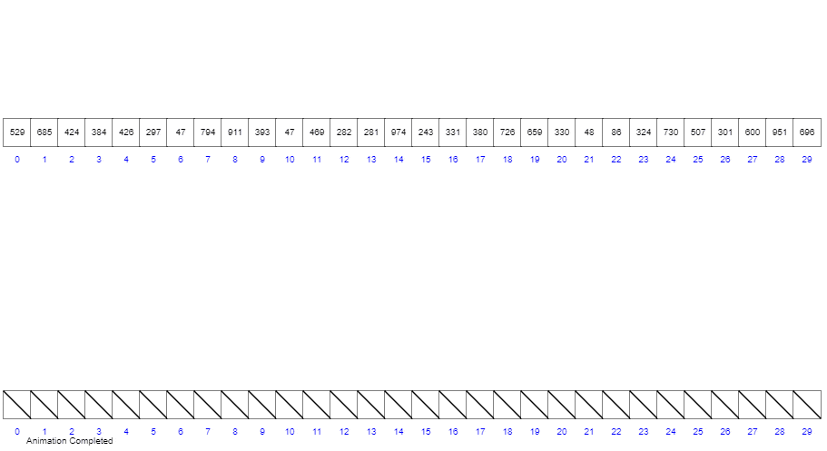

<!-- permalink: /面试/数据结构/    -->


## 基数排序

1. 需要r个列表作为辅助存储空间  r为基数

2. 元素移动次数与初始次序无关.

思想：

1. 对元素中的每一位数字进行排序，从最低位开始排序，复杂度为 `O(n×k)`，`n` 为数组长度，`k` 为数组中元素的最大的位数。

2. 基数排序是按照低位先排序，然后收集；再按照高位排序，然后再收集；依次类推，直到最高位。

3. 有时候有些属性是有优先级顺序的，先按低优先级排序，再按高优先级排序。最后的次序就是高优先级高的在前，

   高优先级相同的低优先级高的在前。基数排序基于分别排序，分别收集，所以是稳定的。

  步骤：

​     &ensp;1.取得数组中的最大数，并取得位数，即为迭代次数 `N`（例如：数组中最大数值为 1000，则 `N=4`）；

​     &ensp;2.`A` 为原始数组，从最低位开始取每个位组成 `radix` 数组；

​     &ensp;3.对 `radix` 进行计数排序（利用计数排序适用于小范围数的特点）；

​     &ensp;4.将 `radix` 依次赋值给原数组；

​     &ensp;5.重复 2~4 步骤 `N` 次

​        

  代码：

```java
public static int[] radixSort(int[] arr) {
    
  if (arr.length < 2) {
        
    return arr;    
  }
    
  int N = 1;
    
  int maxValue = arr[0];
  
  //找到最大值
  for (int element : arr) {
        
    if (element > maxValue) 
            
      maxValue = element;                
  }
  
  //确定最大值的位数
  while (maxValue / 10 != 0) {
        
    maxValue = maxValue / 10;
        
    N += 1;    
  }
  
  //一共进行N次排序
  for (int i = 0; i < N; i++) {
        
    List<List<Integer>> radix = new ArrayList<>();
    
    //准备10个桶
    for (int k = 0; k < 10; k++) {
            
      radix.add(new ArrayList<Integer>());        
    }
    
    //求出元素相应位上的值，然后放入桶中。第一轮求出个位上的值，第二轮求出十位上的值，以此类推。
    for (int element : arr) {
            
      int idx = (element / (int) Math.pow(10, i)) % 10;
            
      radix.get(idx).add(element);
        
    }
        
    int idx = 0;
    
    //将桶中的元素按顺序取出，然后重新放在数组中
    for (List<Integer> list : radix) {
            
      for (int n : list) {
                
        arr[idx++] = n;            
      }              
    }    
  }
    
  return arr;
}
```


## 计数排序

  特点：

​     &ensp;核心在于将输入的数据值转化为键存储在额外开辟的数组空间中。 

​     &ensp;作为一种线性时间复杂度的排序，**计数排序要求输入的数据必须是有确定范围的整数**。

​     &ensp;计数排序 (Counting sort) 是一种稳定的排序算法。计数排序使用一个额外的数组 `C`，其中第 `i` 个元素是待排序数组

​     &ensp; `A` 中值等于 `i` 的元素的个数。然后根据数组 `C` 来将 `A` 中的元素排到正确的位置。**它只能对整数进行排序**。

  步骤：

1. 找出数组中的最大值 `max`、最小值 `min`；

2. 创建一个新数组 `C`，其长度是 `max-min+1`，其元素默认值都为 0；

3. 遍历原数组 A中的元素 `A[i]`，以 `A[i]-min` 作为C数组的索引，以 `A[i]` 的值在 `A` 中出现的次数作为 `C[A[i]-min]` 的值；

4. 对 `C` 数组变形，**新元素的值是该元素与前一个元素值的和**，即当 `i>=1` 时 `C[i] = C[i] + C[i-1]`；

5. 创建结果数组 `R`，长度和原始数组一样。

6. **从后向前**遍历原始数组 `A` 中的元素 `A[i]`，使用 `A[i]` 减去最小值 `min` 作为索引，在计数数组 `C` 中找到

   对应的值 `C[A[i]-min]`，`C[A[i]-min]-1` 就是 `A[i]` 在结果数组 `R` 中的位置，做完上述这些操作，

   将 `C[A[i]-min]` 减小 1。	

​       

  代码：

```java
private static int[] getMinAndMax(int[] arr) {
    
  int maxValue = arr[0];
    
  int minValue = arr[0];
    
  for (int i = 0; i < arr.length; i++) {
        
    if (arr[i] > maxValue) {
            
      maxValue = arr[i];
        
    } else if (arr[i] < minValue) {
            
      minValue = arr[i];        
    }
    
  }    
  return new int[] { minValue, maxValue };
}


public static int[] countingSort(int[] arr) {
    
  if (arr.length < 2) {
        
    return arr;    
  }
    
  int[] extremum = getMinAndMax(arr);
  
  //获取数组中的最大值和最小值
  int minValue = extremum[0];
    
  int maxValue = extremum[1];
  
  //创建新的数组
  int[] countArr = new int[maxValue - minValue + 1];
    
  int[] result = new int[arr.length];

  //将原数组中的值映射到新数组中，新数组中的值为原数组中各个元素出现的次数  
  for (int i = 0; i < arr.length; i++) 
        
    countArr[arr[i] - minValue] += 1;
    
  //改造countArr数组    
  for (int i = 1; i < countArr.length; i++) 
        
    countArr[i] += countArr[i - 1];    
  
    
  for (int i = arr.length - 1; i >= 0; i--) {
        
    int idx = countArr[arr[i] - minValue] - 1;
        
    result[idx] = arr[i];
    
    //将个数减1，意味着如果还有相同的元素，则该元素的位置应该在此前的基础上向前移动一个位置
    countArr[arr[i] - minValue] -= 1;    
  }
    
  return result;
}
```


## 桶排序

  桶排序是计数排序的升级版。它利用了函数的映射关系，高效与否的关键就在于这个映射函数的确定。

  为了使桶排序更加高效，需要做到这两点：

1. 在额外空间充足的情况下，尽量增大桶的数量

2. 使用的映射函数能够将输入的 N 个数据均匀的分配到 K 个桶中

**工作原理：**

&ensp;&ensp;假设输入数据服从均匀分布，将数据分到有限数量的桶里，每个桶再分别排序（有可能再使用别的排序算法或是以

 &ensp;&ensp;递归方式继续使用桶排序进行）。

**步骤：**

1. 设置一个 BucketSize，作为每个桶所能放置多少个不同数值；

2. 遍历输入数据，并且把数据依次映射到对应的桶里去；

3. 对每个非空的桶进行排序，可以使用其它排序方法，也可以递归使用桶排序；

4. 从非空桶里把排好序的数据拼接起来

​         

  代码：

```java
private static int[] getMinAndMax(List<Integer> arr) {
    
  int maxValue = arr.get(0);
    
  int minValue = arr.get(0);
    
  for (int i : arr) {
        
    if (i > maxValue) {
            
      maxValue = i;
        
    } else if (i < minValue) {
            
      minValue = i;        
    }
    
  }    
  return new int[] { minValue, maxValue };
}

/**
 * Bucket Sort
 * @param arr
 * @return
 */
public static List<Integer> bucketSort(List<Integer> arr, int bucket_size) {
    
  if (arr.size() < 2 || bucket_size == 0) 
        
    return arr;
          
  int[] extremum = getMinAndMax(arr);
  
  //获取数组中的最大值和最小值
  int minValue = extremum[0];
    
  int maxValue = extremum[1];
  
  //计算桶的个数
  int bucket_cnt = (maxValue - minValue) / bucket_size + 1;
    
  List<List<Integer>> buckets = new ArrayList<>();
  
  //创建桶
  for (int i = 0; i < bucket_cnt; i++) 
        
    buckets.add(new ArrayList<Integer>());
         
  for (int element : arr) {
    
    //计算元素应该放入到哪个桶中，元素值越大，idx就越大，就越会被放到编号大的桶中
    //即，实现了编号大的桶中的元素大于编号小的桶中的元素
    int idx = (element - minValue) / bucket_size;
        
    buckets.get(idx).add(element);
    
  }
    
  for (int i = 0; i < buckets.size(); i++) {
        
    if (buckets.get(i).size() > 1) {
            
      buckets.set(i, sort(buckets.get(i), bucket_size / 2));
        
    }
    
  }
    
  ArrayList<Integer> result = new ArrayList<>();
  
  //将桶中的元素按顺序取出
  for (List<Integer> bucket : buckets) {
        
    for (int element : bucket) {
            
      result.add(element);        
    }    
  }    
  return result;
}
```


## 
