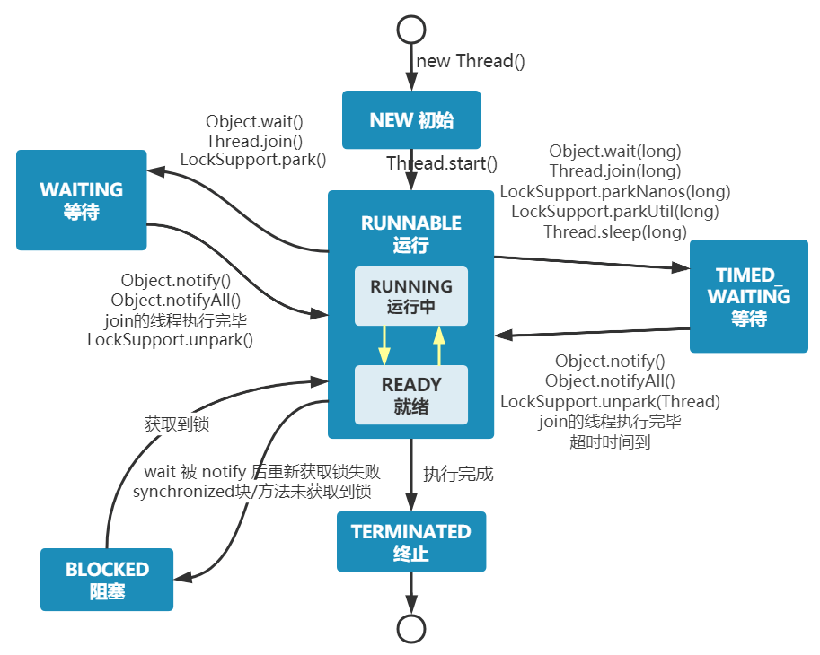
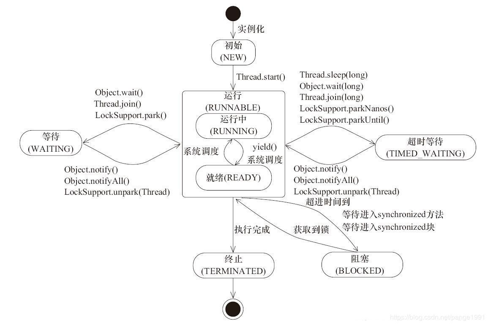

## 线程状态

### 5种状态

五种状态的划分主要是从操作系统的层面进行划分的

1. 初始状态，仅仅是在语言层面上创建了线程对象，即`Thead thread = new Thead();`，还未与操作系统线程关联

2. 可运行状态，也称就绪状态，指该线程已经被创建，与操作系统相关联，等待cpu给它分配时间片就能运行。

3. 运行状态，指线程获取了CPU时间片，正在运行。

   当CPU时间片用完，线程会转换至【可运行状态】，等待 CPU再次分配时间片，这会导致上下文切换。

4. 阻塞状态

   1. 如果调用了阻塞API，如BIO读写文件，那么线程实际上不会用到CPU，不会分配CPU时间片，会导致上下文切换，进入阻塞状态。

   2. 等待BIO操作完毕，会由操作系统唤醒阻塞的线程，转换至【可运行状态】。

   3. 与可运行状态的区别是，只要操作系统一直不唤醒线程，调度器就一直不会考虑调度它们，CPU就不会分配时间片。

5. 终止状态，表示线程已经执行完毕，生命周期已经结束，不会再转换为其它状态。

### 6种状态

 在 API  `java.lang.Thread.State` 中给出了六种线程状态：

####  **NEW**

   NEW 跟五种状态里的初始状态是一个意思，**处于NEW状态的线程尚未启动，即，还没有调用Thread实例的start()方法。**

```java
private void testStateNew() {

  Thread thread = new Thread(() -> {});

  System.out.println(thread.getState()); // 输出 NEW
}
```

  注意：

1. **不能多次调用同⼀个线程的start()方法**

2. **假如⼀个线程执行完毕(此时处于TERMINATED状态)，也不能再次调用这个线程的start()⽅法。**

   因为在调用⼀次start()之后，threadStatus的值会改变（threadStatus !=0），此时再次调用start()方法会抛出

   IllegalThreadStateException异常。

```java
public synchronized void start() {

  if (threadStatus ！= 0)

    throw new IllegalThreadStateException();

  group.add(this);

  boolean started = false;

  try {

    start0();

    started = true;

  } finally {

    try {

      if (!started) {

        group.threadStartFailed(this);
      }

    } catch (Throwable ignore) {

    }
  }
}
```


#### **RUNNABLE**

  Runnable 是当调用了 `start()` 方法之后的状态。

  **Java API 层面的 RUNNABLE 状态涵盖了操作系统层面的【就绪状态】、【运行状态】和【io阻塞状态】。**

   （由于 BIO 导致的线程阻塞，在 Java 里无法区分，仍然认为是可运行）。

#### **BLOCKED**

   **BLOCKED，WAITING，TIMED_WAITING 都是 Java API 层面对【阻塞状态】的细分。**

   阻塞状态。处于BLOCKED状态的线程正等待锁的释放以进入同步区。

#### **WAITING**

   等待状态。**处于等待状态的线程变成RUNNABLE状态需要其他线程唤醒。**

   调用如下3个方法会使线程进入等待状态：

​    &ensp;Object.wait()：使当前线程处于等待状态直到另⼀个线程唤醒它；

​	 &ensp;Thread.join()：等待某个线程执行完毕，底层调用的是Object实例的wait方法；

​	&ensp;LockSupport.park()：除非获得调用许可，否则禁止当前线程进行线程调度。

#### **TIMED_WAITING**

  超时等待状态。线程等待⼀个具体的时间，时间到后会被自动唤醒。

  调用如下方法会使线程进入超时等待状态：

​     &ensp;Thread.sleep(long millis)：使当前线程睡眠指定时间；

​     &ensp;Object.wait(long timeout)：线程休眠指定时间，等待期间可以通过 notify()/notifyAll()唤醒；

​     &ensp;Thread.join(long millis)：等待某个线程结束，最多等待millis毫秒，如果millis为0，则会⼀直等待；

​     &ensp;LockSupport.parkNanos(long nanos)： 除非获得调用许可，否则禁止当前线程进行线程调度，可以指定时间；

​     &ensp;LockSupport.parkUntil(long deadline)：同上，也是禁止线程进行调度，可以指定时间；

|          线程状态          |                       导致状态发生条件                       |
| :------------------------: | :----------------------------------------------------------: |
|        NEW（新建）         | 线程刚被创建，但是并未启动，还没调用 start 方法，只有线程对象，没有线程特征 |
|     Runnable（可运行）     | 线程可以在 Java 虚拟机中运行的状态，可能正在运行自己代码，也可能没有，这取决于操作系统处理器，调用了 t.start() 方法：就绪（经典叫法） |
|      Blocked（阻塞）       | 当一个线程试图获取一个对象锁，而该对象锁被其他的线程持有，则该线程进入 Blocked 状态；当该线程持有锁时，该线程将变成 Runnable 状态 |
|    Waiting（无限等待）     | 一个线程在等待另一个线程执行一个（唤醒）动作时，该线程进入 Waiting 状态，进入这个状态后不能自动唤醒，必须等待另一个线程调用 notify 或者 notifyAll 方法才能唤醒 |
| Timed_Waiting （限期等待） | 有几个方法有超时参数，调用将进入 Timed Waiting 状态，这一状态将一直保持到超时期满或者接收到唤醒通知。带有超时参数的常用方法有 Thread.sleep 、Object.wait |
|     Teminated（结束）      | run 方法正常退出而死亡，或者因为没有捕获的异常终止了 run 方法而死亡 |

### 状态转换


  


​      


  1.如果线程拿到锁之后调用wait方法主动释放锁，则线程会从Runnable状态进入到Waiting状态

  2.如果在Waiting状态的线程被其他线程通过notify方法唤醒的话，会重新竞争锁，如果竞争失败，则会进入Blocked状态。

  3.调用wait方法的前提是获得了锁，如果没有获得锁而调用wait方法，则会抛出异常。


### 
