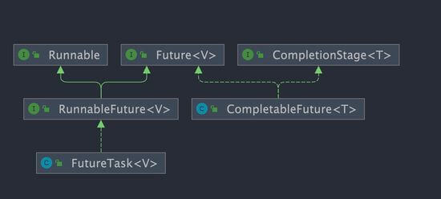

## 创建线程

###   继承Thread类

1. 创建一个类，继承Thread类并重写run方法

2. 通过该类创建对象，并执行start方法

  例：

```java
//继承Thread类并重写run方法
class Mythread extends Thread{
    
  @Override    
  public void run() {
        
    for (int i = 0; i < 100; i++) {
            
      if (i % 10 == 0) {
                
        System.out.println(Thread.currentThread().getName() + ":" + i);            
      }        
    }    
  }
}

public static void main(String args[]) throws InterruptedException {
  
  //创建对象并执行start方法   构造方法的参数是给线程指定名字
  Mythread t1 = new Mythread("t1");
        
  //start()方法底层其实是给CPU注册当前线程，并且触发run()方法执行
  t1.start();
        
  System.out.println("我是主线程");
}
```

继承 Thread 类的优缺点：

- 优点：编码简单

- 缺点：**线程类继承了 Thread 类就无法继承其他类了，功能不能通过继承拓展(单继承的局限性)**


### 实现Runnable接口

1. 创建一个实现Runnable接口的类并实现run方法

2. 使用该类创建对象，并将对象作为参数传递到Thread类的构造器中，创建Thread类的对象

3. 调用Thread对象的start方法

  &ensp;作用：**把线程和任务(要执行的代码)分开，Thread代表线程，Runnable中定义要运行的任务。**

  Thread 类的构造器：

​     `public Thread(Runnable target)`

​     `public Thread(Runnable target, String name)`

例：

```java
class MyThread implements Runnable{
      
    @Override      
    public void run() {
            
      for (int i = 0; i < 100; i++) {            
      
        if (i % 10 == 0)                 
        
           System.out.println(Thread.currentThread().getName() + ":" + i);                      
    }    
  }
}
    
public static void main(String args[]) throws InterruptedException {
  
  //创建Runnable接口类的对象
  MyThread m1 = new MyThread();    
  
  //将对象作为参数传递到Thread类的构造方法中
  Thread t1=new Thread(m1,"线程1");        
  
  t1.start();
        
  //再启动一个线程  
  Thread t2 = new Thread(m1);        
  
  t2.setName("线程2");        
  
  t2.start();   
}
```

Runnable 方式的优缺点：

- 缺点：代码复杂一点。

- 优点：

  1. **线程任务类(MyThread)只是实现了 Runnable 接口，可以继续继承其他类，避免了单继承的局限性**

  1. **同一个线程任务对象可以被包装成多个线程对象**，适合多个线程去共享同一个资源
  2. 实现解耦操作，线程任务代码可以被多个线程共享，线程任务代码和线程独立
  3. 线程池可以放入实现了 Runnable 或 Callable 的线程任务对象

**小结**：

&ensp;&ensp;方法1 是把线程和任务合并在了一起，方法2 是把线程和任务分开了，用 Runnable 更容易与线程池等高级 API 配合，

&ensp;&ensp;用 Runnable 让任务类脱离了 Thread 继承体系，更灵活。通过查看源码可以发现，方法二其实还是通过方法一执行的。

### 实现Callable接口

1. 定义一个线程任务类实现 Callable 接口

2. 实现Callable接口中的 call 方法，将需要执行的操作写在call方法中，这个方法可以直接返回执行的结果

3. 创建一个 Callable接口实现类的对象，将该对象传递到FutureTask类的构造器中，创建FutureTask类的对象

4. 将FutureTask类的对象作为参数传递到Thread类的构造器中，创建Thread对象，并调用start()方法

5. 获取Callable中call方法的返回值

  **方法：**

​    &ensp;`public FutureTask(Callable<V> callable)`：未来任务对象，在线程执行完后得到线程的执行结果

​	 &ensp;`public V get()`：同步等待 task 执行完的结果，如果在线程中获取另一个线程执行结果，会阻塞等待，用于线程同步。

  FutureTask 就是 Runnable 对象，因为 **Thread 类只能执行 Runnable 实例的任务对象**，所以把 Callable 包装成未来任务对象。

优缺点：

- 优点：同 Runnable，并且能得到线程执行的结果

- 缺点：编码复杂

```java
public class MyCallable implements Callable<String> {
        
  //重写线程任务类方法    
  @Override	    
  public String call() throws Exception {
                
    return Thread.currentThread().getName() + "->" + "Hello World";    
  }
}

@Slf4j    
public static void main(String[] args) throws ExecutionException, InterruptedException {
    
  MyCallable call=new MyCallable;
        
  //将Callable线程任务对象包装成一个未来任务对象        
  FutureTask<String> task = new FutureTask<>(call);
  
  //将一个未来任务对象包装成一个线程对象        
  Thread t = new Thread(task);
               
  t.start();
  
  try {            
           
    String s = task.get(); // 获取call方法返回的结果            
            
    System.out.println(s);
                
  }catch (Exception e) {
                            
    e.printStackTrace();       
  }
}

例2:
  //创建FutureTask类的对象      
  FutureTask futureTask = new FutureTask<>( new Callable<Integer>() {
            
        @Override            
        public Integer call() throws Exception {
                
            log.debug("多线程任务");                
            Thread.sleep(100);                
            return 100;            
        }        
  });
        
  //执行t1线程      
  new Thread(futureTask,"t1").start();
        
  //等待返回结果   
  log.debug("{}",futureTask.get()); 
```


### 使用匿名内部类

```java
Thread thread = new Thread(new Runnable() {
	
  @Override	
  public void run() {
		
    // 线程需要执行的任务代码		
    System.out.println("子线程开始启动....");
		
    for (int i = 0; i < 30; i++) {
			
        System.out.println("run i:" + i);		
    }	
  }
});

thread.start();
```


##  Future接口

### 作用

   Future接口是异步思想的运用，**主要用在一些需要执行耗时任务的场景，避免程序一直原地等待耗时任务执行完成，这样执行效率太低**。

   具体来说是：当要执行一个耗时的任务时，可以将这个任务交给一个子线程去异步执行，同时可以干点其他事情，

​    &ensp;&ensp;不用傻傻等待耗时任务执行完成。等事情干完后，再通过 `Future` 类获取到任务的执行结果，这样就提高了执行效率。

   这就是多线程中经典的 Future 模式，可以将其看作是一种设计模式，核心思想是异步调用，主要用在多线程领域，并非 Java 独有。

   在Java 中，`Future` 类只是一个泛型接口，位于 `java.util.concurrent` 包下，其中定义了 5 个方法，主要包括4个功能：            		

```java
public abstract interface Future<V> {

  //1.取消任务 成功取消返回 true，否则返回 false
  public abstract boolean cancel(boolean paramBoolean);

  //2.判断任务是否被取消
  public abstract boolean isCancelled();

  //3.判断任务是否已经执行完成
  public abstract boolean isDone();

  //4.获取任务执行结果
  public abstract V get() throws InterruptedException, ExecutionException;

  //5.指定时间内没有返回计算结果就抛出 Time OutException 异常
  public abstract V get(long paramLong, TimeUnit paramTimeUnit)

    throws InterruptedException, ExecutionException, TimeoutException;
}
```

  **cancel( )方法**：

​    &ensp;&ensp;试图取消⼀个线程的执行，并不⼀定能取消成功。因为任务可能已完成、已取消、或者⼀些其它因素不能取消，

   &ensp;&ensp;&ensp;&ensp;存在取消失败的可能。

​    &ensp;&ensp;boolean 类型的返回值是“是否取消成功”的意思。**参数  paramBoolean  表示是否采用中断的方式取消线程执行。**

  &ensp;&ensp;&ensp;所以**有时候，为了让任务有能够取消的功能，就使用 Callable 来代替 Runnable。**  

### FutureTask类    

  FutureTask类实现了RunnableFuture接口，而RunnableFuture接口同时继承了Runnable接口和 Future接口。

  即，FutureTask类是Future接口的一个实现类，它实现了Future接口中的cancel、get等方法。

  FutureTask的几种状态：

```java
/**
* state可能的状态转变路径如下：
* NEW -> COMPLETING -> NORMAL
* NEW -> COMPLETING -> EXCEPTIONAL
* NEW -> CANCELLED
* NEW -> INTERRUPTING -> INTERRUPTED
*/
private volatile int state;
private static final int NEW = 0;
private static final int COMPLETING = 1;
private static final int NORMAL = 2;
private static final int EXCEPTIONAL = 3;
private static final int CANCELLED = 4;
private static final int INTERRUPTING = 5;
private static final int INTERRUPTED = 6;

/*
 state表示任务的运⾏状态，初始状态为NEW。运⾏状态只会在set、
 setException、cancel⽅法中终⽌。COMPLETING、INTERRUPTING是任务完成后的瞬时状态
*/ 
```

 

### Callable和Future的关系

FutureTask 提供了 Future 接口的基本实现，常用来封装 Callable 和 Runnable，具有取消任务、查看任务是否执行完成以及获取任务执行结果的方法。

ExecutorService.submit() 方法返回的其实就是 Future 的实现类 FutureTask。

   `FutureTask` 不光实现了 `Future`接口，还实现了`Runnable` 接口，因此可以作为任务直接被线程执行。

​		

`FutureTask` 有两个构造函数，可传入 `Callable` 或者 `Runnable` 对象。实际上，即使传入 `Runnable` 对象也会在方法内部转换为 `Callable` 对象。

```java
public FutureTask(Callable<V> callable) {
    
    if (callable == null)
        
        throw new NullPointerException();
    
    this.callable = callable;
    
    this.state = NEW;
}

public FutureTask(Runnable runnable, V result) {
    
    //通过适配器RunnableAdapter来将Runnable对象runnable转换成Callable对象    
    this.callable = Executors.callable(runnable, result);
    
    this.state = NEW;
}
```


