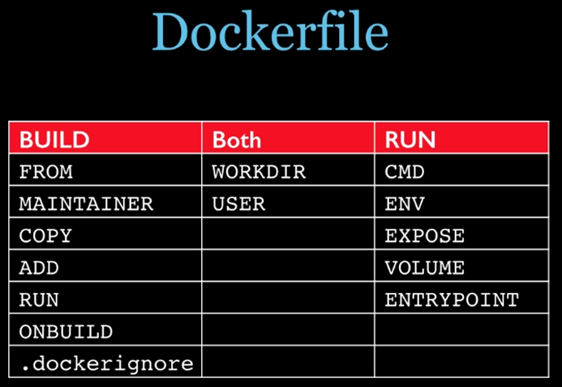

### 镜像结构

镜像是将应用程序及其需要的系统函数库、环境、配置、依赖打包而成。

镜像是分层的结构，每一层称为一个Layer

- BaseImage层：包含基本的系统函数库、环境变量、文件系统

- Entrypoint：入口，是镜像中应用启动的命令

- 其它：在BaseImage基础上添加依赖、安装程序、完成整个应用的安装和配置

### 概述

**Dockerfile ---镜像的描述文件，是用来构建Docker镜像的文本文件，是由一系列构建镜像所需的命令和参数构成的脚本。**

#### **构建步骤：**

1. 编写Dockefile文件 

2. 使用docker build 命令构建镜像

3. 使用新生成的镜像，创建新的容器

#### **Dockerfile内容**

1. 每条保留字指令都必须为大写字母且后面要至少跟一个参数

2. 指令按照从上到下，顺序执行

3. `#`表示注释

4. 每条指令都会创建一个新的镜像层，并对镜像进行提交

#### **Docker执行Dockerfile的大致流程**

1. docker从基础镜像运行一个容器

2. 执行一条指令并对容器做出修改

3. 执行类似docker commit 的操作提交一个新的镜像层

4. docker 再基于刚提交的镜像运行一个新的容器

5. 执行dockerfile中的下一条指令直到所有的指令都执行完成


### 关系

1. Dockerfile

   Dockerfile定义了进程需要的一切东西。

   Dockerfile涉及的内容包括执行代码或者是文件、环境变量、依赖包、运行时环境、动态链接库、操作系统的发行版本

   服务进程和内核进程(当应用进程需要和系统服务和内核进程打交道，这时需要考虑如何设计namespace的权限控制);					

2. Docker镜像

   在用Dockerfile定义一个文件之后，docker build时会产生一个Docker镜像，当运行Docker镜像时，会真正开始提供服务                   

3. Docker容器：容器是直接提供服务的。


### 保留字指令

| 指令       | 含义                                                         |
| ---------- | ------------------------------------------------------------ |
| FROM       | 基础镜像，当前新镜像是基于哪个镜像的。指定一个已经存在的镜像作为模板，**文件第一条必须是FROM**。 |
| MAINTAINER | 镜像维护者的姓名和邮箱地址                                   |
| RUN        | 容器创建时需要执行的命令, **RUN是在 docker build时运行**<br/>1.shell格式  &ensp;&ensp;RUN <命令行命令>   等同于在shell终端操作的shell命令   例：RUN yum -y install vim<br/>2.exec格式  &ensp;&ensp;RUN  ["可执行文件"，"参数1"，"参数2"] |
| EXPOSE     | 当前容器对外暴露的端口号                                     |
| WORKDIR    | 指定 在创建容器后，终端登录进来后默认的工作目录              |
| ENV        | 在创建容器的过程中设置环境变量<br/>这个环境变量可以在后续的任何RUN指令中使用，这就如同在命令前面指定了环境变量前缀一样 |
| ADD        | 将本机目录下的文件拷贝进镜像，且ADD命令会自动处理URL命令和解压tar压缩包<br/> ADD  &ensp;本机路径 &ensp; 容器路径  或 ADD&ensp;  ["本机路径","容器路径"] |
| COPY       | 类似ADD，拷贝文件和目录到镜像中(可以重命名)<br/> COPY &ensp;本机路径  &ensp;容器路径  或 COPY&ensp;["本机路径","容器路径"] |
| VOLUME     | 容器数据卷，用于数据保持和持久化工作                         |
| CMD        | 指定一个容器启动时第一个运行的命令及其参数，dockerfile中可以有多个CMD命令，但只有最后一个生效，CMD会被docker run命令最后的输入参数替换<br/>**CMD是在docker run 时运行** |
| ENTRYROINT | 指定一个容器启动时第一个运行的命令及其参数，但CMD指令会被覆盖，而ENTRYPOINT则是追加 |
| ONBUILD    | 当创建一个继承父镜像的镜像时运行该命令，父镜像在被子镜像继承后，父镜像的ONBUILD被触发 |

#### **分类：**

                           

​                  

### 案例

Base镜像(scratch)：Docker Hub中99%的镜像都是通过在base镜像中安装和配置需要的软件构建出来的。

**过程：**

1. 在本机创建一个dockerfile文件

2. 根据需要使用保留字指令编辑该文件

3. 以该文件为模板生成新的镜像

4. 使用新的镜像创建新的容器

例：编辑自己的centos7镜像，使其具备vim+ifconfig+jdk8

1. 编辑DockerFile文件

```shell
FROM centos

MAINTAINER vkls<vkls@126.com>
 
ENV MYPATH /usr/local

WORKDIR $MYPATH
 
#安装vim编辑器
RUN yum -y install vim

#安装ifconfig命令查看网络IP
RUN yum -y install net-tools

#安装java8及lib库
RUN yum -y install glibc.i686
RUN mkdir /usr/local/java

#ADD 是相对路径jar,把jdk-8u171-linux-x64.tar.gz添加到容器中,安装包必须要和Dockerfile文件在同一位置
ADD jdk-8u171-linux-x64.tar.gz /usr/local/java/

#配置java环境变量
ENV JAVA_HOME /usr/local/java/jdk1.8.0_171
ENV JRE_HOME $JAVA_HOME/jre
ENV CLASSPATH $JAVA_HOME/lib/dt.jar:$JAVA_HOME/lib/tools.jar:$JRE_HOME/lib:$CLASSPATH
ENV PATH $JAVA_HOME/bin:$PATH
 
EXPOSE 80
 
CMD echo $MYPATH

CMD echo "success--------------ok"

CMD /bin/bash
```

2. 构建

```shell
docker build -f +dockfile文件路径 -t +新镜像名称:tag .
```

3. 运行

```shell
docker run -it +新镜像名称:tag  
```


### 虚悬镜像

定义：仓库名、标签都是`<none>`的镜像，俗称dangling image

查看：docker image ls -f dangling=true

删除：docker image prune

  


