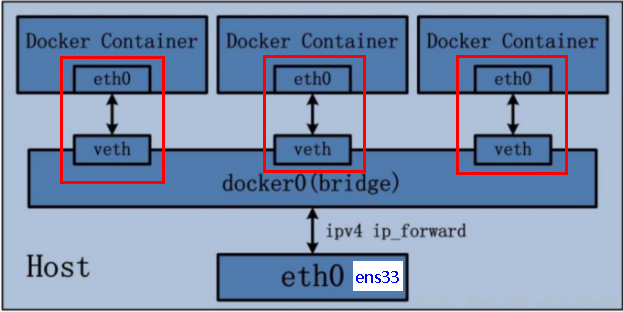
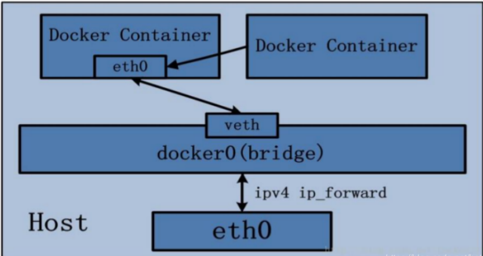

## Docker网络

**docker启动后会产生一个名为docker0的虚拟网桥，默认创建三大网络模式。(仅主机模式、NAT模式、桥接模式)**

### 常用命令

```
0.docker network --help     查看所有命令

1.docker network ls         查看所有网络

2.docker network inspect +网络名称   查看网络的详细信息

3.docker network rm  +网络名称    删除网络
```

### 作用

​     容器间的互联和通信以及端口映射。

​     容器IP变动时候可以通过服务名直接进行网络通信而不受到影响。

### 网络模式

​     

**注意：**

1. bridge、host、none 都是使用 --network 模式名指定 

2. container 使用 --network container:容器名称 或 容器ID  指定

#### **bridge**

1. Docker 服务默认会创建一个 docker0 网桥(其上有一个 docker0 内部接口)，该桥接网络的名称为docker0，它在内核层

   连通了其他的物理或虚拟网卡，这就将所有容器和本地主机都放到同一个物理网络。

   **Docker 默认指定了 docker0 接口 的 IP 地址和子网掩码，让主机和容器之间可以通过网桥相互通信。**

2. Docker使用Linux桥接，在宿主机虚拟一个Docker容器网桥(docker0)，Docker启动一个容器时会根据Docker网桥的网段

   分配给容器一个IP地址，称为Container-IP，同时Docker网桥是每个容器的默认网关。

   **因为在同一宿主机内的容器都接入同一个网桥，这样容器之间就能够通过容器的Container-IP直接通信。**

3. docker run 的时候，没有指定network的话默认使用的网桥模式就是bridge，使用的就是docker0。

   在宿主机执行ifconfig，就可以看到docker0和自己create的network eth0，eth1，eth2……代表网卡一，网卡二，

   网卡三....，lo代表127.0.0.1，即localhost，inet addr用来表示网卡的IP地址。

4. 网桥docker0创建一对对等虚拟设备接口一个叫veth，另一个叫eth0，成对匹配。

​         &ensp;&ensp;4.1 整个宿主机的网桥模式都是docker0，类似一个交换机有一堆接口，每个接口叫veth，在本地主机和容器内分别创建

​         &ensp;&ensp;&ensp; &ensp;&ensp;一个虚拟接口，并让他们彼此联通（这样一对接口叫veth pair）；

​         &ensp;&ensp;4.2 每个容器实例内部也有一块网卡，每个接口叫eth0；

​         &ensp;&ensp;4.3 docker0上面的每个veth匹配某个容器实例内部的eth0，两两配对，一一匹配。

   通过上述，将宿主机上的所有容器都连接到这个内部网络上，两个容器在同一个网络下,会从这个网关下各自拿到分配的ip，此时两个容器的网络是互通的。

​       


#### **host**

1. 直接使用宿主机的 IP 地址与外界进行通信，不再需要额外进行NAT 转换。

2. 容器将不会获得一个独立的Network Namespace， 而是和宿主机共用一个Network Namespace。

​    &ensp;&ensp;容器将不会虚拟出自己的网卡而是使用宿主机的IP和端口。

​		


#### **none**

   在none模式下，并不为Docker容器进行任何网络配置。 也就是说，这个Docker容器没有网卡、IP、路由等信息，

   只有一个lo，需要我们自己为Docker容器添加网卡、配置IP等。


#### **container**

   **新建的容器和已经存在的一个容器共享一个网络ip配置而不是和宿主机共享**。新创建的容器不会创建自己的网卡，

   配置自己的IP，而是和一个指定的容器共享IP、端口范围等。同样，两个容器除了网络方面，其他的如文件系统、进程列表等还是隔离的。

​     


### 自定义网络

自定义网络默认使用的是桥接网络

1. 新建自定义网络

```
docker network create vkls_network
```

2. 新建容器加入上一步新建的自定义网络

```shell
docker run -d -p 8081:8080 --network vkls_network  --name tomcat81 billygoo/tomcat8-jdk8

docker run -d -p 8082:8080 --network vkls_network  --name tomcat82 billygoo/tomcat8-jdk8
```

3. 使用服务名互相ping

```shell
docker exec -it tomcat81 bash

  ping tomcat82
  
  
docker exec -it tomcat82 bash
 
  ping tomcat81
```

结论：自定义网络本身就维护好了主机名和ip的对应关系（ip和域名都能通）


