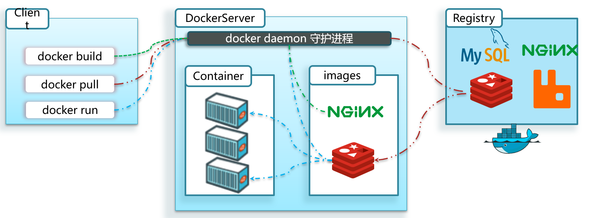
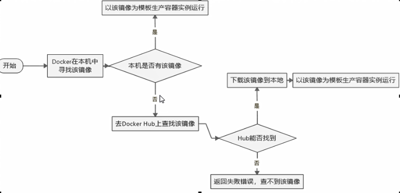

### 问题

大型项目组件较多，运行环境也较为复杂，部署时会碰到一些问题：

- 依赖关系复杂，容易出现兼容性问题

- 开发、测试、生产环境有差异

Docker如何解决大型项目依赖关系复杂，不同组件依赖的兼容性问题？

- Docker允许开发中将应用、依赖、函数库、配置一起**打包**，形成可移植镜像

- **将每个应用放到一个隔离容器去运行，使用沙箱机制，相互隔离，避免产生干扰**

Docker如何解决开发、测试、生产环境有差异的问题？

- Docker镜像中包含完整运行环境，包括系统函数库，仅依赖系统的Linux内核，因此可以在任意Linux操作系统上运行。


### 简介

​    **Docker是解决了运行环境和配置问题的软件容器， 方便做持续集成并有助于整体发布的容器虚拟化技术。**

​    将应用打包成镜像，通过镜像成为运行在Docker容器上面的实例，而 Docker容器在任何操作系统上都是一致的，

​    这就实现了跨平台、跨服务器。只需要一次配置好环境，换到别的机器上就可以一键部署好，大大简化了操作。

​    启动、移除都可以通过一行命令完成，方便快捷。


### Linux容器

   Linux容器(Linux Containers，缩写为 LXC)，Linux容器是与系统其他部分隔离开的一系列进程，从另一个镜像运行，

   并由该镜像提供支持进程所需的全部文件。

   **容器提供的镜像包含了应用的所有依赖项，因而在从开发到测试再到生产的整个过程中，它都具有可移植性和一致性。**

​    **Linux 容器不是模拟一个完整的操作系统而是对进程进行隔离。**

​    **有了容器，就可以将软件运行所需的所有资源打包到一个隔离的容器中。**

​    容器与虚拟机不同，不需要捆绑一整套操作系统，只需要软件工作所需的库资源和设置。

​    系统因此而变得高效轻量并保证部署在任何环境中的软件都能始终如一地运行。


### 与传统虚拟化的区别

  传统虚拟机技术是虚拟出一套硬件后，在其上运行一个完整的操作系统，在该系统上再运行所需进程。

  而容器内的应用进程直接运行于宿主的内核，容器内没有自己的内核且也没有进行硬件虚拟。因此容器要比传统虚拟机更为轻便。

​    **每个容器之间互相隔离，每个容器有自己的文件系统 ，容器之间进程不会相互影响，能区分计算资源。**


### 三要素

   镜像(image)：**镜像就是一个只读的模板**，相当于Java中的类，镜像可以用来创建Docker容器，docker容器实例类似于

   &ensp;&ensp;&ensp;java中new出来的新对象，**一个镜像可以创建很多容器。**

   容器(container)：**容器是用镜像创建的运行实例，镜像是静态的定义，容器是镜像运行时的实体。**

   &ensp;&ensp;&ensp;容器为镜像提供了一个标准的和隔离的运行环境，独立运行一个或一组应用。

   &ensp;&ensp;&ensp;它可以被启动，开始，停止，删除。

  &ensp;&ensp;&ensp;每个容器相互隔离，保证了平台的安全性。

   仓库(repository)：**集中存放镜像文件的场所**。类似于Maven仓库，存放各种jar包的地方。

   &ensp;&ensp;&ensp;仓库和仓库注册服务器(Registry)是有区别的，仓库注册服务器存放着多个仓库，每个仓库中又包含了多个镜像，

&ensp;&ensp;&ensp;每个镜像有不同的标签。

  &ensp;&ensp;&ensp;仓库分为公开仓库(Public)和私有仓库(Private)两种，最大的公开仓库是Docker Hub (https://hub.docker.com/)，

​	&ensp;&ensp;&ensp;存放了数量庞大的镜像供用户下载。国内的公开仓库包括阿里云 、网易云等。

**总结：**

   **Docker 本身是一个容器运行载体或称之为管理引擎。我们把应用程序和依赖配置打包好形成一个可交付的运行环境，**

  **这个打包好的运行环境就是image镜像文件。只有通过这个镜像文件才能生成Docker容器实例。**

   **image文件可以看作是容器的模板。Docker 根据 image 文件生成容器的实例。**

   **同一个 image 文件，可以生成多个同时运行的容器实例。**

​     

### 整体架构和底层原理

Docker 是一个 C/S 模式的架构，由两部分组成： 

- 服务端(server)：Docker守护进程，负责处理Docker指令，管理镜像、容器等

- 客户端(client)：通过命令或RestAPI向Docker服务端发送指令。可以在本地或远程向服务端发送指令

​     

​      


### 安装与卸载(以CentOS7为例)

1.卸载旧的

```sh
 yum remove docker \
                  docker-client \
                  docker-client-latest \
                  docker-common \
                  docker-latest \
                  docker-latest-logrotate \
                  docker-logrotate \
                  docker-engine
```

2.下载utils

```shell
yum install -y yum-utils
```

3.设置stable镜像仓库

```shell
yum-config-manager --add-repo http://mirrors.aliyun.com/docker-ce/linux/centos/docker-ce.repo
```

4.更新yum软件包索引

```shell
yum makecache fast
```

5.安装docker引擎

```shell
yum install docker-ce docker-ce-cli containerd.io
```

6.启动docker

```shell
systemctl start docker    
```

7.验证是否正确安装

```vim
docker run hello-world 

//如果安装成功，会输出一段提示信息，然后hello world就会停止运行，容器自动终止
```

8.卸载

```shell
systemctl stop docker

yum remove docker-ce docker-ce-cli containerd.io

rm -rf /var/lib/docker

rm -rf /var/lib/containerd
```

9.配置阿里云docker yum源

```shell
yum -y install yum-utils device-mapper-persistent-data lvm2 git

yum-config-manager --add-repo http://mirrors.aliyun.com/docker-ce/linux/centos/docker-ce.repo
```


### 运行

​     &ensp;docker -v   或   docker version   &ensp;&ensp;&ensp;//查看docker版本状态

​     &ensp;docker  info                   &ensp;&ensp;&ensp;// 查看docker运行状态

​     &ensp;&ensp;&ensp;如果在执行docker info 时报错：bridge-nf-call-iptables ins disabled

​     &ensp;&ensp;&ensp;解决: 打开conf文件：#vim /etc/sysctl.conf，在里面添加以下内容：

```conf
net.bridge.bridge-nf-call-ip6tables=1   
net.bridge.bridge-nf-call-iptables=1
net.bridge.bridge-nf-call-arptables=1
```


### 下载镜像过程

​      


