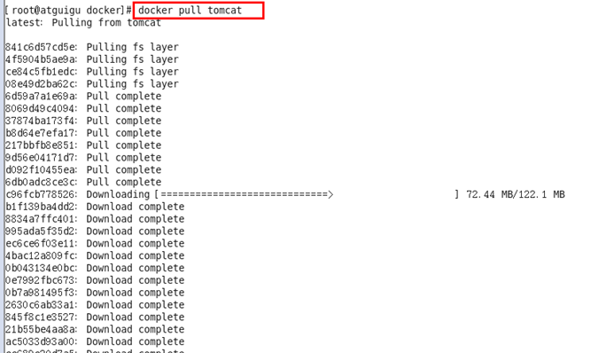

## 镜像详解

###  定义

​      **镜像是一种轻量级、可执行的独立软件包，用来打包软件运行环境和基于运行环境开发的软件。**

​      **它包含运行某个软件所需要的所有东西，包括代码、运行时、库、环境变量和配置文件等。**

​      只有通过这个镜像文件才能生成Docker容器实例。

### 分层的镜像

以pull为例，在下载的过程中可以看到docker的镜像好像是在一层一层的在下载。

### UnionFS

 UnionFS(联合文件系统) 是一种分层、轻量级并且高性能的文件系统，它支持**将对文件系统的修改作为一次提交来**

**一层层的叠加**，同时可以将不同目录挂载到同一个虚拟文件系统下。

 **联合文件系统是Docker镜像的基础，镜像可以通过分层来进行继承，基于基础镜像(没有父镜像)，可以制作各种具体的应用镜像。**

 特性：一次同时加载多个文件系统，但从外面看起来，只能看到一个文件系统，联合加载会把各层文件系统叠加起来，

​	&ensp;&ensp;这样最终的文件系统会包含所有底层的文件和目录。

### Docker镜像加载原理

​     **docker的镜像实际上由一层一层的文件系统组成，这种层级的文件系统就是UnionFS。**

#### **bootfs**

​      bootfs(boot file system)主要包含bootloader和kernel，bootloader主要是引导加载kernel，Linux刚启动时会加载

​           bootfs文件系统，**在Docker镜像的最底层就是引导文件系统bootfs。**

​           这一层与典型的Linux/Unix系统是一样的，包含boot加载器和内核。当boot加载完成之后整个内核就都在内存中了。

​           此时内存的使用权已由bootfs转交给内核，此时系统也会卸载bootfs。

#### **rootfs**

​	  rootfs(root file system)，在bootfs之上，包含的就是典型Linux系统中的/dev，/proc，/bin，/etc等标准目录和文件。

​          rootfs就是各种不同的操作系统发行版， 比如Ubuntu，Centos等等。

​      对于一个精简的OS，rootfs可以很小，只需要包括最基本的命令、工具和程序库就可以了，因为底层直接用

​      Host的kernel，自己只需要提供rootfs就行了。由此可见对于不同的linux发行版，bootfs基本是一致的，

​      rootfs会有差别，因此不同的发行版可以共用bootfs。

#### **原因**

1. **镜像分层最大的一个好处就是共享资源，方便复制迁移，就是为了复用。**

   比如说有多个镜像都从相同的 base 镜像构建而来，那么 Docker Host 只需在磁盘上保存一份 base 镜像；

   同时内存中也只需加载一份 base 镜像，就可以为所有容器服务了。而且**镜像的每一层都可以被共享**。

2. **docker镜像层都是只读的，容器层是可写的。**

   当容器启动时，一个新的可写层被加载到镜像的顶部。这一层通常被称作“容器层”，"容器层"之下的都叫“镜像层”。

   所有对容器的改动，无论添加、删除、还是修改文件都只会发生在容器层中。

​			

### commit操作  

 &ensp;&ensp;docker  commit      &ensp;

  &ensp;&ensp;&ensp;&ensp;**将修改过的容器提交使之成为一个新的镜像**

&ensp;&ensp;&ensp;&ensp;我们可以在生成的容器中做一些修改，比如配置dhcp、配置apache，把修改过的容器当做一个模板上传，那么别人用

&ensp;&ensp;&ensp;&ensp;这个模板生成的容器就会已经配置好了dhcp和apache。

  &ensp;&ensp;具体使用：

&ensp;&ensp;&ensp;docker  commit  -a "作者名" -m "描述信息"  +当前操作的容器ID  +要创建的目标镜像名:[标签名] 
     

### 总结

 **Docker中的镜像分层，支持通过扩展现有镜像，创建新的镜像**。类似Java继承于一个Base基础类，自己再按需扩展。

 **新镜像是从 base 镜像一层一层叠加生成的**。每安装一个软件，就在现有镜像的基础上增加一层。

