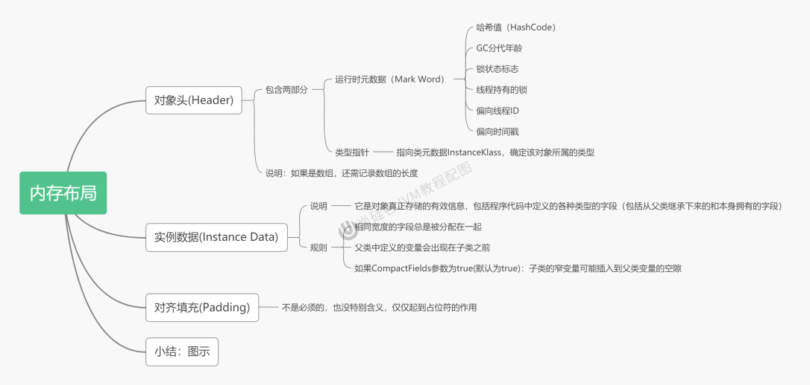
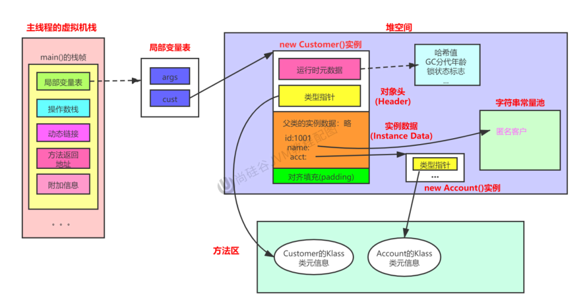
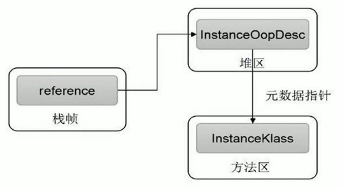
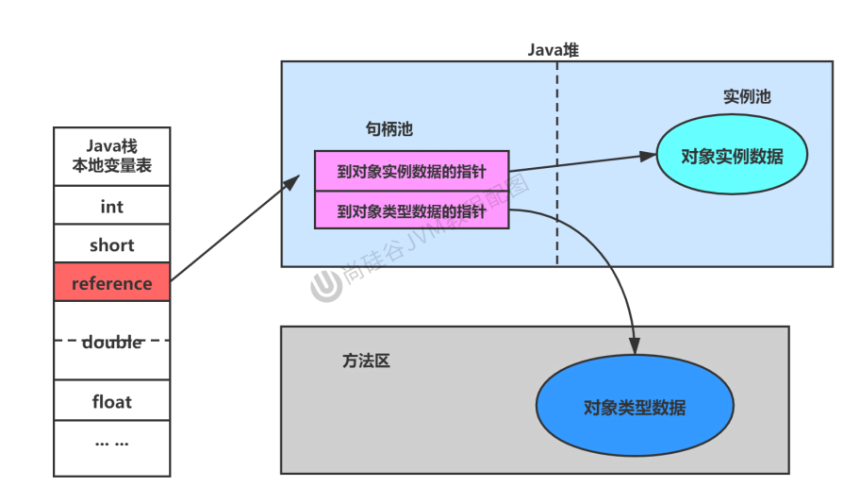
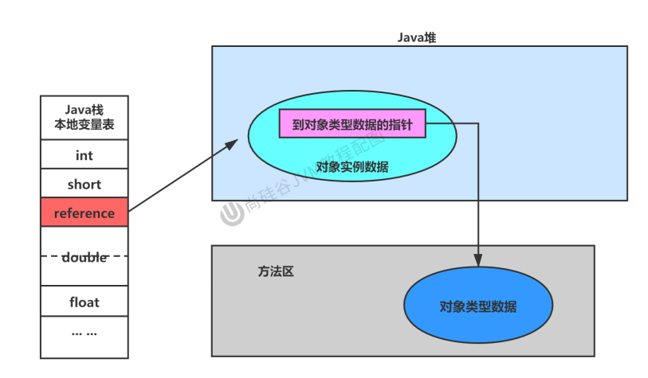

<!-- permalink: /JVM/ -->

# 对象

## 实例化

### 对象创建方式

- new：最常见的方式、单例类中调用 getInstance 的静态类方法，XXXFactory 的静态方法

- Class 的 newInstance 方法：在 JDK9 里面被标记为过时的方法，因为只能调用空参构造器

- Constructor 的 newInstance(XXX)：反射的方式，可以调用空参或带参的构造器

- 使用 clone()：不调用任何的构造器，要求当前的类需要实现 Cloneable 接口中的 clone 方法

- 使用序列化：序列化一般用于 Socket 的网络传输

- 第三方库Objenesis

### 创建对象的步骤

1. **判断对象对应的类是否加载、链接、初始化**

   虚拟机遇到一条 new 指令，首先去检查这个指令的参数能否在 Metaspace 的常量池中定位到一个类的符号引用，

   并且检查这个符号引用代表的类是否已经被加载，链接和初始化。(即判断类元信息是否存在)。

   如果没有，那么在双亲委派模式下， 使用当前类加载器以 ClassLoader + 包名 + 类名为 key 进行查找对应的

    .class 文件， 

   如果没有找到，则抛出 ClassNotFoundException 异常，如果找到，则进行类加载，并生成对应的 Class 对象。

2. **为对象分配内存**

   首先计算对象占用空间的大小，接着在堆中划分一块内存给新对象。

   如果实例成员变量是引用变量，仅分配引用变量空间即可，即 4 个字节大小。

   1. **如果内存规整，则使用指针碰撞(Bump The Point)方法**

      意思是所有用过的内存在一边，空闲的内存放另外一边，中间放着一个指针作为分界点的指示器，分配内存就仅仅是

      把指针指向空闲那边挪动一段与对象大小相等的距离。

      **一般使用带 Compact(整理)过程的垃圾收集器时，会使用指针碰撞，如， Serial ，ParNew 。**

      
      
   2. **如果内存不规整，则虚拟机需要维护一个列表，进行空闲列表分配**
   
      如果内存不是规整的，已使用的内存和未使用的内存相互交错，那么虚拟机将采用的是空闲列表来为对象分配内存。
   
      意思是**虚拟机维护了一个列表，记录上那些内存块是可用的，再分配的时候从列表中找到一块足够大的空间划分**
   
      **给对象实例，** 并更新列表上的内容。这种分配方式称为 "空闲列表(Free List)"。
   
      **使用该分配方式的 GC 收集器：CMS**
   
&ensp;**选择哪种分配方式由堆内存是否规整所决定，堆内存是否规整取决于 GC 收集器的算法是"标记-清除"，**

&ensp;&ensp;&ensp;&ensp;**还是"标记-整理"(也称作"标记-压缩")，复制算法内存也是规整的。**

3. **处理并发问题**

   在程序中，对象的创建时非常频繁的，有可能会出现两个线程同时在同一块内存创建对象的情况。

   方法：

   - 采用 CAS 配上失败重试保证更新的原子性

     CAS 是乐观锁的一种实现方式。**虚拟机采用 CAS 配上失败重试的方式保证更新操作的原子性。**

     

   - **每个线程预先分配 TLAB**    
   
     为每一个线程预先在 Eden 区分配一块内存，JVM 在给线程中的对象分配内存时，首先在 TLAB 分配，
   
     当对象大于 TLAB 中的剩余内存或 TLAB 的内存已用尽时，再采用上述的 CAS 进行内存分配。
   
     --通过设置 -XX:+UseTLAB 参数来设置(区域加锁机制)

4. **初始化零值**

   内存分配完成后，虚拟机需要将分配到的内存空间都初始化为零值(不包括对象头)，这一步操作保证了对象的

   实例字段在 Java 代码中可以不赋初始值就直接使用，程序能访问到这些字段的数据类型所对应的零值。

   给对象属性赋值的操作有：

​      &ensp;&ensp;&ensp;•  属性的默认初始化

​      &ensp;&ensp;&ensp;•  显式初始化

​      &ensp;&ensp;&ensp;•  代码块中的初始化

​      &ensp;&ensp;&ensp;•  构造器初始化

​      &ensp;&ensp;&ensp;•  所有属性设置默认值，保证对象实例字段在不赋值时可以直接使用

5. **设置对象的对象头**

   **将对象的所属类(即类的元数据信息)、对象的 HashCode 和对象的 GC 信息、锁信息等数据存储在对象的对象头中。**

   这个过程的具体设置方式取决于 JVM 实现。

6. **执行init 方法进行初始化**

   **初始化成员变量，执行实例化代码块，调用类的构造方法，并把堆内对象的首地址赋值给引用变量。**

   因此一般来说(由字节码中跟随 invokespecial 指令所决定)，new 指令之后会接着就是执行方法，把对象按照

   程序员的意愿进行初始化，这样一个真正可用的对象才算完成创建出来。

**对象实例化的过程**

- 加载类元信息

- 为对象分配内存

- 处理并发问题

- 属性的默认初始化(零值初始化)

- 设置对象头信息

- 属性的显示初始化、代码块中初始化、构造器中初始化

## 内存布局

​    

### 对象头

 对象头包含了两部分，分别是运行时元数据(Mark Word)和 类型指针(确定该对象所属的类型)

 如果对象是一个java数组，在对象头中还需要记录数组的长度。

 **运行时元数据**

- 哈希值(HashCode)

- GC 分代年龄

- 锁状态标志

- 线程持有的锁

- 偏向线程 ID

- 偏向时间戳

 **类型指针**

  &ensp;&ensp;指向类元数据 InstanceKlass，确定该对象所属的类型。**指向的其实是方法区中存放的类元信息。**

### 实例数据(Instance Data)

 它是对象真正存储的有效信息，包括程序代码中定义的各种类型的字段(包括从父类继承的和本身拥有的)。

  规则：

- 相同宽度的字段总是被分配在一起

- 父类中定义的变量会出现在子类的之前

- 如果CompactFields参数为true(默认为true)，则子类的变量可能插入到父类变量的空隙。

### 对齐填充(Padding)

不是必须的，也没有特别的含义，仅仅起到占位符的作用.

 HotSpot虚拟机要求对象的起始地址必须是8字节的整数倍，**即任何对象的大小都必须是8字节的整数倍.**

 对象头部分已经被设计成正好是8字节的整数倍(1倍或2倍)，因此，如果对象实例数据部分没有对齐的话，

&ensp;&ensp;就需要进行对齐填充。 

​    

## 访问定位

​      

​    通过栈帧中的reference来访问堆中的对象实例。

### 对象访问的方式

1. **使用句柄访问**

   Java堆中会划分出来一块内存来作为句柄池，reference中存储的是对象的句柄地址，而句柄中包含了对象实例数据

   与类型数据各自具体的地址信息。

   优点：

   &ensp;&ensp;reference 中存储稳定的句柄地址，在对象被移动(垃圾收集时移动对象是很普遍的行为)时只会改变句柄中实例数据

   &ensp;&ensp;指针，reference 本身不需要被修改。
   ​      

2. **直接地址访问(HotSpot采用)**

   reference中存储的就是对象地址，如果只是访问对象本身的话，就不需要多一个间接访问的开销。

   优点是速度快。

​      

