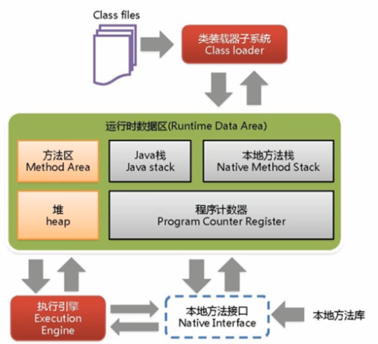
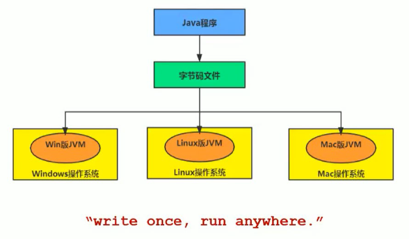
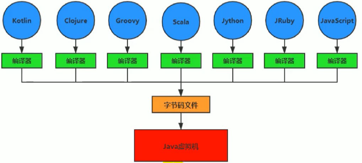

<!-- permalink: /JVM/概述 -->


## JVM体系结构图

​	

​		       执行引擎包含三部分：解释器，及时编译器，垃圾回收器


## 虚拟机和Java虚拟机

### 虚拟机

所谓虚拟机（Virtual Machine），就是一台虚拟的计算机。它是一款软件，用来执行一系列虚拟计算机指令。

大体上，**虚拟机可以分为系统虚拟机和程序虚拟机。**            

Visual Box,VMware就属于系统虚拟机，它们完全是对物理计算机的仿真，提供了一个可运行完整操作系统的软件平台。

程序虚拟机的典型代表就是 Java 虚拟机，它专门为执行单个计算机程序而设计，在 Java 虚拟机中执行的指令我们称为Java 字节码指令。

无论是系统虚拟机还是程序虚拟机，在上面运行的软件都被限制于虚拟机提供的资源。


### Java 虚拟机

Java 虚拟机是一台执行 Java 字节码的虚拟计算机，它拥有独立的运行机制，**其运行的 Java 字节码也未必由 Java 语言编译而成。**

JVM 平台的各种语言可以共享 Java 虚拟机带来的跨平台性、优秀的垃圾回器，以及可靠的即时编译器。

Java 技术的核心就是 Java 虚拟机（JVM，Java Virtual Machine），因为所有的 Java程序都运行在 Java 虚拟机内部。

**Java 虚拟机就是二进制字节码的运行环境，负责装载字节码到其内部，解释/编译为对应平台上的机器指令执行。**

**每一条 Java 指令，Java 虚拟机规范中都有详细定义，如怎么取操作数，怎么处理操作数，处理结果放在哪里。**


### 字节码文件

​       

​	  每种语言都需要转换成字节码文件，最后转换得到的字节码文件都能通过 Java 虚拟机进行运行和处理。

​	         

  **Java 虚拟机根本不关心运行在其内部的程序到底是使用何种编程语言编写的，它只关心“字节码”文件。**

  即，Java 虚拟机拥有语言无关性，并不会单纯地与Java 语言“终身绑定”，只要其他编程语言的编译结果满足并包含

  Java 虚拟机的内部指令集、符号表以及其他的辅助信息，它就是一个有效的字节码文件，就能够被虚拟机所识别并装载运行。

  平时说的 java 字节码，指的是用 java语言编译成的字节码。准确的说任何能在jvm平台上执行的字节码格式都是一样的

​        所以应该统称为：jvm 字节码。 

  **不同的编译器，可以编译出相同的字节码文件，字节码文件也可以在不同的 JVM上运行。**


## 指令集架构

### 指令集

 Java 编译器输入的指令流基本上是一种基于栈的指令集架构，另外一种指令集架构则是基于寄存器的指令集架构。

 基于栈式架构的特点

​     •   设计和实现更简单，适用于资源受限的系统；

​     •   避开了寄存器的分配难题：使用零地址指令方式分配。

​     •   **指令流中的指令大部分是零地址指令，其执行过程依赖于操作栈。指令集更小， 编译器容易实现。**

​     •   不需要硬件支持，可移植性更好，更好实现跨平台

 基于寄存器架构的特点 

​     •   典型的应用是 x86 的二进制指令集：比如传统的 PC 以及 Android 的 Davlik虚拟机。

​     •   指令集架构则完全依赖硬件，可移植性差

​     •   性能优秀和执行更高效

​     •   花费更少的指令去完成一项操作。

​     •   在大部分情况下，基于寄存器架构的指令集往往都以一地址指令、二地址指令和三地址指令为主，

&nbsp;&nbsp;&nbsp;&nbsp;&nbsp;而基于栈式架构的指令集却是以零地址指令为主。

### 举例

 同样执行 2+3 这种逻辑操作，其指令分别如下： 

 基于栈的计算流程（以 Java 虚拟机为例）：

​	iconst_2 	 //常量 2 入栈

​	istore_1

​	iconst_3 	 // 常量 3 入栈

​	istore_2 

​	iload_1 

​	iload_2

​	iadd 			 //常量 2/3 出栈，执行相加

​	istore_0 	  // 结果 5 入栈


 而基于寄存器的计算流程:

​	mov eax,2 	   //将 eax 寄存器的值设为 1 

​	add eax,3    //使 eax 寄存器的值加 3


### 字节码反编译

   编写一个简单的代码，然后查看一下字节码的反编译后的结果

```java
public class StackStruTest {
    
	public static void main(String[] args) {
        
		   int i = 2 + 3;       	        
    }	  	
}
```

​     然后找到编译后的 .class 文件，在idea的命令行中使用下列命令进行反编译：

​	       javap -v StackStruTest.class

​	得到的文件为:

```java
public static void main(java.lang.String[]); 
				
	descriptor: ([Ljava/lang/String;)V
				
    flags: ACC_PUBLIC, ACC_STATIC
				
    Code:
					
      stack=2, locals=4, args_size=1 0: iconst_2
						
                  1: istore_1
						
                  2: iconst_3
						
                  3: istore_2
						
                  4: iload_1
						
                  5: iload_2
						
                  6: iadd
						
                  7: istore_3
						
                  8: return 
				
    LineNumberTable:
						
         line 9: 0
						
         line 10: 2
						
         line 11: 4
						
         line 12: 8 
				
     LocalVariableTable:
						
           Start  Length  Slot  Name   Signature
                  
							0       9        0     args   [Ljava/lang/String; 
                                                           
							2 		 7        1      i          I
                                                           
							4       5        2       j          I
                                                           
							8       1        3       k          I
```


### 总结

   由于跨平台性的设计，Java 的指令都是根据栈来设计的。

  **不同平台 CPU 架构不同， 所以不能设计为基于寄存器的指令集。**

   **优点是跨平台，指令集小，编译器容易实现，缺点是性能下降，实现同样的功能需要更多的指令。**


## JVM生命周期

### 虚拟机的启动

Java 虚拟机的启动是通过引导类加载器（bootstrap class loader）创建一个初始类(initial class）来完成的，这个类是由虚拟机的具体实现指定的。

### 虚拟机的执行

   •   一个运行中的 Java 虚拟机有着一个清晰的任务：执行 Java 程序。

   •   程序开始执行时它才运行，程序结束时他就停止。

   •   执行一个所谓的 Java 程序的时候，真真正正在执行的是一个叫做 Java 虚拟机的进程。

### 虚拟机的退出

  有如下的几种情况：

​     •   程序正常执行结束

​     •   程序在执行过程中遇到了异常或错误而异常终止

​     •   由于操作系统出现错误而导致 Java 虚拟机进程终止

​     •   某线程调用 Runtime 类或 System 类的 exit 方法，或 Runtime 类的 halt 方法，且 Java 安全管理器也允许这种操作。

​     除此之外，JNI(Java Native Interface)规范描述了用 JNI Invocation API 来加载或卸载Java 虚拟机时，Java 虚拟机的退出情况。

