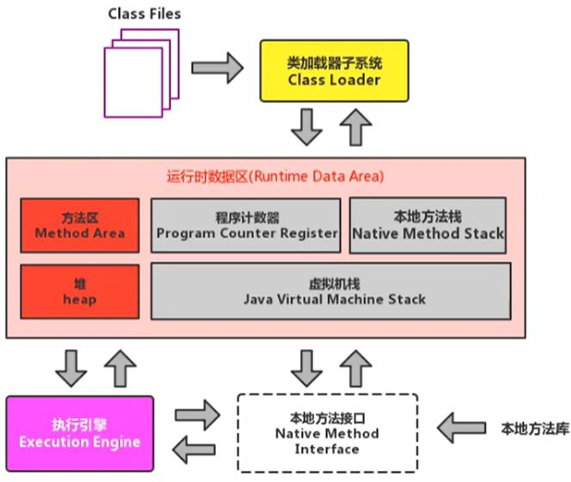
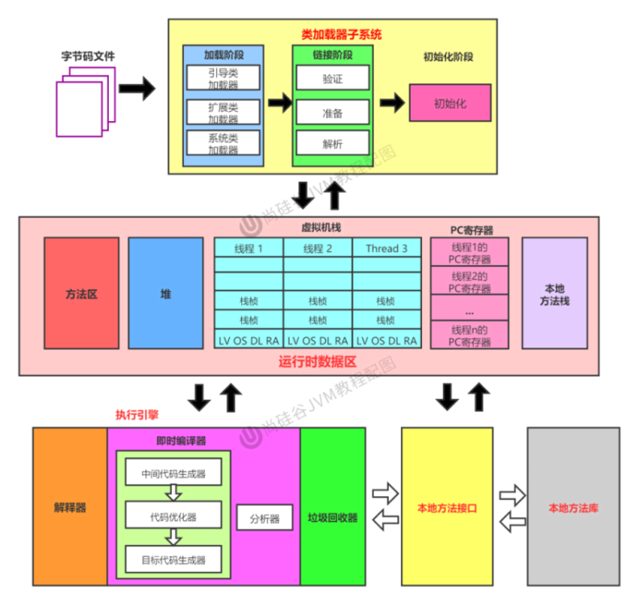
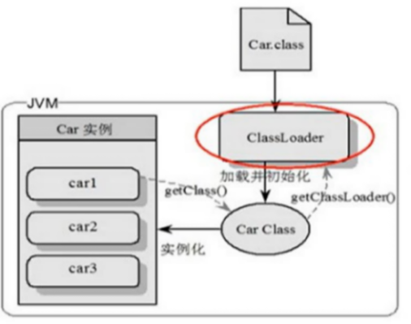
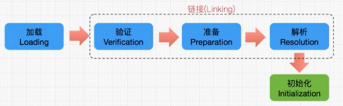
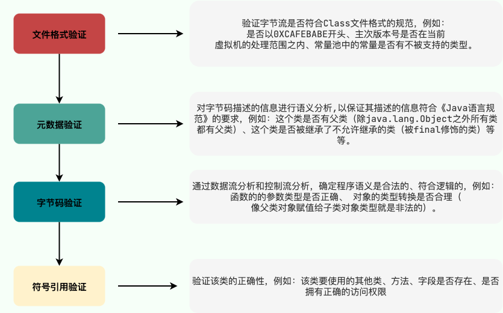
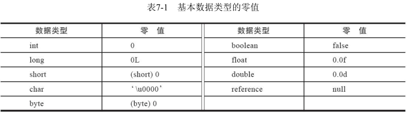
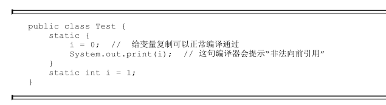
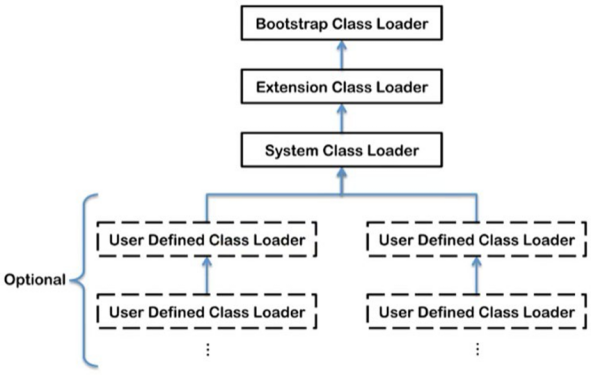
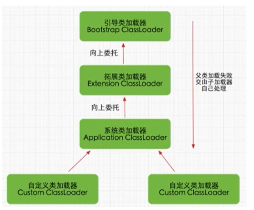
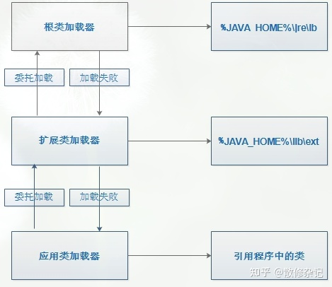

<!--  permalink: /JVM/类加载子系统 -->


## 概述

​         

 完整图：

​       

## 作用

  类加载器子系统负责从文件系统或者网络中加载 Class 文件，**Class 文件在文件开头有特定的文件标识**。

   ClassLoader 只负责 Class 文件的加载，至于它是否可以运行，则由 Execution Engine 决定。

   **加载的类信息存放在一块称为方法区的内存空间。**

   除了类的信息外，方法区中还会存放运行时常量池信息，可能还包括字符串字面量和数字常量(这部分常量信息是Class 文件中常量池部分的内存映射)

​      

   •  class file 存在于本地硬盘上，最终这个文件在执行的时候是要加载到 JVM 当中，然后根据这个文件实例化出 n 个一模一样的实例

   •  **class file 加载到 JVM 中，被称为 DNA 元数据模板，放在方法区中**

   •  从.class 文件->JVM->成为元数据模板，此过程就需要一个运输工具(类装载器 Class Loader），扮演一个快递员的角色

   •  类信息加载到方法区之后，就可以通过类的构造方法创建出n个对象(例，car1、car2、car3）存放在堆中，

&nbsp;&nbsp;&nbsp;**通过调用对象的 getClass( ) 方法就可以知道该对象是通过哪个类创建的。**


## 类的加载过程

​	   


### 加载阶段

**完成的工作：**

1. 通过一个类的全限定名(类的全名)获取定义此类的二进制字节流，
2. 将这个字节流所代表的静态存储结构转化为方法区的运行时数据结构，
3. **在内存中生成一个代表这个类的 java.lang.Class 对象，作为方法区这个类的各种数据的访问入口。**

**类加载器介绍：**

1. 类加载器是一个负责加载类的对象。`ClassLoader` 是一个抽象类。给定类的二进制名称，类加载器应尝试定位或生成构成类定义的数据。典型的策略是**将名称转换为文件名，然后从文件系统中读取该名称的“类文件”。**

2. 每个 Java 类都有一个引用指向加载它的 `ClassLoader`。

3. 但是，数组类不是通过 `ClassLoader` 创建的，而是 JVM 在需要的时候自动创建的，数组类通过`getClassLoader()`方法获取 的`ClassLoader` 和该数组的元素类型的 `ClassLoader` 是一致的。

4. 其实除了加载类之外，类加载器还可以加载 Java 应用所需的资源如文本、图像、配置文件、视频等。

**加载规则：**

1. JVM 启动的时候，并不会一次性加载所有的类，而是根据需要去动态加载，即，大部分类在用到的时候才会去加载。

2. 对于已经加载的类会被放在 `ClassLoader` 中。在类加载的时候，系统会首先判断当前类是否被加载过。已经被加载的类会直接返回，否则才会尝试加载。也就是说，**对于一个类加载器来说，相同二进制名称的类只会被加载一次。**

**加载文件的方式：**

1. 从ZIP压缩包中读取，最终成为日后JAR、EAR、WAR格式的基础。

2. 从网络中获取，这种场景最典型的应用就是Web Applet。

3. 运行时计算生成，这种场景使用得最多的就是动态代理技术，在java.lang.reflect.Proxy中，就是用了

&nbsp;&nbsp;&nbsp;&nbsp;&nbsp;ProxyGenerator.generateProxyClass( )来为特定接口生成形式为“*$Proxy”的代理类的二进制字节流。

4. 由其他文件生成，典型场景是JSP应用，由JSP文件生成对应的Class文件。

5. 从数据库中读取，这种场景相对少见些，例如有些中间件服务器（如SAP Netweaver）可以选择把程序安装到数据库中来完成程序代码在集群间的分发。

6. 可以从加密文件中获取，这是典型的防Class文件被反编译的保护措施，通过加载时解密Class文件来保障程序运行逻辑不被窥探。


### 链接阶段(Linking)

####  **验证(Verify)**

   **目的在于确保 Class 文件的字节流中包含的信息符合当前虚拟机要求，保证被加载类的正确性，不会危害虚拟机自身安全**

   验证阶段这一步在整个类加载过程中耗费的资源还是相对较多的，但很有必要，可以有效**防止恶意代码的执行**。

   任何时候，程序安全都是第一位。

   不过，验证阶段也不是必须要执行的阶段。如果程序运行的全部代码(包括自己编写的、第三方包中的、从外部加载的、动态生成的等所有代码)都已经被反复使用和验证过，在生产环境的实施阶段就可以考虑使用 `-Xverify:none` 参数来关闭大部分的类验证措施，以缩短虚拟机类加载的时间。

   主要包括四种验证：

​     **文件格式验证(Class文件格式检查)：**

&nbsp;&nbsp;&nbsp;1.是否以魔数0xCAFEBABE开头。

&nbsp;&nbsp;&nbsp;2.主、次版本号是否在当前Java虚拟机接受范围之内。

&nbsp;&nbsp;&nbsp;3.常量池的常量中是否有不被支持的常量类型（检查常量tag标志）。

&nbsp;&nbsp;&nbsp;4.指向常量的各种索引值中是否有指向不存在的常量或不符合类型的常量。

&nbsp;&nbsp;&nbsp;5.CONSTANT_Utf8_info型的常量中是否有不符合UTF-8编码的数据。

&nbsp;&nbsp;&nbsp;6.Class文件中各个部分及文件本身是否有被删除的或附加的其他信息。

&nbsp;&nbsp;&nbsp;文件格式验证阶段是基于该类的二进制字节流进行的，主要目的是保证输入的字节流能正确地解析并存储于

&nbsp;&nbsp;&nbsp;&nbsp;&nbsp;&nbsp;方法区之内，格式上符合描述一个 Java 类型信息的要求。

&nbsp;&nbsp;&nbsp;&nbsp;除了这一阶段之外，**其余三个验证阶段都是基于方法区的存储结构上进行的，不会再直接读取、操作字节流了**。

**元数据验证(字节码语义检查)：**

&nbsp;&nbsp;&nbsp;1.这个类是否有父类（除了java.lang.Object之外，所有的类都应当有父类）。

&nbsp;&nbsp;&nbsp;2.这个类的父类是否继承了不允许被继承的类（被final修饰的类）。

&nbsp;&nbsp;&nbsp;3.如果这个类不是抽象类，是否实现了其父类或接口之中要求实现的所有方法。

&nbsp;&nbsp;&nbsp;4.类中的字段、方法是否与父类产生矛盾(例如覆盖了父类的final字段，或者出现不符合规则的方法重载)。

&nbsp;&nbsp;&nbsp;第二阶段的主要目的是对类的元数据信息进行语义校验，保证不存在与《Java语言规范》定义相悖的元数据信息。

 **字节码验证(程序语义检查)：**

&nbsp;对类的方法体(Class文件中的Code属性)进行校验分析，保证被校验类的方法在运行时不会做出危害虚拟机安全的行为。

&nbsp;&nbsp;&nbsp;1.保证任意时刻操作数栈的数据类型与指令代码序列都能配合工作

&nbsp;&nbsp;&nbsp;2.保证任何跳转指令都不会跳转到方法体以外的字节码指令上

&nbsp;&nbsp;&nbsp;3.保证方法体中的类型转换总是有效的

**符号引用验证(类的正确性检查)：**

&nbsp;&nbsp;符号引用验证的主要目的是确保解析行为能正常执行。

&nbsp;&nbsp;主要验证 **该类是否缺少或者被禁止访问它依赖的某些外部类、方法、字段等资源。**

&nbsp;&nbsp;&nbsp;1.符号引用中通过字符串描述的全限定名是否能找到对应的类。

&nbsp;&nbsp;&nbsp;2.在指定类中是否存在符合方法的字段描述符及简单名称所描述的方法和字段。

&nbsp;&nbsp;&nbsp;3.符号引用中的类、字段、方法的可访问性（private、protected、public、package）是否可被当前类访问。


​	   

​	

####  **准备(Prepare)**

   **为类变量(被static修饰)分配内存并且设置该类变量的默认初始值，即零值**。

&nbsp;&nbsp;&nbsp;(int型的默认初始值为0，布尔类型为false，引用类型为null）

​      

​    从概念上讲，这些变量所使用的内存都应当在方法区中进行分配，但必须注意到方法区本身是一个逻辑上的区域，

​      在JDK 7及之前，HotSpot使用永久代来实现方法区时，实现是完全符合这种逻辑概念的；

​      而在**JDK8及之后，类变量则会随着Class对象一起存放在Java堆中**，这时候“类变量在方法区”就完全是一种对逻辑概念的表述了。

   这里不包含用finial修饰的变量，因为**final修饰的变量在编译期间就会分配内存，在准备阶段会将其显式初始化**。

   **这里不会为实例变量分配内存，类变量会分配在方法区中，而实例变量会随着对象一起分配到java堆中。**

```java
public class HelloApp {
    
	private static int a = 1;   //在准备阶段 a的值为0，在初始化的时候才会将a的值变为1
    
	public static void main(String[] args) { 
        						
        System.out.println(a);					
  }				 
}
```


#### **解析(Resolve)**

   **将常量池内的符号引用转换为直接引用的过程，也就是得到类或者字段、方法在内存中的指针或者偏移量。**

   事实上，解析操作往往会伴随着 JVM 在执行完初始化之后再执行。

   **符号引用就是一组符号来描述所引用的目标。** 符号引用的字面量形式明确定义在《java 虚拟机规范》的class文件格式中

   **直接引用就是直接指向目标的指针、相对偏移量或一个间接定位到目标的句柄。**

   虚拟机实现可以根据需要来自行判断在什么时候进行解析，是在类被加载器加载时就对常量池中的符号引用进行解析，还是等到一个符号引用将要被使用前才去解析它。

   解析动作主要针对类或接口、字段、类方法、接口方法、方法类型、方法句柄和调用点限定符等。

   对应常量池中的 CONSTANT_Class_info、CONSTANT_Fieldref_info、CONSTANT_Methodref_info 等。

   

   符号引用（Symbolic References）：

&nbsp;&nbsp;&nbsp;**符号引用以一组符号来描述所引用的目标，符号可以是任何形式的字面量，只要使用时能无歧义地定位到目标即可。**

&nbsp;&nbsp;&nbsp;符号引用与虚拟机实现的内存布局无关，引用的目标并不一定是已经加载到虚拟机内存当中的内容。

&nbsp;&nbsp;&nbsp;各种虚拟机实现的内存布局可以各不相同，但是它们能接受的符号引用必须都是一致的，因为符号引用的字面量形式明确定义在《Java虚拟机规范》中。

   直接引用（Direct References）：

&nbsp;&nbsp;&nbsp;直接引用是可以直接指向目标的指针、相对偏移量或者是一个能间接定位到目标的句柄。

&nbsp;&nbsp;&nbsp;直接引用和虚拟机实现的内存布局是直接相关的，同一个符号引用在不同虚拟机上翻译出来的直接引用一般不会相同。

&nbsp;&nbsp;&nbsp;如果有了直接引用，那引用的目标必定已经在虚拟机的内存中存在。

### 初始化阶段

   **初始化阶段就是执行类构造器方法`<clinit>( )`的过程。**

   此方法不需要定义，**是 javac 编译器自动收集类中的所有类变量(即静态变量)的赋值操作和静态代码块中的语句合并而来**

​	  编译器收集的顺序是由语句在源文件中出现的顺序决定的，静态语句块中只能访问到定义在静态语句块之前的变量，定义在它之后的变量，在前面的静态语句块可以赋值，但是不能访问。

​              

   即，当代码中包含 static 变量的时候，就会有 clinit 方法。

   若该类具有父类，JVM会保证子类的`<clinit>()`执行前，父类的`<clinit>()`已经执行完。

   任何一个类在声明后，都有生成一个构造器，默认是无参构造器，对应.class文件中的`<init>`方法。

   `<clinit>()`方法对于类或接口来说并不是必需的，如果一个类中没有静态语句块，也没有对变量的赋值操作，那么编译器可以不为这个类生成`<clinit>()`方法

   **虚拟机必须保证一个类的`<clinit>()`方法在多线程下被同步加锁。**

注意以下几种情况不会执行类初始化：

1. 通过子类引用父类的静态字段，只会触发父类的初始化，而不会触发子类的初始化。
2. 定义对象数组，不会触发该类的初始化。
3. 常量在编译期间会存入调用类的常量池中，本质上并没有直接引用定义常量的类，不会触发定义常量所在的类。
4. 通过类名获取 Class 对象，不会触发类的初始化。
5. 通过 Class.forName 加载指定类时，如果指定参数 initialize 为 false 时，也不会触发类初始化，
6. 通过 ClassLoader 默认的 loadClass 方法，也不会触发初始化动作。


## 类加载器的种类 

JVM 支持两种类型的类加载器：引导类加载器(Bootstrap ClassLoader) 和 自定义类加载器(User-Defined ClassLoader)。

   java虚拟机规范中将所有派生于抽象类 ClassLoader 的类加载器都划分为自定义类加载器。

   即，**除了引导类加载器之外，包括扩展类加载器和应用程序类加载器在内，所有继承了ClassLoader的加载器都是自定义类加载器。**

   

### 虚拟机自带的加载器

#### **启动类加载器**

   又叫引导类加载器，Bootstrap ClassLoader

  •  这个类加载使用 C/C++语言实现的，嵌套在 JVM 内部，无法在java代码中获取它的引用。

  •  它用来加载 Java 的核心库（JAVAHOME/jre/ lib/rt.jar、resources.jar 或sun.boot.class.path 路径下的内容），

&nbsp;&nbsp;&nbsp;**用于提供 JVM 自身需要的类以及java核心类，比如，int.class，String.class。**

  •  并不继承自 java.lang.ClassLoader，没有父加载器。

  •  **加载扩展类加载器和应用程序类加载器，并被指定为他们的父类加载器。**

&nbsp;&nbsp;&nbsp;  因为类加载器类和其它的 Java 类一样，也是要由类加载器来加载的。

  •  出于安全考虑，Bootstrap 启动类加载器只加载包名为 java、javax、sun 等开头的类。


#### **扩展类加载器**

  Extension ClassLoader

  •  在类sun.misc.Launcher$ExtClassLoader中以Java代码的形式实现。

  •  派生于抽象类ClassLoader 

  •  父类加载器为启动类加载器

  •  从 java.ext.dirs 系统属性所指定的目录中加载类库，或从 JDK 的安装目录的jre/lib/ext 子目录(扩展目录)下加载类库。

&nbsp;&nbsp;&nbsp; 如果用户创建的 JAR 放在此目录下，也会自动由扩展类加载器加载。


#### **应用程序类加载器**

   又叫 系统类加载器，Application Class Loader

   •  java 语言编写，由 sun.misc.Launcher$AppClassLoader 实现

   •  派生于 ClassLoader 类

   •  父类加载器为扩展类加载器

   •  **它负责加载环境变量 classpath 或系统属性 java.class.path 指定路径下的类库**

   •  该类加载是程序中默认的类加载器，一般来说，Java 应用程序中的类以及用到的第三方包中的类都是由它来完成加载

   •  通过 classLoader.getSystemclassLoader（）方法可以获取到该类加载器


### 用户自定义类加载器

在 Java 的日常应用程序开发中，类的加载几乎是由上述 3 种类加载器相互配合执行的，在必要时，我们还可以自定义类加载器，来定制类的加载方式。 

 为什么要自定义类加载器？

​    &nbsp;&nbsp;•  隔离加载类

​    &nbsp;&nbsp;•  修改类加载的方式

​    &nbsp;&nbsp;•  扩展加载源

​    &nbsp;&nbsp;•  防止源码泄漏

用户自定义类加载器实现步骤：

- 开发人员可以通过继承抽象类 java.lang.ClassLoader 类的方式，实现自己的类加载器，以满足一些特殊的需求
- 在 JDK1.2 之前，在自定义类加载器时，会去继承 ClassLoader 类并重写 loadClass( ) 方法，从而实现自定义的类加载器，但在 JDK1.2 之后已不再建议用户去覆盖 loadclass( ) 方法，而是建议把自定义的类加载逻辑写在findclass方法中

- 在编写自定义类加载器时，如果没有太过于复杂的需求，可以直接继承URIClassLoader 类，这样就可以避免自己去编写 findclass（）方法及其获取字节码流的方式，使自定义类加载器编写更加简洁。

​       **关于ClassLoader：它是一个抽象类，其后所有的类加载器都继承自ClassLoader（启动类加载器除外）**


## 双亲委派机制

  Java 虚拟机对 class 文件采用的是按需加载的方式，当需要使用该类时才会将它的 class 文件加载到内存生成 class 对象

  在加载某个类的class文件时，Java 虚拟机采用的是双亲委派模式，把请求交由父类加载器处理，它是一种任务委派模式

### 工作原理

- 在类加载的时候，系统会首先判断当前类是否被加载过。已经被加载的类会直接返回，否则才会尝试加载（每个父类加载器都会走一遍这个流程)。

- 类加载器在进行类加载的时候，它并不会自己先去加载，而是把这个请求委托给父类的加载器去执行，（调用父加载器 `loadClass()`方法来加载类）；

- 如果父类加载器还存在其父类加载器，则进一步向上委托，依次递归，请求最终将到达顶层的启动类加载器；

- 如果父类加载器可以完成类加载任务，就成功返回，倘若父类加载器无法完成此加载任务（它的搜索范围中没有找到要加载的类），子加载器才会尝试自己去加载（调用自己的 `findClass()` 方法来加载类）。
  ​    

   即，如果一个类加载器收到了类加载的请求，它首先不会自己去尝试加载这个类，而是把这个请求委派给父类加载器

   去完成，每一个层次的类加载器都是如此，因此所有的加载请求最终都应该传送到最顶层的启动类加载器中，

   只有当父加载器无法完成这个加载请求(它的搜索范围中没有找到所需的类)时，子加载器才会尝试自己去完成加载。

###   优势(代理模式)

1. 代理模式是为了保证 Java 核心库的类型安全：通过代理模式，对于 Java 核心库的类的加载工作由引导类加载器来统一完成，**保证了 Java 应用所使用的都是同一个版本的 Java 核心库的类**，是互相兼容的。

2. **相同名称的类可以并存在 Java 虚拟机中**：不同的类加载器为相同名称的类创建了额外的名称空间。相同名称的类可以并存在 Java 虚拟机中，只需要用不同的类加载器来加载它们即可。不同类加载器加载的类之间是不兼容的，这就相当于在 Java 虚拟机内部创建了一个个相互隔离的 Java 类空间。

3. **避免类的重复加载**：比如加载位于 rt.jar 包中的类 java.lang.Object，不管是哪个加载器加载这个类，最终都是委托给顶层的启动类加载器进行加载，这样就保证了使用不同的类加载器最终得到的都是同样一个 Object 对象

4. **保护程序安全，防止核心 API 被随意篡改**

例：加载用户自定义类Test.class

​      Test.class要进行加载时，JVM将会启动应用类加载器进行加载Test类，但是这个系统类加载器不会真正去加载他，

&nbsp;&nbsp;    而是会调用看是否有父加载器，结果有，是扩展类加载器，扩展类加载器也不会直接去加载，它看自己是否有

&nbsp;&nbsp;     &nbsp;父加载器，结果还是有，是启动类加载器。

   &nbsp;&nbsp;所以这个时候启动类加载器就去加载这个类，可在%JAVA_HOME%\jre\lib下，它找不到com.vkls.Test这个类，

&nbsp;&nbsp;所以它告诉它的子类加载器，我找不到，你去加载吧，扩展类加载器去%JAVA_HOME%\lib\ext去找，也找不着，

&nbsp;&nbsp;它告诉它的子类加载器 System类加载器，我找不到这个类，你去加载吧，结果System类加载器找到了，

&nbsp;&nbsp;就加载到内存中，并生成Class对象。

​			


#### **如何判断两个 class 对象是否相同**

两个必要条件：


​    •  类的完整类名必须一致，包括包名。

​    •  加载这个类的 ClassLoader(ClassLoader 实例对象)必须相同。

​    在JVM 中，即使这两个类对象(class 对象)来源同一个 Class 文件， 被同一个虚拟机所加载，但只要加载它们的 ClassLoader 实例对象不同，那么这两个类对象也是不相等的。

​    JVM 必须知道一个类型是由启动类加载器加载的还是由用户类加载器加载的。

​     如果一个类是由用户类加载器加载的，那么 JVM 会将这个类加载器的一个引用作为类型信息的一部分保存在方法区中。     

​     **当解析一个类型到另一个类型的引用的时候，JVM 需要保证这两个类型的类加载器是相同的。**


#### **类的主动使用和被动使用**

  Java 程序对类的使用方式分为：主动使用和被动使用。 

  主动使用，又分为七种情况：  主动使用会导致类的初始化

​     &nbsp;&nbsp;•  创建类的实例

​     &nbsp;&nbsp;•  访问某个类或接口的静态变量，或者对该静态变量赋值

​     &nbsp;&nbsp;•  调用类的静态方法 

​     &nbsp;&nbsp;•  反射（比如：Class.forName（"com.vkls.Test"））

​     &nbsp;&nbsp;•  初始化一个类的子类

​     &nbsp;&nbsp;•  Java 虚拟机启动时被标明为启动类的类

​     &nbsp;&nbsp;•  JDK7 开始提供的动态语言支持：java.lang.invoke.MethodHandle 实例的解析结果 REF getStatic、REF putStatic、REF invokeStatic 句柄对应的类没有初始化，否则就初始化。

​    **除了以上七种情况，其他使用 Java 类的方式都被看作是对类的被动使用，都不会导致类的初始化。**


