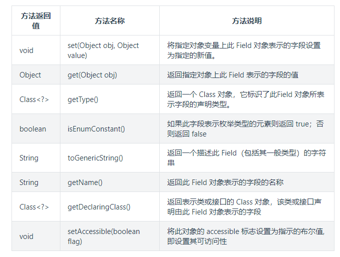
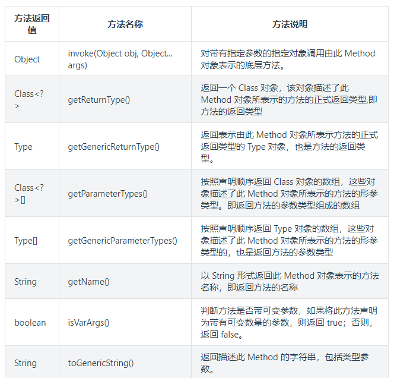

<!-- permalink: /    -->


## 反射机制

**反射，指的是可以于运行时加载、探知、使用编译期间完全未知的类。**

JAVA反射机制是在运行状态中，**对于任意一个类，都能够知道这个类的所有属性和方法**；对于任意一个对象，都能够调用

它的任意一个方法和属性；这种动态获取信息以及动态调用对象方法的功能称为java语言的反射机制。

 例：

`Class c = Class. forName ("com.vkls.User");`

 加载完类之后，在堆内存中，就产生了一个 Class 类型的对象(**每个类都有一个Class对象，一个类只有一个 Class 对象**)，

这个**Class对象包含了关于类的结构和行为的信息，可以用来创建类的实例、访问类的方法和字段，以及获取有关类的**

**各种元数据**。在运行时，Java虚拟机会动态地创建这些Class对象，并在需要时使用它们来操作类的实例。

 这个对象就像一面镜子(或者可以认为它给类拍了一个x光，这样类里面的属性和方法就像人体内部的器官一样能被

 看到了)，透过这个镜子看到类的结构，所以，我们形象的称之为：反射。

## Class类

Class类也是一个实实在在的类，存在于JDK的java.lang包中，与class关键字是不一样的。

Class类的实例表示java应用运行时的类(class and enum)或接口(interface and annotation)，

**每个java类运行时都在JVM里表现为一个class对象，可通过类名.class、类型.getClass()、Class.forName("类名")等方法**

**获取对应的class对象**。

 数组同样也被映射为Class 对象的一个类，所有具有相同元素类型和维数的数组都共享该 Class 对象。

 基本类型boolean，byte，char，short，int，long，float，double和关键字void同样表现为 Class 对象。

- 手动编写的类被编译后会产生一个Class对象，其表示的是创建的类的类型信息，这个Class对象保存在同名.class文件中

- **每个通过关键字class标识的类，在内存中有且只有一个与之对应的Class对象来描述其类型信息，无论创建多少个**

  **实例对象，其依据的都是同一个Class对象。**

- Class类只有私有构造函数，因此每个类对应的Class对象只能由JVM创建和加载。

- **Class对象的作用是运行时提供或获得某个对象的类型信息**。


## 获取Class对象

1. 使用类固有的class属性来获取该类对应的class对象      

```java
 Class<Student> c1=Student.class  //Student为类名
```

2. 调用对象的getClass( )方法，返回该对象所属类对应的Class对象

```java
Student s=new Student();

Class<? extends Student> c2=s.getClass();
```

3. 使用Class类中的静态方法forName(String className)   className为某个类的全路径             

```java
Class<?> c3=Class.forName("com.vkls.Student");
```

4. 通过类加载器获取

```java
Class<?> c4=ClassLoader.getSystemClassLoader().loadClass("com.vkls.User");
```

5. 对数组来说，当元素类型和维度数一样时，得到的class对象是一样的         

```java
int[] arr01=new int[10];
               
int[] arr02=new int[20];           //arr01.getClass().hashCode()等于arr02.getClass().hashCode()
               
int[] arr03=new int[30][10];     //arr03的hashCode和01,02不一样
               
double[] arr04=new double[10]; //arr04和上面的都不一样
```

 **以下几种操作不会触发类的初始化：**

1. 通过类名获取 Class 对象，不会触发类的初始化。

2. 通过 Class.forName 加载指定类时，如果指定参数 initialize 为 false 时，也不会触发类初始化。

3. 通过 ClassLoader 默认的 loadClass 方法，也不会触发初始化动作。

## Class类的方法

|       方法名       |                             作用                             |
| :----------------: | :----------------------------------------------------------: |
|     getName()      |         获取全限定的类名(包括包名)，即类的完整名字。         |
|  getSimpleName()   |                     获取类名(不包括包名)                     |
| getCanonicalName() |                  获取全限定的类名(包括包名)                  |
|   isInterface()    |               判断该Class对象是否表示一个接口                |
|  getInterfaces()   |  返回Class对象数组，获取该Class对象表示类所实现的所有接口。  |
|  getSupercalss()   | 返回Class对象，获取Class对象表示的类所继承的直接基类。应用该方法可在运行时发现一个对象完整的继承结构。 |
|   newInstance()    | 返回一个Oject对象，是实现“虚拟构造器”的一种途径。**使用该方法创建的类，必须带有无参的构造器。** |
|    getFields()     | 获取Class对象所表示类的所有public变量，包括继承自父类的public变量。 类似的还有getMethods和getConstructors。 |
| getDeclaredFields  | 获取Class对象所表示类的自己声明的变量，即包括public、private和proteced，不包括父类声明的任何变量。 |

```java
package com.mtgd;
import java.lang.reflect.Field;

interface I1{
}
interface I2{
}

class Person{
    public String name;
}

class Teacher extends Person{
    public int teacherPublic;
    protected int teacherProtected;
    int teacherDefault;
    private int teacherPrivate;
    protected static int sTeacherProtected;
    static int sTeacherDefault;
    public static int sTeacherPublic;
    private static int sTeacherPrivate;
}

class Stu extends Person implements I1,I2{
    public int stuPublic;
    protected int stuProtected;
    int stuDefault;
    private int stuPrivate;
    protected static int sStuProtected;
    static int sStuDefault;
    public static int sStuPublic;
    private static int sStuPrivate;
}

public  class  Cat {
    public static void main(String[] args) throws ClassNotFoundException, InstantiationException, IllegalAccessException {

        Class<Stu> stu= Stu.class;

        //类名打印
        System.out.println(stu.getName()); //com.mtgd.Stu
        System.out.println(stu.getSimpleName()); //Stu
        System.out.println(stu.getCanonicalName());//com.mtgd.Stu

        //获取所实现的接口
        System.out.println(stu.isInterface()); //false
        for (Class iI : stu.getInterfaces()) {
            System.out.println(iI);
        }
        //interface com.mtgd.I1   interface com.mtgd.I2

        //获取父类路径
        System.out.println(stu.getSuperclass());//class com.mtgd.Person

        //创建对象
        Stu d = stu.newInstance();

        //获取所有public变量
        for (Field f : stu.getFields()) {
            System.out.println(f.getName());
        }
        //stuPublic  sStuPublic  name

        //获取自身声明的所有变量
        for (Field f : stu.getDeclaredFields()) {
            System.out.println(f.getName());
        }
        /*
        stuPublic
        stuProtected
        stuDefault
        stuPrivate
        sStuProtected
        sStuDefault
        sStuPublic
        sStuPrivate
         */
    }
}
```


## 获取构造方法

1. Constructor<?>[ ]  getConstructors( )     

   返回一个Constructor类型的数组，每一个Constructor对象代表类的一个公共构造方法。

   例：

   ```java
   Class<?> c=Class.forName("com.vkls.Student");       //获取Class对象
                 
   Constructor<?>[] cons=c.getConstructors();  
                 
   for(Constructor con:cons){
                    
       System.out.println(con);  //输出Student类所有public修饰的构造方法的方法名，不包括JVM自动添加的
   }
   ```

   

2. 其他方法

   ```java
   //获取所有的构造方法
   2.Constructor<?>[ ]  getDeclareConstructors( )   
   
   //返回单个公共构造方法,通过参数类型确定返回哪个构造方法  
   3.Constructor<T> getConstructor(Class<?>...parameterTypes)     
     
   //返回单个构造方法  
   4.Constructor<T> getDeclaredConstructor(Class<?>...parameterTypes)   
   
   //调用无参构造器创建此Class对象所表示的类的一个新实例。所表示的类必须有无参构造方法。
   5.T newInstance()
   ```

   例：

   ```java
   Class<?> c=Class.forName("com.vkls.Student");    
   
   //传入的参数应与获得的构造方法所需要的参数相匹配，即，应有一个需要两个参数的构造方法，一个是String类型，
   //一个是int类型  
   Constructor<?> con=c.getConstructor(String.class,int.class);  
   
   //使用获取的构造函数创建对象   
   //Object是所有类的父类,实际开发中这里可以使用具体的类 如 User user=con.newInstance("vkls",22);
   Object obj=con.newInstance("vkls",22);     
   
   //暴力反射,当参数为true时,程序可以使用私有的构造方法创建对象
   //方法原型:public void setAccessible(boolean flag)
   con.setAccessible(true);                                                   
   ```

   例1：

   ```java
   public class ConstructionTest implements Serializable {
       
       public static void main(String[] args) throws Exception {
   
           Class<?> clazz = null;
   
           //获取Class对象的引用
           clazz = Class.forName("com.example.javabase.User");
   
           //第一种方法，实例化默认构造方法，User必须有无参构造方法,否则将抛异常
           User user = (User) clazz.newInstance();
           
           user.setAge(20);
           
           user.setName("Jack");
           
           System.out.println(user);
   
           System.out.println("--------------------------------------------");
   
           
           //获取带String参数的public构造函数
           Constructor cs1 =clazz.getConstructor(String.class);
           
           //通过获取的构造方法创建User
           User user1= (User) cs1.newInstance("vkls");
           
           user1.setAge(22);
           
           System.out.println("user1:"+user1.toString());
   
           System.out.println("--------------------------------------------");
   
           
           //取得需要int和String类型参数的构造方法,该方法是私有构造方法
           Constructor cs2=clazz.getDeclaredConstructor(int.class,String.class);
           //由于是private必须设置可访问
           cs2.setAccessible(true);
           
           //创建user对象
           User user2= (User) cs2.newInstance(25,"mtgd");
           System.out.println("user2:"+user2.toString());
   
           System.out.println("--------------------------------------------");
   
           
           //获取所有构造方法
           Constructor<?> cons[] = clazz.getDeclaredConstructors();
           
           // 查看每个构造方法需要的参数
           for (int i = 0; i < cons.length; i++) {
               //获取构造函数参数类型
               Class<?> clazzs[] = cons[i].getParameterTypes();
               
               System.out.println("构造函数["+i+"]:"+cons[i].toString() );
               
               System.out.print("参数类型["+i+"]:(");
               
               for (int j = 0; j < clazzs.length; j++) {
                   
                   if (j == clazzs.length - 1)
                       System.out.print(clazzs[j].getName());
                   else
                       System.out.print(clazzs[j].getName() + ",");
               }
               System.out.println(")");
           }
       }
   }
   
   @Data
   class User {
       private int age;
       private String name;
       
       public User() {
           super();
       }
      
       public User(String name) {
           super();
           this.name = name;
       }
   
       /**
        * 私有构造方法
        * @param age
        * @param name
        */
       private User(int age, String name) {
           super();
           this.age = age;
           this.name = name;
       }
   }
   
   //结果：
   User{age=20, name='Jack'}
   --------------------------------------------
   user1:User{age=22, name='vkls'}
   --------------------------------------------
   user2:User{age=25, name='mtgd'}
   --------------------------------------------
   构造函数[0]:private com.example.javabase.User(int,java.lang.String)
   参数类型[0]:(int,java.lang.String)
   
   构造函数[1]:public com.example.javabase.User(java.lang.String)
   参数类型[1]:(java.lang.String)
   
   构造函数[2]:public com.example.javabase.User()
   参数类型[2]:()
   ```

   

**Constructor类本身一些常用方法**

| 方法返回值  |              名称               |                           方法说明                           |
| :---------: | :-----------------------------: | :----------------------------------------------------------: |
|    Class    |       getDeclaringClass()       | 返回 Class 对象，该对象表示声明由此 Constructor 对象表示的构造方法的类，其实就是返回真实类型（不包含参数） |
|   Type[]    |   getGenericParameterTypes()    | 按照声明顺序返回一组 Type 对象，返回的就是 Constructor对象构造函数的形参类型。 |
|   String    |            getName()            |              以字符串形式返回此构造方法的名称。              |
| Class<?>[ ] |       getParameterTypes()       | 按照声明顺序返回一组 Class 对象，即返回Constructor 对象所表示构造方法的形参类型 |
|      T      | newInstance(Object... initargs) |       使用此 Constructor对象表示的构造函数来创建新实例       |
|   String    |        toGenericString()        |     返回描述此 Constructor 的字符串，其中包括类型参数。      |

 例：

```java
Constructor cs3 = clazz.getDeclaredConstructor(int.class,String.class);

System.out.println("-----getDeclaringClass-----");

Class uclazz=cs3.getDeclaringClass();

//Constructor对象表示的构造方法的类
System.out.println("构造方法的类:"+uclazz.getName());


System.out.println("-----getGenericParameterTypes-----");

//对象表示此 Constructor 对象所表示的方法的形参类型
Type[] tps=cs3.getGenericParameterTypes();

for (Type tp:tps) {
    System.out.println("参数名称tp:"+tp);
}


System.out.println("-----getParameterTypes-----");

//获取构造函数参数类型
Class<?> clazzs[] = cs3.getParameterTypes();

for (Class claz:clazzs) {
    System.out.println("参数名称:"+claz.getName());
}


System.out.println("-----getName-----");

//以字符串形式返回此构造方法的名称
System.out.println("getName:"+cs3.getName());


System.out.println("-----getoGenericString-----");

//返回描述此 Constructor 的字符串，其中包括类型参数。
System.out.println("getoGenericString():"+cs3.toGenericString());


结果：
-----getDeclaringClass-----
构造方法的类:com.example.javabase.User
    
-----getGenericParameterTypes-----
参数名称tp:int
参数名称tp:class java.lang.String
    
-----getParameterTypes-----
参数名称:int
参数名称:java.lang.String
    
-----getName-----
getName:com.example.javabase.User
    
-----getoGenericString-----
getoGenericString():private com.example.javabase.User(int,java.lang.String)
```


## 获取成员变量

```java
1. Field[] getFields()                //返回一个包含Filed对象的数组,获取所有的公共成员变量    
    
2. Field[] getDeclareFields()        //获取所有的成员变量
    
3. Field getField(String name)      //获取指定的公共成员变量
    
4. Field getDeclaredField(String name)    //返回指定的成员变量
```

 **Field类方法:**

​	

例： 

```java
Class<?> c=Class.forName("com.vkls.Student");
  
Field addressField=c.getField("address");  //获取成员变量address
  
Constructor<?> con=c.getConstructor();    //假设获取无参构造方法创建对象
  
Object obj=con.newInstance();      //该处的object根据实际情况可以是具体的类  
  
addressField.set(obj,"杭州");     //给对象obj的成员变量addressField赋值为杭州  
                                //原型:void set(Object obj,Object value)  //给obj的成员变量赋值为value
```

## 获取成员方法

```java
1. Method[] getMethods()     //返回一个包含方法对象的数组,获取所有公共方法(包括从父类中继承的)
    
2. Method[] getDeclareMethods()    //获取所有方法(不包括父类的)
  
   //获取一个特定的公共方法,name为方法名称,再加上方法所需参数的类型 
3. Method getMethod(String name,Class<?>...parameterTypes)
    
4. Method getDeclareMethod(String name,Class<?>...parameterTypes)   //可以获取该类的一个指定的方法
  
5. Object invoke(Object obj,Object...args)    //调用obj对象的成员方法,参数是args,返回值是Object类型
```

  **Method类方法：**

​     


例1：通过反射调用普通方法

```java
//有一个Student类(有姓名和年龄两个属性),获取其Class对象
Class<?> cls=Class.forName("com.vkls.Student");  
      
Student s1=cls.newInstance();    //调用Student类的无参构造方法生成s1
    
//获取class对象的setName方法,传入setName所需的参数类型
Method m1=cls.getMethod("setName",String.class);

//调用m1,设置Student类s1的姓名属性，该方法的返回类型为void
//这两行代码等同于  s1.setName("vkls");
//如果setName是私有方法,则使用 m1.setAccessible(true); 语句
m1.invoke(s1,"vkls");  
```

  例2：通过反射操作属性

```java
Student s2=cls.newInstance();
      
Field f=cls.getDeclareField("name");   //获取Student类的name属性
      
f.set(s2,"mtgd");   //设置s2的name的值为mtgd    如果name是私有属性,则使用 f.setAccessible(true); 语句
      
f.get(s2);         //获取s2的name属性值  打印输出为mtgd
```


## 获取包名和类名

```java
Class cls=Class.forName(Student);  //有一个Student类,获取它的Class对象

cls.getName();          //获取包名+类名
   
cls.getSimpleName();   //只获取类名                                                
                                                
```

## 反射操作泛型

 Java采用泛型擦除的机制来引入泛型。

 Java中的泛型仅仅是给编译器javac使用的，确保数据的安全性和免去强制类型转换的麻烦。

&ensp;&ensp;但是，一旦编译完成，所有和泛型有关的类型全部擦除。

 为了通过反射操作这些类型以迎合实际开发的需要，Java就新增了ParameterizedType，GenericArrayType，TypeVariable

 &ensp;&ensp;和 WildcardType几种类型来代表不能被归一到Class类中但是又和原始类型齐名的类型。    

```tex
 ParameterizedType: 表示一种参数化的类型，比如Collection<String>

 GenericArrayType: 表示一种元素类型是参数化类型或者类型变量的数组类型

 TypeVariable: 是各种类型变量的公共父接口

 WildcardType: 代表一种通配符类型表达式， 比如 ?, ? extends Number, ? super Integer               
```

```java
public class Test {
    
     public static void main(String[] args){
      
         try{
            
             Method m1=Test.class.getMethod("test1",Map.class,List.class);
            
             Type[] t=m1.getGenericParameterTypes();
            
             for(Type paramType:t){
                
                 System.out.println(paramType);
                
                 if(paramType instanceof ParameterizedType){
                    
                     Type[] genericTypes=((ParameterizedType)paramType).getActualTypeArguments();
                    
                     for(Type genericType:genericTypes){
                        
                         System.out.println("泛型类型"+genericType);
                    
                     }
                 }            
             }
            
             System.out.println("--------------------");
 
             Method m2=Test.class.getMethod("test2",null);
        
             Type returnType=m2.getGenericReturnType();
        
             if(returnType instanceof ParameterizedType){
            
                 Type[] genericTypes=((ParameterizedType) returnType).getActualTypeArguments();
            
                 for(Type genericType:genericTypes){
                
                     System.out.println("返回值,泛型类型:"+genericType);
            
                 }      
             }
         }
  
         catch(Exception e){
      
             e.printStackTrace();  
         }
     }

     public void test1(Map<String,User> map,List<User> list){
    
         System.out.println("我是test1");
     }

     public Map<Integer,User> test2(){
    
         System.out.println("我是test2");
    
         return null;
     }
}
```


## 反射获取注解

```java
Class cls=Class.forName("com.vkls.Student");   //获取类的Class对象
    
//获得类的所有有效注解    
Annotation[] annotations=cls.getAnnotations();
    
for (Annotation a : annotations) {   //打印输出会得到该注解类所在的位置以及在使用时value的取值
         
    System.out.println(a);    
}
    
//根据注解名称获得指定注解    
MyAnnotation1  a1 = (MyAnnotation1) cls.getAnnotation(MyAnnotation1.class);
    
System.out.println(st.value());   //打印输出该注解的value值

    
//获得类的属性的注解    
Field f = cls.getDeclaredField("studentName");
    
MyAnnotation2  a2 = f.getAnnotation(MyAnnotation2.class);
    
System.out.println(MyAnnotation2.columnName()+"----"+MyAnnotation2.type()+"----
                   "+MyAnnotation2.length()); 
                   
//输出MyAnnotation2的各个属性的取值    假设注解MyAnnotation2有columnName,type,length三个属性
```


## 
