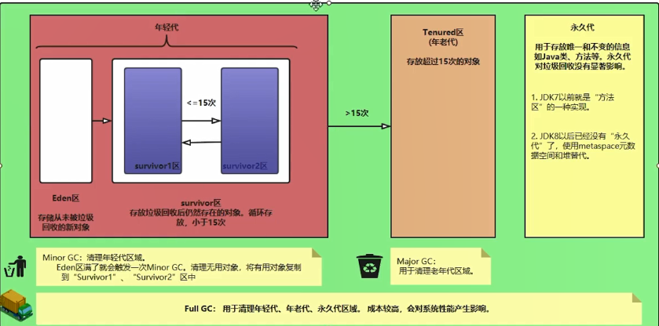
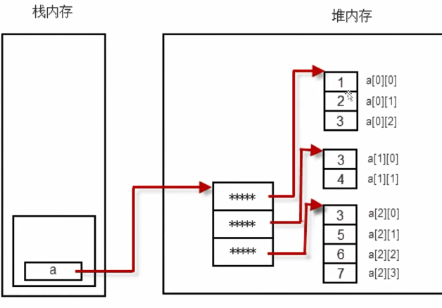

<!-- permalink: /    -->


## 基础知识

### 1.重写和重载

####     **重写(override)**

子类对父类方法的实现过程进行重新编写

1. 方法名和参数列表必须完全相同，返回类型可以不相同，但必须是父类返回值的派生类

2. 访问权限不能比父类的访问权限更低

3. **只有父类的成员方法能被它的子类重写，构造方法不能重写**

4. **声明为final的方法不能重写，声明为static的方法不能重写，但可以再次声明**

5. 重写方法不能抛出更大范围的异常

####     **重载(overload)**

1. 一个类中可以定义多个名称相同，但参数列表不同的方法，返回值类型可以相同也可以不同

   **不同的含义：形参类型不同，形参个数不同，形参顺序不同**

2. 可以改变返回值类型和访问修饰符

3. 可以声明新的或更广的检查异常

4. 方法能在同一个类中或者在一个子类中被重载

|   区别点   |              重写方法              | 重载方法 |
| :--------: | :--------------------------------: | :------: |
|   方法名   |              不能修改              | 不能修改 |
|  参数列表  |              不能修改              | 必须修改 |
|  返回类型  | 和父类相同或者是父类返回类型的子类 | 可以修改 |
| 访问修饰符 |         可以扩大但不能缩小         | 可以修改 |
|    异常    |     不能抛出新的或者更大的异常     | 可以修改 |


### 2.类

​    每个源文件必须有且只有一个public class，并且类名和文件名保持一致

​    类有三种成员：属性field，方法method，构造器constructor

### 3.构造器

#### **创建对象分为四步：**

1. 分配对象空间，并将对象成员初始化为0或空

2. 执行属性值的显式初始化

3. 执行构造方法

4. 返回对象的地址给相关变量

####  **构造器声明格式：**

​        [修饰符] 类名(形参列表){

​             &ensp;&ensp;语句;

​         }

1. 构造器会在使用new关键字时被调用

2. 构造器虽然有返回值，但是不能定义返回值类型，**不能在构造器中使用return返回某个值**

3. 如果没有定义构造器，则编译器会自动定义一个无参的构造方法；如果已经定义，则编译器不再自动定义

4. **构造器的名称必须和类名一致**


### 4.内存

 Java虚拟机的内存分为三个区域：栈stack，堆heap，方法区method area

#### **栈**

  栈描述的是方法执行的内存模型。每个方法被调用时都用创建一个栈帧(存储局部变量，操作数等)

  JVM为每个线程创建一个栈，用于存放该线程执行方法的信息(实参，局部变量等)

  栈属于线程私有，不能实现线程间的共享

  栈由系统自动分配，速度快

####   **堆**

 **堆用于存储创建好的对象**和数组(数组也是对象)

  JVM只有一个堆，被所有线程所共享

  堆是一个不连续的存储空间，分配灵活，速度慢

  堆的区域会被垃圾回收器做进一步划分，例如新生代，老年代的划分

####   **方法区**

 方法区(也是堆)是java虚拟机的规范，有不同的实现方法

 JVM只有一个方法区，被所有线程所共享

 方法区也是堆，用于存储永远不变或唯一的内容(类信息，静态变量，字符串常量等)

 常量池主要存放常量，如文本字符串，final常量值


### 5.垃圾回收机制(Garbage Collection)

1. Java的内存管理很大程度上是对堆中对象的管理，其中包括对象空间的分配和释放

   对象空间的分配：使用new关键字创建对象即可

   对象空间的释放：将对象赋值为null即可

 2.垃圾回收过程

​    1.发现无用的对象(是指：没有任何变量引用的对象)

​    2.回收无用对象占用的内存空间

3.堆内存模型

​		 

​     不同的对象的生命周期是不一样的，所以**会对不同的对象存取不同的回收算法**，以提高回收效率。

​     将对象分为三种状态：年轻态，年老态，永久代。同时，将处于不同状态的对象放到堆中不同的区域

​     1.年轻态

​     &ensp;&ensp;所有新生成的对象首先都是放在Eden区。年轻代区域的目标就是尽可能快速的回收掉那些生命周期短的对象，

​    &ensp;&ensp;对应的是Minor GC， 每次Minor GC算法采用效率较高的复制算法，频繁的操作，但是会浪费内存空间。

​    &ensp;&ensp;当“年轻代”区域存放满对象后，就将对象存放到年老代区域。

​    2.年老代

​    &ensp;&ensp;在年轻代中经历了N(默认15)次垃圾回收后仍然存活的对象，就会被放到年老代中。

​    &ensp;&ensp;可以认为年老代中存放的都是一些生命周期较长的对象。

​    &ensp;&ensp;随着年老代对象越来越多，这时就需要启动Major GC和Full GC(全量回收)，全面清理年轻代区域和年老代区域。

​    3.永久代

   &ensp;&ensp;用于存放静态文件，如Java类、方法等。永久代对垃圾回收没有显著影响。

   &ensp;&ensp;JDK7以前就是“方法区”的一种实现。JDK8以后已经没有“永久代”了，使用metaspace元数据空间和堆替代。

​    Minor GC：

   &ensp;&ensp;用于清理年轻代区域。Eden区满了就会触发一次Minor GC。

   &ensp;&ensp;清理无用对象，将有用对象复制到“Survivor1"区或"Survivor2”区中。

​    Major GC：

   &ensp;&ensp;用于清理老年代区域。

​    Full GC：

   &ensp;&ensp;用于清理年轻代、年老代区域。成本较高，会对系统性能产生影响。    

   **在对JVM调优的过程中，很大一部分工作就是对于Full GC的调节。**

   有如下原因可能导致Full GC：

​     &ensp;&ensp;1.年老代( Tenured)被写满

​     &ensp;&ensp;2.永久代(Perm)被写满

​     &ensp;&ensp;3.System.gc( )被显式调用

​     &ensp;&ensp;4.上一次GC之后Heap的各域分配策略动态变化


### 6.数组

1. 特点

&ensp;&ensp;1.数组被创建后，大小是不可以改变的

&ensp;&ensp;2.元素的类型必须是相同类型

&ensp;&ensp;3.数组类型可以是任何数据类型，包括基本类型和引用类型

&ensp;&ensp;4.**数组变量属于引用类型**

2. 声明

&ensp;&ensp;ElementType[ ]  arr_name;

&ensp;&ensp;ElementType  arr_name[ ];

3. 初始化

&ensp;&ensp;静态初始化：

&ensp;&ensp;&ensp;&ensp;int[] a={1,2,3,4};

&ensp;&ensp;动态初始化：(数组定义与为数组元素分配空间并赋值的操作分开进行)

&ensp;&ensp;&ensp;&ensp;int[ ] a=new int[2];

 &ensp;&ensp;&ensp;&ensp;a[0]=10;

&ensp;&ensp;&ensp;&ensp;a[1]=20; 

&ensp;&ensp;默认初始化：

&ensp;&ensp;&ensp;&ensp;数组是对象，元素相当于对象的属性，每个元素也按照属性的方法被默认初始化

&ensp;&ensp;&ensp;&ensp;int a[ ]=new int[2];        &ensp;&ensp;//默认值：0  0

&ensp;&ensp;&ensp;&ensp;String[ ] s=new String[2];   &ensp;&ensp;//默认值：null  null

4. 数组的拷贝

&ensp;&ensp;System.arraycopy(src,srcpos,dest,destpos,length)

 &ensp;&ensp;src：源数组

&ensp;&ensp;srcpos：原数组中开始复制的位置

&ensp;&ensp;dest：目标数组

&ensp;&ensp;destpos：复制的目标数组中的起始位置

&ensp;&ensp;length：要复制的数组元素的个数   		

5. Arrays类中对数组的常用操作

```java
import java.util.Arrays   
 
System.out.println(Arrays.toString(arr));   //打印数组元素
  
Arrays.sort(arr);                 //对数组元素进行排序(从小到大)
  
Arrays.binarySearch(arr,num)     //使用二分法查找指定元素   成功则返回索引值,失败则返回负数
  
Arrays.fill(arr,2,6,100);       //将数组arr中从arr[2]到arr[6]的值改变为100  
  
数组名.length;                  //获取数组元素个数
```

6. 二维数组

```java
int[][] arr=new int[3][3]  //或int[] arr[]  或int arr[][]
     
arr[0]=new int[3];

arr[1]=new int[2];

arr[2]=new int[4];      //二维数组声明
```

​              

