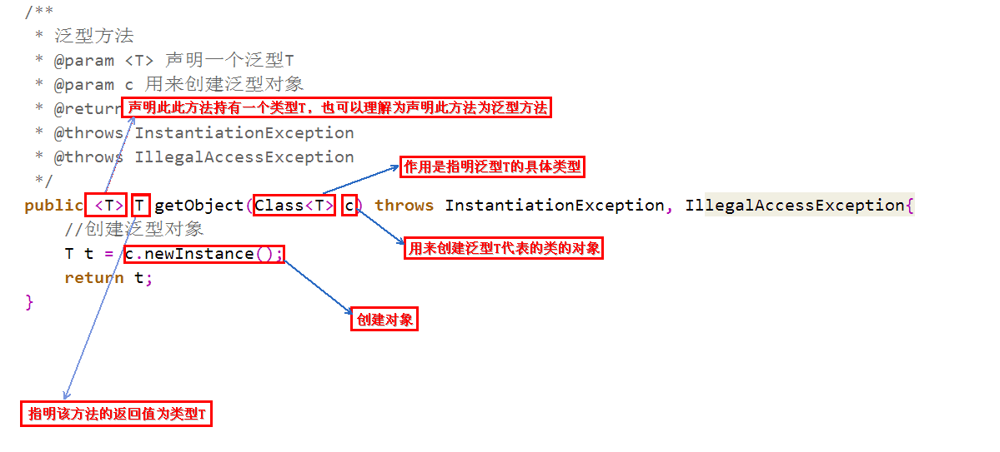
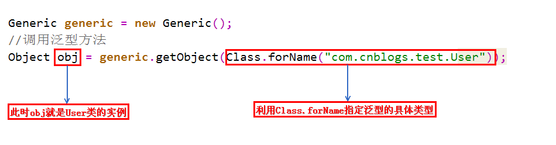
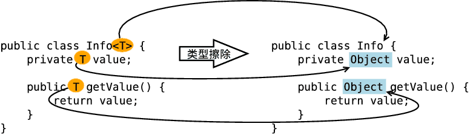
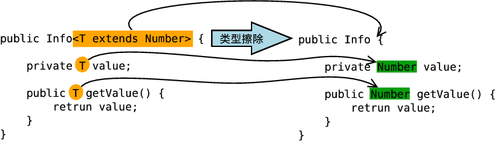
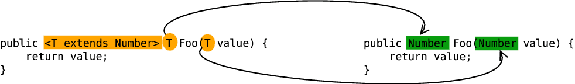

<!-- permalink: /    -->


## 类别

   

## 泛型类的定义

`修饰符 class 类名<类型>{  }`

 **如果想在类中定义泛型变量或在类的方法中使用泛型，则类必须定义为泛型类。**

 例1：简单泛型类

```java
public class Student<T>{		//此处的T是任意标识,常见的有T,E,K,V等用于表示泛型
    
    private T var;
    
    public T getVar(){
        
        return var;
    }
    
    public void setVar(T var){  // 设置的类型也由外部决定  
        
        this.var = var ;  
    }      
}      
            
Student<String> s1=new Student<String>();       //创建对象s1,T就变成了String类型
            
Student<Integer> s2=new Student<Integer>();   //创建对象s2,T就变成了Integer类型
```

例2：多元泛型类

```java
class Notepad<K,V>{       // 此处指定了两个泛型类型  
    
    private K key ;     // 此变量的类型由外部决定  
   
    private V value ;   // 此变量的类型由外部决定  
    
    public K getKey(){  
        return this.key ;  
    }  
    
    public V getValue(){  
        return this.value ;  
    }  
    
    public void setKey(K key){  
        this.key = key ;  
    }  
    
    public void setValue(V value){  
        this.value = value ;  
    }  
} 

public class GenericsDemo{  
    public static void main(String args[]){  
       
        Notepad<String,Integer> t = null ;    // 定义两个泛型类型的对象  
        
        t = new Notepad<String,Integer>() ;  // 里面的key为String，value为Integer  
        
        t.setKey("汤姆") ;  // 设置第一个内容  
        
        t.setValue(20) ;   // 设置第二个内容  
        
        System.out.print("姓名；" + t.getKey()) ;      // 取得信息  
        
        System.out.print("，年龄；" + t.getValue()) ;  // 取得信息    
    }  
}
```


## 泛型方法

### 定义

1. `修饰符 T 方法名(变量类型 变量名){ }`  或 `修饰符 T 方法名(T t)`

   返回的变量类型必须为泛型，即，被T修饰，不能是具体的变量类型。

   **用这种方式定义时，还可以使用static关键字。**

2. `修饰符  <T>  T  方法名(T 变量名){ }`

   返回的变量必须要该方法的入参，不能返回方法外定义的泛型。

   例：

   ```java
   public T name;
   
   public <T>  T  show(T t){  
       
       return name;  //报错
       
       return t;  //没有报错
   }
   ```

3. `修饰符 <T> T 方法名(Class<T> c)`

   定义

​      

 &ensp;&ensp;在执行newInstance方法时，会调用传入的类的无参构造方法，如果类没有无参构造方法，则会报错。

 &ensp;&ensp;例如，如果实参传入Integer.class则会报错，因为Integer类没有无参构造方法。

   调用：



  **定义泛型方法时，必须在返回值前边加一个`<T>`来声明这是一个泛型方法，持有一个泛型T，然后才可以用泛型T作为方法的返回值。**

  `Class<T>`的作用就是指明泛型的具体类型，而`Class<T>`类型的变量c，可以用来创建泛型类的对象。

  为什么要用变量c来创建对象？

&ensp;&ensp;既然是泛型方法，就代表着不知道具体的类型是什么，也不知道构造方法如何，因此没有办法去new一个对象，

&ensp;&ensp;但可以利用变量c 的newInstance方法去创建对象，也就是**利用反射创建对象**。

### 调用

在调用时，如果传入的是基本数据类型，则必须直接传入值，如果传入变量，则必须有static修饰；

如果是引用类型，则必须新建，不能传入变量。

```java
public  class  Cat<T> {
    
    private static int age=10;

    private int name=22;

    Father f=null;

    public static void main(String[] args) {
        
        Cat c=new Cat();
        
        System.out.println(c.getName(22));  //通过
        System.out.println(c.getName(name));  //报错
        System.out.println(c.getName(age));  //通过
        System.out.println(c.getName(new Father())); //通过
        System.out.println(c.getName(f));//报错
   }
    
    public  <T>  T getName(T t){

        return  t;
    }
}
```

 在调用泛型方法时，可以指定泛型，也可以不指定泛型:

- 在不指定泛型的情况下，泛型变量的类型为该方法中的几种类型的同一父类的最小级，直到Object

- 在指定泛型的情况下，该方法的几种类型必须是该泛型的实例的类型或者其子类

```java
public class Test {  
    
    public static void main(String[] args) {  
        
        //不指定泛型的时候        
        int i = Test.add(1, 2); //这两个参数都是Integer，所以T为Integer类型  
        
        Number f = Test.add(1, 1.2); //这两个参数一个是Integer，一个是Float，所以取同一父类的最小级，为Number  
        
        //这两个参数一个是Integer，一个是String，所以取同一父类的最小级，为Object  
        Object o = Test.add(1, "asd"); 

        /**指定泛型的时候*/  
        int a = Test.<Integer>add(1, 2); //指定了Integer，所以只能为Integer类型或者其子类  
        
        int b = Test.<Integer>add(1, 2.2); //编译错误，指定了Integer，不能为Float  
        
        Number c = Test.<Number>add(1, 2.2); //指定为Number，所以可以为Integer和Float  
    }  

    //这是一个简单的泛型方法  
    public static <T> T add(T x,T y){  
        return y;  
    }  
}
```

 **static不能修饰泛型变量，不能修饰带有`<T>`的泛型方法。**

## 泛型接口的定义

 `修饰符  interfac  接口名<类型> {    }`

 例： 

```java
1.public interface Iter<T>{        //定义泛型接口
                       
    void show(T t);
                   
  }
                 
2.public class IterImpl<T> implements Iter<T>{  //定义接口的实现类
                            
      @Override                 //重写接口中的方法                          
      public void show(T t){
                                  
          System.out.println(t);                             
      }                     
  }
                 
3.Iter<String> s1=new IterImpl<String>();          //创建对象
                    
  s1.show("vkls");        //输出vkls
```

## 类型通配符

  `<?>`   表示元素可以匹配任何类型

  `<? extends 类型>`  类型通配符上限

  `<? super 类型>`     类型通配符下限   

  例1：  

```java
List<? extends Number>    //表示的类型是Number或者其子类
                
  List<? extends Number> list1=new ArrayList<Object>();    //程序报错,Object不是Number的子类

  List<? extends Number> list2=new ArrayList<Integer>();   //正确,Integer是Number的子类

List<? super Number>    //表示的类型是Number或者其父类       
```

   例2：在方法中使用

```java
public <T> T test(T c) throws IllegalAccessException, InstantiationException {
        
    return c;    
}

//如果对实参的类型没有限制，则在public之后使用<T>
//但，如果希望传入的实参类型是Collection类的子类，则在public后面使用通配符,即：
public <T extends Collection> T test(T t) thorws IllegalAccessException, InstantiationException {
    
    return t;
}

//如果希望是两个类型的子类，即：
public <T extends Collection & Serializable> T test(T t) thorws IllegalAccessException, 

																				InstantiationException {
    
    return t;
}
```


## 可变参数

 **即，参数个数可变**

 格式：修饰符  返回值类型  方法名(数据类型...变量名) {    }

```java
public static int sum(int...a) {   }

    1.这里的变量a其实是一个数组

    2.如果一个方法有多个参数,且还有可变参数,则可变参数要放在最后

public static int sum(int a,int...b){    }
```

 应用：

 1.

```java
//1.Arrays工具类中有一个静态方法
//返回由指定数组支持的固定大小的列表
//该列表不能进行添加和删除操作,但可以进行修改操作
public static <T> List<T> aslist(T...a)    

例:
   List<String> list=Arrays.aslist("hello","world");

   System.out.println(list);   //输出[hello,world]

   list.add("java");     //报错,不能改变数组大小

   list.set(0,"java");  //正确,list中的内容为[java,world];
```

   2.

```java
//List接口中有一个静态方法
public static <E> List<E> of (E...elements)   //返回包含任意数量元素的不可变列表

例:       
List<String> list=List.of("hello","world","hello");  
//list中的内容为[hello,world,hello],可以有重复元素,但不可更改
```

   3.

```java
//3.Set接口中有一个静态方法
public static <E> Set<E> of(E...elements);   //返回包含任意数量元素的不可变集合
        
例:
       
 Set<String> set=Set.of("hello","world");  //set中的内容为[hello,world],不能有重复元素,且不可更改 
```

 

## 类型擦除

### 定义

&ensp;&ensp;Java在语法上支持泛型，但是在编译阶段会进行 **"类型擦除"** (Type Erasure)，将所有的泛型表示(尖括号中的内容)都

&ensp;&ensp;替换为具体的类型(其对应的原生态类型)，就像完全没有泛型一样。

### 类型擦除的原则

- 消除类型参数声明，即删除`<>`及其包围的部分。

- 根据类型参数的上下界推断并替换所有的类型参数为原生态类型：如果类型参数是无限制通配符或没有上下界限定则

  替换为Object，如果存在上下界限定则根据子类替换原则取类型参数的最左边限定类型(即父类)。

- 为了保证类型安全，必要时插入强制类型转换代码。

- 自动产生“桥接方法”以保证擦除类型后的代码仍然具有泛型的“多态性”。

### 类型擦除方式

1. 擦除类定义中的类型参数 --- 无限制类型擦除

   当类定义中的类型参数没有任何限制时，在类型擦除中直接被替换为Object，即，形如`<T>`和`<?>`的类型参数都被替换为Object。

​	       

2. 擦除类定义中的类型参数 --- 有限制类型擦除

   当类定义中的类型参数存在限制（上下界）时，在类型擦除中替换为类型参数的上界或者下界，

   比如，形如`<T extends Number>` 和 `<? extends Number>`的类型参数被替换为`Number`，

   `<? super Number>`被替换为Object。

​			

3. 擦除方法定义中的类型参数

   擦除方法定义中的类型参数原则和擦除类定义中的类型参数是一样的，这里仅以擦除方法定义中的有限制类型参数为例。

​		  

 证明：

```java
public class Test {

    public static void main(String[] args) throws Exception {

        ArrayList<Integer> list = new ArrayList<Integer>();

        list.add(1);  //这样调用 add 方法只能存储整形，因为泛型类型的实例为 Integer

        list.getClass().getMethod("add", Object.class).invoke(list, "asd");

        for (int i = 0; i < list.size(); i++) {
            
            System.out.println(list.get(i));
        }
    }
}
```

​	  在程序中定义了一个`ArrayList`泛型类型实例化为`Integer`对象，如果直接调用`add()`方法，那么只能存储整数数据，

  &ensp;但，当利用反射调用`add()`方法的时候，却可以存储字符串，这说明了`Integer`泛型实例在编译之后被擦除掉了，

&ensp;&ensp;只保留了原始类型。


## 泛型的编译期检查

 问题：

&ensp;&ensp;既然类型变量会在编译的时候擦除掉，那为什么往 `ArrayList<String>` 创建的对象中添加整数会报错呢？

&ensp;&ensp;不是说泛型变量String会在编译的时候变为Object类型吗？为什么不能存别的类型呢？

&ensp;&ensp;**既然类型擦除了，如何保证只能使用泛型变量限定的类型呢？**

&ensp;&ensp; **Java编译器是通过先检查代码中泛型的类型，然后再进行类型擦除，再进行编译。**

例：

```java
public static  void main(String[] args) {  

    ArrayList<String> list = new ArrayList<String>();  
    
    list.add("123");  
    
    list.add(123); //编译错误  
}

在上面的程序中，使用add方法添加一个整型，在IDE中，直接会报错，说明这就是在编译之前的检查，因为如果是在编译之后检查，
类型擦除后，原始类型为Object，是应该允许任意引用类型添加的。可实际上却不是这样的。
```

#### **类型检查的针对对象**

```java
//定义ArrayList的话可以有两种方法：
ArrayList<String> list1 = new ArrayList(); //第一种情况

ArrayList list2 = new ArrayList<String>(); //第二种情况

/*
 这两种定义方法都不会报错，但会有个编译时警告。
 
 第一种情况下，可以实现与完全使用泛型参数一样的效果，只能添加String类型的对象。
 
 但第二种方法不行，list2中既可以添加String类型，也可以添加int类型。
 
 因为new ArrayList()只是在内存中开辟了一个存储空间，可以存储任何类型的对象，
 而真正涉及类型检查的是它的引用，所以list1限定了String类型，而list2可以传入其他类型。
*/
```

   例：

```java
public class Test {      
    public static void main(String[] args) {  

        ArrayList<String> list1 = new ArrayList();  
        
        list1.add("1"); //编译通过  
        
        list1.add(1); //编译错误  
        
        String str1 = list1.get(0); //返回类型就是String  

        
        ArrayList list2 = new ArrayList<String>();  
        
        list2.add("1"); //编译通过  
        
        list2.add(1); //编译通过  
        
        Object object = list2.get(0); //返回类型就是Object  

        
        new ArrayList<String>().add("11"); //编译通过  
        
        new ArrayList<String>().add(22); //编译错误  

        String str2 = new ArrayList<String>().get(0); //返回类型就是String  
    }  
} 
```

&ensp; **类型检查就是针对引用的，谁是一个引用，用这个引用调用泛型方法，就会对这个引用调用的方法进行类型检测，**

&ensp;**而无关它真正引用的对象**。


## 静态方法和静态变量

   **泛型类中的静态方法和静态变量不可以使用泛型类所声明的泛型类型参数。**

  例：

```java
public class Test2<T> {    
    
    public static T one;   //编译错误    
    
    public static T show(T one){ //编译错误    
        
        return null;    
    }    
}
```

​     因为泛型类中的泛型参数的实例化是在定义对象的时候指定的，而静态变量和静态方法不需要使用对象来调用。

​     对象都没有创建，是无法确定这个泛型参数是何种类型的，所以是错误的。

但这种情况是可以的：

```java

public class Test2<T> {    

    public static <T> T show(T one){ //这是正确的    
        
        return null;    
    }    
}
```

**因为这是一个泛型方法，在泛型方法中使用的T是自己在方法中定义的 T，而不是泛型类中的T。**


## 
