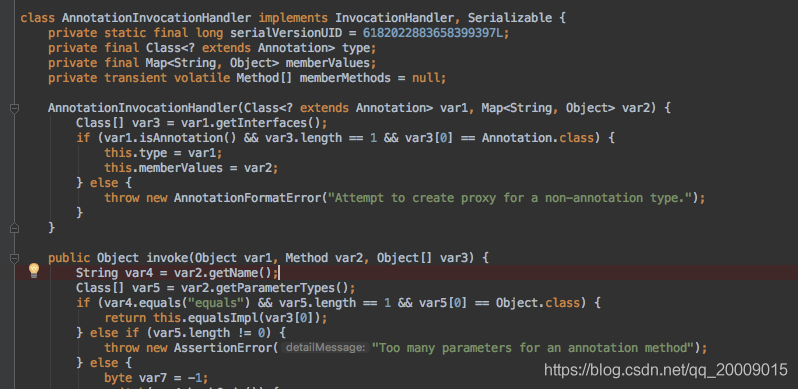

<!-- permalink: /    -->


## 定义

1. 不是程序本身，可以对程序作出解释，与注释类似。

2. 可以被其他程序(如，编译器)读取。如果没有注解信息处理流程，则注解毫无意义。

3. 可以附加在package，class，method，field等上面，相当于添加了额外的辅助信息，可以通过反射访问这些元数据。

 作用：

1. 生成文档，通过代码里标识的元数据生成javadoc文档。

2. 编译检查，通过代码里标识的元数据让编译器在编译期间进行检查验证。

3. 编译时动态处理，编译时通过代码里标识的元数据动态处理，例如，动态生成代码。

4. 运行时动态处理，运行时通过代码里标识的元数据动态处理，例如，使用反射注入实例。

 

## 格式

 注解以 **@注解名** 的形式在代码中存在，还可以添加一些参数值。例如：@SuppressWarnings(value="unchecked");

## 内置注解

1. @Override

   定义在java.lang.Override中，此注解只适用于修饰方法，表示打算重写超类中的一个方法。

2. @Deprecated

   定义在java.lang.Deprecated中，此注解可用于修辞方法、属性、类，表示不鼓励程序员使用这样的元素，

   通常是因为它很危险或存在更好的选择。

3. @SuppressWarnings

   定义在java.lang.SuppressWarnings中，作用是不显示编译时的警告信息。该注解需要添加一个参数才能使用：

|    参数     |                          说明                          |
| :---------: | :----------------------------------------------------: |
| deprecation |              使用了过时的类或方法时的警告              |
|  unchecked  | 执行了未检查的转换时的警告。例如，使用集合时未指定泛型 |
| fallthrough |            当在switch语句使用时发生case穿透            |
|    path     |      在类路径、源文件路径等中有不存在路径时的警告      |
|   serial    |   当在可序列化的类上缺少serialVersionUID定义时的警告   |
|   finally   |            任何finally子句不能完成时的警告             |
|     all     |                 关于以上所有情况的警告                 |

   例： 

```java
@SuppressWarnings("unchecked")

@SuppressWarnings(value={"unchecked", "deprecation"})
```


## 元注解

 **元注解的作用是负责注解其他注解。**

 java定义了四个标准的meta-annotation类型，它们被用来对其它 annotation类型作说明。

这些类型和它们所支持的类在java.lang.annotation包中可以找到。

1. @Target

   用于描述注解的使用范围(即：被描述的注解可以用在什么地方)，取值范围定义在ElementType 枚举类中。

|               可使用的地方               |                             取值                             |
| :--------------------------------------: | :----------------------------------------------------------: |
|                    包                    |                           PACKAGE                            |
|      类、接口、枚举、Annotation类型      |                             TYPE                             |
| 类成员(方法，构造方法，成员变量，枚举值) | 构造方法：CONSTRUCTOR   &ensp;&ensp;变量：FIELD&ensp;&ensp;方法：METHOD |
|            方法参数和本地变量            |   局部变量：LOCAL_VARIABLE     &ensp;&ensp;参数：PARAMETER   |


​    例：@Target(value=ElementType.TYPE)     

2. @Retention

   表示需要在什么级别保存该注解信息，用于描述注解的生命周期

   Reteniton注解用来限定那些被它所注解的注解类在注解到其他类上以后，可被保留到何时。

   取值定义在RetentionPolicy枚举类中。

| 取值----RetentionPolicy |                        作用                         |
| :---------------------: | :-------------------------------------------------: |
|         SOURCE          |          在源文件中有效(即，源文件中保留)           |
|          CLASS          |                  在class文件中有效                  |
|         RUNTIME         | 在运行时有效，**取值为RUNTIME时可以被反射机制读取** |

3. @Documented

   在使用 javadoc 工具为类生成帮助文档时是否要保留其注解信息。

4. @Inherited

   被它修饰的Annotation将具有继承性。如果某个类使用了被@Inherited修饰的Annotation，则其子类将自动具有该注解。

5. @Repeatable(Java8新增)

   允许多次使用同一个注解

```java
@Repeatable(Authorities.class)
public @interface Authority {
     String role();
}

public @interface Authorities {
    Authority[] value();
}

public class RepeatAnnotationUseNewVersion {
    @Authority(role="Admin")
    @Authority(role="Manager")
    public void doSomeThing(){ }
}
//创建重复注解Authority时，加上@Repeatable，指向存储注解Authorities，在使用时候，直接可以重复使用Authority注解。
```

6. @Native(Java8新增)

   使用 @Native 注解修饰成员变量，则表示这个变量可以被本地代码引用，常常被代码生成工具使用。不常使用。


## 获取注解

**反射包 java.lang.reflect 下的AnnotatedElement接口提供了获取注解的方法。**

注意：**只有注解被定义为RUNTIME后，该注解才能是运行时可见**。

- `boolean isAnnotationPresent(Class<?extends Annotation> annotationClass)`

​      判断该程序元素上是否包含指定类型的注解，存在则返回true，否则返回false。

​      注意：此方法会忽略注解对应的注解容器。

- `<T extends Annotation> T getAnnotation(Class<T> annotationClass)`

​      返回该程序元素上存在的、指定类型的注解，如果该类型注解不存在，则返回null。

- `Annotation[] getAnnotations()`

​	 返回该程序元素上存在的所有注解，若没有注解，返回长度为0的数组。

- `<T extends Annotation> T[] getAnnotationsByType(Class<T> annotationClass)`

​	  返回该程序元素上存在的、指定类型的注解数组。如果没有注解对应类型的注解时，返回长度为0的数组。

​      该方法的调用者可以随意修改返回的数组，而不会对其他调用者返回的数组产生任何影响。

​      `getAnnotationsByType`方法与 `getAnnotation`的区别在于，`getAnnotationsByType`会检测注解对应的重复注解容器。

​      若程序元素为类，当前类上找不到注解，且该注解为可继承的，则会去父类上检测对应的注解。

- `<T extends Annotation> T getDeclaredAnnotation(Class<T> annotationClass)`

​	  返回直接存在于此元素上的所有注解。该方法将忽略继承的注释。如果没有注释直接存在于此元素上，则返回null。

- `<T extends Annotation> T[] getDeclaredAnnotationsByType(Class<T> annotationClass)`

​	  返回直接存在于此元素上的所有注解。与此接口中的其他方法不同，该方法将忽略继承的注解。

- `Annotation[] getDeclaredAnnotations()`

  返回直接存在于此元素上的所有注解及注解对应的重复注解容器。该方法将忽略继承的注解。

  如果没有注释直接存在于此元素上，则返回长度为零的一个数组。

  该方法的调用者可以随意修改返回的数组，而不会对其他调用者返回的数组产生任何影响。

## 自定义注解 


使用 @interface 进行自定义注解时，自动继承了java.lang.annotation.Annotation接口

格式：

 `public @interface 注解名 { 定义体  }`

例：

```java
@Target({TYPE, FIELD, METHOD, PARAMETER, CONSTRUCTOR, LOCAL_VARIABLE})

@Retention(RetentionPolicy.SOURCE)
          
public @interface SuppressWarnings {
          			  
    String[] value();		   
} 
```

 其中, `String[] value()`  这行代码声明了一个配置参数，参数名称为value，参数类型是String类型的数组。 

&ensp;&ensp;参数类型只能是基本类型、Class、String、enum

&ensp;&ensp;可以使用 default 来声明参数的默认值。 **如果只有一个参数成员，一般参数名为value。**

注意：

​      **注解元素必须要有值。定义注解元素时，经常使用空字符串、0作为默认值。也经常使用负数(比如：-1)表示不存在的含义**

例：

```java
@Target(value={ElementType.METHOD,ElementType.TYPE})
       
@Retention(RetentionPolicy.RUNTIME)
       
public @interface MyAnnotation{
    
     //参数name,取值为String型,默认为空字符串
    //如果有默认值，那么在使用该注解时如果没有对该参数进行赋值是不会报错的
    String name() default "";  
                                                                        
    int age() default 0;   //参数age，取值为int型，默认为0
            
    String[] schools() default {"清华大学"};   //参数schools，取值为String数组，默认为"清华大学"        
}

在使用时:
           
	@MyAnnotation(name="vkls",age=19,schools={"北京大学","浙江大学"} )
           
	public void test() {
           
   }  
```

  例：

```java
//定义自己的注解
@Target(ElementType.METHOD)
@Retention(RetentionPolicy.RUNTIME)
public @interface MyMethodAnnotation {

    public String title() default "";

    public String description() default "";
}

//使用注解
public class TestMethodAnnotation {

    @Override
    @MyMethodAnnotation(title = "toStringMethod", description = "override toString method")
    public String toString() {
        return "Override toString method";
    }

    @Deprecated
    @MyMethodAnnotation(title = "old static method", description = "deprecated old static method")
    public static void oldMethod() {
        System.out.println("old method, don't use it.");
    }

    @SuppressWarnings({"unchecked", "deprecation"})
    @MyMethodAnnotation(title = "test method", description = "suppress warning static method")
    public static void genericsTest() throws FileNotFoundException {
        
        List l = new ArrayList();
        
        l.add("abc");
        
        oldMethod();
    }
    
    //用反射接口获取注解信息
    public static void main(String[] args) {
    
        try {
        
            // 获取所有methods       
            Method[] methods = TestMethodAnnotation.class.getClassLoader()
                
                .loadClass(("com.pdai.java.annotation.TestMethodAnnotation"))
                
                .getMethods();
       
            // 遍历    
            for (Method method : methods) {
            
                //判断方法上是否有MyMethodAnnotation注解            
                if (method.isAnnotationPresent(MyMethodAnnotation.class)) {
                
                    try {
                    
                        // 获取并遍历方法上的所有注解                   
                        for (Annotation anno : method.getDeclaredAnnotations()) {
                        
                            System.out.println("Annotation in Method '" + method + "' : " + anno);                 
                        }
                   
                        // 获取MyMethodAnnotation对象信息                   
                        MyMethodAnnotation methodAnno = method.getAnnotation(MyMethodAnnotation.class);
                                                                            
                        System.out.println(methodAnno.title());
                
                    } catch (Throwable ex) {           
                        ex.printStackTrace();
                    }            
                }       
            }    
        } catch (SecurityException | ClassNotFoundException e) {        
            e.printStackTrace();    
        }
    }
}
```

## 原理

注解@interface 是一个实现了Annotation接口的 接口， 然后在调用getDeclaredAnnotations()方法的时候，

返回一个代理$Proxy对象，这个是使用jdk动态代理创建，使用Proxy的newProxyInstance方法时候，

传入接口 和InvocationHandler的一个实例(也就是 AnotationInvocationHandler ) ，最后返回一个代理实例。

 期间，在创建代理对象之前，解析注解时候 从该注解类的常量池中取出注解的信息，包括之前写到注解中的参数，然后

 将这些信息在创建 AnnotationInvocationHandler时候 ，传入进去作为构造函数的参数。

​	

## 


