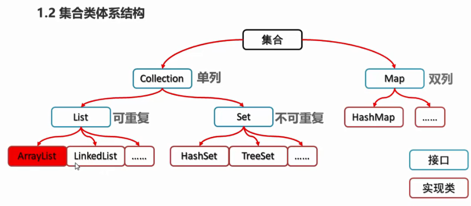

<!-- permalink: /    -->


## 体系结构

​        


## 概述

1. 使用多态的方式创建对象

```java
Collection<String> s=new ArrayList<String>();
```

2. 常用方法           

```java
boolean add(E e)              //添加元素  例: s.add("hello");   在集合s中添加元素hello
           
boolean remove(Object o)     //从集合中移除指定元素
           
void clear()                //清空集合中的元素
           
boolean contain(Object o)  //判断集合中是否存在指定元素
           
boolean isEmpty()         //判断集合是否为空
           
 int size()              //求集合的长度,即集合中元素的个数
```

3. Collection集合的遍历

```java
Iterator：迭代器，集合专用遍历方法

Iterator<E> iterator()     返回此集合中元素的迭代器，通过集合的iterator()方法实现

常用方法：

   1.E next()             //返回迭代器中的下一个元素

   2.boolean hasNext()    //如果迭代器中有更多的元素,则返回true 
```

  例：

```java
Collection<String> s=new ArrayList<String>();   //通过多态创建Collection对象
                
s.add("hello");   //添加元素
                
s.add("world");
                
Iterator<String> it=s.iterator();   //通过Collection对象的iterator方法创建迭代器对象
                
while(it.hasNext()){
                    
    System.out.println(it.next()); //输出迭代器中的下一个元素                
}
```


## List

###  特点

&ensp;&ensp;有序，可以通过索引访问元素

&ensp;&ensp;相对于Set来说，list中存储的元素可以重复

###  特有方法

**(Collection类中没有，但ArrayList中有)**      

```java
void add(int index,E element)   //在指定索引处插入指定元素

E remove(int index)            //删除指定索引处的元素,返回被删除的元素

E set(int index,E element)    //修改指定索引处的元素,返回被修改的元素

E get(int index)             //返回指定索引处的元素
```

###  列表迭代器

&ensp;&ensp;ListIterator：列表迭代器

&ensp;&ensp;通过List集合的listIterator()方法得到，是List集合特有的迭代器

&ensp;&ensp;可以沿任一方向遍历列表迭代器，可在迭代期间修改列表，并获取列表中迭代器的当前位置

​      常用方法          

```java
E next()            //返回迭代中的下一个元素
               
boolean hasNext()  //如果迭代具有更多的元素,则返回true
    
E previous()      //返回列表中的上一个元素
    
boolean hasPrevious()    //如果此列表迭代器在相反方向遍历列表时具有更多的元素,则返回true
    
void add(E e)           //将指定元素插入列表   
```

 例：三种方式遍历list集合     

```java
List<Student> list=new ArrayList<>(); //Student为学生类,有姓名和年龄两个变量
                
Student s1=new Student("vkls",22);         
                
Student s2=new Student("mtgd",22);
                
Student s3=new Student("cly",22);
                
list.add(s1);
                
list.add(s2);
                
list.add(s3);
```

 &ensp;&ensp;1.迭代器方式             

```java
Iterator<Student> it=list.Iterator();
                   
while(it.hasNext()){
                        
    Student s=it.next();
                        
    System.out.println(s.getName()+s.getAge());
                   
}
```

&ensp;&ensp;2.普通for循环                   

```java
for(int i=0;i<list.size();i++){
                        
    Student s=list.get(i);
                        
    System.out.println(s.getName()+s.getAge());                   
}
```

&ensp;&ensp;3.增强for循环                 

```java
 for(Student s:list){
                        
     System.out.println(s.getName()+s.getAge());                   
 }
```

 

### LinkedList的特有方法

#### **(LinkedList底层是通过链表实现)**            

```java
public void addFirst(E e)     //在该列表开头插入指定元素
    
public void addLast(E e)     //将指定的元素追加到此列表的末尾
    
public E getFirst()         //返回此列表中的第一个元素
    
public E getLast()         //返回此列表中的最后一个元素
    
public E removeFirst()    //删除并返回第一个元素
    
public E removeLast()    // 删除并返回最后一个用时 
```


### ArrayList的常用方法

```java
1.public ArrayList();              //创建一个空的集合对象[]

   ArrayList<Integer> array=new ArrayList<>(); //创建一个空的int型集合对象(使用int的包装类)

2.public boolean add(E e);                 //将指定的元素追加到此集合的末尾,元素之间以逗号分隔

3.public void add(int index,E element);   //在此集合的指定位置插入指定的元素

4.public boolean remove(Object o);       //删除指定的元素

5.public E remove(int index);           //删除指定索引处的元素并返回该元素

6.public E set(int index,E element);   //修改指定索引处的元素并返回被修改的元素

7.public int size();                  //返回集合中元素的个数  
```


## Set集合

### 特点

&ensp;&ensp;不包含重复的元素

&ensp;&ensp;没有带索引的方法，不能使用for循环遍历

### 哈希值

&ensp;&ensp;JDK根据对象的地址或者字符串或者数字算出来的int类型的数值

&ensp;&ensp;Object类中有一个方法可以获取对象哈希值：

 &ensp;&ensp;&ensp;&ensp;public int hashCode()    &ensp;&ensp;//返回对象的哈希值 

&ensp;&ensp;**同一个对象多次调用hashCode()方法返回的哈希值是相同的**

&ensp;&ensp;默认情况下，不同对象的哈希值是不同的。而重写hashCode()方法，可以实现让不同对象的哈希值相同

### HashSet 

&ensp;&ensp;底层数据结构是哈希表

&ensp;&ensp;对集合的迭代顺序不做保证，即不保证存储和取出的元素顺序一致

&ensp;&ensp;**没有带索引的方法，不能使用普通的for循环遍历**

&ensp;&ensp;不包含重复元素

### TreeSet

1. 元素会按照一定的规则自动排序，具体排序方法取决于构造方法

   ```java
   TreeSet()                         //无参构造方法,根据其元素的自然排序进行排序
   
   TreeSet(Comparator comparator)    //根据指定的比较器进行排序             
   ```

2. **没有带索引的方法，所以不能使用普通for循环遍历**

3. 不包含重复的元素

4. 自然比较器Comparable的使用

   要想使用自然比较器，必须实现Comparable接口，然后重写comparableTo()方法            

```java
 public class Student implements Comparable<Student>{
                        
     ...
                                                
     @Override                        
     public int comparableTo(Student s){
                                 
         return 0;      //该元素与上一个元素相同
                                 
         return 1;      //该元素放在被比较元素s后面
                                 
         return -1;    //该元素放在被比较元素s前面                              
     }              
 }
```

 

## MAP集合

### 简介

1. 定义

  &ensp;&ensp;`Interface Map<K,V>`

 &ensp;&ensp;&ensp;K：键的类型   V：值的类型

2. 将键映射到值的对象，不能包含重复的键，每个键可以映射到最多一个值

3. 使用多态形式的创建Map集合的对象，具体的实现类为HashMap

   例：`Map<String,String> map=new HashMap<String,String>();`

### 常用方法 

```java
1.V put(K key,V value)    //添加元素,将指定的值与键相关联

	例：map.put("001","vkls");

2.V remove(Object key)   //根据键删除键值对元素;如果没有,则返回null

3.void clear()          //移除所有的键值对元素

4.boolean containsKey(Object key)         //判断集合是否包含指定的键

5.boolean containsValue(Object value)    //判断集合是否包含指定的值

6.boolean isEmpty()  //判断集合是否为空

7.int size()        //求集合的长度,即键值对的个数               
```

###  获取方法

```java
1.V get(Object key)        //根据键获取值

2.Set<K> keySet()         //获取所有键的值

3.Collection<V> values()           //获取所有值的集合

4.Set<Map.Entry<K,V>> entrySet()  //获取所有键值对对象的集合 
```

###   遍历

1. 获取所有键的集合，用keySet( )方法实现

   ```java
   Set<String> keyset=map.keySet();
   ```

   遍历键的集合，获取每个键对应的值

   ```java
   for(String key:keyset){
                     
        String value=map.get(key);             //根据key获取对应的value
                     
        System.out.println(key +","+ value);  //输出键值对             
   }       
   ```

2. 获取所有键值对对象的集合     

   ```java
   Set<Map.Entry<String,String>> entrySet=map.entrySet();
   ```

   遍历键值对对象的集合，得到每一个键值对对象  

   ```java
   for(Map.Entry<String,String> me:entrySet){
                       
       String key=me.getKey();
                       
       String value=me.getValue();
                       
       System.out.println(key +","+ value);  //输出键值对
                 
   } 
   ```

   ​                        

