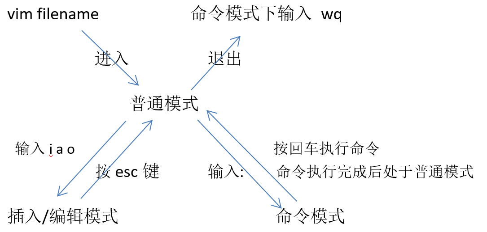

### 插入命令

a     &ensp;&ensp;&ensp;在光标所在字符的后面插入

A     &ensp;&ensp;&ensp;在光标所在行的行尾插入

i       &ensp;&ensp;&ensp;&ensp;在光标所在字符的前面插入

I       &ensp;&ensp;&ensp;&ensp;在光标所在行的行首插入

o     &ensp;&ensp;&ensp;&ensp;在光标所在行的下一行插入新行

O     &ensp;&ensp;&ensp;在光标所在行的上一行插入新行

 

### 光标移动命令

set nu   &ensp;&ensp;&ensp;&ensp;&ensp;设置行号(命令模式)

set nonu  &ensp;&ensp;&ensp;取消行号(命令模式)

:n     &ensp;&ensp;&ensp;&ensp;到第n行行首(命令模式)

:0     &ensp;&ensp;&ensp;&ensp;移动到第一行行首(命令模式)

`:$`    &ensp;&ensp;移动到最后一行行首(命令模式)

 

gg     &ensp;&ensp;&ensp;移到第一行行首(普通模式)

G     &ensp;&ensp;&ensp;&ensp;移动最后一行行首(普通模式)

nG     &ensp;&ensp;&ensp;移动第n行行首(普通模式)

0     &ensp;&ensp;&ensp;&ensp;&ensp;移动到当前所在行的行首(普通模式)

$     &ensp;&ensp;&ensp;&ensp;&ensp;移动到当前所在行的行尾(普通模式)

 

### 删除命令(普通模式)

x    &ensp;&ensp;&ensp;删除光标所在处字符

nx    &ensp;&ensp;&ensp;删除光标所在处后n个字符(包括光标所在字符)

dd   &ensp;&ensp;&ensp;删除光标所在行

ndd   &ensp;&ensp;&ensp;删除光标所在行后n行(包括光标所在行)    

D    &ensp;&ensp;&ensp;删除光标所在处到行尾内容

d0   &ensp;&ensp;&ensp;删除光标到行首的内容

dG   &ensp;&ensp;&ensp;删除光标所在行到文件末尾处内容

:n1,n2d &ensp;&ensp;&ensp;删除指定范围的行(命令模式)

 

### 复制和剪切命令(普通模式)

yy   &ensp;&ensp;&ensp;&ensp;复制当前行

nyy   &ensp;&ensp;&ensp;复制当前行以下n行

dd   &ensp;&ensp;&ensp;&ensp;剪切当前行

ndd   &ensp;&ensp;&ensp;剪切当前行以下n行

p/P   &ensp;&ensp;&ensp;&ensp;粘贴在当前光标所在行的下一行/上一行

 

### 替换和撤销命令(普通模式)

替换单个字符：将待替换的字符用光标选中，在普通模式下按下r ，再按下想要替换成的字符即可

r    &ensp;&ensp;代表光标所在处字符

R   &ensp;&ensp;从光标所在处开始替换多个字符，按esc键结束

u   &ensp;&ensp;撤销(普通模式)

ctrl+r  &ensp;&ensp;反撤销(普通模式)

 

### 查找和替换命令(命令模式)

**查找**

:/string      &ensp;&ensp;搜索指定字符串，按 n 查找下一个(命令模式下输入 **`/`** ) 

&ensp;&ensp;:set ic 搜索时忽略大小写

&ensp;&ensp;N        &ensp;&ensp;指定字符串的下一个出现位置

**单行替换**

&ensp;&ensp;将光标置于待替换行上，进入命令模式，输入 **`:s /原数据/新数据`**  (是在命令模式下输入`:s`，而不是s)

**全篇替换**

&ensp;&ensp;命令模式下输入 **`:%s /原数据/新数据/g`**   如果不加g，则只替换每行第一个符合的字符串

**指定行替换**

&ensp;&ensp;命令模式下输入 **`:n1,n2s /原数据/新数据/g`**  (n1和n2代表起始行号和终止行号，即，替换第n1行到第n2行的数据)

 

### 保存退出命令(命令模式)

:w         &ensp;&ensp;&ensp;保存修改

:w new_filename  &ensp;&ensp;&ensp;另存为指定文件

:wq        &ensp;&ensp;&ensp;保存修改并退出(快捷键:ZZ)

:q         &ensp;&ensp;&ensp;&ensp;不保存修改并退出

:q!        &ensp;&ensp;&ensp;&ensp;不保存修改并强制退出

:wq!        &ensp;&ensp;&ensp;保存修改并退出(仅root和文件所有者可用)

 

### 技巧

:r +文件名      &ensp;&ensp;&ensp;导入一个文件

:! +命令       &ensp;&ensp;&ensp;&ensp;仅执行shell命令 

:r ! +命令      &ensp;&ensp;&ensp;将命令执行结果导入到文件中

 

:ab      &ensp;&ensp;&ensp;替换，例，:ab 123 456    &ensp;&ensp;则，在输入123 时将自动替换为456

**连续行注释**

:n1,n2s/^/#/g     &ensp;&ensp;&ensp;n1到n2行首加#

:n1,n2s/^#//g

命令模式下使用sp命令可以实现水平分屏，用ctrl+w+w进行切换，用wqall 全部退出；

用vsp可实现垂直分屏

