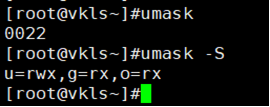

### 文件处理命令

#### **ls(list)**

**信息说明：**

```shell
d 目录   - 文件   l 软连接文件   c 字符设备文件

b 块设备文件   p 命令管道文件   s 套接字文件

u 所属者  g 所属组   o其他人

r 可读   w 可写   x 可执行
```

**参数：**

```shell
–l    列出详细信息(包括文件类型，权限，大小，所属者，所属组，修改日期)

–ld   只显示当前目录信息(将目录像文件一样显示,而不显示目录下的文件)

–i    文件或目录身份证

–a    显示所有文件，包括以.开头的文件

–h    单独使用是展示文件名称;和 -l 一起使用可以用易于阅读的方式展示文件大小,如,1K、1M
```

#### **mkdir(make directories)**

```shell
mkdir     创建一个或多个目录，用空格分开

mkdir –p  （递归创建）在不存在的目录下再创建一个目录
```

#### **cd(change directories)**

切换目录

#### **pwd(print working directory)**

显示当前目录

#### **rmdir(remove empty directories)**

删除空目录

#### **cp(copy)**

```shell
cp   复制一个或多个文件到另一个目录

cp –r 复制一个或多个目录到另一个目录

cp -p 保留文件属性
```

#### **mv(move)**

移动文件或目录，且可同时改名

#### **rm(remove)**

```shell
rm   删除文件

rm –r  删除目录

rm -f 强制删除，系统不再询问

rm -i  删除前需要确认
```

#### **touch**    

```
创建一个或多个空文件，用空格分开

若文件名含有空格，则用“ ”引上，表示一个整体

除 / 外，大部分符号可作为文件名
```

#### **stat +文件名    &ensp;&ensp;查看文件详细信息**

**du          统计当前目录的磁盘使用情况**

```
-a        显示所有文件的大小

-h        人性化方式显示

-s        显示文件的总大小
```

#### **cat**

```
查看文件内容

–n 显示行号

tac 倒序显示文件内容
```

#### **more   +文件名**

```
分页显示文件内容

空格或f  翻页

enter   换行

q或Q   退出
```

#### **less    +文件名**

```
分页显示文件内容

空格或f  翻页

enter    换行

q或Q    退出

pgup    向上整页翻

向上的箭头 向上翻一行
```

#### **head  +文件名**

```
显示文件前几行，默认为10行

–n +数字x   显示文件前x行

head -2 test.txt  显示文件前两行
```

#### **tail    +文件名**

```shell
显示文件后几行，默认为10行

–n +数字x   显示文件后x-1行

–f     动态显示文件末尾内容
```

#### **ln**

```shell
ln 源文件名 目标文件名

1. 生成指定文件的硬链接文件
  特点:1.cp –p +同步更新,与源文件有同一个i节点 2.因为两个文件指向的是同一个inode号,所以不能跨分区操作 3.不能针对目录
   
   
   所谓的删除文件,只是删除的指向该文件的路径,该文件依然存在,只是无法通过一般方法访问,再向该文件所在的分区存入
   其他数据时,该文件就有可能被覆盖,从而彻底消失。

2. –s  生成指定文件的软连接(符号链接 symbolic link)文件，类似于快捷键。
   特点：1.所有生成的链接文件都是 lrwxrwxrwx,但权限没有任何意义  2.文件非常小  3.都指向源文件
   生成的软连接文件的block区存储的是源文件的绝对路径,所以源文件的绝对路径占多少个字节,软连接文件就会占多少个字节
```

#### **sort  对文本文件内容，以行为单位进行排序输出(不改变原文件的内容)**

```
-f     忽略大小写

-r     反向排序

-n     以数值型进行排序

-t     指定分隔符,默认为制表符

-k n[,m]  指定字段排序
```

#### **wc   统计指定文本的行数、字数、字节数**

```
-l     只显示行数

-w     只显示单词数

-c     只显示字节数 

只使用wc 时显示的分别是行,单词数,大小

 例: # wc /etc/passwd

     # 43 86 2237
```


#### **diff    比较多个文本文件的差异**

```
--brief   显示比较结果

-c        描述文件内容具体的不同
```


#### **dd        按照指定数据块的大小和个数来复制文件或转换文件**

```
if        输入的文件名称
 
of        输出的文件名称

bs        设置每个块的大小

count     设置要复制块的个数 

例: dd if=/dev/zero of=560-file count=1 bs=560M
```

 


### 权限管理命令

  **权限的数字表示：** r------4    w------2    x------1

#### **chmod**

(change the permissions mode of a file)

```shell
1.chmod + [ugoa] + [+-=] + [rwx] + [文件名或目录名]   修改文件或目录的权限

  例:chmod 777 +文件名 

2. –R  递归修改，修改目录权限的同时会修改目录下所有文件和子目录的权限，使之与目录权限相同
```

#### **chown**

```
(change file ownership)(只有root 能改)

chown + [用户名] + [文件名或目录名]   改变文件或目录的所有者或所属组  
```


#### **chgrp**

```
(change file group ownership)

chgrp + [用户组] + [文件名或目录名]   改变文件或目录所属组
```

 

#### **umask**

 

```
(当创建一个文件或目录时的默认权限)(每一个进程都有一个umask)
                                             
直接输入 umask 可以查看umask的值,使用umask -S 查看文件或目录的默认值

其中,第一个0与特殊权限有关，后面三位与普通权限(rwx)有关;

第二个0与所有者有关,表示从所有者的权限中减去0,也就是权限不变;第一个2与所属组有关,第二个2与其他用户有关.
  (文件和目录一样,文件刚开始的权限时-rw-rw-rw-,目录是drwxrwxrwx)

在配置文件/etc/bashrc 中添加umask=(数字) 可永久修改创建时的默认权限; 在/etc/profile中也可修改
```

#### **ACL权限(access control list)**

**使用 ls 命令查看文件信息时，如果文件的权限后有+，说明文件有acl权限。**

**说明：**

  &ensp;&ensp;**当要给一个用户的权限与文件属主、属组和其他人权限都不相同的时候使用**，也就是说，这个用户对于这个文件

  &ensp;&ensp;的权限不属于三种身份中的任何一种，是属于第四种身份，这时就需要使用ACL权限去给他赋予单独的权限。

**命令：**

```
getfacl +文件名        查看文件的acl权限

setfacl -b             删除所有的acl权限

setfacl –b +文件名       删除指定文件的所有acl权限

setfacl –x u:+用户名 +文件名   删除指定文件中指定用户的acl权限

setfacl –x g:+组名 +文件名     删除指定文件中指定组的acl权限

  

setfacl –m d:u:用户名:权限 +目录名 为目录设置默认递归权限(管着以后新建的文件 d:default,权限往下继承)

setfacl –m u:用户名:权限 +文件名   添加用户acl权限

setfacl –m g:组名:权限 +文件名     添加组acl权限
  
  例:setfacl –m u:用户名:权限 –R +目录名   对某一目录设置递归权限(在该命令设置之后 新建的文件不遵守)
```

 

#### **mask权限**

临时决定了除所有者和其他人外的最高权限(包括所属组)，只对修改mask值之前添加的用户或组有效，对之后添加的用户和组无效

```
setfacl –m m:rx +文件名      修改最大有效权限

setfacl –R                  递归设定acl权限(只针对该目录下现有文件)

当在设置了mask之后,又添加了其他的用户或组,则mask的值自动还原,为能取到的最大值(即除所有者和其他人之外的最大权限),
mask的值只有限制作用,没有提高作用.  
```


#### **隐藏属性 + -**

**使用lsattr可以查看文件的隐藏属性，隐藏属性显示在普通权限(rwx)的后面。**

```
chattr

  +i     1.对文件:锁定文件,不可删除,不可更改,只可查看

         2.对目录:只允许修改目录下文件的数据,不可新建、删除文件

  +a     1.对文件只允许在后面追加

         2.对目录,只允许建立和修改文件,不允许删除

  e属性    大多数文件都有e属性,表明是使用ext文件系统进行储存的,不能删除

lsattr

  -a   显示所有文件和目录的隐藏属性(包括隐藏文件)

  -d   若目标是目录,则只列出目录的属性
```


#### **特殊权限**

**共有12个权限位，其中最开始的三位对应特殊权限位**

 **suid-----4   &ensp;&ensp;sgid------2   &ensp;&ensp;sticky------1**

**suid 给普通用户提权 (针对文件)**

```
若一个文件被设置了suid或sgid,会分别表现在所有者或所属组的可执行位上,即s会把x覆盖,
如果是s,说明x依然存在,如果是S,说明没有x权限.只有当文件有x权限时,高级权限才有效.

一些可执行文件(如/usr/bin/passwd)只有root用户(所有者)有执行权限,如果给该文件加上suid权限,那么普通用户就可以
以root的身份执行该文件.

例:在进程文件(二进制,可执行)上增加suid权限

   # chmod u+s /usr/bin/cat  chmod 4755 /usr/bin/rm
```

**sgid    当一个目录有该权限时，在该目录下新建的文件和目录都会继承该目录所属的组 (针对目录)**

  &ensp;&ensp;例：chmod g+s filename(设置suid权限)  chmod 2755 filename(去掉suid权限)

**sticky   在有该权限的目录下用户只能删除自己建立的文件，只有root用户和目录的所有者可以删除所有的文件(针对目录)**

  &ensp;&ensp;例：chmod o+t filename    &ensp;&ensp;&ensp; chome 1755 filename

#### **sudo(给一些用户root 的权限)**

```
-h   列出帮助信息

-l   列出当前用户可执行的命令

-p    更改询问密码的提示语

-b    在后台执行指定的命令

修改配置文件/etc/sudoers 可以为普通用户提权

文件的语法相当于 who　　where　　whom　　command 表示哪个用户可以在哪个主机以谁的身份来执行哪些命令。

例:root ALL=(ALL) ALL   NOPASS=ALL

   root: 表示root用户

   ALL： 表示在任何主机上都可以

   (ALL)：表示以任何身份

　 ALL: 表示可以执行任何命令

　 NOPASS: 表示执行时不需要输入密码

 若为一个用户组修改权限,需要在组名前加上%
```

 

### 文件搜索命令

#### **find**

 **任何一个表达式前面都可以加一个 `!` ，表示取反操作**

```
1.-name    通过名字搜索，区分大小写(所有子目录)

  例：find /etc –name init     搜索etc目录下名为init的文件和目录
      find /etc –name *init*   搜索etc目录下名字含有init四个字母的文件和目录(使用通配符)

2.-iname    根据名字搜索，不区分大小写

3.-size     根据大小搜索

  +n大于   -n 小于   n 等于(n为数据块)

  1数据块=512字节=0.5k

  例:find / -size +204800   在根目录下查找大于100M的文件

4.–user     根据所有者查找

  例:find /home –user vkls    在根目录下查找所有者为vkls的文件

5.-amin访问时间   –cmin 文件属性    -mmin 文件内容

  例:find /etc –cmin -5   在etc下查找5分钟内被修改过属性的文件和目录

6.–type    根据类型查找

  f文件  d目录  l软连接文件   b块设备   c字符设备   p管道文件  s套接字

7.-a(and)两个条件都满足  -o(or)两个条件满足任意一个

  例:find /etc –size +163840 –a –size -204800   查找etc下大于80M小于100M的文件

8.-exec/-ok … {} \;   
  
  exec或ok后面输入自定义的shell命令  {}表示前面找到的内容; "\;"是固定语法;当后面有删除等操作时,-ok会发出提示信息 

  例:find /etc -name abc –exec ls –l {} \;     在etc目录下查找abc文件并显示其信息

     find /etc -name abc -exec cp -rvf {} /tmp \;  将找到的abc文件拷贝到/tmp

9.-inum        根据节点查找

10.-user或 -group  按照属主或属组查找

   例:find /home -user jack        查找属主是jack 的文件

   例:find /home -user jack -a -group hr 查找属主是jack且属组是hr的文件

11.-maxdepth levels        指定查找的目录深度

12.-nouser 或 -nogroup      没有属主或属组

13.-perm     按照文件权限找

   例:find . -perm 644  在当前目录下查找权限为644的文件(必须是644)

   find . -perm -444    在当前目录下查找权限至少为444的文件(可以是444) 
```

 

#### **locat  快速定位文件路径**

```
1. 在文件资料库中查找，但找不到tmp目录下的文件  updatedb命令可更新文件资料库

2. –i  不区分文件名大小写    
```

#### **which**

查找命令所在目录及别名信息

#### **whereis**

查找命令所在目录及帮助文档路径

####  **grep**

```
1. +字符串   在文件中搜索字串匹配的行并输出

2. –i        不区分大小写

3. -n        显示匹配行的行号

4. -r        递归查找子目录中的文件

5. -l        只打印匹配的文件名

6. -c        只打印匹配的行数

7. –v        排除指定字串

  例:grep –v # /etc/inittab  输出除有#字符的行

     grep –v ^# /etc/inittab  输出除以#开头的行
```

### 帮助命令

#### **man**

 查看命令和配置文件的帮助信息

 &ensp;&ensp;例：man ls    &ensp;&ensp;查看ls的帮助信息

​    &ensp;&ensp;&ensp;&ensp;&ensp;&ensp;man services  &ensp;&ensp;&ensp;查看文件services的帮助信息(只输入文件名，不能输入文件的绝对路径) 

#### **whatis**      

只得到命令的一句话解释

#### **命令 + -- help**

得到命令的常用选项

#### **help +命令**    

获得shell内置命令的帮助信息


### 用户管理命令

useradd       &ensp;&ensp;添加新用户

passwd       &ensp;&ensp;&ensp;设置用户密码

who        &ensp;&ensp;&ensp;查看登录用户信息 （tty 本地终端   pts 远程终端）

id +用户名      &ensp;&ensp;&ensp;查询用户信息

su +用户名     &ensp;&ensp;&ensp; 切换用户

w     &ensp;&ensp;&ensp;得到登录用户详细信息

whoami    &ensp;&ensp;&ensp;我是谁

userdel 用户名   &ensp;&ensp;&ensp;删除用户,保留家目录

  &ensp;&ensp;-f     &ensp;&ensp;强制删除 

  &ensp;&ensp;-r     &ensp;&ensp;删除用户及用户家目录

 

groupadd      &ensp;&ensp;&ensp;&ensp;创建用户组

groupmod      &ensp;&ensp;&ensp;修改用户组

 &ensp;&ensp;-g        修改组ID

 &ensp;&ensp;-n        修改组名   &ensp;groupmod –n 新组名 原组名

groupdel +组名   &ensp;&ensp;&ensp;删除用户组(改组不能有初始用户,可有附加用户)

gpasswd -a 用户名 + 组名   &ensp;&ensp;&ensp;把用户加入组(作为附加用户)

gpasswd –d 用户名 + 组名   &ensp;&ensp;&ensp;把用户从组中删除

#### **passwd**

 &ensp;&ensp;-S     &ensp;&ensp;查询用户密码的密码状态(仅root用户可用)

&ensp;&ensp;-l      &ensp;&ensp;暂时锁定用户(仅root用户可用)

&ensp;&ensp;-u     &ensp;&ensp;解锁用户(仅root可用)

&ensp;&ensp;-d      &ensp;&ensp;使该用户可用空密码登录系统

&ensp;&ensp;-e      &ensp;&ensp;强制用户在下次登录时修改密码

 &ensp;&ensp;--stdin    &ensp;&ensp;可将通过管道符输入的数据作为用户密码

&ensp;&ensp;&ensp;&ensp;&ensp;echo “123” | passwd –stdin 1220 

#### **usermod   &ensp;&ensp;修改用户属性**

 &ensp;&ensp;-c      &ensp;&ensp;填写用户账户的备注信息

 &ensp;&ensp;-d –m    &ensp;&ensp;连用,可重新指定用户的家目录,并把旧的数据转移过去

 &ensp;&ensp;-e      &ensp;&ensp;用户的到期时间,格式为：YYY-MM-DD

 &ensp;&ensp;-g      &ensp;&ensp;更改初始用户组

 &ensp;&ensp;-G      &ensp;&ensp;更该扩展用户组

 &ensp;&ensp;-L      &ensp;&ensp;锁定用户

 &ensp;&ensp;-U      &ensp;&ensp;解锁用户

 &ensp;&ensp;-s      &ensp;&ensp;更改默认终端

 &ensp;&ensp;-u      &ensp;&ensp;修改用户UID

#### **chage     &ensp;&ensp;修改用户密码状态**

 &ensp;&ensp;-l       &ensp;&ensp;列出用户详细密码状态

&ensp;&ensp; -d       &ensp;&ensp;shadow 3字段

 &ensp;&ensp;-m      &ensp;&ensp;4字段

&ensp;&ensp;-M       &ensp;&ensp;5字段

&ensp;&ensp;-W      &ensp;&ensp;6字段

&ensp;&ensp;-I      &ensp;&ensp;&ensp;7字段

&ensp;&ensp;-E       &ensp;&ensp;&ensp;8字段       

 

### 用户管理文件

#### **/etc/passwd**

&ensp;&ensp;第一字段:  用户名称

&ensp;&ensp;第二字段:  密码标志

&ensp;&ensp;第三字段:  UID(用户ID)

 &ensp;&ensp;&ensp;&ensp;0     &ensp;&ensp;超级用户

&ensp;&ensp;&ensp;&ensp;1-999    &ensp;&ensp;系统用户(伪用户)

&ensp;&ensp;&ensp;&ensp;1000-    &ensp;&ensp;普通用户

&ensp;&ensp;第四字段：用户初始组ID

 &ensp;&ensp;&ensp;&ensp;初始组：    用户一登陆就拥有这个组的相关权限,每个用户的初始组只能有一个，组名一般和用户名相同

 &ensp;&ensp;&ensp;&ensp;附加组：    用户可以加入多个其他的用户组，并拥有这些组的权限

 

&ensp;&ensp;第五字段：   用户说明

&ensp;&ensp;第六字段：   家目录

 &ensp;&ensp;&ensp;&ensp;普通用户：  /home/用户名/

 &ensp;&ensp;&ensp;&ensp;超级用户：  /root/

&ensp;&ensp;第七字段：  登录后的shell

 

#### **/etc/shadow**

&ensp;&ensp;第一字段：  用户名

&ensp;&ensp;第二字段：  加密密码

 &ensp;&ensp;&ensp;&ensp;加密算法为SHA512散列加密算法

 &ensp;&ensp;&ensp;&ensp;如果密码位是 "!!" 或 "*"，代表没有密码，不能登录

&ensp;&ensp;第三字段：  密码最后一次修改日期

&ensp;&ensp;&ensp;&ensp;使用1970年1月1日作为标准时间

&ensp;&ensp;第四字段：  两次密码的修改间隔时间(和第三字段相比)

&ensp;&ensp;第五字段：  密码有效期(和第三字段相比) (可进行更改)

&ensp;&ensp;第六字段：  密码修改到期前的警告天数(和第五字段相比)

&ensp;&ensp;第七字段：  密码过期后的宽限天数(和第五字段相比)

  &ensp;&ensp;&ensp;&ensp;0：    密码过期后立即失效

  &ensp;&ensp;&ensp;&ensp;-1：     密码永不失效

&ensp;&ensp;第八字段：  账号失效时间(用时间戳表示)

&ensp;&ensp;第九字段：  保留

 

####  **/etc/group**

&ensp;&ensp;第一字段：    组名

&ensp;&ensp;第二字段：    组密码标志

&ensp;&ensp;第三字段：    GID

&ensp;&ensp;第四字段：    组中附加用户

#### **/etc/gshadow**

&ensp;&ensp;第一字段：    组名

&ensp;&ensp;第二字段：    组密码

&ensp;&ensp;第三字段：    组管理员用户名

&ensp;&ensp;第四字段：    组中附加用户

&ensp;&ensp;用户默认值文件： /etc/login.defs  /etc/default/useradd

 


###  文件压缩命令

gzip + 文件名    &ensp;&ensp;压缩文件，压缩后文件格式为.gz(只能压缩文件，不保留原文件)

gunzip + 文件名( = gzip –d +文件名)      &ensp;&ensp;解开压缩文件

tar  [压缩后文件名]  [想要压缩的目录]  &ensp;&ensp;打包目录

  &ensp;&ensp;-c    &ensp;&ensp;打包

  &ensp;&ensp;-v    &ensp;&ensp;显示详细信息

  &ensp;&ensp;-f    &ensp;&ensp;指定文件名

  &ensp;&ensp;-z    &ensp;&ensp;打包同时压缩

   &ensp;&ensp;&ensp;&ensp;例：tar –zcf 123 456

  &ensp;&ensp;-x    &ensp;&ensp;解包

  &ensp;&ensp;-v    &ensp;&ensp;显示详细信息

  &ensp;&ensp;-f    &ensp;&ensp;指定解压文件

  &ensp;&ensp;-z    &ensp;&ensp;解压缩

   &ensp;&ensp;&ensp;&ensp;例：tar –zxvf 123

 zip + [压缩后文件名] +[文件或目录]

   &ensp;&ensp;压缩文件或目录，压缩后文件格式为.zip(可保留原文件)

  &ensp;&ensp;-r  压缩目录

unzip   &ensp;&ensp;解压.zip的压缩文件(不分文件和目录)

bzip2   &ensp;&ensp;压缩文件，压缩后格式为.bz2 (不能压缩目录) 

​    &ensp;&ensp;-k   &ensp;&ensp;压缩后保留源文件

bunzip2   解压缩文件

​    &ensp;&ensp;-k   &ensp;&ensp;解压缩后保留源文件 

### 网络命令

write       &ensp;&ensp;给指定用户发信息，以ctrl +D保存结束

wall (write all)+message &ensp;&ensp;同时给所有用户发信息

ping        &ensp;&ensp;测试网络联通性

​    &ensp;&ensp;-c +数字      &ensp;&ensp;指定发送次数(与windows不同)

last           &ensp;&ensp;查询目前与过去登录系统的用户信息

lastlog         &ensp;&ensp;可检查特定用户上次登陆的时间

traceroute        &ensp;&ensp;显示到某网站的路径

netstat         &ensp;&ensp;显示网络相关信息

​    &ensp;&ensp;-t         &ensp;&ensp;TCP协议

​    &ensp;&ensp;-u         &ensp;&ensp;UDP协议 

​    &ensp;&ensp;-l         &ensp;&ensp;监听

​    &ensp;&ensp;-r         &ensp;&ensp;路由

​    &ensp;&ensp;-n         &ensp;&ensp;显示IP地址和端口号

&ensp;&ensp;例：netstat –tuln    &ensp;&ensp;查看本机监听的端口

  &ensp;&ensp;netstat –an    &ensp;&ensp;查看本机所有的网络连接

  &ensp;&ensp;netstat –rn    &ensp;&ensp;查看本机路由表

### 关机重启命令

shutdown

   &ensp;&ensp;-c   &ensp;&ensp;取消

   &ensp;&ensp;-h   &ensp;&ensp;关机

   &ensp;&ensp;-r   &ensp;&ensp;重启

关机命令：halt  poweroff  init 0

重启命令：reboot  init 6

 logout  退出登录
