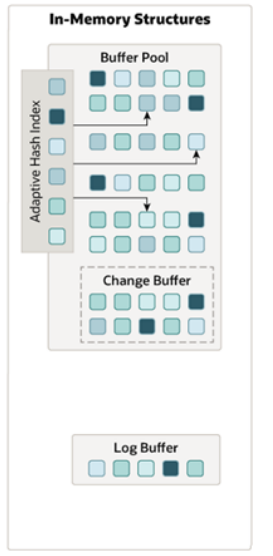
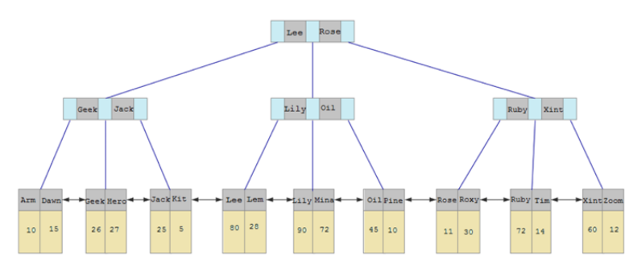
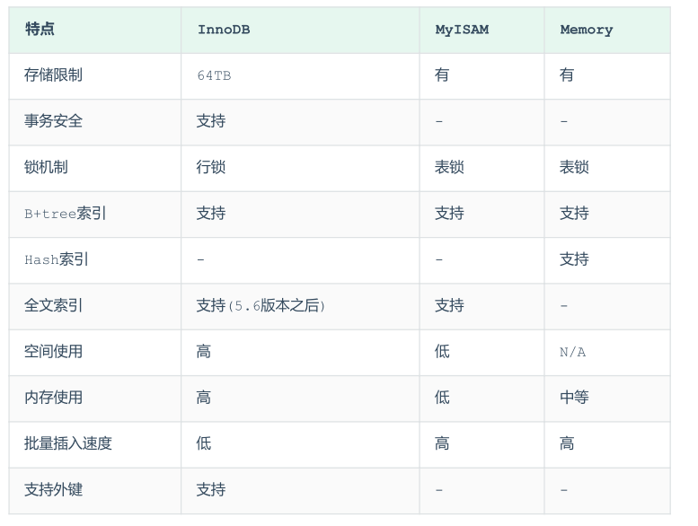

<!-- permalink: /MySQL/原理/基础架构和存储引擎  -->

## 基础架构

### 概览

​    		


**连接器：** 身份认证和权限相关(登录 MySQL 的时候)。

**查询缓存：** 执行查询语句的时候会先查询缓存（因为这个功能不太实用，MySQL 8.0 版本后移除）。

**分析器：** 没有命中缓存的话，SQL 语句就会经过分析器，分析器会先分析SQL语句要干嘛，再检查SQL语法是否正确。

**优化器：** 选择一个 MySQL 认为的最优的方案。

**执行器：** 执行语句，然后从存储引擎返回数据。 执行语句之前会先判断是否有权限，如果没有权限则会报错。

**插件式存储引擎：** 主要负责数据的存储和读取，采用的是插件式架构， InnoDB、MyISAM、Memory 等多种存储引擎。


简单来说 MySQL 主要分为 Server 层和存储引擎层：

- **Server 层**：

  主要包括连接器、查询缓存、分析器、优化器、执行器等；

  所有跨存储引擎的功能都在这一层实现，比如存储过程、触发器、视图、函数等，还有一个通用的日志模块 bin log 日志模块。              

- **存储引擎**： 

  主要负责数据的存储和读取，采用可以替换的插件式架构， InnoDB、MyISAM、Memory 等多个存储引擎， 其中，InnoDB 引擎有自带的日志模块 redo log 模块

- **现在最常用的存储引擎是 InnoDB，它从 MySQL 5.5 版本开始就被当做默认存储引擎了。**


### Server 层基本组件

#### **连接器**

&nbsp;&nbsp;连接器主要和身份认证和权限相关的功能相关，就好比一个级别很高的门卫一样。

   &nbsp;&nbsp;**主要负责用户登录数据库，进行用户的身份认证，包括校验账户密码，权限等操作**，如果用户账户密码已通过，

&nbsp;&nbsp;连接器会到权限表中查询该用户的所有权限，之后在这个连接里的权限逻辑判断都是会依赖此时读取到的权限数据，

&nbsp;&nbsp;也就是说，后续只要这个连接不断开，即使管理员修改了该用户的权限，该用户也是不受影响的。

#### **查询缓存**

&nbsp;**查询缓存主要用来缓存我们所执行的 select 语句以及该语句的结果集。**

 &nbsp;&nbsp;1.连接建立后，执行查询语句的时候，会先查询缓存，MySQL 会先校验这个SQL 是否执行过，以Key-Value 的形式缓存 

&nbsp;&nbsp;&nbsp;&nbsp;&nbsp;在内存中，Key 是查询预计，Value 是结果集。如果缓存 key 被命中，就会直接返回给客户端，如果没有命中，就会

&nbsp;&nbsp;&nbsp;&nbsp;&nbsp;执行后续的操作，完成后也会把结果缓存起来，方便下一次调用。&nbsp;&nbsp;&nbsp;&nbsp;&nbsp;&nbsp;&nbsp;&nbsp;

 &nbsp;&nbsp;2.在真正执行缓存查询的时候还是会校验用户的权限，看用户是否有该表的查询权限。

 &nbsp;&nbsp;&nbsp;&nbsp;&nbsp;&nbsp;MySQL 查询不建议使用缓存，因为查询缓存失效在实际业务场景中可能会非常频繁，假如对一个表更新的话，

&nbsp;&nbsp;&nbsp;&nbsp;&nbsp;&nbsp;这个表上的所有的查询缓存都会被清空。对于不经常更新的数据来说，使用缓存还是可以的。

&nbsp;&nbsp;&nbsp;&nbsp;&nbsp;&nbsp;所以，**一般在大多数情况下不推荐去使用查询缓存的**。MySQL 8.0 版本后删除了缓存的功能。

#### **分析器**

&nbsp;&nbsp;&nbsp;&nbsp;MySQL 没有命中缓存，那么就会进入分析器，**分析器主要是用来分析 SQL 语句是来干嘛的。**

&nbsp;&nbsp;&nbsp;&nbsp;分析器也会分为几步：

&nbsp;&nbsp;&nbsp;&nbsp;&nbsp;1.词法分析：一条 SQL 语句有多个字符串组成，首先要提取关键字，比如 select，提出查询的表，提出字段名，

&nbsp;&nbsp;&nbsp;&nbsp;&nbsp;&nbsp;&nbsp;&nbsp;&nbsp;&nbsp;&nbsp;&nbsp;&nbsp;&nbsp;&nbsp;&nbsp;&nbsp;&nbsp;&nbsp;&nbsp;&nbsp;&nbsp;&nbsp;&nbsp;&nbsp;&nbsp;提出查询条件等等。做完这些操作后，就会进入第二步。

&nbsp;&nbsp;&nbsp;&nbsp;&nbsp;2.语法分析：主要就是判断输入的 SQL 是否正确，是否符合 MySQL 的语法。

&nbsp;&nbsp;&nbsp;&nbsp;完成这2步后，MySQL 就准备开始执行了，但是如何执行，怎么执行是最好的结果呢？这个时候就需要优化器了。&nbsp;&nbsp;&nbsp;&nbsp;&nbsp;&nbsp;

#### **优化器**

&nbsp;&nbsp;&nbsp;&nbsp;优化器的作用就是选择它认为的最优的方案去执行，**比如多个索引的时候该如何选择索引，多表查询的时候如何选择关联顺序等**。

   &nbsp;&nbsp;&nbsp;可以说，经过了优化器之后可以说这个语句具体该如何执行就已经定下来。

#### **执行器**

&nbsp;&nbsp;&nbsp;&nbsp;当选择了执行方案后，MySQL 就准备开始执行了，首先执行前会校验该用户有没有权限，如果没有权限，就会返回

&nbsp;&nbsp;&nbsp;&nbsp;错误信息，如果有权限，就会去调用引擎的接口，返回接口执行的结果。


## 存储引擎架构

### MySQL体系结构

   


**1.连接层**

​	  最上层是一些客户端和链接服务，包含本地socket 通信和大多数基于客户端/服务端工具实现的类似于TCP/IP的通信。

​	  **主要完成一些类似于连接处理、授权认证、及相关的安全方案**。在该层上引入了线程池的概念，为通过认证安全接入的

​	  客户端提供线程。同样在该层上可以实现基于SSL的安全链接。服务器也会为安全接入的每个客户端验证它所具有的操作

​      权限。

 **2.服务层**

​	  第二层架构主要完成大多数的核心服务功能，如SQL接口、缓存的查询、SQL的分析和优化、部分内置函数的执行。

​      **所有跨存储引擎的功能也在这一层实现，如过程、函数等**。在该层，服务器会解析查询并创建相应的内部解析树，

​      并对其完成相应的优化如确定表的查询的顺序，是否利用索引等，最后生成相应的执行操作。

​      如果是select语句，服务器还会查询内部的缓存，如果缓存空间足够大，这样在进行大量读操作的环境中能够很好的提升系统的性能。     

 **3.引擎层**

​	  存储引擎层， **存储引擎真正的负责了MySQL中数据的存储和提取**，服务器通过API和存储引擎进行通信。

​      不同的存储引擎具有不同的功能，这样我们可以根据自己的需要，来选取合适的存储引擎。

​		**数据库中的索引是在存储引擎层实现的。**

 **4.存储层**

​	  数据存储层， 主要是将数据(如: redolog、undolog、数据、索引、二进制日志、查询日志、慢查询日志等)存储在文件系统之上，并完成与存储引擎的交互。    

​      和其他数据库相比，MySQL有点不同，它的架构可以在多种不同场景中应用并发挥良好作用。主要体现在存储引擎上，插件式的存储引擎架构，将查询处理和其他的系统任务以及数据的存储提取分离。

​	     这种架构可以根据业务的需求和实际需要选择合适的存储引擎。


### 存储引擎介绍

   MySQL 存储引擎采用的是 **插件式架构** ，有多种存储引擎，**可以为不同的数据库表设置不同的存储引擎以适应不同场景的需要。 存储引擎是基于表的，而不是数据库。**

  

   并且，还可以根据 MySQL 定义的存储引擎实现标准接口来编写一个属于自己的存储引擎。

   这些非官方提供的存储引擎可以称为第三方存储引擎。

   可以在创建表的时候，指定选择的存储引擎，如果没有指定将使用默认的存储引擎(InnoDB)。

   建表时指定存储引擎：

```sql
create table 表名(
    
	字段1 字段1类型 [ comment 字段1注释 ] ,
    
	......
    
	字段n 字段n类型 [comment 字段n注释 ]
    
) engine = InnoDB [ comment 表注释 ] ;
```

​	查询当前数据库的存储引擎：

```sql
show engines;
```

  

#### **InnoDB**

##### **简介**

1.介绍

&nbsp;&nbsp;InnoDB是一种兼顾高可靠性和高性能的通用存储引擎，在 MySQL 5.5 之后，InnoDB是默认的MySQL 存储引擎。

2.特点

&nbsp;&nbsp;DML操作遵循ACID模型，支持事务；

&nbsp;&nbsp;支持行级锁，提高并发访问性能；

&nbsp;&nbsp;支持外键FOREIGN KEY约束，保证数据的完整性和正确性；

3.文件

&nbsp;&nbsp;xxx.ibd：xxx代表的是表名，innoDB引擎的每张表都会对应这样一个表空间文件，存储该表的表结构(frm-早期的 、sdi-新版的)、数据和索引。

&nbsp;&nbsp;参数：innodb_file_per_table      

&nbsp;&nbsp;&nbsp;&nbsp;&nbsp;&nbsp;&nbsp;&nbsp;&nbsp;&nbsp;&nbsp;&nbsp;如果该参数开启，代表对于使用InnoDB引擎的表，每一张表都对应一个ibd文件。

&nbsp;&nbsp;&nbsp;ibd文件中不仅存放表结构、数据，还会存放该表对应的索引信息。 该文件是基于二进制存储的，不能直接用记事本打开。可以使用ibd2sdi指令从.ibd文件中提取sdi信息。

#####  **逻辑存储结构**

   

  

表空间 

  &nbsp;&nbsp;&nbsp;InnoDB存储引擎逻辑结构的最高层，ibd文件其实就是表空间文件，在表空间中可以包含多个Segment段。

&nbsp;&nbsp;&nbsp;**如果启用了参数 innodb_file_per_table(在8.0版本中默认开启) ，则每张表都会有一个表空间（xxx.ibd）**，

  &nbsp;&nbsp;&nbsp;&nbsp;一个mysql实例可以对应多个表空间，用于存储记录、索引等数据。

  段(Segment) 

 &nbsp;&nbsp;&nbsp;表空间是由各个段组成的， 常见有数据段(Leaf node segment)、索引段(Non-leaf node segment)、回滚段(Rollback segment)等。

​	 &nbsp;&nbsp;&nbsp;**InnoDB是索引组织表，数据段就是B+树的叶子节点， 索引段即为B+树的非叶子节点。**

​	 &nbsp;&nbsp;&nbsp;InnoDB中对于段的管理，都是引擎自身完成，不需要人为对其进行控制，一个段中包含多个区。

  区(Extent) 

​     &nbsp;&nbsp;&nbsp;区是表空间的单元结构，每个区的大小为1M。 

​	  &nbsp;&nbsp;&nbsp;默认情况下， InnoDB存储引擎页大小为16K， 即一个区中一共有64个连续的页。

  页(Page)

​     &nbsp;&nbsp;&nbsp;页是组成区的最小单元，**也是InnoDB 存储引擎磁盘管理的最小单元，每个页的大小默认为 16KB。**

​     &nbsp;&nbsp;&nbsp;为了保证页的连续性，InnoDB 存储引擎每次从磁盘申请 4-5 个区。

  行(Row)

​      &nbsp;&nbsp;&nbsp;InnoDB 存储引擎是面向行的，也就是说**数据是按行进行存放的**。

​      &nbsp;&nbsp;&nbsp;在每一行中除了定义表时所指定的字段以外，还包含两个隐藏字段：

​		 &nbsp;&nbsp;&nbsp;&nbsp;Trx_id：每次对某条记录进行改动时，都会把对应的事务id赋值给trx_id隐藏列。

​		 &nbsp;&nbsp;&nbsp;&nbsp;Roll_pointer：每次对某条记录进行改动时，都会把旧的版本写入到undo log日志中，

​				&nbsp;&nbsp;&nbsp;&nbsp;&nbsp;&nbsp;&nbsp;&nbsp;&nbsp;&nbsp;&nbsp;&nbsp;&nbsp;&nbsp;&nbsp;&nbsp;&nbsp;&nbsp;&nbsp;&nbsp;&nbsp;&nbsp;&nbsp;&nbsp;&nbsp;&nbsp;&nbsp;这个隐藏列就相当于一个指针，可以通过它来找到该记录修改前的信息。

#####  **内存结构**

   

1. Buffer Pool

    InnoDB存储引擎基于磁盘文件存储，访问物理硬盘和在内存中进行访问，速度相差很大，为了尽可能弥补这两者之间的I/O效率的差值，就需要把经常使用的数据加载到缓冲池中，避免每次访问都进行磁盘I/O。

​      &nbsp;&nbsp;&nbsp;**在InnoDB的缓冲池中不仅缓存了索引页和数据页，还包含了undo页、插入缓存、自适应哈希索引和InnoDB的锁信息。**

​      &nbsp;&nbsp;&nbsp;缓冲池 Buffer Pool，是主内存中的一个区域，里面可以缓存磁盘上经常操作的真实数据，在执行增删改查操作时，

​      &nbsp;&nbsp;&nbsp;**先操作缓冲池中的数据（若缓冲池没有数据，则从磁盘加载并缓存）**，然后再以一定频率刷新到磁盘，从而减少磁盘IO，加快处理速度。

​      &nbsp;&nbsp;&nbsp;**缓冲池以Page页为单位，底层采用链表数据结构管理Page**。根据状态，将Page分为三种类型：

​		&nbsp;&nbsp;&nbsp;&nbsp;• free page：空闲page，未被使用。

​		&nbsp;&nbsp;&nbsp;&nbsp;• clean page：page已经被使用，但数据没有被修改过。

​		&nbsp;&nbsp;&nbsp;&nbsp;• dirty page：脏页，page被使用，且数据被修改过，其中数据与磁盘中的数据不一致。

&nbsp;&nbsp;在专用服务器上，通常将多达80％的物理内存分配给缓冲池 。参数设置：show variables like 'innodb_buffer_pool_size';

2. Change Buffer

   Change Buffer（变更缓冲）是InnoDB存储引擎中的一项优化技术，**用于加速数据的插入、更新和删除操作。**

   Change Buffer 是一种内存缓冲区，**用于临时保存在非叶子页（非聚集索引的索引页）上的变更操作。**

      对于唯一索引和主键索引的更改是不会操作更改缓冲区的。

   在InnoDB中，当执行插入、更新或删除操作时，需要对受影响的索引进行更新。而为了避免频繁的磁盘IO操作，InnoDB通过将这些变更操作先记录到Change Buffer中，而不是直接更新磁盘上的索引页。

   Change Buffer 以一种累积的方式运行。当有多个修改操作（例如多个插入、更新或删除操作）在同一个非叶子页上发生时，它们会被累积到Change Buffer中，而不是每个操作都直接写入磁盘。

   **当查询需要使用到被修改的索引时，InnoDB会先从Change Buffer中读取这些变更操作，并将其应用到内存中的索引页上。**

      这种批量的组合操作可以极大地减少磁盘IO操作，提高数据修改的性能。

   **Change Buffer适用于高并发的写入工作负载**。它通过延迟磁盘写入操作，将多个修改操作合并批量处理，减少了磁盘访问的频率，从而提高了写入性能和响应时间。

   需要注意的是，在InnoDB的一些特殊情况下（例如表空间不足或索引页不在内存中等），Change Buffer可能无法生效或被禁用。

   此外，当查询需要读取被更新的索引页时，Change Buffer也会导致额外的内存开销。

   Change Buffer的意义：

​			

​	  &nbsp;&nbsp;与聚集索引不同，二级索引通常是非唯一的，并且以相对随机的顺序插入二级索引。同样，删除和更新可能会影响索引树中不相邻的二级索引页，如果每一次都操作磁盘，会造成大量的磁盘IO。

 &nbsp;&nbsp;&nbsp;有了ChangeBuffer之后，我们可以在缓冲池中进行合并处理，减少磁盘IO。

3. Adaptive Hash Index

   **自适应Hash索引，用于优化对Buffer Pool数据的查询，是InnoDB存储引擎的一项特性。**

   Hash索引在进行等值匹配时，一般性能是要高于B+树的，因为Hash索引一般只需要一次IO即可，而B+树，可能需要几次匹配，所以Hash索引的效率要高，但是**Hash索引又不适合做范围查询、模糊匹配等**。

   **InnoDB存储引擎会监控对表上各索引页的查询，如果观察到在特定的条件下hash索引可以提升速度，则建立hash索引**

   自适应哈希索引通过缓存适应性算法在内存中维护一个哈希索引结构，**用于加速等值查询**。

   当数据库执行等值查询时，它会首先尝试使用自适应哈希索引来查找匹配的行。如果索引中存在匹配的值，查询就可以在内存中直接定位到目标行，从而避免了多级索引的搜索，提高了查询性能。

   **自适应哈希索引，无需人工干预，是系统根据情况自动完成。** 

   它会根据数据库的工作负载和查询模式动态调整自身的大小和维护策略。

   参数： adaptive_hash_index。

4. Log Buffer

   日志缓冲区，用来保存要写入到磁盘中的log日志数据（redo log 、undo log），

   **默认大小为 16MB，日志缓冲区的日志会定期刷新到磁盘中。**

   如果需要执行更新、插入或删除许多行的事务，增加日志缓冲区的大小，可以节省磁盘 I/O。

   参数:

   &nbsp;&nbsp;&nbsp;innodb_log_buffer_size：缓冲区大小

   &nbsp;&nbsp;&nbsp;innodb_flush_log_at_trx_commit：日志刷新到磁盘时机，取值主要包含以下三个：

   &nbsp;&nbsp;&nbsp;&nbsp;&nbsp;1: 日志在每次事务提交时写入并刷新到磁盘，默认值。

   &nbsp;&nbsp;&nbsp;&nbsp;&nbsp;0: 每秒将日志写入并刷新到磁盘一次。 

   &nbsp;&nbsp;&nbsp;&nbsp;&nbsp;2: 日志在每次事务提交后写入，并每秒刷新到磁盘一次。

##### **后台线程**

  在InnoDB的后台线程中，分为4类，分别是：Master Thread 、IO Thread、Purge Thread、Page Cleaner Thread。

  1). Master Thread

​       核心后台线程，负责调度其他线程，还负责将缓冲池中的数据异步刷新到磁盘中, 保证数据的一致性，

​        还包括脏页的刷新、合并插入缓存、undo页的回收。 

  2). IO Thread

​      在InnoDB存储引擎中大量使用了AIO来处理IO请求, 这样可以极大地提高数据库的性能，而IO Thread主要负责这些IO请求的回调。

  3). Purge Thread

​	   主要用于回收事务已经提交了的undo log，在事务提交之后，undo log可能不用了，就用它来回收。

  4). Page Cleaner Thread

​       协助 Master Thread 刷新脏页到磁盘的线程，它可以减轻 Master Thread 的工作压力，减少阻塞。


#### **MyISAM**

​	MyISAM是MySQL早期的默认存储引擎。

​	不支持事务，不支持外键

​    表锁，不支持行锁

​    访问速度快

​    文件：

&nbsp;&nbsp;&nbsp;xxx.sdi：存储表结构信息

&nbsp;&nbsp;&nbsp;xxx.MYD: 存储数据

&nbsp;&nbsp;&nbsp;xxx.MYI: 存储索引


#### **Memory**

​    Memory引擎的表数据是存储在内存中的，由于受到硬件问题、断电问题的影响，只能将这些表作为临时表或缓存使用

​    特点：

&nbsp;&nbsp;&nbsp;&nbsp;内存存放

&nbsp;&nbsp;&nbsp;&nbsp;hash索引（默认）

​    文件：

&nbsp;&nbsp;&nbsp;&nbsp;xxx.sdi：存储表结构信息


### 存储引擎比较

​    


### InnoDB和MyISAM的对比

&nbsp;&nbsp;InnoDB 支持行级别的锁粒度，MyISAM 不支持，只支持表级别的锁粒度。

&nbsp;&nbsp;MyISAM 不提供事务。InnoDB 提供事务，实现了 SQL 标准定义了四个隔离级别。

&nbsp;&nbsp;MyISAM 不支持外键，而 InnoDB支持 。

&nbsp;&nbsp;MyISAM 不支持MVCC，而 InnoDB支持。

&nbsp;&nbsp;虽然 MyISAM 引擎和 InnoDB 引擎都是使用 B+Tree 作为索引结构，但是两者的实现方式不太一样。

&nbsp;&nbsp;MyISAM 不支持数据库异常崩溃后的安全恢复，而 InnoDB支持 。

&nbsp;&nbsp;InnoDB 的性能比 MyISAM 更强大。

