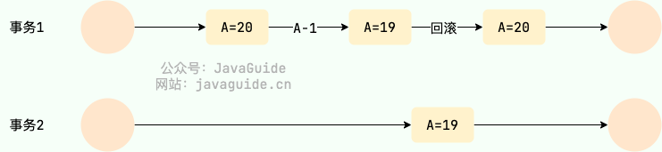
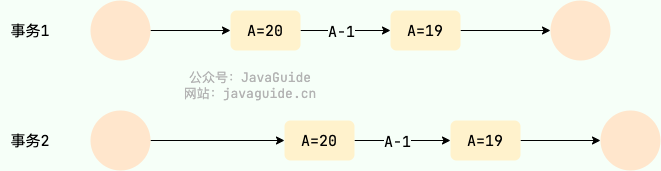
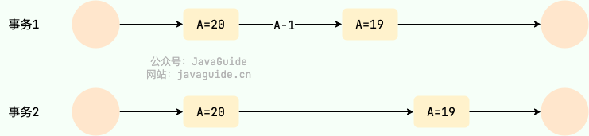
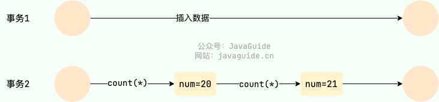
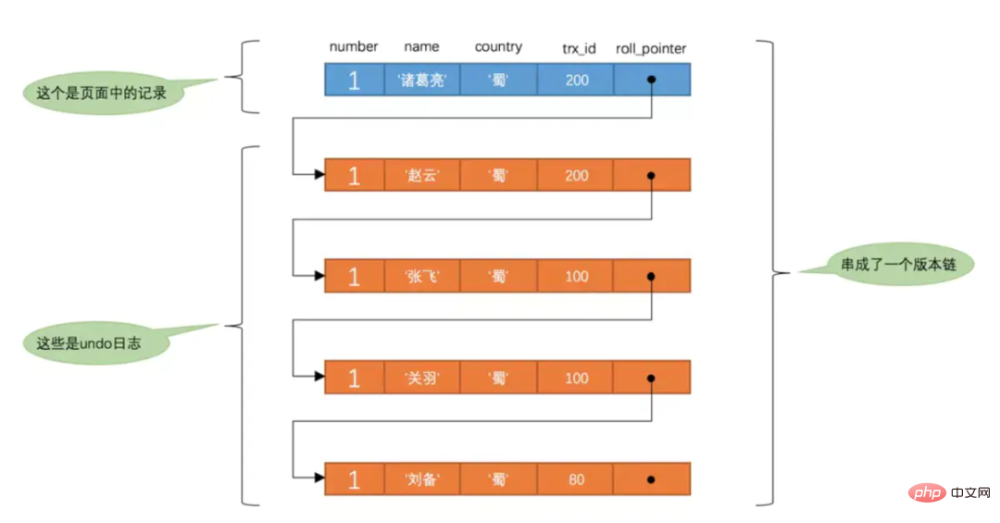

<!-- permalink: /MySQL/原理/事务/  -->

## 定义

  事务是一组操作的集合，事务会把所有的操作作为一个整体一起向系统提交或撤销操作请求。

  即，**这些操作要么同时成功，要么同时失败。**   

  事务不能回退 `SELECT` 语句，回退 `SELECT` 语句也没意义；也不能回退 `CREATE` 和 `DROP` 语句。

##  控制事务

   **MySQL 默认是隐式提交**，每执行一条语句就把这条语句当成一个事务然后进行提交。

   当出现 `START TRANSACTION` 语句时，会关闭隐式提交；当 `COMMIT` 或 `ROLLBACK` 语句执行后，事务会自动关闭，重新恢复隐式提交。

   查看/设置事务提交方式

```sql
select @@autocommit;

set @@autocommit=0;  //取消自动提交
```

   提交事务

```sql
commit;
```

   回滚事务

```sql
rollback;
```

   开启事务

```sql
start transction 或 begin;
```

  指令：

- `START TRANSACTION` --- 用于标记事务的起始点。
- `SAVEPOINT` ------------ 用于创建保留点。
- `ROLLBACK TO` ---------- 用于回滚到指定的保留点；如果没有设置保留点，则回退到 `START TRANSACTION` 语句处。
- `COMMIT` ---------------- 提交事务

 例：

```sql
-- 开始事务
START TRANSACTION;

-- 插入操作 A
INSERT INTO `user`
VALUES (1, 'root1', 'root1', 'xxxx@163.com');

-- 创建保留点 updateA
SAVEPOINT updateA;

-- 插入操作 B
INSERT INTO `user`
VALUES (2, 'root2', 'root2', 'xxxx@163.com');

-- 回滚到保留点 updateA
ROLLBACK TO updateA;

-- 提交事务，只有操作 A 生效
COMMIT;
```


## 事务四大特性

​	原子性（Atomicity）：事务是不可分割的最小操作单元，要么全部成功，要么全部失败。

​	一致性（Consistency）：事务完成时，必须使所有的数据都保持一致状态。

​	隔离性（Isolation）：数据库系统提供的隔离机制，保证事务在不受外部并发操作影响的独立环境下运行。

​	持久性（Durability）：事务一旦提交或回滚，它对数据库中的数据的改变就是永久的。

​	上述就是事务的四大特性，简称ACID。

## 并发事务的问题

| 问题       | 描述                                                         |
| :--------- | :----------------------------------------------------------- |
| 脏读       | 一个事务读到另一个事务还没提交的数据                         |
| 不可重复读 | 一个事务先后读取同一条记录，但两次读取的数据不同             |
| 幻读       | 一个事务按照条件查询数据时，没有对应的数据行，但是再插入数据时，又发现这行数据已经存在 |

### 脏读(Dirty read)

  一个事务读取数据并且对数据进行了修改，这个修改对其他事务来说是可见的，即使当前事务没有提交，

  这时，另外一个事务读取了这个还未提交的数据，但第一个事务突然回滚，导致数据并没有被提交到数据库，

  那第二个事务读取到的就是脏数据。

  例：

&nbsp;&nbsp;事务1读取某表中的数据 A=20，事务1修改 A=A-1，事务2读取到 A=19,事务1回滚导致对 A 的修改并为提交到数据库， 

&nbsp;&nbsp;所以，A 的值还是 20。

​		


### 丢失修改(Lost to modify)

   在一个事务读取一个数据时，另外一个事务也访问了该数据，在第一个事务中修改了这个数据后，第二个事务也修改了

   这个数据，这样第一个事务内的修改结果就被丢失，因此称为丢失修改。

   例：

&nbsp;&nbsp;事务1读取某表中的数据 A=20，事务2 也读取 A=20，事务1 先修改 A=A-1，事务2后来也修改 A=A-1，

&nbsp;&nbsp;最终结果 A=19，则，事务1 的修改被丢失。      

​			 

### 不可重复读(Unrepeatable read)

   在一个事务内多次读取同一个数据，在这个事务还没有结束时，另一个事务也访问该数据。那么，在第一个事务中的

   两次读数据之间，由于第二个事务的修改导致第一个事务两次读取的数据可能不太一样。

   这就发生了**在一个事务内两次读到的数据是不一样的情况**，因此称为不可重复读。

   例如：事务1读取某表中的数据 A=20，事务2也读取 A=20，事务1修改 A=A-1，事务 2 再次读取 A =19，

&nbsp;&nbsp;&nbsp;此时，事务2第二次读取的结果和第一次读取的结果不同。

​              


**三种不可重复读**

 1.读-更新

​	–  事务1 读取某一数据

​	–  事务2 对其做了修改

​	–  当事务1 再次读该数据时，得到与前一次不同的值

 2.读-删除

​    –  事务1 按一定条件从数据库中读取某些数据记录

​    –  事务2 删除了其中部分记录

​    –  当事务1 再次按相同条件读取数据时，发现某些记录神密地消失了

 3.读-插入

​    –  事务1 按一定条件从数据库中读取某些数据记录

​    –  事务2 插入了一些记录

​    –  当事务1再次按相同条件读取数据时，发现多了一些记录  

### 幻读(Phantom read)

   幻读与不可重复读类似。一个事务读取了几行数据，接着另一个并发事务插入了一些数据时，如果第一个事务再次进行

   查询，就会发现多了一些原本不存在的记录，就好像发生了幻觉一样。(即，三类不可重复读中的第二种和第三种情况)。

   例如：事务2 读取某个范围的数据，事务1 在这个范围插入了新的数据，事务2 再次读取这个范围的数据发现相比于第一次读取的结果多了新的数据。

​		      


### 不可重复读和幻读的区别

- 不可重复读的重点是内容修改或者记录减少，比如多次读取一条记录发现其中某些记录的值被修改；
- 幻读的重点在于数据的新增，比如多次执行同一条查询语句（DQL）时，发现查到的记录增加了。

### 解决幻读的方法

  解决幻读的方式有很多，但其核心思想是：**一个事务在操作某张表数据的时候，另外一个事务不允许新增或者删除这张表中的数据**。

  解决幻读的方式主要有以下几种：

1. 将事务隔离级别调整为 `SERIALIZABLE` 。

2. 在可重复读的事务级别下，给事务操作的这张表添加表锁。

3. 在可重复读的事务级别下，给事务操作的这张表添加 Next-key Lock（Record Lock+Gap Lock，即，行锁+间隙锁）。

    

## 事务隔离级别

​    为了解决并发事务所引发的问题，在数据库中引入了事务隔离级别。

​    主要有以下几种（从低到高，√是该隔离级别下会出现的问题）：

| 隔离级别                           | 脏读                | 不可重复读          | 幻读                      |
| ---------------------------------- | ------------------- | ------------------- | :------------------------ |
| Read uncommitted&nbsp;&nbsp;&nbsp; | √&nbsp;&nbsp;&nbsp; | √&nbsp;&nbsp;&nbsp; | √&nbsp;&nbsp;&nbsp;&nbsp; |
| Read committed                     | ×                   | √                   | √                         |
| Repeatable Read(默认)              | ×                   | ×                   | √                         |
| Serializable                       | ×                   | ×                   | ×                         |

  READ-UNCOMMITTED(读取未提交)：最低的隔离级别，**允许读取尚未提交的数据**，可能会导致脏读、幻读、不可重复读

  READ-COMMITTED(读取已提交)：**允许读取并发事务已经提交的数据**，可以阻止脏读，但可能发生幻读或不可重复读。

  REPEATABLE-READ(可重复读)：**对同一字段的多次读取结果都是一致的，除非数据是被本身事务自己所修改，** 可以阻止脏读和不可重复读，但幻读仍有可能发生。

  SERIALIZABLE(可串行化)：最高的隔离级别，完全服从 ACID 的隔离级别。**所有的事务依次逐个执行**，这样事务之间就完全不可能产生干扰，也就是说，该级别可以防止脏读、不可重复读以及幻读。

  **隔离级别的实现：**

&nbsp;&nbsp;Read committed：写操作时加X锁，事务结束释放，读操作时加S锁，读取完成释放。

&nbsp;&nbsp;Repeatable Read：写操作时加X锁，事务结束释放；读操作时加S锁，事务结束释放。

&nbsp;&nbsp;解决幻读：写操作时加X锁，事务结束释放；读操作时加临键锁，事务结束释放。

  **查看事务隔离级别**

```sql
select @@transaction_isolation; 
```

   **设置事务隔离级别**

```sql
set [ session | global ] transaction isolation level { read uncommitted |

read committed | repeatable read | serializable }
```

   注意：**事务隔离级别越高，数据越安全，但是性能越低。**

​	         MySQL InnoDB 存储引擎的默认的隔离级别是 **REPEATABLE-READ(可重读)。**


## 事务原理

  事务的原子性、一致性和持久性是由InnoDB中的两份日志来保证的，一份是undo log日志，一份是redo log日志。

  而**隔离性是通过数据库的锁，加上MVCC来保证的**。

### redo log

  **重做日志，记录的是事务提交时数据页的物理修改，用来实现事务的持久性。**

  该日志文件由两部分组成：重做日志缓冲(redo log buffer) 以及重做日志文件(redo log file)，前者是在内存中，后者在磁盘中。

  当事务提交之后会把所有修改信息都存到该日志文件中, **用于在刷新脏页到磁盘时，如果发生错误, 进行数据恢复使用。**

  有了redo log之后，当对缓冲区的数据进行增删改之后，会首先将操作的数据页的变化，记录在redo log buffer中。

  在事务提交时(默认策略），会将redo log buffer中的数据刷新到redo log磁盘文件中。

  过一段时间之后，如果刷新缓冲区的脏页到磁盘时，发生错误，此时就可以借助于redo log进行数据恢复，这样就保证了事务的持久性。

  **如果脏页成功刷新到磁盘或者涉及到的数据已经落盘，此时redolog就没有作用可以删除了，所以存在的两个redolog文件是循环写的。**

### undo log

  回滚日志，用于记录数据被修改前的信息 , 作用包含两个：提供回滚(保证事务的原子性) 和 MVCC(多版本并发控制) 。

  undo log和redo log记录物理日志不一样，它是逻辑日志。可以认为当delete一条记录时，undo log中会记录一条对应的insert记录，反之亦然，当update一条记录时，它记录一条对应相反的update记录。

  **当执行rollback时，就可以从undo log中的逻辑记录读取到相应的内容并进行回滚。**

   Undo log销毁：undo log在事务执行时产生，事务提交时，并不会立即删除undo log，因为这些日志可能还用于MVCC。

   Undo log存储：**undo log采用段的方式进行管理和记录，存放在 rollback segment回滚段中，内部包含1024个undo log segment。**                   

## 并发事务的控制方式

  MySQL 中并发事务的控制方式有两种：**锁** 和 **MVCC**。

### 锁

  锁可以看作是悲观控制的模式，多版本并发控制(MVCC，Multiversion concurrency control)可以看作是乐观控制的模式。

  锁控制方式下会通过锁来显示控制共享资源而不是通过调度手段，MySQL 中主要是通过 **读写锁** 来实现并发控制。

- **共享锁(S 锁)：** 又称读锁，事务在读取记录的时候获取共享锁，允许多个事务同时获取（锁兼容）。

- **排他锁(X 锁)：** 又称写锁/独占锁，事务在修改记录的时候获取排他锁，不允许多个事务同时获取。

  ​             **如果一个记录已经被加了排他锁，那么其他事务不能再对这条记录加任何类型的锁（锁不兼容）。**				                    

  读写锁可以做到读读并行，但是无法做到写读、写写并行。

  另外，根据根据锁粒度的不同，又被分为 表级锁(table-level locking) 和行级锁(row-level locking) 。

  InnoDB 不仅支持表级锁，还支持行级锁，默认为行级锁。

  行级锁的粒度更小，仅对相关的记录上锁即可（对一行或者多行记录加锁），所以对于并发写入操作来说， InnoDB 的性能更高。

  **不论是表级锁还是行级锁，都存在共享锁（Share Lock，S 锁）和排他锁（Exclusive Lock，X 锁）这两类。**

### MVCC

  MVCC是多版本并发控制方法，对一份数据会存储多个版本，通过事务的可见性来保证事务能看到自己应该看到的版本。

  通常会有一个全局的版本分配器来为每一行数据设置版本号，版本号是唯一的。

  MVCC 在 MySQL 中实现所依赖的手段主要是: **隐藏字段、read view、undo log**。

- undo log : undo log 用于记录某行数据的多个版本的数据。
- read view 和 隐藏字段 : 用来判断当前版本数据的可见性。

## MVCC

### 简介

  全称 Multi-Version Concurrency Control，多版本并发控制，是乐观锁的一种实现。

  **作用：维护一个数据的多个版本，使得读写操作没有冲突，主要是为了提高数据库的并发性能。**

  为了当查询一些正在被另一个事务更新的行时，可以看到它们被更新之前的值，这样在做查询的时候就不用等待另一个事务释放锁了。

   同一行数据平时发生读写请求时，一般会上锁阻塞住，

   但**MVCC用更好的方式去处理读—写请求，做到了在发生读—写请求冲突时不用加锁。**

   这个读是指的快照读，而不是当前读，当前读是一种加锁操作，是悲观锁。

### 当前读

  当前读读取的是记录的最新版本(最新数据，而不是历史版本的数据)，读取时还要保证其他并发事务不能修改当前记录，

  **会对读取的记录进行加锁，是悲观锁的一种操作。**

  如下操作都是当前读：

- select ... lock in share mode (加了共享锁的select语句)

- select for update (加了排他锁的select语句)

- update... (update语句默认加排他锁)

- insert... (insert语句默认加排他锁)

- delete... (delete语句默认加排他锁)

- 串行化事务隔离级别

   

### 快照读

  快照读的实现是基于多版本并发控制，即MVCC，它在很多情况下，避免了加锁操作，降低了开销。

  **既然是多版本，那么快照读读到的数据不一定是当前最新的数据，有可能是之前历史版本的数据。**

  快照读又叫一致性读，读取的是快照数据。**不加锁的简单的 SELECT语句就属于快照读。**

  **快照读的前提是隔离级别不是串行级别，串行级别下的快照读会退化成当前读。**


### 数据库并发场景

- 读--读：不存在任何问题，也不需要并发控制。

- 读--写：有线程安全问题，可能会造成事务隔离性问题，可能遇到脏读，幻读，不可重复读。

- 写--写：有线程安全问题，可能会存在更新丢失问题，比如第一类更新丢失，第二类更新丢失。

   

### MVCC解决的问题

  MVCC用来解决读—写冲突的无锁并发控制，**为事务分配单向增长的时间戳，为每个数据修改保存一个版本，版本与事务时间戳相关联。**

  **读操作只读取该事务开始前的数据库快照。**

**解决问题如下：**

- 并发读-写时：可以做到读操作不阻塞写操作，同时写操作也不会阻塞读操作。
- 解决 脏读、幻读、不可重复读等事务隔离问题，但不能解决上面的 写-写 更新丢失 问题。

**因此有了下面提高并发性能的组合拳：**

- `MVCC + 悲观锁`：MVCC解决读写冲突，悲观锁解决写写冲突

- `MVCC + 乐观锁`：MVCC解决读写冲突，乐观锁解决写写冲突

   

### MVCC的实现原理

  它的实现依赖于版本链、undo log日志、Read View。

**版本链**

  数据库中的每行数据，除了可见的数据外，还有三个隐藏的字段：

| 隐藏字段        | 含义                                                         |
| --------------- | ------------------------------------------------------------ |
| DB_TRX_ID       | 最近修改事务ID，保存插入这条记录或最后一次修改这条记录的事务的ID |
| DB_ROLL_POINTER | 回滚指针，指向这条记录的上一个版本，上一个版本的内容记录在undo log中 |
| DB_ROW_ID       | 隐藏主键，如果表结构没有指定主键，将会生成该隐藏字段         |

  TRX_ID：6bytes，记录创建/最后一次修改 这条记录的事务ID。

  ROLL_POINTER：7bytes，回滚指针，指向这条记录的上一个版本。

&nbsp;&nbsp;&nbsp;&nbsp;**每次对某条记录进行改动时，都会把旧的内容保存到 undo日志中，通过这个指针，可以找到该记录被修改前的信息**。                

  ROW_ID：6bytes，隐含的自增id，如果数据表没有主键，InnoDB会自动以DB_ROW_ID产生一个聚簇索引。


  每次对数据库记录进行改动，都会记录一条undo日志，**每条undo日志也都有一个roll_pointer属性**(insert操作对应的undo日志没有该属性，因为该记录并没有更早的版本)，

可以将这些undo日志都连起来，串成一个链表，所以现在的情况就像下图一样：

​		

   对该记录每次更新后，都会将旧值放到一条undo日志中，算是该记录的一个旧版本，随着更新次数的增多，所有的版本

   都会被roll_pointer属性连接成一个链表，这个链表称之为版本链，版本链的头节点就是当前记录最新的值。

​    另外，**每个版本中还包含生成该版本时对应的事务id，这个信息在根据ReadView判断版本可见性的时候会用到**。


### undo log

**简介**

   Undo log 主要用于记录数据被修改之前的日志，在表信息修改之前先会把数据拷贝到undo log里。

   当事务进行回滚时可以通过undo log 里的日志进行数据还原。

**作用**

   1.保证事务进行rollback时的原子性和一致性，当事务进行回滚的时候可以用undo log的数据进行恢复。

   2.用于MVCC快照读的数据，在MVCC多版本控制中，通过读取undo log的历史版本数据可以实现不同事务版本号都拥有自己独立的快照数据版本。

 **种类**

   当进行insert操作的时候，产生的undo log日志只在回滚时需要，在事务提交后，可被立即删除。 

   而update、delete的时候，产生的undo log日志不仅在回滚时需要，在快照读时也需要，不会被立即删除，只有在快照读或事务回滚不涉及该日志时，对应的日志才会被purge线程统一清除。


### ReadView(读视图)

**简介**

   **事务进行快照读操作的时候产生的读视图**，在该事务执行快照读的那一刻，会生成数据库系统当前的一个快照。

   ReadView 是 快照读 SQL执行时MVCC提取数据的依据，记录并维护系统当前活跃的事务（未提交的）id。

   **Read View主要是用来做可见性判断的, 即当某个事务执行快照读的时候，对该记录创建一个Read View读视图，**

  **把它当做条件用来判断当前事务能够看到哪个版本的数据，既可能是当前最新的数据，也有可能是该行记录的undo log里面的某个版本的数据。**

**属性**

  ReadView中包含了四个核心字段：

| 字段           | 含义                                                 |
| -------------- | ---------------------------------------------------- |
| trx_ids        | 当前活跃的(未提交)事务ID集合                         |
| up_limit_id    | 最小活跃事务ID                                       |
| low_limit_id   | 预分配事务ID，当前最大事务ID+1（因为事务ID是自增的） |
| creator_trx_id | 创建当前read view的事务ID                            |

**Read View可见性判断条件**

- `db_trx_id` < `up_limit_id` || `db_trx_id` == `creator_trx_id`（显示）

  如果旧版本数据中的事务ID小于读视图中的最小活跃事务ID，说明该数据是在当前事务开启之前就已经存在了，所以可以显示。

  或者旧版本事务ID等于`creator_trx_id` ，说明这个数据就是当前事务自己生成的，这种情况下此数据也可以显示。

- `db_trx_id` >= `low_limit_id`（不显示）

  如果旧版本的事务ID大于read view 中的当前系统的最大事务ID，则说明该数据是在当前read view 创建之后才产生的，所以数据不显示。

  如果小于则进入下一个判断。

- `db_trx_id`是否在 活跃事务（trx_ids）中

  - `不存在`：则说明read view产生的时候事务已经commit了，这种情况下数据可以显示。
  - `存在`：则代表Read View生成时刻，这个事务还在活跃，还没有Commit，则这个事务修改的数据，当前事务是看不见的。


**MVCC和事务隔离级别**

   Read View 用于RC（Read Committed，读提交）和RR（Repeatable Read，可重复读）隔离级别的实现。

   不同的隔离级别，生成ReadView的时机不同：

&nbsp;&nbsp;READ COMMITTED ：在事务中每一次执行快照读时都会生成并获取最新的ReadView。

&nbsp;&nbsp;REPEATABLE READ：仅在事务中第一次执行快照读时生成ReadView，后续复用该ReadView，所以一个事务的查询结果

&nbsp;&nbsp;&nbsp;&nbsp;&nbsp;&nbsp;&nbsp;&nbsp;&nbsp;&nbsp;&nbsp;&nbsp;&nbsp;&nbsp;&nbsp;&nbsp;&nbsp;&nbsp;&nbsp;&nbsp;&nbsp;&nbsp;&nbsp;&nbsp;&nbsp;&nbsp;&nbsp;&nbsp;&nbsp;&nbsp;&nbsp;&nbsp;&nbsp;&nbsp;&nbsp;&nbsp;&nbsp;&nbsp;每次都是一样的。									  

### RC和RR级别下快照读区别

- **在RC级别下的事务中，每次快照读都会新生成一个快照和Read View，所以在RC级别的事务中可以看到别的事务提交的更新。**

- 在RR级别下的事务对某条记录的第一次快照读会创建一个快照及Read View， 将当前系统活跃的其他事务记录起来，

  此后再调用快照读的时候，使用的是同一个Read View，所以只要当前事务在其他事务提交更新之前使用过快照读，

  那么之后的快照读使用的都是同一个Read View，所以对其他事务之后的修改不可见；

- 即，RR级别下，快照读生成Read View时，Read View会记录此时所有其他活动事务的ID，这些事务的修改对于

  当前事务都是不可见的，而早于Read View创建的事务所做的修改均是可见。   

### 解决幻读问题

- 快照读：通过MVCC来进行控制的，不用加锁。按照MVCC中规定的“语法”进行增删改查等操作，以避免幻读。
- 当前读：通过next-key锁（行锁+gap锁）来解决问题的。


