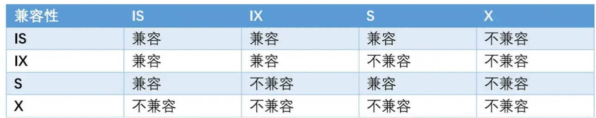
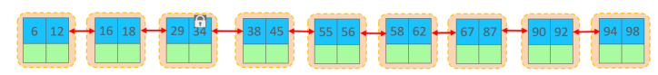
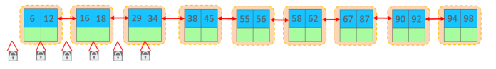
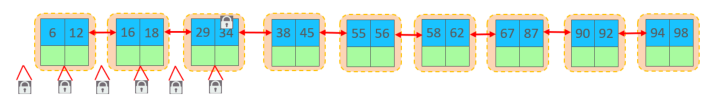

<!-- permalink: /MySQL/原理/锁    -->


# 锁

## 概述

 **锁是计算机协调多个进程或线程并发访问某一资源的机制**。

 在数据库中，除传统的计算资源（CPU、RAM、I/O）的争用以外，数据也是一种供许多用户共享的资源。

  如何保证数据并发访问的一致性、有效性是所有数据库必须解决的一个问题，锁冲突也是影响数据库并发访问性能的一个重要因素。

  从这个角度来说，锁对数据库而言显得尤其重要，也更加复杂。

  MySQL中的锁，按照锁的粒度分，分为以下三类：

​	&ensp;全局锁：锁定数据库中的所有表。

​	&ensp;表级锁：每次操作锁住整张表。

​	&ensp;行级锁：每次操作锁住对应的行数据。

## 全局锁

### 概述

   全局锁就是对整个数据库实例加锁，加锁后整个实例就处于只读状态，后续的DML、DDL语句都将被阻塞。

   其典型的使用场景是做全库的逻辑备份，对所有的表进行锁定，从而获取一致性视图，保证数据的完整性。

### 语法

​	加全局锁

```sql
flush tables with read lock ; 
```

​	数据备份

```sql
mysqldump -uroot –p1234 student > student.sql 
```

​	释放锁

```sql
unlock tables ; 
```

### 特点

​	数据库中加全局锁，是一个比较重的操作，存在以下问题：

​	&ensp;&ensp;如果在主库上备份，那么在备份期间都不能执行更新，业务基本上就得停摆。

​	&ensp;&ensp;如果在从库上备份，那么在备份期间从库不能执行主库同步过来的二进制日志（binlog），会导致主从延迟。

​	在InnoDB引擎中，可以在备份时加上参数 --single-transaction 来完成不加锁的一致性数据备份。

```sql
mysqldump --single-transaction -uroot –p123456 student > student.sql 
```


## 表级锁

### 概述

​    表级锁，每次操作锁住整张表。锁的粒度大，发生锁冲突的概率最高，并发度最低。

​    应用在MyISAM、InnoDB等存储引擎中。

​    对于表级锁，主要分为以下三类：

​	 &ensp;表锁

​	 &ensp;元数据锁（meta data lock，MDL）

​	 &ensp;意向锁

### 表锁

   对于表锁，分为两类：

​	&ensp;表共享读锁（read lock）

​	&ensp;表独占写锁（write lock）

  语法：

​	&ensp;加锁：lock tables 表名... read/write。

​	&ensp;释放锁：unlock tables / 客户端断开连接 。

 &ensp;&ensp;**读锁不会阻塞其他客户端的读操作，但是会阻塞写。写锁会阻塞其他客户端的读，也会阻塞其他客户端的写。**


### 元数据锁

   meta data lock , 元数据锁，简写MDL。

   **这里的元数据，可以简单理解为就是一张表的表结构。 也就是说，某一张表涉及到未提交的事务时，是不能够修改这张表的表结构的。**

   MDL加锁过程是系统自动控制，无需显式使用，在访问一张表的时候会自动加上。

   MDL锁主要作用是维护表元数据的数据一致性，在表上有活动事务时，不可以对元数据进行写入操作。

   **为了避免DML与DDL冲突，保证读写的正确性。**

   在MySQL5.5中引入了MDL，当对一张表进行增删改查的时候，加MDL读锁；当对表结构进行变更操作时，加MDL写锁。


### 意向锁

   意向锁是**一种不与行级锁冲突的表级锁**。未来的某个时刻，事务可能要加共享或者排它锁时，先提前声明一个意向。

####  **原因：**

   因为InnoDB是表锁和行锁共存的，如果一个事务A获取到了表中某一行的排他锁，但还未提交，这时候事务B请求获取同一个表的表共享锁，因为共享锁和排他锁是互斥的，因此事务B想对这个表加共享锁时，需要保证没有其他事务持有这个表的表排他锁，同时还要保证没有其他事务持有表中任意一行数据的排他锁。

​    然后问题来了，如何判断表中的数据没有排他锁呢，一行一行遍历肯定是不行，性能太差了。

​    这时，就需要用到一个叫做意向锁的东西来快速判断是否可以对某个表使用表锁，使得给数据表加表锁时不用检查每行数据是否加锁，**即，使用意向锁来减少表锁的检查。**

#### **分类**

​	意向共享锁(Intention Shared Lock，IS锁)

​     &ensp;&ensp;当事务准备在某些记录上加S锁时，加锁前必须先取得该表的 IS 锁。

​     &ensp;&ensp;与表锁共享锁(read)兼容，与表锁排他锁(write)互斥。

​	意向排他锁(Intention Exclusive Lock，IX锁)

​     &ensp;&ensp;当事务准备在某条记录上加 X锁时，加锁之前必须先取得该表的 IX 锁。  

​     &ensp;&ensp;与表锁共享锁(read)及排他锁(write)都互斥。

#### **原理**

   如果一个事务A获取到了某一行的排他锁，并未提交，这时候表上就有 意向排他锁 和这一行的 排他锁 。

   这个时候事务B想要获取这个表的共享锁，此时因为检测到事务A持有了表的 意向排他锁 ，说明事务A必然持有某些行的排他锁，也就是说事务B对表的加锁请求需要阻塞等待，不再需要去检测表的每一行数据是否存在排他锁。

  特点：

1. **意向锁是由数据引擎自己维护的**，用户无法手动操作，在为记录加共享/排他锁之前，InnoDB 会先获取该记录所在数据表的对应的意向锁。       

2. **意向锁之间互相兼容，与行级的共享锁和排他锁也兼容**，但意向锁与表级别的共享锁和表级别的排它锁互斥。



​      **一旦事务提交了，意向共享锁、意向排他锁，都会自动释放。**

### 自增锁

  auto_inc lock，自增锁是一种特殊的表级别锁。它是专门针对AUTO_INCREMENT类型的列，对于这种列，如果表中新增数据时就会去持有自增锁。

   即，如果一个事务正在往表中插入记录，所有其他事务的插入必须等待，以便第一个事务插入的行是连续的主键值。

   参数`innodb_autoinc_lock_mode`的取值：

​       0：传统锁模式，使用表级AUTO_INC锁。一个事务的INSERT-LIKE语句在执行结束后释放AUTO_INC锁，而不是在事务结束后释放。

​       1：连续锁模式，连续锁模式对于Simple inserts不会使用表级锁，而是使用一个轻量级锁来生成自增值。

​		&ensp;&ensp;&ensp;因为InnoDB可以提前知道插入多少行数据。自增值生成阶段使用轻量级互斥锁来生成所有的值，而不是一直加锁

   &ensp;&ensp;&ensp;&ensp;直到插入完成。但对于bulk inserts类语句就会使用AUTO_INC表级锁，直到语句完成。

​       2：交错锁模式，所有的 INSERT-LIKE 语句都不使用表级锁，而是使用轻量级互斥锁。

  **注意**：

​		&ensp;INSERT-LIKE：指所有的插入语句，包括： INSERT、REPLACE、INSERT…SELECT、REPLACE…SELECT,LOAD DATA等。

​       &ensp;Simple inserts：指在插入前就能确定插入行数的语句，包括：INSERT、REPLACE，不包含INSERT…ON DUPLICATE KEY 

​										UPDATE这类语句。

​        Bulk inserts：指在插入前不能确定行数的语句，包括：INSERT … SELECT/REPLACE … SELECT/LOAD DATA。


## 行级锁

### 概述

  行级锁，每次操作锁住对应的行数据。锁定粒度最小，发生锁冲突的概率最低，并发度最高。

  应用在InnoDB存储引擎中。

  InnoDB的数据是基于索引组织的，**行锁是通过对索引上的索引项加锁来实现的，而不是对记录加的锁。**

  **行级锁和存储引擎有关，是在存储引擎层面实现的。**

  对于行级锁，主要分为以下三类：

1. 行锁(Record Lock)：又叫记录锁，锁定单行记录的锁，防止其他事务对此行记录进行update和delete。在RC、RR隔离级别下都支持。**行锁永远都是加在索引上的，即使一个表没有索引，InnoDB也会隐式的创建一个索引。**

​										

2. 间隙锁(Gap Lock)：锁定索引记录的间隙（不含该记录），确保索引记录间隙不变，

​						&ensp;&ensp;&ensp;&ensp;防止其他事务在这个间隙进行insert操作，产生幻读。在RR隔离级别下使用。

​									  

3. 临键锁(Next-Key Lock)：行锁和间隙锁组合，同时锁住数据，并锁住数据前面的间隙Gap。

   主要目的是为了解决幻读问题。它的锁区间是前开后闭，在RR隔离级别下使用。

​			

### 行锁

   InnoDB实现了 以下两种类型的行锁：

​      共享锁（S）：又称读锁，事务在读取记录的时候获取共享锁，允许多个事务同时获取（锁兼容）

​      排他锁（X）：又称写锁/独占锁，事务在修改记录的时候获取排他锁，不允许多个事务同时获取。

​       注意：**排他锁指的是一个事务在一行数据加上排他锁后，其他事务不能再添加其他的锁。**

​				  比如，InnoDB中，**select语句是默认不加任何锁的**，如果一条记录被加了排他锁，虽然不能再加锁，但是可以使用普通select语句进行查询操作，因为select语句默认不加锁。  

​		 

​	常见的SQL语句，在执行时，所加的行锁如下：

|                    SQL                    |  行锁类型  |                     说明                      |
| :---------------------------------------: | :--------: | :-------------------------------------------: |
|                insert ...                 |   排他锁   |                   自动加锁                    |
|                update ...                 |   排他锁   |          自动加锁&ensp;&ensp;&ensp;           |
|                delete ...                 |   排他锁   |                   自动加锁                    |
|               select (正常)               | 不加任何锁 |  RC和RR时，默认不加锁，Serializable下会加锁   |
| select ... lock in share mode&ensp;&ensp; |   共享锁   | 需要手动在select语句之后加 lock in share mode |
|           select ... for update           |   排他锁   |       需要手动在select之后加for update        |

  默认情况下，InnoDB在 repeatable read事务隔离级别运行会使用 next-key 锁进行搜索和索引扫描，以防止幻读。

  针对唯一索引进行检索时，对已存在的记录进行等值匹配时，将会自动优化为行锁。

  **InnoDB的行锁是针对于索引加的锁，如果不通过索引条件检索数据，那么InnoDB将对表中的所有记录加锁， 此时就会升级为表锁。**

使用：

```sql
# 共享锁
SELECT ... LOCK IN SHARE MODE;

# 排他锁
SELECT ... FOR UPDATE
```


### 间隙锁和临键锁

​    默认情况下，InnoDB在 repeatable read事务隔离级别运行时会使用 next-key 锁进行搜索和索引扫描，以防止幻读。

​       索引上的等值查询(唯一索引)，如果记录存在，则会优化为行锁；如果查询的记录不存在，则会优化为间隙锁 。

​       索引上的等值查询(非唯一普通索引)，向右遍历到最后一个值不满足查询需求时，next-key lock 退化为间隙锁。

​       索引上的范围查询(唯一索引)------会访问到不满足条件的第一个值为止。

​    注意：间隙锁唯一目的是防止其他事务插入间隙。

&ensp;&ensp;&ensp;&ensp;&ensp;&ensp;  **间隙锁可以共存，一个事务采用的间隙锁不会阻止另一个事务在同一间隙上采用间隙锁。**


## 死锁和活锁

###  活锁

   定义：系统可能使某个事务永远处于等待状态，得不到封锁的机会，这种现象称为"活锁"(Live Lock)。   

   解决：采用 先来先服务 的策略

​        &ensp;&ensp; –  当多个事务请求封锁同一数据对象时，封锁子系统按请求封锁的先后次序对这些事务进行排队

​        &ensp;&ensp;&ensp;–  该数据对象上的锁一旦释放，首先批准申请队列中第一个事务获得锁

### 死锁

####  **定义**

&ensp;&ensp;系统中有两个或两个以上的事务都处于等待状态，并且每个事务都在等待其中另一个事务解除封锁，

&ensp;&ensp;它才能继续执行下去，结果造成任何一个事务都无法继续执行，这种现象称系统进入了"死锁"(Dead Lock)状态。

####  **解决**

1. **死锁的预防(数据库中不适用)**

    预防死锁的发生就是要破坏产生死锁的条件，有一次封锁法和顺序封锁法。

  &ensp;&ensp; **1.一次封锁法：**

  &ensp;&ensp;  &ensp;&ensp;**一次封锁法要求每个事务必须一次将所有要使用的数据全部加锁，否则就不能继续执行。**

​     &ensp;&ensp;&ensp;&ensp;存在的问题：

   &ensp;&ensp;&ensp;&ensp;&ensp;&ensp;1. 降低并发度

​    &ensp;&ensp;&ensp;&ensp;&ensp;&ensp;一次就将以后要用到的全部数据加锁，势必扩大了封锁的范围，从而降低了系统的并发度。

   &ensp;&ensp;&ensp;&ensp;&ensp;&ensp;2.难于事先精确确定封锁对象

   &ensp;&ensp;&ensp;&ensp;&ensp;&ensp;&ensp;&ensp;数据库中数据是不断变化的，原来不要求封锁的数据，在执行过程中可能会变成封锁对象，所以很难事先精确

&ensp;&ensp;&ensp;&ensp;&ensp;&ensp;&ensp;&ensp;地确定每个事务所要封锁的数据对象。

 &ensp;&ensp;&ensp;**2.顺序封锁法**

  &ensp;&ensp;&ensp;&ensp;&ensp;**顺序封锁法是预先对数据对象规定一个封锁顺序，所有事务都按这个顺序实行封锁。**

  &ensp;&ensp;&ensp;&ensp;&ensp;存在的问题：

​    &ensp;&ensp;&ensp;&ensp;&ensp;&ensp;1.维护成本高

&ensp;&ensp;&ensp;&ensp;&ensp;&ensp;    数据库系统中可封锁的数据对象极其众多，并且随数据的插入、删除等操作而不断地变化，要维护这样极多

&ensp;&ensp;&ensp;&ensp;&ensp;&ensp;&ensp;&ensp;而且变化的资源的封锁顺序非常困难，成本很高。

​    &ensp;&ensp;&ensp;&ensp;&ensp;&ensp;2.难于实现

​       &ensp;&ensp;&ensp;&ensp;&ensp;&ensp;&ensp;事务的封锁请求可以随着事务的执行而动态地决定，很难事先确定每一个事务要封锁哪些对象，因此也就很难

&ensp;&ensp;&ensp;&ensp;&ensp;&ensp;&ensp;&ensp;按规定的顺序去施加封锁。

2. **死锁的诊断和解除**

​	&ensp;&ensp;由DBMS 的并发控制子系统 定期检测 系统中是否存在死锁，一旦检测到死锁，就要设法解除。

​     &ensp;&ensp;检测死锁的方法： 

​       &ensp;&ensp;1.超时法

​     &ensp;&ensp;&ensp;&ensp;**如果一个事务的等待时间超过了规定的时限，就认为发生了死锁。**

​      &ensp;&ensp;&ensp;&ensp;优点：实现简单

​      &ensp;&ensp;&ensp;&ensp;缺点：有可能误判死锁，时限若设置得太长，死锁发生后不能及时发现

​      &ensp;&ensp;2.等待图法

​       &ensp;&ensp;&ensp;&ensp;用事务等待图动态反映所有事务的等待情况

​       &ensp;&ensp;&ensp;&ensp;事务等待图是一个有向图G=(T，U)，T为结点的集合，每个结点表示正运行的事务，U为边的集合，

&ensp;&ensp;&ensp;&ensp;      每条边表示事务等待的情况，若T1等待T2，则T1，T2之间划一条有向边，从T1指向T2。

​    &ensp;&ensp;&ensp;&ensp;**并发控制子系统周期性地(比如每隔1min)检测事务等待图，如果发现图中存在回路，则表示系统中出现了死锁。**

​    **解除死锁：**

​        &ensp;&ensp;选择一个处理死锁代价最小的事务，将其撤消，释放此事务持有的所有的锁，使其它事务能继续运行下去。

  


