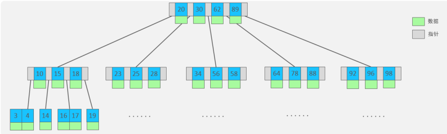
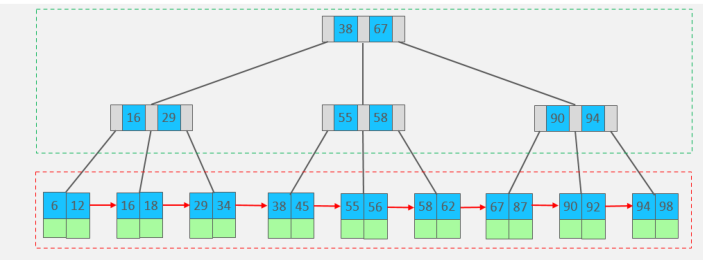
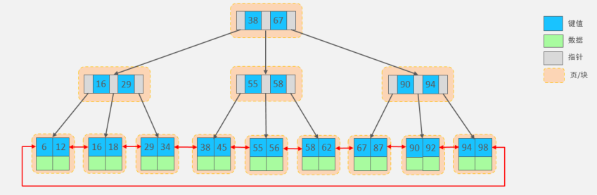
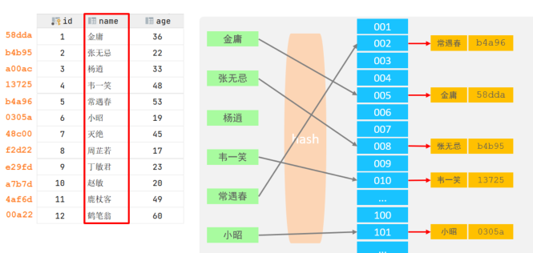
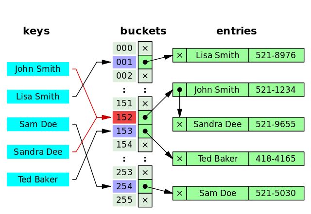
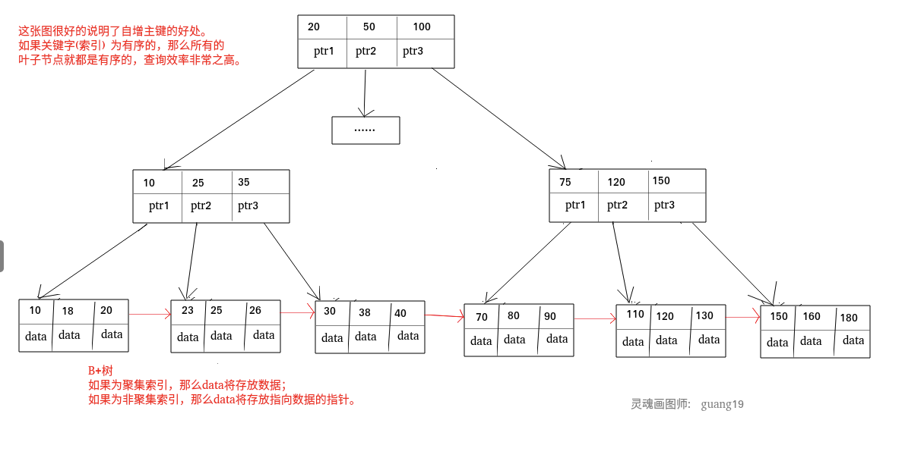
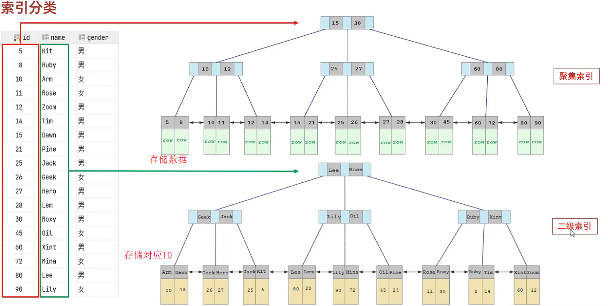
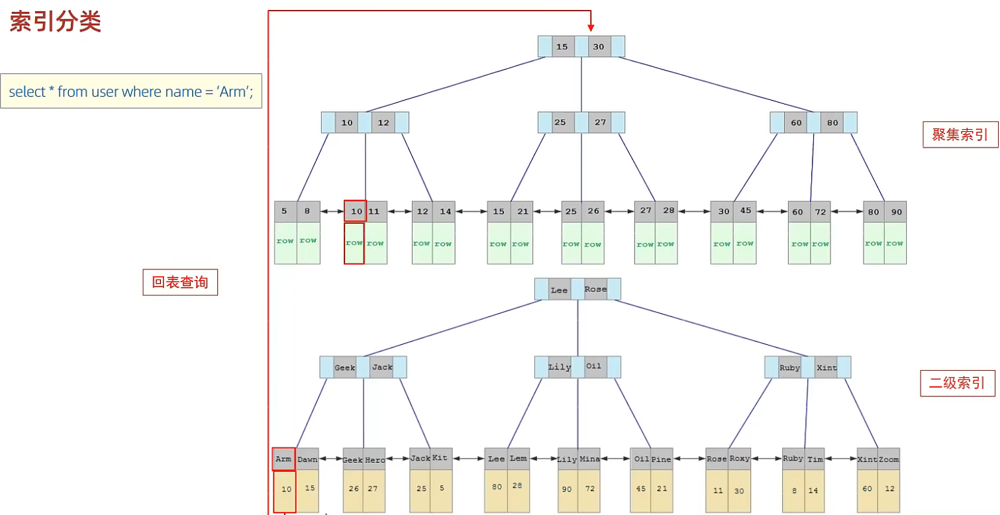

<!-- permalink: /MySQL/原理/索引    -->


# 索引

##  概述

 定义： 

​    **索引(index)是一种用于快速查询和检索数据的数据结构，其本质可以看成是一种排序好的数据结构。**

  在数据之外，数据库系统还维护着满足特定查找算法的数据结构，这些数据结构以某种方式引用(指向)数据， 这样就可以在这些数据结构上实现高级查找算法，这种数据结构就是索引。

​    优点：

​      &ensp;&ensp;**提高数据检索的效率，降低数据库的IO成本。**

​	 &ensp;&ensp;通过索引列对数据进行排序，降低数据排序的成本，降低CPU的消耗。

​     缺点：

​      &ensp;&ensp;索引列也是要**占用空间**的。

​      &ensp;&ensp;索引提高了查询效率，同时却也**降低了更新表的速度**，如对表进行INSERT、UPDATE、DELETE操作时，效率会降低。

​     &ensp;&ensp;创建和维护索引也需要耗费时间。

​    大多数情况下，索引查询都是比全表扫描要快的。但如果数据库的数据量不大，使用索引也不一定能够带来很大提升。

## 索引结构

​	**MySQL的索引是在存储引擎层实现的，不同的存储引擎有不同的索引结构**，主要包含以下几种：

​    按照数据结构维度划分：

| 索引结构            | 描述                                                         |
| :------------------ | :----------------------------------------------------------- |
| B+Tree              | 最常见的索引类型，大部分引擎都支持B+树索引                   |
| Hash                | 底层数据结构是用哈希表实现，只有精确匹配索引列的查询才有效，不支持顺序查询和范围查询 |
| R-Tree(空间索引)    | 空间索引是 MyISAM 引擎的一个特殊索引类型，主要用于地理空间数据类型，通常使用较少 |
| Full-Text(全文索引) | 是一种通过建立倒排索引，快速匹配文档的方式，类似于 Lucene, Solr, ES |

​	不同的存储引擎对于索引结构的支持：			 

| 索引       | InnoDB        | MyISAM | Memory |
| :--------- | :------------ | :----- | :----- |
| B+Tree索引 | 支持          | 支持   | 支持   |
| Hash索引   | 不支持        | 不支持 | 支持   |
| R-Tree索引 | 不支持        | 支持   | 不支持 |
| Full-text  | 5.6版本后支持 | 支持   | 不支持 |

### B-Tree

   B-Tree，B树是一种多叉路平衡查找树，相对于二叉树，B树每个节点可以有多个分支，即多叉。

   以一棵最大度数（max-degree）为5(5阶)的b-tree为例，那么这棵树上每个节点最多存储4个key，会有5个指针：

​	  

   特点：

​    &ensp;&ensp;5阶的B树，每一个节点最多存储4个key，对应5个指针。

​	&ensp;&ensp;一旦节点存储的key数量到达5，就会裂变，中间元素向上分裂。

​	  **在B树中，非叶子节点和叶子节点都会存放数据。**

### B+Tree

   B+Tree是B-Tree的变种，以一棵最大度数（max-degree）为4(4阶)的 B+tree为例，

​	

​	绿色框框起来的部分，是索引部分，仅仅起到索引数据的作用，不存储数据。

​	红色框框起来的部分，是数据存储部分，在其叶子节点中要存储具体的数据。

### B+Tree 与 B-Tree的区别

- B 树的所有节点既存放键(key) 也存放 数据(data)，而 B+树只有叶子节点存放 key 和 data，非叶子节点只存放 key，

  仅起到索引作用。

- B 树的叶子节点都是独立的；B+树的叶子节点有一条引用链指向与它相邻的叶子节点，叶子节点形成一个单向链表。

- B 树的检索的过程相当于对范围内的每个节点的关键字做二分查找，可能还没有到达叶子节点，检索就结束了。

  而 B+树的检索效率就很稳定，任何查找都是从根节点到叶子节点的过程，叶子节点的顺序检索很明显。

- MySQL在原B+Tree的基础上，增加一个指向相邻叶子节点的链表指针，就形成了带有顺序指针的B+Tree，

  即，将单向链表改为了双向链表，提高了区间访问的性能，可以支持范围查询和顺序扫描。

​	 


### Hash索引

  哈希索引就是采用一定的hash算法，将键值换算成新的hash值，映射到对应的槽位上，然后存储在hash表中。

​     

​    如果两个(或多个)键值，映射到一个相同的槽位上，这就产生了hash冲突（也称为hash碰撞），可以通过链表来解决。

​    哈希冲突：

​		

​    特点：

​     &ensp;&ensp;A. Hash索引只能用于对等比较(=，in)，不支持范围查询（between，>，< ，...）

​	&ensp;&ensp;B. 无法利用索引完成排序操作

​	&ensp;&ensp;C. 查询效率高，通常(不存在hash冲突的情况)只需要一次检索就可以了，效率通常要高于B+tree索引。

### R-Tree 索引

   一般不会使用，仅支持 geometry 数据类型，优势在于范围查找，效率较低，通常使用搜索引擎如 ElasticSearch 代替。

### 全文索引

   对文本的内容进行分词，进行搜索。目前只有 `CHAR`、`VARCHAR` ，`TEXT` 列上可以创建全文索引。

   一般不会使用，效率较低，通常使用搜索引擎如 ElasticSearch 代替。


## 索引分类

#### 分类

| 分类                             | 含义                                                     | 特点                     | 关键字   |
| :------------------------------- | :------------------------------------------------------- | :----------------------- | :------- |
| 主键索引&ensp;&ensp;&ensp;&ensp; | 针对于表中主键创建的索引，不可以有null值                 | 默认自动创建，只能有一个 | primary  |
| 唯一索引                         | 加速查询，列值唯一，可以有null值                         | 可以有多个               | unique   |
| 常规索引                         | 快速定位特定数据，仅加速查询，允许数据重复和null值       | 可以有多个               |          |
| 覆盖索引                         | 一个索引包含（或者说覆盖）所有需要查询的字段的值         |                          |          |
| 联合索引                         | 多列值组成一个索引，专门用于组合搜索，其效率大于索引合并 |                          |          |
| 全文索引                         | 对文本的内容进行分词，进行搜索                           | 可以有多个               | fulltext |

  

在 InnoDB 存储引擎中，根据索引的存储形式，又可以分为以下两种：

| 分类                        | 含义                                                   | 特点                 |
| :-------------------------- | :----------------------------------------------------- | :------------------- |
| 聚簇索引(Clustered Index)   | 将数据存储与索引放一块，索引结构的叶子节点保存了行数据 | 必须有，而且只有一个 |
| 非聚簇索引(Secondary Index) | 将数据与索引分开存储                                   | 可以存在多个         |

###  聚簇索引

   又叫聚集索引，**索引结构和数据一起存放的索引，并不是一种单独的索引类型，InnoDB 中的主键索引就属于聚簇索引。**

**聚簇索引的优缺点**

**优点**：

- 查询速度非常快 ：聚簇索引的查询速度非常的快，因为整个 B+树本身就是一棵多叉平衡树，叶子节点也都是有序的，定位到索引的节点，就相当于定位到了数据。**相比于非聚簇索引， 聚簇索引少了一次读取数据的 IO 操作。**

- 对排序查找和范围查找优化 ：聚簇索引对于主键的排序查找和范围查找速度非常快。

**缺点** ：

- 依赖于有序的数据：因为 B+树是多路平衡树，如果索引的数据不是有序的，那么就需要在插入时排序，如果数据是整型还好，如果是类似于字符串或 UUID 这种又长又难比较的数据，插入或查找的速度肯定比较慢。

- 更新代价大：如果对应索引列的数据被修改时，那么对应的索引也将会被修改，而且聚簇索引的叶子节点还存放着数据，修改代价肯定是较大的，所以**对于主键索引来说，主键一般都是不可被修改的。**

  

### 非聚簇索引

   **又叫非聚集索引，即索引结构和数据分开存放的索引，并不是一种单独的索引类型。**

**二级索引(辅助索引)就属于非聚簇索引。**

   MySQL 的 MyISAM 引擎，不管主键还是非主键，使用的都是非聚簇索引。

   非聚簇索引的叶子节点并不一定存放指向数据的指针，因为二级索引的叶子节点可以存放的是主键，根据主键再回表查数据。

**非聚簇索引的优缺点**

**优点** ：

  更新代价比聚簇索引要小 。非聚簇索引的更新代价就没有聚簇索引那么大了，非聚簇索引的叶子节点是不存放数据的。

**缺点** ：

- 依赖于有序的数据：跟聚簇索引一样，非聚簇索引也依赖于有序的数据。

- 可能会二次查询(回表)：这应该是非聚簇索引最大的缺点了。当查到索引对应的指针或主键后，可能还需要根据指针或主键再到数据文件或表中查询。


MySQL 的表的文件截图：

   

聚簇索引和非聚簇索引：

​	

**聚集索引选取规则：**

- 如果存在主键，主键索引就是聚集索引

- 如果不存在主键，将使用第一个唯一(unique)索引作为聚集索引

- 如果表没有主键或没有合适的唯一索引，则 InnoDB 会自动生成一个6bytes的隐藏字段 row_id 作为自增主键。

   

### 回表查询原理

​    

  区别：

​	&ensp;&ensp;**聚集索引的叶子节点下挂的是这一行的数据 。**

&ensp;&ensp;   **二级索引的叶子节点下挂的是该字段值对应的主键值。**


**具体的查找过程：**

​     select * from user where name='Arm'；

​     


 具体过程如下:

​	①由于是根据name字段进行查询，所以先根据name='Arm'到name字段的二级索引中进行匹配查找。

​	   &ensp;&ensp;但是在二级索引中只能查找到 Arm 对应的主键值为10。

​	②由于查询返回的结果是要求所有字段，所以还需要根据主键值10，到聚集索引中查找10对应的记录，最终找到

&ensp;&ensp;    主键10对应的行数据。

​	③最终拿到这一行的数据，直接返回。

   **这种先到二级索引中查找数据，找到主键值，然后再到聚集索引中根据主键值，获取数据的方式，称之为回表查询。**


## 索引语法

  创建索引

```sql
create [ unique | fulltext ] index 索引名 on 表名 (想要创建索引的字段1,... ) ;
```

  查看索引

```sql
show index from 表名 ; 
```

  删除索引

```sql
drop index 索引名 on 表名 ; 
```


## SQL性能分析

### SQL执行频率

​	MySQL 客户端连接成功后，通过 show [session|global] status 命令可以查看服务器状态信息。

​    通过如下指令，可以查看当前数据库的insert、update、delete、select的访问频次：

```sql
-- session 是查看当前会话 ;

-- global 是查询全局数据 ;

show global status like 'Com_______';
```

​	通过上述指令，可以查看到当前数据库到底是以查询为主，还是以增删改为主，从而为数据库优化提供参考依据。 

​    如果是以查询为主，那么就要考虑对数据库的索引进行优化了。

​    **SQL的执行次数可以借助于慢查询日志。**


### 慢查询日志

   **慢查询日志记录了执行时间超过指定参数(long_query_time，单位：秒，默认10秒)的所有SQL语句。**

   MySQL的慢查询日志默认没有开启，可以查看系统变量 slow_query_log：show variables like 'slow_query_log',

​    &ensp;&ensp;显示value值为OFF。

   如果要开启慢查询日志，需要在MySQL的配置文件（/etc/my.cnf）中配置如下信息(Linux系统下）：

```shell
# 开启MySQL慢日志查询开关
slow_query_log=1

# 设置慢日志的时间为2秒，SQL语句执行时间超过2秒，就会视为慢查询，记录慢查询日志
long_query_time=2
```

   配置完毕之后，通过systemctl restart mysqld 指令重新启动MySQL服务器，查看慢日志文件中记录的信息：

​	  /var/lib/mysql/localhost-slow.log。


### profile详情

​    通过 `show profiles;` 语句能够在做SQL优化时帮助我们了解时间都耗费在哪里了。

​    通过have_profiling参数，能够看到当前MySQL是否开启了profile操作：

```ysql
select @@have_profiling ; 
```

​	可以通过set语句在session/global级别开启profiling：

```sql
set profiling = 1; 
```

​    通过以下指令查看SQL语句的耗时：

```sql
-- 查看每一条SQL的耗时基本情况
show profiles;

-- 查看指定query_id的SQL语句各个阶段的耗时情况   query_id可以通过show profiles;指令查看
show profile for query query_id;

-- 查看指定query_id的SQL语句CPU的使用情况
show profile cpu for query query_id;
```


### explain

   通过explain或者 desc命令获取 MySQL 执行 select语句的信息，包括 select语句执行过程中表如何连接和表连接的顺序。

   语法：

```sql
-- 直接在select语句之前加上关键字 explain/desc

explain select 字段列表 from 表名 where 条件 ;
```

 Explain 执行计划中各个字段的含义:

  **id：**

​    &ensp;**SELECT 标识符，是查询中 SELECT 的序号**，用来标识整个查询中 SELELCT 语句的顺序。

​      &ensp;如果 id相同，则从上往下依次执行。如果id不同，id 值越大，执行优先级越高，如果行引用其他行的并集结果，

&ensp;&ensp;&ensp;  则该值可以为 NULL

  **select_type：**

​      &ensp;**表示查询的类型，主要用于区分普通查询、联合查询、子查询等复杂的查询**，常见的值有：

​      &ensp;&ensp;SIMPLE：简单查询，Union和子查询。

​      &ensp;&ensp;PRIMARY：查询中如果包含子查询或其他部分，外层的 SELECT 将被标记为 PRIMARY。

​      &ensp;&ensp;UNION：在 UNION 语句中，UNION 之后出现的 SELECT。

​      &ensp;&ensp;SUBQUERY：子查询中的第一个 SELECT。

​      &ensp;&ensp;DERIVED：在 FROM 中出现的子查询将被标记为 DERIVED。

​	   &ensp;&ensp;UNION RESULT：UNION 查询的结果。

  **table：**

​     &ensp;**查询用到的表名**，表名除了正常的表之外，也可能是以下列出的值：

​     &ensp;`<unionM,N>` : 本行引用了 id 为 M 和 N 的行的 UNION 结果；

​     &ensp;`<derivedN>` : 本行引用了 id 为 N 的表所产生的的派生表结果。派生表有可能产生自 FROM 语句中的子查询。

​     &ensp;`<subqueryN>` : 本行引用了 id 为 N 的表所产生的子查询结果

  **type：**

​    &ensp;**表示连接类型，性能由好到差的连接类型为 NULL、system、const、eq_ref、ref、range、index、all。**

​    &ensp;常见的几种类型具体含义如下：

   &ensp;&ensp;&ensp;NULL：不访问任何表或索引，直接返回结果

​	&ensp;&ensp;&ensp;system：如果表使用的引擎对于表行数统计是精确的（如：MyISAM），且表中只有一行记录的情况下，

&ensp;&ensp;&ensp;&ensp;&ensp;&ensp;&ensp;&ensp;       &ensp;&ensp;&ensp;&ensp;则类型是 system ，是 const 的一种特例，**实际中基本不存在这个情况**。

​	&ensp;&ensp;&ensp;const：表中最多只有一行匹配的记录，一次查询就可以找到，常用于使用主键或唯一索引的所有字段作为查询条件

​	&ensp;&ensp;&ensp;eq_ref：当连表查询时，前一张表的行在当前这张表中只有一行与之对应。是除了 system 与 const 之外

&ensp;&ensp;&ensp;&ensp;&ensp;&ensp;&ensp;&ensp;&ensp;&ensp;&ensp;最好的 join 方式，常用于使用主键或唯一索引的所有字段作为连表条件。

&ensp;&ensp;&ensp;&ensp;ref：使用普通索引作为查询条件，查询结果可能找到多个符合条件的行，常出现在关联查询中。

&ensp;&ensp;&ensp;&ensp;index_merge：当查询条件使用了多个索引时，表示开启了 Index Merge 优化，此时执行计划中的 key 列列出了

&ensp;&ensp;&ensp;&ensp;&ensp;&ensp;&ensp;&ensp;&ensp;&ensp;&ensp;&ensp;&ensp;&ensp;&ensp;&ensp;&ensp;&ensp;使用到的索引。

​	&ensp;&ensp;&ensp;range：对索引列进行范围查询，执行计划中的 key 列表示哪个索引被使用了，常用于<，<=，>=，between等操作

​	&ensp;&ensp;&ensp;index：查询遍历了整棵索引树，与 ALL 类似，只不过扫描的是索引，而索引一般在内存中，速度更快。

​	&ensp;&ensp;&ensp;all：全表扫描，没有优化，最慢的方式

  **possible_key：**

​    &ensp;&ensp;possible_keys 列表示 MySQL 执行查询时可能用到的索引。如果这一列为 NULL ，则表示没有可能用到的索引；

&ensp;&ensp;&ensp;这种情况下，需要检查 WHERE 语句中所使用到的列，看是否可以通过给这些列添加索引的方法来提高查询性能。

  **Key：**

   &ensp;&ensp;**实际使用的索引，如果为 NULL，则表示没有使用索引。**

  **Key_len**：

   &ensp;&ensp;表示索引中使用的字节数，该值为索引字段最大可能长度，并非实际使用长度，在不损失精确性的前提下，

&ensp;&ensp;   长度越短越好。如果 key 列显示 NULL ，则 key_len 列也显示 NULL。

   **ref：**

   &ensp;&ensp;当使用索引等值查询时，与索引作比较的列或常量

   **rows：** 

   &ensp;&ensp;**MySQL认为必须要执行的行数，在InnoDB引擎的表中，是一个估计值，可能并不总是准确的。**  

   **filtered：** 

   &ensp;&ensp;**表示返回结果的行数占需读取行数的百分比**，filtered的值越大越好。

   **Extra：**

​      附加信息，常见的值如下：

​      &ensp;&ensp;Using filesort：在排序时使用了外部的索引排序，没有用到表内索引进行排序。

​      &ensp;&ensp;Using temporary：MySQL 需要创建临时表来存储查询的结果，常见于 ORDER BY 和 GROUP BY。

​      &ensp;&ensp;Using index：表明查询使用了覆盖索引，不用回表，查询效率非常高。

​      &ensp;&ensp;Using index condition：表示查询优化器选择使用了索引条件下推这个特性。

​      &ensp;&ensp;Using where：表明查询使用了 WHERE 子句进行条件过滤。一般在没有使用到索引的时候会出现。

​      &ensp;&ensp;Using join buffer (Block Nested Loop)：连表查询的方式，表示当被驱动表的没有使用索引的时候，

&ensp;&ensp;&ensp;&ensp;&ensp;&ensp;&ensp;MySQL 会先将驱动表读出来放到 join buffer 中，再遍历被驱动表与驱动表进行查询。

​                                                                       

## 索引使用

### 最左前缀法则

  如果索引了多列（联合索引），要遵守最左前缀法则。

  最左前缀法则指的是**查询从索引的最左列开始，并且不跳过索引中的列。如果跳过了某一列，索引将会部分失效(后面的字段索引失效)。**

  例：

​     1.创建联合索引

```sql
create index idx_user_pro_age_sta on tb_user(profession,age,status); 
```

​     2.进行查询测试1

```sql
explain select * from tb_user where profession = '软件工程' and age = 31 and status= '0';

explain select * from tb_user where profession = '软件工程' and age = 31; 

-- 通过以上两组测试，我们发现只要联合索引最左边的字段 profession存在，索引就会生效，只不过索引的长度不同
```

​     3.测试2

```sql
explain select * from tb_user where age = 31 and status = '0'; 

explain select * from tb_user where status = '0'; 

-- 通过上面的这两组测试，可以看到索引并未生效，原因是因为不满足最左前缀法则，联合索引最左边的列profession不存在。
```

​      4.测试3

```sql
explain select * from tb_user where age = 31 and status = '0' and profession = '软件工程';

-- 可以看到这个例子也满足最左前缀法则
```

  注意：

  &ensp;&ensp;**最左前缀法则中说的最左边的列，是指在查询时，联合索引的最左边的字段(即，第一个字段)必须存在，**

   &ensp;&ensp;**与编写SQL语句时，书写的查询条件的先后顺序无关。**


### 范围查询

 如果在联合索引中，出现范围查询(>,<)，则范围查询右侧的列索引失效。

 例：

```sql
explain select * from tb_user where profession = '软件工程' and age > 30 and status = '0';

-- 当范围查询使用> 或 < 时，会走联合索引，范围查询右边的status字段是没有走索引的。

explain select * from tb_user where profession = '软件工程' and age >= 30 and status = '0';

-- 当范围查询使用>= 或 <= 时，会走联合索引，且所有的字段都是走索引的。
```

   所以，在业务允许的情况下，尽可能的使用类似于 >= 或 <= 这类的范围查询，而避免使用 > 或 <。


### 索引失效情况

#### **索引列运算**

 **不能在索引列上进行运算操作或使用函数，否则索引将失效。**

  例：

​    1.创建索引

```sql
create unique index idx_user_phone on tb_user(phone); 
```

​    2.当根据phone字段进行等值匹配查询时, 索引生效。

```sql
select * from tb_user where phone = '17799990015'; 
```

​    3.当根据phone字段进行函数运算操作之后，索引失效。

```sql
select * from tb_user where substring(phone,10,2) = '15'; 
```


#### **字符串不加引号**

   字符串类型字段使用时，如果不加引号，则索引将失效。

   如果字符串不加单引号，对于查询结果，没什么影响，但是数据库存在隐式类型转换，索引将失效。


#### **模糊查询**

 **如果仅仅是尾部模糊匹配，索引不会失效。如果是头部模糊匹配，索引失效。**

 例：

```sql
select * from tb_user where profession like '软件%';
select * from tb_user where profession like '%工程';
select * from tb_user where profession like '%工%';

-- 在第二个和第三个查询中，索引将会失效。
```


#### **or连接条件**

   用or连接的查询条件， 如果or前面的条件中的列有索引，而后面的条件中的列没有索引，则涉及的索引都不会被用到。

   即，**当or两侧的条件中的字段都有索引时，索引才会生效。**


#### **数据分布影响**

 **如果MySQL评估使用索引比全表更慢，则不使用索引。**

 例：

```sql
select * from tb_user where phone >= '17799990005';

select * from tb_user where phone >= '17799990015';
```

   执行第一条语句时没有走索引，执行第二条语句时，使用了索引。

   这是因为MySQL在查询时，会评估使用索引的效率与走全表扫描的效率，如果走全表扫描更快，则放弃使用索引。

   因为索引是用来索引少量数据的，如果通过索引查询返回大批量的数据，则还不如走全表扫描快，此时索引就会失效。


### SQL提示

 SQL提示，是优化数据库的一个重要手段，简单来说，就是**在SQL语句中加入一些人为的提示来达到优化操作的目的。**

   1.use index ： 建议MySQL使用哪一个索引完成此次查询（仅仅是建议，mysql内部还会再次进行评估）。

```sql
select * from tb_user use index(idx_user_pro) where profession = '软件工程';
```

​    2.ignore index ： 忽略指定的索引。

```sql
select * from tb_user ignore index(idx_user_pro) where profession = '软件工程';
```

​    3.force index ： 强制使用索引。

```sql
select * from tb_user force index(idx_user_pro) where profession = '软件工程';
```


### 覆盖索引

 **覆盖索引是指 查询使用了索引，并且需要返回的列，在该索引中已经全部能够找到。** 

  例：

​    1.创建联合索引

```sql
create index idx_user_pro_age_sta on tb_user(profession,age,status); 
```

​     2.执行查询语句并分析

```sql
1.explain select id, profession from tb_user where profession = '软件工程' and age =31 and status = '0' ;
              
2.explain select id,profession,age, status from tb_user where profession = '软件工程' and age = 31 and status = '0' ;
                
3.explain select id,profession,age, status, name from tb_user where profession = '软件工程' and age = 31 and status = '0' ;
               
4.explain select * from tb_user where profession = '软件工程' and age = 31 and status= '0';          
```

   分析语句执行计划的Extra字段，可以看到前两条语句Using where; Using Index ; 

   而后面两条SQL的结果为: Using index condition 。

| Extra                    | 含义                                                         |
| ------------------------ | ------------------------------------------------------------ |
| Using where; Using Index | 查找使用了索引，但是需要的数据都在索引列中能找到，所以不需要回表查询数据 |
| Using index condition    | 查找使用了索引，但是需要回表查询数据                         |

   因为，在tb_user表中有一个联合索引 idx_user_pro_age_sta，该索引关联了三个字段profession、age、status，而这个索引也是一个二级索引，所以叶子节点下面挂的是这一行的主键id。 

   所以当查询返回的数据在 id、profession、age、status 之中，则直接走二级索引直接返回数据了。 

   如果超出这个范围，就需要拿到主键id，再去扫描聚集索引，再获取额外的数据了，这个过程就是回表。 

   而如果一直使用select  * 查询返回所有字段值，很容易就会造成回表查询(除非是根据主键查询，此时只会扫描聚集索引)


### 前缀索引

  当字段类型为字符串(varchar，text，longtext等)时，有时候需要索引很长的字符串，这会让索引变得很大，会产生大量的磁盘IO。 

  此时可以**只将字符串的一部分前缀，建立索引，这样可以大大节约索引空间，从而提高索引效率。**

  语法：

```sql
create index idx_xxxx on 表名(column(n)) ; 
```

   例：

​      为tb_user表的email字段，建立长度为5的前缀索引。

```sql
create index idx_email_5 on tb_user(email(5)); 
```

**前缀长度**

 &ensp;&ensp;可以根据索引的选择性来决定，而选择性是指不重复的索引值（基数）和数据表的记录总数的比值，

  &ensp;&ensp;索引选择性越高则查询效率越高， 唯一索引的选择性是1，这是最好的索引选择性，性能也是最好的。

```sql
select count(distinct email) / count(*) from tb_user ;

select count(distinct substring(email,1,5)) / count(*) from tb_user ;
```

 

## 索引使用建议

#### **选择合适的字段创建索引**

- 不为 NULL 的字段 ：索引字段的数据应该尽量不为 NULL，因为对于数据为 NULL 的字段，数据库较难优化。

  如果字段频繁被查询，又避免不了为 NULL，建议使用 0，1，true，false这样语义较为清晰的短值或短字符作为替代

- 被频繁查询的字段 ：创建索引的字段应该是数据量较大，且查询操作非常频繁的字段。

- 被作为条件查询的字段 ：常作为查询条件（where）、排序（order by）、分组（group by）操作的字段建立索引。

- 频繁需要排序的字段 ：索引已经排序，这样查询可以利用索引的排序，加快排序查询时间。

- 被经常用于连接的字段：经常用于连接的字段可能是一些外键列，对于外键列并不一定要建立外键，只是说该列涉及到表与表的关系对于频繁被连接查询的字段，可以考虑建立索引，提高多表连接查询的效率。

- 尽量选择区分度高的列作为索引，尽量建立唯一索引，区分度越高，使用索引的效率越高。                                            


#### **被频繁更新的字段应该慎重建立索引**

   &ensp;&ensp;虽然索引能带来查询上的效率，但是维护索引的成本也是不小的。 

   &ensp;&ensp;如果一个字段不被经常查询，反而被经常修改，那么就更不应该在这种字段上建立索引了。

#### **限制每张表上的索引数量**

 &ensp;&ensp;索引并不是越多越好，建议单张表索引不超过 5 个。索引可以提高效率同样可以降低效率。

  &ensp;&ensp;**索引可以增加查询效率，但同样也会降低插入和更新的效率，甚至有些情况下会降低查询效率。**

 &ensp;&ensp;因为 MySQL 优化器在选择如何优化查询时，会根据统一信息，对每一个可以用到的索引来进行评估，以生成出一个最好的执行计划，如果同时有很多个索引都可以用于查询，就会增加 MySQL 优化器生成执行计划的时间，同样会降低查询性能。

#### **尽可能的考虑建立联合索引而不是单列索引**

&ensp;&ensp;因为索引是需要占用磁盘空间的，可以简单理解为每个索引都对应着一颗 B+树。

 &ensp;&ensp;如果一个表的字段过多，索引过多，那么当这个表的数据达到一个体量后，索引占用的空间也是很多的，且修改索引时，耗费的时间也是较多的。

&ensp;&ensp;如果是联合索引，多个字段在一个索引上，那么将会节约很大磁盘空间，且修改数据的操作效率也会提升。


#### **注意避免冗余索引**

 &ensp;&ensp;冗余索引指的是索引的功能相同，能够命中索引(a, b)就肯定能命中索引(a) ，那么索引(a)就是冗余索引。

 &ensp;&ensp;如（name,city ）和（name ）这两个索引就是冗余索引，能够命中前者的查询肯定是能够命中后者的。

 &ensp;&ensp;在大多数情况下，都应该尽量扩展已有的索引而不是创建新索引。

#### **字符串类型的字段使用前缀索引代替普通索引**

&ensp;&ensp;前缀索引仅限于字符串类型，较普通索引会占用更小的空间，所以可以考虑使用前缀索引带替普通索引。

#### **避免索引失效**

 索引失效也是慢查询的主要原因之一，常见的导致索引失效的情况有下面这些：

- 使用 `SELECT *` 进行查询 

- 创建了联合索引，但查询条件未遵守最左前缀法则

- 在索引列上进行计算、函数、类型转换等操作

- 以 `%` 开头的 like 查询比如 `like '%abc'`

- 查询条件中使用 or，且 or 的前后条件中有一个列没有索引，涉及的索引都不会被使用到

   

**删除长期未使用的索引**

 &ensp;&ensp;删除长期未使用的索引，不用的索引的存在会造成不必要的性能损耗。

 &ensp;&ensp;MySQL 5.7 可以通过查询 `sys` 库的 `schema_unused_indexes` 视图来查询哪些索引从未被使用。


