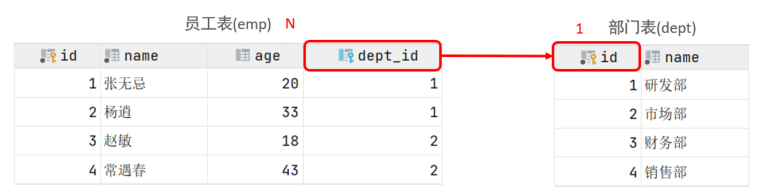
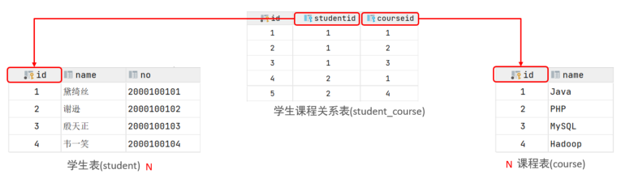
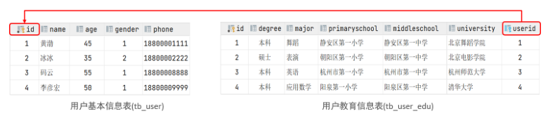
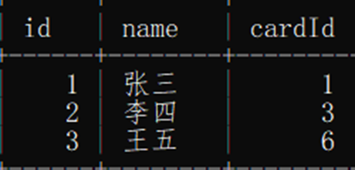
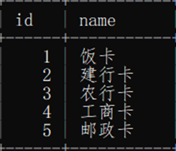
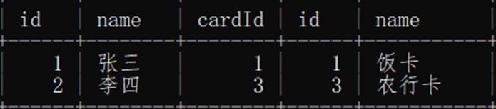
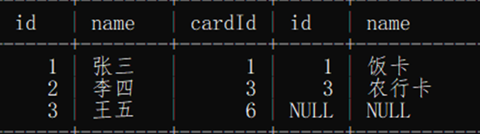
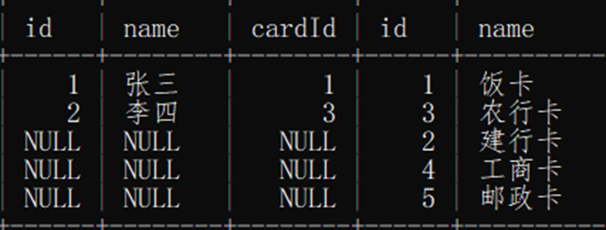
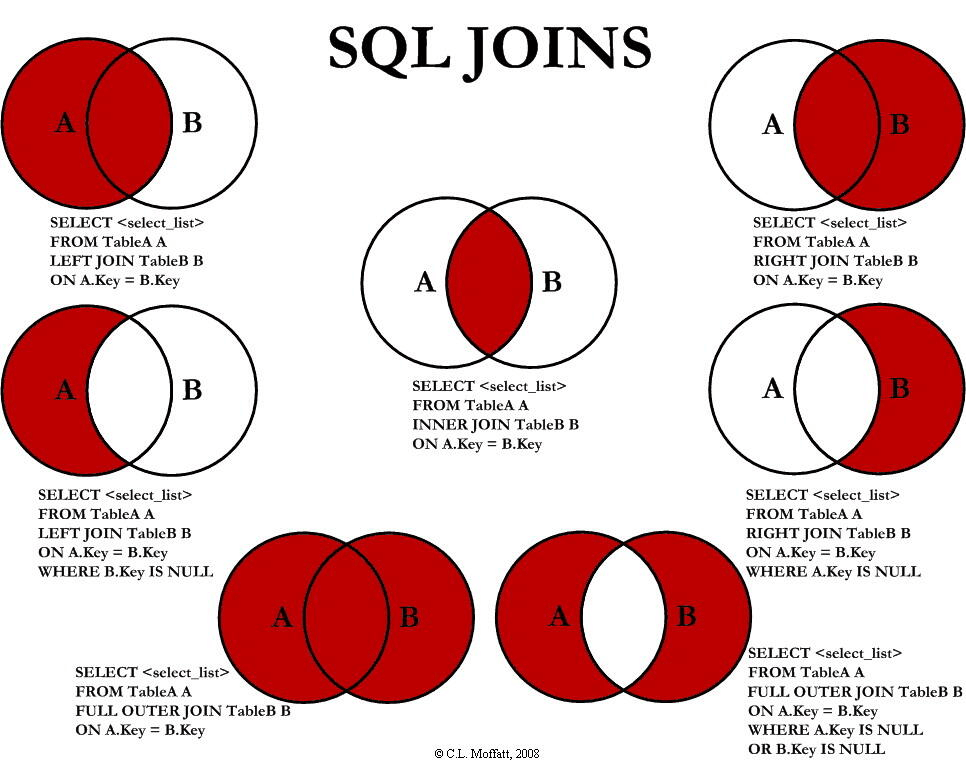

<!-- permalink: /MySQL/基础语法/多表查询  -->

##  多表关系  

###   一对多

​      案例: 部门 与 员工的关系

​      关系: 一个部门对应多个员工，一个员工对应一个部门

​      实现: 在多的一方建立外键，指向一的一方的主键

​		 

###    多对多

​		 案例: 学生 与 课程的关系

​		 关系: 一个学生可以选修多门课程，一门课程也可以供多个学生选择

​		 实现: 建立第三张中间表，中间表至少包含两个外键，分别关联两方主键

​			 

​        

   对应的SQL脚本：

```sql
create table student(
    
	id int auto_increment primary key comment '主键ID',
	name varchar(10) comment '姓名',
	no varchar(10) comment '学号'
    
) comment '学生表';
	
insert into student values (null, '黛绮丝', '2000100101'),(null, '谢逊',
                                                        
	'2000100102'),(null, '殷天正', '2000100103'),(null, '韦一笑', '2000100104');


create table course(
    
	id int auto_increment primary key comment '主键ID',
	name varchar(10) comment '课程名称'
    
) comment '课程表';

insert into course values (null, 'Java'), (null, 'PHP'), (null , 'MySQL') ,(null, 'Hadoop');


create table student_course(
    
	id int auto_increment comment '主键' primary key,
	studentid int not null comment '学生ID',
	courseid int not null comment '课程ID',
	constraint fk_courseid foreign key (courseid) references course (id),
	constraint fk_studentid foreign key (studentid) references student (id)
    
)comment '学生课程中间表';

insert into student_course values (null,1,1),(null,1,2),(null,1,3),(null,2,2),(null,2,3)，
    (null,3,4);
```


### 一对一

​    案例：用户 与 用户详情的关系

​    关系：一对一关系，多用于单表拆分，将一张表的基础字段放在一张表中，其他详情字段放在另一张表中，以提升操作效率

​     实现：在任意一方加入外键，关联另外一方的主键，并且设置外键为唯一的(unique)

​		 


## 查询分类

### 内连接    

 **查询两张表的交集部分**

 隐式内连接

```sql
select 字段列表 from 表1 , 表2 where 条件 ... ; 
```

 显式内连接

```sql
select 字段列表 from 表1 [ inner ] join 表2 on 连接条件 ... ; 
```

  例：

&nbsp;&nbsp;&nbsp;查询每一个员工的姓名 , 及关联的部门的名称 (隐式内连接实现)

&nbsp;&nbsp;&nbsp;表结构：emp , dept

&nbsp;&nbsp;&nbsp;连接条件：emp.dept_id = dept.id

```sql
select emp.name , dept.name from emp , dept where emp.dept_id = dept.id ;

-- 为每一张表起别名,简化SQL编写

-- 一旦为表起了别名，就不能再使用表名来指定对应的字段了，此时只能够使用别名来指定字段。

select e.name,d.name from emp e , dept d where e.dept_id = d.id;
```

&nbsp;&nbsp;&nbsp;查询每一个员工的姓名 , 及关联的部门的名称 (显式内连接实现)

```sql
select e.name, d.name from emp e inner join dept d on e.dept_id = d.id;

-- 为每一张表起别名,简化SQL编写
select e.name, d.name from emp e join dept d on e.dept_id = d.id;
```

​    作用：**将两个表中能够相对应的部分展示出来**

​        例：

​              

​			  

​              

   查询出用户所拥有的银行卡：

```sql
select * from person inner join card on person.cardId=card.id;
```

   结果：

​			

​         因为王五拥有的6号卡在第二张表中没有记录，所以查询结果中没有王五的信息，即，内连接查询出两张表的共同部分。


### 外连接

#### 左外连接

查询左表所有数据，以及两张表交集部分数据。

 语法：

```sql
select 字段列表 from 表1 left [ outer ] join 表2 on 条件 ... ; 
```

  **在on 条件之后还可以再跟where子句，且where后的条件最后执行。**

  作用：**以表1为准，将表2中能与表1对应的部分显示出来，没有对应的补NULL(表1的数据全部取出)**

  例：

&nbsp;&nbsp;&nbsp;以上一节中的两张表为数据表，使用左连接查询用户及用户所拥有的卡

```mysql
select * from person left join card on person.cardId=card.id;
```

&nbsp;&nbsp;&nbsp;结果：

​			

​        **王五的id和姓名能够查出(即，能够展示出左表的所有信息)，但6号卡在第二张表中没有记录，所以以null代替。**


#### 右外连接

 查询右表所有数据，以及两张表交集部分数据

 语法：

```sql
select 字段列表 from 表1 right [ outer ] join 表2 on 条件 ... ; 
```

   作用：**以表2为准,将表1中能与表2对应的部分显示出来,没有对应的补NULL(表2的数据全部取出)**

   例1

```sql
select * from person right join card on person.cardId=card.id;
```

   结果：

​			

  例2

 &nbsp;&nbsp;&nbsp;查询emp表的所有数据, 和对应的部门信息。

&nbsp;&nbsp;&nbsp;由于需求中提到，要查询emp的所有数据，所以是不能内连接查询的，需要考虑使用外连接查询。

```sql
select e.*, d.name from emp e left outer join dept d on e.dept_id = d.id;

select e.*, d.name from emp e left join dept d on e.dept_id = d.id;
```


#### 总结

&nbsp;&nbsp;&nbsp;①A inner join B：取交集

&nbsp;&nbsp;&nbsp;②A left join B：取A全部，如果B没有对应的值，则为null

&nbsp;&nbsp;&nbsp;③A right join B：取B全部，如果A没有对应的值，则为null

&nbsp;&nbsp;&nbsp;④A full outer join B：取并集，如果彼此没有对应的值为null

​		


## 自连接

### 自连接查询

  自己连接自己，也就是把一张表连接查询多次。

  对于自连接查询，可以是内连接查询，也可以是外连接查询。

  语法：	

```sql
select 字段列表 from 表A 别名A join 表A 别名B ON 条件 ... ; 
```

   例：

&nbsp;&nbsp;&nbsp;查询员工及其所属领导的名字。

```sql
select a.name,b.name from emp a,emp b where a.managerid = b.id; 

-- 在自连接查询中，必须要为表起别名，要不然不清楚所指定的条件、返回的字段，到底是哪一张表的字段。
```


### 联合查询

  对于union查询，就是把多次查询的结果合并起来，形成一个新的查询结果集。

  语法：

```sql
select 字段列表 from 表A ...

union [ ALL ]

select 字段列表 from 表B ....;
```

   注意：

&nbsp;&nbsp;&nbsp;**1.对于联合查询的多张表，表的列数和列的顺序必须保持一致，列的字段类型也必须保持一致。**

&nbsp;&nbsp;&nbsp;**2.union all 会将全部的数据直接合并在一起，union 会对合并之后的数据去重。**

&nbsp;&nbsp;&nbsp;**3.如果多条查询语句查询出来的结果，字段数量不一致，在进行union/union all联合查询时，将会报错**

&nbsp;&nbsp;&nbsp;4.union会将查询之后的行垂直放在一起，join是将查询之后行水平放在一起。

​    例：

&nbsp;&nbsp;&nbsp;将薪资低于 5000 的员工 , 和 年龄大于 50 岁的员工全部查询出来。

```sql
select * from emp where salary < 5000

union all

select * from emp where age > 50;

#union all查询出来的结果，仅仅进行简单的合并，并未去重，如果使用union，则会对结果进行去重
```

​		

## 子查询

### 概述

​	SQL语句中嵌套select语句，称为嵌套查询，又称子查询。

​    即，将一个 `select` 查询（子查询）的结果作为另一个 SQL 语句（主查询）的数据来源或者判断条件。

```sql
select * from t1 where column1 = ( select column1 from t2 ); 
```

 子查询可以嵌入 `SELECT`、`INSERT`、`UPDATE` 和 `DELETE` 语句中，也可以和 `=`、`<`、`>`、`IN`、`BETWEEN`、`EXISTS` 等运算符一起使用。

 分类：

&nbsp;&nbsp;根据子查询结果不同，分为：

&nbsp;&nbsp;&nbsp;&nbsp;&nbsp;A. 标量子查询（子查询结果为单个值）

&nbsp;&nbsp;&nbsp;&nbsp;&nbsp;B. 列子查询(子查询结果为一列)

&nbsp;&nbsp;&nbsp;&nbsp;&nbsp;C. 行子查询(子查询结果为一行)

&nbsp;&nbsp;&nbsp;&nbsp;&nbsp;D. 表子查询(子查询结果为多行多列)

&nbsp;&nbsp;根据子查询位置，分为：

&nbsp;&nbsp;&nbsp;&nbsp;&nbsp;A. where之后

&nbsp;&nbsp;&nbsp;&nbsp;&nbsp;B. from之后

&nbsp;&nbsp;&nbsp;&nbsp;&nbsp;C. select之后


### 标量子查询

 **子查询返回的结果是单个值（数字、字符串、日期等），是最简单的形式**，这种子查询称为标量子查询。

 常用的操作符：=&nbsp;&nbsp;&nbsp;&nbsp;<>&nbsp;&nbsp;&nbsp;&nbsp;>&nbsp;&nbsp;&nbsp;&nbsp;>=&nbsp;&nbsp;&nbsp;&nbsp;<&nbsp;&nbsp;&nbsp;&nbsp;<=

  例：

&nbsp;&nbsp;A. 查询 "销售部" 的所有员工信息

&nbsp;&nbsp;&nbsp;&nbsp;完成这个需求时，我们可以将需求分解为两步：

&nbsp;&nbsp;&nbsp;&nbsp;①查询 "销售部" 部门ID

```sql
select id from dept where name = '销售部'; 
```

&nbsp;&nbsp;&nbsp;&nbsp;②根据 "销售部" 部门ID, 查询员工信息

```sql
select * from emp where dept_id = (select id from dept where name = '销售部');
```

&nbsp;&nbsp;B.查询在 "方东白" 入职之后的员工信息

&nbsp;&nbsp;&nbsp;&nbsp;①查询 方东白 的入职日期

```sql
select entrydate from emp where name = '方东白'; 
```

&nbsp;&nbsp;&nbsp;&nbsp;②查询指定入职日期之后入职的员工信息

```sql
select * from emp where entrydate > (select entrydate from emp where name = '方东白');
```


### 列子查询

 **子查询返回的结果是一列（可以是多行）**，这种子查询称为列子查询。

 常用的操作符：in、not in、 any、some、all

| 操作符                                                   | 描述                                   |
| :------------------------------------------------------- | :------------------------------------- |
| in&nbsp;&nbsp;&nbsp;&nbsp;&nbsp;&nbsp;&nbsp;&nbsp;&nbsp; | 在指定的集合范围内，多选一             |
| not in                                                   | 不在指定的集合范围内                   |
| any                                                      | 子查询返回列表中，有任意一个满足即可   |
| some                                                     | 与any等同，使用some的地方都可以使用any |
| all                                                      | 子查询返回列表的所有值都必须满足       |

 例：

&nbsp;&nbsp;A. 查询 "销售部" 和 "市场部" 的所有员工信息-----使用in操作符

&nbsp;&nbsp;&nbsp;&nbsp;①查询 "销售部" 和 "市场部" 的部门ID

```sql
select id from dept where name = '销售部' or name = '市场部'; 
```

&nbsp;&nbsp;&nbsp;&nbsp;②根据部门ID, 查询员工信息

```sql
select * from emp where dept_id in (select id from dept where name = '销售部' or  name = '市场部');
```


&nbsp;&nbsp;B. 查询比 财务部 所有人工资都高的员工信息-----使用all操作符

&nbsp;&nbsp;&nbsp;&nbsp;①查询所有 财务部 人员工资

```sql
-- 查询财务部门的id
select id from dept where name = '财务部';   

-- 查询财务部分所有人员的工资  子查询的返回结果是单个值，是标量子查询，使用 = 操作符
select salary from emp where dept_id = (select id from dept where name = '财务部');
```

&nbsp;&nbsp;&nbsp;&nbsp;②查询比 财务部 所有人工资都高的员工信息

```sql
select * from emp where salary > all ( select salary from emp where dept_id =
                                      
										(select id from dept where name = '财务部'));
```


&nbsp;&nbsp;C. 查询比研发部其中任意一人工资高的员工信息-----使用any操作符

&nbsp;&nbsp;&nbsp;&nbsp;①查询研发部所有人工资

```sql
select salary from emp where dept_id = (select id from dept where name = '研发部'); 
```

&nbsp;&nbsp;&nbsp;&nbsp;②比研发部其中任意一人工资高的员工信息

```sql
select * from emp where salary > any ( select salary from emp where dept_id =

                                      (select id from dept where name = '研发部'));
```


### 行子查询

  **查询返回的结果是一行(可以是多列)，** 这种子查询称为行子查询。

  常用的操作符：= 、<> 、in、not in

   例：

&nbsp;&nbsp;A. 查询与 "张无忌" 的薪资及直属领导相同的员工信息 ;

&nbsp;&nbsp;&nbsp;&nbsp;①查询 "张无忌" 的薪资及直属领导

```sql
select salary, managerid from emp where name = '张无忌'; 
```

&nbsp;&nbsp;&nbsp;&nbsp;②查询与 "张无忌" 的薪资及直属领导相同的员工信息 ;

```sql
select * from emp where (salary,managerid) = (select salary, managerid from emp 
                                              
                                               where name = '张无忌');
```


### 表子查询

​    **查询返回的结果是多行多列**，这种子查询称为表子查询。

​    常用的操作符：in

​	例：

&nbsp;&nbsp;A. 查询与 "鹿杖客" , "宋远桥" 的职位和薪资相同的员工信息

&nbsp;&nbsp;&nbsp;&nbsp;①查询 "鹿杖客" , "宋远桥" 的职位和薪资

```sql
select job, salary from emp where name = '鹿杖客' or name = '宋远桥'; 
```

&nbsp;&nbsp;&nbsp;&nbsp;②查询与 "鹿杖客" , "宋远桥" 的职位和薪资相同的员工信息

```sql
-- 子查询的返回结果为两组值，两行两列。所以，where之后的job和salary分别等于这两组值
select * from emp where (job,salary) in ( select job, salary from emp where name =

                                         '鹿杖客' or name = '宋远桥' );
```


&nbsp;&nbsp;B. 查询入职日期是 "2006-01-01" 之后的员工信息 , 及其部门信息

&nbsp;&nbsp;&nbsp;&nbsp;①查询入职日期是 "2006-01-01" 之后的员工信息

```sql
select * from emp where entrydate > '2006-01-01'; 
```

&nbsp;&nbsp;&nbsp;&nbsp;②查询这部分员工, 对应的部门信息;

```sql
-- 可以将子查询的返回结果看做一张表，给表起个别名为e，e.*即为入职日期在06年之后的员工的信息

select e.*, d.* from (select * from emp where entrydate > '2006-01-01') e left

			join dept d on e.dept_id = d.id ;
```


## 


