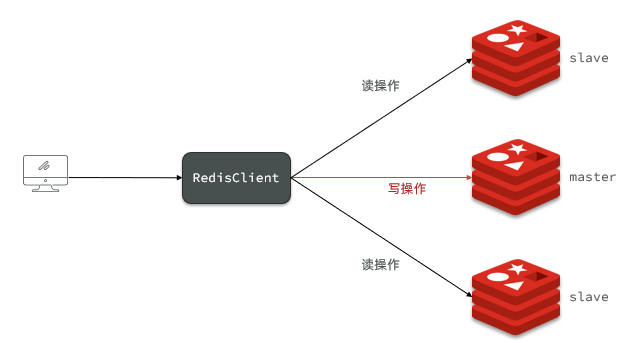
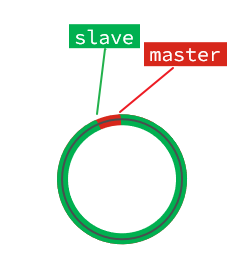
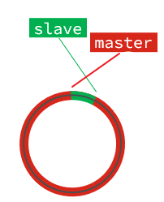

## 主从复制

### 简介

  为了避免单点Redis服务器故障，准备多台服务器，互相连通。

  **将数据复制多个副本保存在不同的服务器上，连接在一起，并保证数据是同步的。**

  即使有其中一台服务器宕机，其他服务器依然可以继续提供服务，实现Redis的高可用，同时实现数据冗余备份。 

​    

#### **主从复制**

   **定义**：主机数据更新后根据配置和策略， 自动同步到备机的master/slaver机制，Master以写为主，Slave以读为主

   **特征**：一个master可以拥有多个slave，一个slave只对应一个master

   **职责**： 

​     &ensp;&ensp;master：1.写数据  &ensp;&ensp;2.执行写操作时，将出现变化的数据自动同步到slave &ensp;&ensp; 3.读数据（可忽略） 

​     &ensp;&ensp;slave：1.读数据  &ensp;&ensp; 2.写数据（禁止） 

   **作用**:

​       &ensp;&ensp;1.**读写分离**：master写、slave读，提高服务器的读写负载能力

​       &ensp;&ensp;2.**负载均衡**：基于主从结构，配合读写分离，由slave分担master负载，并根据需求的变化，改变slave的数量，

​             &ensp;&ensp;&ensp;&ensp;通过多个从节点分担数据读取负载，大大提高Redis服务器并发量与数据器吞吐量。

​       &ensp;&ensp;3.**故障恢复**：当master出现问题时，由slave提供服务，实现快速的故障恢复

​       &ensp;&ensp;4.**数据冗余**：实现数据热备份，是持久化之外的一种数据冗余方式

​       &ensp;&ensp;5.**高可用基石**：基于主从复制，构建哨兵模式与集群，实现Redis的高可用方案

### 搭建

  1.将原有的配置文件拷贝到/myredis中，并进行修改

​       &ensp;&ensp;daemonize  yes

​       &ensp;&ensp;appendonly   no

  2.新建三个配置文件：redis6379.conf、redis6380.conf、redis6381.conf，写入以下内容：

​       &ensp;&ensp;include /myredis/redis.conf           &ensp;&ensp;&ensp;#引入myredis目录下的redis.conf作为共有部分

​       &ensp;&ensp;pidfile /var/run/redis_6379.pid      &ensp;&ensp;&ensp;#配置pid文件的名称

​       &ensp;&ensp;port 6379                               &ensp;&ensp;&ensp;#配置端口号

​       &ensp;&ensp;dbfilename dump6379.rdb       &ensp;&ensp;&ensp;#配置.rdb文件的名称      

  3.启动三台redis服务器

​      &ensp;&ensp;redis-server  redis6379.conf

  4.通过 redis-cli  -p  端口号 可连接上指定端口号的redis

​      &ensp;&ensp;redis-cli  -p  6379

  5.设置主机和从机，配从不配主（在5.0以后新增命令replicaof，与salveof效果一致）

​     &ensp;&ensp;slaveof  ip地址  端口号       

​     &ensp;&ensp;设置该服务器为哪个机器的从机，如果在命令行执行，则从机重启后需要重新设置，写入配置文件中，可永久生效

  6.查看主机和从机的相关信息

​      &ensp;&ensp;info  replication				

​	  								     

 **特点**：

​    1.从机重启后，会复制主机中的所有数据。

​     &ensp;&ensp;所以，在从机宕机的时候，如果主机中写入了新的数据，则当从机重启后，依然能看到主机中的所有数据。

​    2.主机宕机后，从机不会有任何变化，当主机重启后，一切如初。

 **薪火相传**：

  &ensp;&ensp;上一个 slave 可以是下一个 slave 的 master，slave 同样可以接收其他 slave的连接和同步请求，那么该 slave 成为了

&ensp;&ensp;链条中下一个的 master，可以有效减轻 master 的写压力，去中心化降低风险。

 &ensp;&ensp;例，原本6379是主机，6380和6381是从机，可以在6380中执行 slaveof 命令，将6380变为6381的从机，

   &ensp;&ensp;&ensp;&ensp;&ensp;&ensp;此时，查看6380的信息就会看到，其主机变成了6381，6381的主机依然是6379，而6379的从机只有6381了。

  &ensp;&ensp;但，如果中途变更转向，会清除之前的数据，重新建立拷贝最新的。

​     &ensp;&ensp;&ensp;&ensp;&ensp;&ensp;当某个 slave宕机后，后面的slave都没法备份。

 **反客为主：**

​    &ensp;&ensp;当一个master宕机后，后面的slave可以立刻升级为master，其后面的slave不用做任何修改。

​    &ensp;&ensp;当主机挂掉后，在从机执行命令 slaveof  no  one ，就可以将从机变为主机。

### 数据同步原理

#### **全量同步**

   主从第一次建立连接时，会执行**全量同步**，将master节点的所有数据都拷贝给slave节点，流程：

​	

​	master如何得知salve是第一次来连接呢？

​	有几个概念，可以作为判断依据：

- **Replication Id**：简称replid，是数据集的标记，id一致则说明是同一数据集。

  ​						   每一个master都有唯一的replid，slave则会继承master节点的replid

- **offset**：偏移量，随着记录在repl_baklog中的数据增多而逐渐增大。slave完成同步时也会记录当前同步的offset。

  ​			  如果slave的offset小于master的offset，说明slave数据落后于master，需要更新。

  **因此slave做数据同步，必须向master声明自己的replication id 和offset，master才可以判断到底需要同步哪些数据。**

  因为slave没有变成slave之前也是一个master，有自己的replid和offset，当第一次变成slave，与master建立连接时，发送的replid和offset是自己的replid和offset。master判断发现slave发送来的replid与自己的不一致，说明这是一个全新的slave，就知道要做全量同步了。

  **master会将自己的replid和offset都发送给这个slave，slave保存这些信息。以后slave的replid就与master一致了。**

  因此，**master判断一个节点是否是第一次同步的依据，就是看replid是否一致**。

​	

 全量同步完整流程描述：

- slave节点请求增量同步
- master节点判断replid，如果发现不一致，拒绝增量同步
- master将完整内存数据生成RDB，发送RDB到slave
- slave清空本地数据，加载master的RDB
- **master将在生成RDB期间的命令记录在repl_baklog，并持续将log中的命令发送给slave**
- **slave执行接收到的命令，保持与master之间的同步**

#### **增量同步**

  **只更新slave与master存在差异的部分数据。**

  全量同步需要先做RDB，然后将RDB文件通过网络传输给slave，成本很高。因此除了第一次做全量同步，其它大多数时候

​     slave与master都是做**增量同步**。

​	

##### **repl_backlog原理：**

  **master通过全量同步时的repl_baklog文件知道slave与自己的数据差异在哪里。**

  该文件是一个固定大小的环形的数组，也就是说**角标到达数组末尾后，会再次从0开始读写**，这样数组头部的数据就会被覆盖。

  **repl_baklog中会记录Redis处理过的命令日志及offset，包括master当前的offset，和slave已经拷贝到的offset：**

​	

​	slave与master的offset之间的差异，就是salve需要增量拷贝的数据了。

​	随着不断有数据写入，master的offset逐渐变大，slave也不断的拷贝，追赶master的offset：

​		

​	直到数组被填满：

​     

此时，如果有新的数据写入，就会覆盖数组中的旧数据。不过，旧的数据只要是绿色的，说明是已经被同步到slave的数据，即便被覆盖了也没什么影响。因为未同步的仅仅是红色部分。

​    但是，如果slave出现网络阻塞，导致master的offset远远超过了slave的offset： 

​		

​	如果master继续写入新数据，其offset就会覆盖旧的数据，直到将slave现在的offset也覆盖。

​    **repl_backlog的大小有上限，写满后会覆盖最早的数据。如果slave断开时间过久，导致尚未备份的数据被覆盖，则无法基于log做增量同步，只能再次做全量同步。**

### 小结

**全量同步和增量同步区别**

- 全量同步：master将完整内存数据生成RDB，发送RDB到slave。后续命令则记录在repl_backlog，逐个发送给slave。

  

- 增量同步：slave提交自己的offset到master，master获取repl_backlog中从offset之后的命令给slave

**什么时候执行全量同步**

- slave节点第一次连接master节点时

  

- slave节点断开时间太久，repl_baklog中的offset已经被覆盖时

**什么时候执行增量同步**

- slave节点断开又恢复，并且在repl_baklog中能找到offset时

### 

