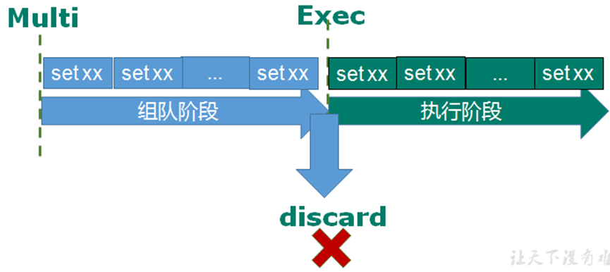
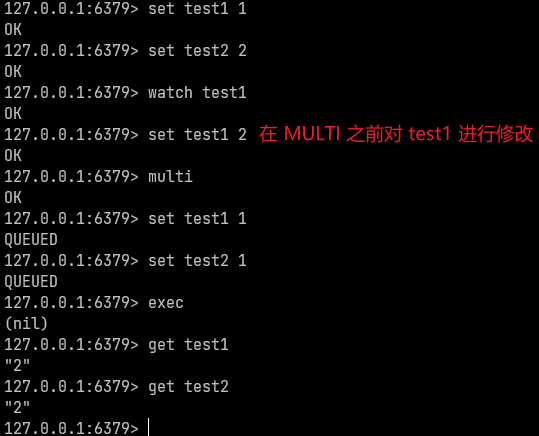
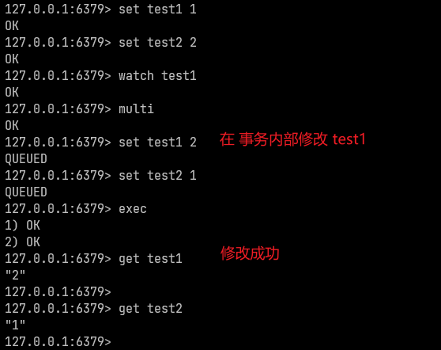
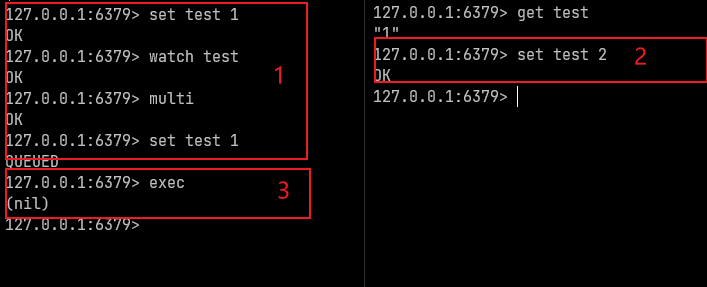

## 事务

### 概念

1. Redis事务是一个单独的隔离操作：事务中的所有命令都会序列化、按顺序地执行。

   事务在执行的过程中，不会被其他客户端发送来的命令请求所打断。

2. redis事务就是一个 命令执行的队列，将一系列预定义命令包装成一个整体（一个队列）。

   当执行时，一次性按照添加命令的顺序依次执行，中间不会被打断或者干扰。 

   即，**一个队列中，一次性、顺序性、排他性的执行一系列命令**。

3. **Redis事务的主要作用就是串联多个命令防止别的命令插队。**

### 操作

 **multi**                       

​    &ensp;设定事务的开始位置，执行该指令后，后续的所有指令都加入到事务中，直到执行exec指令。

&ensp;&ensp;加入事务的命令只是暂时进入到任务队列中，并没有立即执行，只有遇到exec指令时才开始执行，

&ensp;&ensp;执行完毕后返回每条指令的执行结果。

**exec**                        

  &ensp;&ensp;设定事务的结束位置，同时开始执行上面提交的事务。与multi成对出现，成对使用。

**discard**                    

  &ensp;&ensp;终止当前事务的定义，发生在multi之后，exec之前。

### 命令特性

1. 从输入Multi指令开始，输入的命令都会依次进入到命令队列中，但不会执行，直到输入Exec后，Redis才会将之前

   命令队列中的命令依次执行。进入队列的过程中可以通过使用discard指令来放弃组队。  						    

​             

2. 在定义事务的过程中，如果所输入的命令存在格式错误(例如：set 命令只有一个参数），则整个事务中的所有命令

   都不会执行，包括正确的命令也不会执行。

3. 如果定义事务的过程中，命令格式正确，但无法正确的执行(例：对list进行incr操作)，则能够正确运行的命令会执行，

   无法执行的命令不会被执行。且已经执行完的命令不会对数据进行自动回滚，需要程序员自己在代码中实现回滚。 

4. **如果在创建事务的过程中，试图在事务中修改的变量在另一个终端被修改了，则另一个终端的操作是有效的。**

## 锁

### 悲观锁

   悲观锁(Pessimistic Lock)，顾名思义，就是很悲观，每次去拿数据的时候都认为别人会修改，所以每次在拿数据的时候

都会上锁，这样别人想拿这个数据就会被block直到它拿到锁。

   传统的关系型数据库里边就用到了很多这种锁机制，比如行锁，表锁等，读锁，写锁等，都是在做操作之前先上锁。

### 乐观锁

   乐观锁(Optimistic Lock)，每次去拿数据的时候都认为别人不会修改，所以不会上锁，但是在更新的时候会判断一下

   在此期间别人有没有去更新这个数据，可以使用版本号等机制。

   乐观锁**适用于多读的应用类型**，这样可以提高吞吐量。Redis就是利用这种check-and-set机制实现事务的。

### 监视锁

 watch  key1  [key2...]

​    在执行multi之前，先执行watch key1 [key2]，可以监视一个(或多个) key ，如果在事务执行之前所监视的key被其他命令

​    所改动，那么事务将会被打断。

​    即，**对 key添加监视锁，如果执行exec之前或事务执行之前key发生了变化，则终止事务的执行。**

​        **没开始的就不要开始了，正在进行的立刻停止**。

​    使用unwatch可以取消对所有key的监视，如果在执行 watch 命令后，exec 或discard 命令先被执行了的话，就不需要

&ensp;&ensp;再执行unwatch了。

  **watch命令的不同使用：**

  1.同一个session中，如果watch监视的key在multi之前被修改，那么该事务不会执行。

​	     

2. 同一个session中，如果watch监视的key在事务内部被修改，则事务可以执行。

    

3. 同一个session中，watch监视的key在事务内部被修改，但是在事务提交之前被其他 session 修改，则事务失败。

   ​	

 **结论：**

  &ensp;&ensp;WATCH 操作只是 session 级别的，不会影响其他 session，在同一个 session 中，对于同一个 Key ，在事务执行之前

  &ensp;&ensp;最多只能加一个 WATCH，**WATCH监视的 Key 在事务内部被修改，无论这个事务是否执行成功，这个Key 上的WATCH** 

   &ensp;&ensp;**都会失效。** 

### 事务的三特性

1. 单独的隔离操作 

​    &ensp;&ensp;事务中的所有命令都会序列化、按顺序地执行。事务在执行的过程中，不会被其他客户端发送来的命令请求所打断。

2. 没有隔离级别的概念 

​	&ensp;&ensp;队列中的命令没有提交之前都不会实际被执行，因为事务提交前任何指令都不会被实际执行。

3. 不保证原子性 

​    &ensp;&ensp;事务中如果有一条命令执行失败，其后的命令仍然会被执行，没有回滚。

### 解决事务缺陷

   Redis 从 2.6 版本开始支持执行 Lua 脚本，它的功能和事务非常类似。

   可以利用 Lua 脚本批量执行多条 Redis 命令，这些 Redis 命令会被提交到 Redis 服务器一次性执行完成，减小了网络开销

   一段 Lua 脚本可以视作一条命令执行，一段 Lua 脚本执行过程中不会有其他脚本或 Redis 命令同时执行，保证了操作不会被其他指令插入或打扰。    

   不过，如果 Lua 脚本运行时出错并中途结束，出错之后的命令是不会被执行的。并且，出错之前执行的命令是无法被撤销的，无法实现类似关系型数据库执行失败可以回滚的那种原子性效果。

   因此，严格来说的话，**通过 Lua 脚本来批量执行 Redis 命令实际也是不完全满足原子性的**。

​      **如果想要让 Lua 脚本中的命令全部执行，必须保证语句语法和命令都是对的。**

