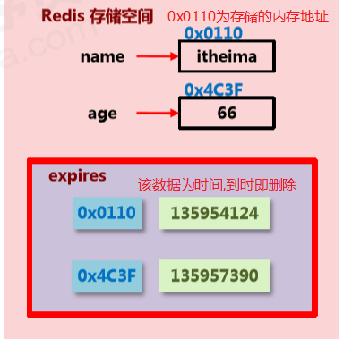
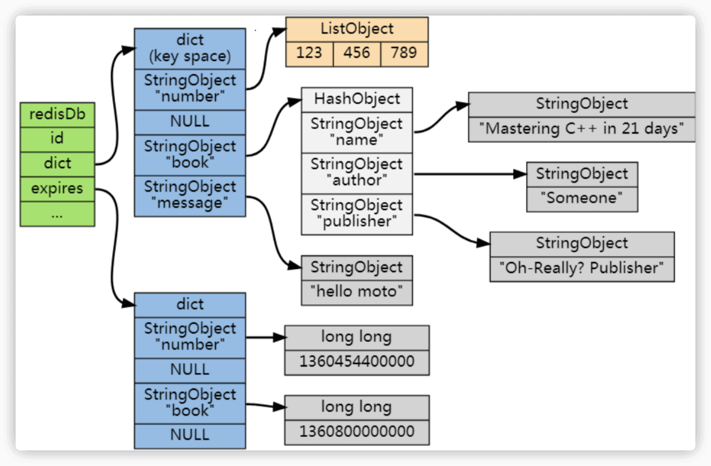

## 删除策略

### 概述

Redis是一种内存级数据库，所有数据均存放在内存中，**内存中的数据可以通过TTL命令获取其状态**。

 TTL命令返回值： 

​      &ensp;-1：代表永久有效的数据

​      &ensp;-2：已经过期的数据 或 被删除的数据 或 未定义的数据

​     &ensp;一个具体的时间：具有时效性的数据

 **过期的数据并不会立即删除，而是根据设置的策略执行。**

​	      

### 如何判断数据是否过期

  Redis 通过一个叫做过期字典(可以看作是 hash 表)的东西来保存数据过期的时间。

  过期字典的键指向 Redis 数据库中的某个 key(键)，过期字典的值是一个 long long 类型的整数，这个整数保存了 key 所指向的数据库键的过期时间(毫秒精度的 UNIX 时间戳)。

​		

​	  过期字典是存储在 redisDb 这个结构里的：

```c
typedef struct redisDb {
    ...

    dict *dict;       //数据库键空间，保存着数据库中所有键值对
    
    dict *expires;   // 过期字典，保存着键的过期时间      
    
    ...

} redisDb;
```


### 数据删除策略

####    **1.定时删除**

​    (1)创建一个定时器，当key设置有过期时间，且过期时间到达时，由定时器任务立即执行对键的删除操作

​    (2)优点：节约内存，到时就删除，快速释放掉不必要的内存占用

​    (3)缺点：CPU压力很大，无论CPU此时负载量多高，均占用CPU，会影响redis服务器响应时间和指令吞吐量

​    (4)总结：**用处理器性能换取存储空间(用时间换空间)** 

####    **2.惰性删除**

​    (1)数据到达过期时间，不做处理。等到下次访问该数据时：

​       &ensp;&ensp;&ensp;如果未过期，返回数据 

​      &ensp;&ensp;&ensp;发现已过期，删除记录，并返回不存在 

​    (2)优点：节约CPU性能，发现必须删除的时候才删除 

​    (3)缺点：内存压力很大，出现长期占用内存的数据

​    (4)总结：**用存储空间换取处理器性能 (用空间换时间)**

####   **3.定期删除**

​     (1)Redis启动服务器初始化时，读取配置server.hz的值，默认为10 

​     (2)每秒钟执行server.hz次serverCron()  ---->databaseCron( ) --->activeExpireCycle( )

​     (3)activeExpireCycle函数对每个`expires[*]`逐一检测，每次执行250ms/server.hz。`expires[*]`代表任意一个数据库。

​     (4)对某个数据库进行检测时，随机挑选W个key检测 

​       &ensp;&ensp;如果key超时，删除key 

​       &ensp;&ensp;如果一轮中删除的key的数量>W*25%，循环该过程 

​       &ensp;&ensp;如果一轮中删除的key的数量≤W*25%，检查下一个`expires[*]`，从0-15循环 

​          &ensp;&ensp;&ensp;&ensp;W取值=ACTIVE_EXPIRE_CYCLE_LOOKUPS_PER_LOOP属性值 

​     (5)参数current_db用于记录activeExpireCycle函数进入哪个数据库执行 

​     (6)如果activeExpireCycle函数执行时间到期，下次从current_db开始继续向下执行 

 特点:

1. **周期性轮询redis库中的时效性数据，采用随机抽取的策略，利用过期数据占比的方式控制删除频度** 

2. CPU性能占用设置有峰值，检测频度可自定义设置 

3. 内存压力不是很大，长期占用内存的冷数据会被持续清理 

4. 总结：**周期性抽查存储空间(随机抽查，重点抽查)** 

### 删除策略对比

1. 定时删除     &ensp;&ensp;节约内存，无占用       &ensp;&ensp;&ensp;不分时段占用CPU资源，频度高        &ensp;&ensp;&ensp;&ensp;&ensp;拿时间换空间  

2. 惰性删除     &ensp;&ensp;内存占用严重      &ensp;&ensp;&ensp; &ensp;&ensp;&ensp;&ensp;延时执行，CPU利用率高  &ensp;&ensp;&ensp;&ensp;&ensp;&ensp;&ensp;&ensp;&ensp;&ensp;&ensp;拿空间换时间

3. 定期删除     &ensp;&ensp;内存定期随机清理       &ensp;&ensp;&ensp;每秒花费固定的CPU资源维护内存      &ensp;&ensp;&ensp;&ensp;随机抽查，重点抽查  

### 逐出算法  

####   **定义**     

   当新数据进入redis时，如果内存不足怎么办

1. Redis使用内存存储数据，在执行每一个命令前，会调用 freeMemoryIfNeeded()检测内存是否充足。

   如果内存不满足新加入数据的最低存储要求，redis要临时删除一些数据为当前数据留出存储空间。

   **清理数据的策略称为逐出算法或淘汰策略。** 

2. 逐出数据的过程不是100%能够清理出足够的可使用的内存空间，如果不成功则反复执行。

   当对所有数据尝试完毕后，仍然不能达到内存清理的要求，将出现错误信息。 

####   **相关配置**

1. maxmemory               

​     &ensp;&ensp;最大可使用内存，即占用物理内存的比例，默认为0，表示不限制。根据需求设定，通常设置在50%以上。

2. maxmemory-samples

​    &ensp;&ensp;每次选取待删除的数据的个数

​    &ensp;&ensp;选取数据时并不会全库扫描，这样将导致严重的性能消耗，降低读写性能。

​    &ensp;&ensp;因此采用随机获取数据的方式选出待检测删除数据 

3. maxmemory-policy

   &ensp;&ensp;达到最大内存后，对被挑选出来的数据进行删除的策略

####   **驱逐策略**      

1. 检测易失数据（已设置过期时间的数据集--server.db[i].expires ）

​    &ensp;&ensp;volatile-lru：挑选最后一次使用时间距现在较早的数据淘汰(长时间没有用过的数据) &ensp;&ensp;LRU:least recently used

​     &ensp;&ensp;volatile-lfu：挑选最近使用次数最少的数据淘汰(规定时间内使用次数最少)       &ensp;&ensp;LFU:least frequently used

​      &ensp;&ensp;volatile-ttl：挑选将要过期的数据淘汰

​     &ensp;&ensp;volatile-random：任意选择数据淘汰

2. 检测全库数据 (所有数据集--server.db[i].dict)

​    &ensp;&ensp;allkeys-lru：挑选最近最少使用的数据淘汰 

​    &ensp;&ensp;allkeys-lfu：挑选最近使用次数最少的数据淘汰

​     &ensp;&ensp;allkeys-random：任意选择数据淘汰

3. 放弃数据驱逐

​     &ensp;&ensp;no-enviction：禁止驱逐数据(4.0中默认策略)，当内存不足以容纳新数据时会引发错误OOM(out of memory)  


​       


​       
