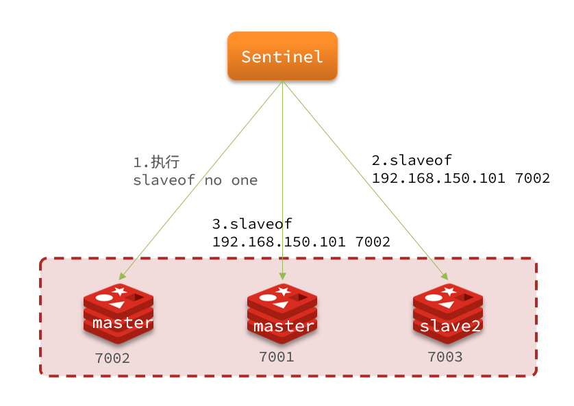

## 哨兵模式

### 作用

   **哨兵(Sentinel)机制用来实现主从集群的自动故障恢复。**

   **反客为主的自动版，能够在后台监控主机是否故障，如果故障了根据投票数自动将从库转换为主库。**

​		

 **作用**：

- **监控**：Sentinel 会不断检查master和slave是否按预期工作。

  

- **自动故障恢复**：如果master故障，Sentinel会将一个slave提升为master。即使故障实例恢复，也以新的master为主。

- **通知**：Sentinel充当Redis客户端的服务发现来源，当集群发生故障转移时，会将最新信息推送给Redis的客户端。


### 监控原理

Sentinel基于心跳机制监测服务状态，每隔1秒向集群的每个实例发送ping命令：

- 主观下线：如果某sentinel节点发现某实例未在规定时间响应，则认为该实例**主观下线**。

- 客观下线：若超过指定数量(quorum)的sentinel都认为该实例主观下线，则该实例**客观下线**。

​              &ensp;&ensp;&ensp;quorum值最好超过Sentinel实例数量的一半。

​	

### 恢复原理

  一旦发现master故障，sentinel需要在salve中选择一个成为新的master，选择依据是这样的：

- 首先会**判断slave节点与master节点断开时间长短**，如果超过指定值(down-after-milliseconds * 10)则会排除该slave节点

  

- 然后**判断slave节点的slave-priority值**，越小优先级越高，如果是0，则永不参与选举

- 如果slave-prority一样，则**判断slave节点的offset值**，越大说明数据越新，即，同步的master的数据越多，优先级越高

- 最后是**判断slave节点的运行id大小**，越小优先级越高。

 当选出一个新的master后，该如何实现切换呢？

 **切换流程如下：**

- sentinel给备选的slave1节点发送slaveof no one命令，让该节点成为master

- sentinel给所有其它slave发送slaveof 192.168.150.101 7002 命令，让这些slave成为新master的从节点，开始从新master上同步数据。

- 最后，sentinel将故障节点标记为slave，当故障节点恢复后会自动成为新的master的slave节点。

​	  

### 搭建

​    设置主机的端口号为7001，三个从机的端口号为27001、27002、27003

​     1.创建 sentinel.conf 文件(文件名不能更改)

​        &ensp;&ensp;/opt/etc/sentinel.con

​     2.配置哨兵

```ini
port 27001
sentinel announce-ip 192.168.150.101
sentinel monitor mymaster 192.168.150.101 7001 2
sentinel down-after-milliseconds mymaster 5000
sentinel failover-timeout mymaster 60000
dir "/tmp/s1"
```

​	 port 27001：&ensp;&ensp;当前sentinel实例的端口

​     sentinel  monitor  mymaster  ip地址  端口号   1

​           &ensp;&ensp;mymaster：监控对象(主节点)的服务器名称，自定义，任意写

​           &ensp;&ensp;ip地址：监控对象的IP地址

​           &ensp;&ensp;1：至少要有多少个哨兵同意迁移

​      3.启动哨兵

​           &ensp;&ensp;redis-sentinel  /opt/etc/sentinel.conf 

​      4.令master节点宕机，查看sentinel日志

​         

 **主机挂掉，会根据选举规则在从机中选出新的主机。原主机重启后会变成从机。**

 选举的规则：

​     1.根据配置文件中设置的优先级别

​         &ensp;&ensp;replica-priority 10    设置从机的优先级，值越小，优先级越高，用于选举主机时使用。默认100

​     2.根据偏移量，优先选择偏移量大的。偏移量说明了获得原主机数据的多少。

​     3.根据 runid，优先选择最小的。每个redis实例启动后都会随机生成一个40位的runid。


 选举的过程：

​     


