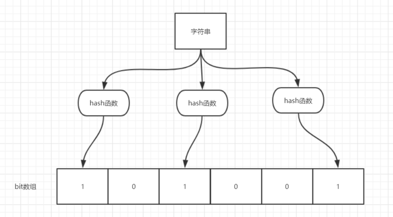

## Redis应用问题

### 缓存穿透

#### **描述**

   **大量请求的key不存在于缓存中，也不存在于数据库中**，如果key对应的数据在redis中并不存在，那么每次针对这个key的

   请求都会去访问数据库，如果这样的请求过多，则可能会压垮数据库，黑客可能会利用这个特点进行攻击数据库。

   **现象**：

​      &ensp;1.数据库访问压力突然变大了

​      &ensp;2.redis命中率降低

​      &ensp;3.一直查询数据库

​      &ensp;4.出现很多非正常url访问

#### **解决**

   由于缓存是不命中时被动写的，并且出于容错考虑，如果从存储层查不到数据则不写入缓存，

   这将导致这个不存在的数据每次请求都要到存储层去查询，失去了缓存的意义。

1. **对空值缓存**：如果一个查询返回的数据为空(不管是数据是否不存在)，仍然把这个空结果(null)进行缓存，

   设置空结果的过期时间会很短，最长不超过五分钟。

2. **设置可访问的名单(白名单)**：使用bitmaps类型定义一个可以访问的名单，名单id作为bitmaps的偏移量，

   每次访问和bitmap里面的id进行比较，如果访问id不在bitmaps里面，进行拦截，不允许访问。

3. **采用布隆过滤器**：布隆过滤器可以用于检索一个元素是否在一个集合中。

   它的优点是空间效率和查询时间都远远超过一般的算法，缺点是有一定的误识别率和删除困难。

   将所有可能存在的数据哈希到一个足够大的bitmaps中，一个一定不存在的数据会被 这个bitmaps拦截掉，

   从而避免了对底层存储系统的查询压力。

   布隆过滤器（Bloom Filter）是1970年由布隆提出的。它实际上是一个很长的二进制向量(位图)和一系列随机映射函数(哈希函数)。

4. **进行实时监控**：当发现Redis的命中率开始急速降低，需要排查访问对象和访问的数据，和运维人员配合，可以设置黑名单限制服务。                             

### 缓存击穿

#### **描述**

   **请求的key对应的是热点数据，该数据存在于数据库中，但在redis中已经过期**，此时若有大量并发请求过来，

   这些请求发现缓存过期一般都会从后端DB加载数据并回设到缓存，这个时候大并发的请求可能会瞬间把后端DB压垮。

   例：秒杀进行过程中，缓存中的某个秒杀商品的数据突然过期，这就导致瞬时大量对该商品的请求直接落到数据库上，对数据库造成了巨大的压力。

​    现象：

​         &ensp;1.数据库访问压力瞬时增加

​         &ensp;2.redis里面没有出现大量过期的key

​         &ensp;3.redis正常运行

#### **解决方案**

   key可能会在某些时间点被超高并发的访问，是一种非常“热点”的数据。这个时候，需要就考虑缓存被“击穿”的问题。

   解决问题：

   （1）**预先设置热门数据**：在redis高峰访问之前，把一些热门数据提前存入到redis里面，加大这些热门数据key的时长。

   （2）**实时调整**：现场监控哪些数据热门，实时调整key的过期时长。

   （3）**使用互斥锁**，保证只有一个请求会落到数据库上，减小数据库的压力：

​     &ensp;（1）就是在缓存失效的时候(判断拿出来的值为空)，不是立即去load db。

​     &ensp;（2）先使用缓存工具的某些带成功操作返回值的操作(比如Redis的SETNX)去set一个mutex key

​     &ensp;（3）当操作返回成功时，再进行load db的操作，并回设缓存，最后删除mutex key；

​     &ensp;（4）当操作返回失败，证明有线程在load db，当前线程睡眠一段时间再重试整个get缓存的方法。


### 缓存雪崩

#### **描述**

   **缓存在同一时间大面积的失效，导致大量的请求都直接落到了数据库上，对数据库造成了巨大的压力**。

   缓存雪崩与缓存击穿的区别在于缓存雪崩针对很多key缓存，而缓存击穿则是某一个key过期。

####  **解决**

​    （1)构建多级缓存架构：nginx缓存 + redis缓存 +其他缓存（ehcache等）

​    &ensp;(2)使用锁或队列：

​         &ensp;&ensp;&ensp;用加锁或者队列的方式保证来保证不会有大量的线程对数据库一次性进行读写，从而避免失效时大量的并发请求

​     &ensp;&ensp;&ensp;落到底层存储系统上。不适用高并发情况。

​    &ensp;(3)设置过期标志更新缓存：

​       &ensp;&ensp;&ensp;记录缓存数据是否过期（设置提前量），如果过期会触发通知另外的线程在后台去更新实际key的缓存。

   &ensp;&ensp;(4)将缓存失效时间分散开：

​       &ensp;&ensp;&ensp;&ensp;比如可以在原有的失效时间基础上增加一个随机值，比如1-5分钟随机，这样每一个缓存的过期时间的重复率

&ensp;&ensp;&ensp;&ensp;&ensp;就会降低，就很难引发集体失效的事件。


### 布隆过滤器

#### **简介**

​	一个名叫 Bloom 的人提出了一种来检索元素是否在给定大集合中的数据结构，这种数据结构是高效且性能很好的，

​    但缺点是具有一定的错误识别率和删除难度。并且，**理论情况下，添加到集合中的元素越多，误报的可能性就越大。**

**原理**

   可以把它看作由二进制向量（或者说位数组）和一系列随机映射函数（哈希函数）两部分组成的数据结构。

  **当一个元素加入布隆过滤器中的时候，会进行如下操作：**

1. 使用布隆过滤器中的哈希函数对元素值进行计算，得到哈希值(有几个哈希函数就会得到几个哈希值)。

   

2. 根据得到的多个哈希值，在位数组中把对应下标的值置为 1。

 **当需要判断一个元素是否存在于布隆过滤器的时候，会进行如下操作：**

1. 对给定元素再次进行相同的哈希计算；

2. 得到值之后判断位数组中的每个元素是否都为 1，如果值都为 1，那么说明这个值在布隆过滤器中，

   如果存在一个值不为 1，说明该元素不在布隆过滤器中。

   

   ​	

  **不同的字符串可能哈希出来的位置相同，这种情况可以适当增加位数组大小或者调整哈希函数。**

  **布隆过滤器说某个元素存在，小概率会误判。布隆过滤器说某个元素不在，那么这个元素一定不在。**


**使用场景**

 1. 判断给定数据是否存在：比如判断一个数字是否存在于包含大量数字的数字集中(数字集很大)、

    防止缓存穿透(判断请求的数据是否有效，避免直接绕过缓存请求数据库等、邮箱的垃圾邮件过滤、黑名单功能等。

2. 去重：比如爬给定网址的时候对已经爬取过的 URL 去重。


### 分布式锁

#### **简介**

   随着业务发展的需要，原单体单机部署的系统被演化成分布式集群系统后，由于分布式系统多线程、多进程并且分布在不同机器上，这将使原单机部署情况下的并发控制锁策略失效，单纯的Java API并不能提供分布式锁的能力。

   为了解决这个问题就需要一种跨JVM的互斥机制来控制共享资源的访问，这就是分布式锁要解决的问题！

   分布式锁主流的实现方案：

​       &ensp;1.基于数据库实现分布式锁

​       &ensp;2.基于缓存（Redis等）

​       &ensp;3.基于Zookeeper

   每一种分布式锁解决方案都有各自的优缺点：

​      1.性能：redis最高

​      2.可靠性：zookeeper最高

#### **实现**

   redis中使用setnx命令实现分布式锁。

​       &ensp;nx ：当键不存在时，才对键进行设置操作。 set key value nx  效果等同于 setnx key value。

   &ensp;使用 setnx 设置一个公共锁 

​      &ensp;&ensp;setnx  key  value           &ensp;&ensp;&ensp;//加锁， value取值任意

​      &ensp;&ensp;del lock-key                 &ensp;&ensp;&ensp;//删除锁，即，删除该键

   &ensp;返回值：如果已经被锁上，则返回设置失败(数字0)；如果还没有被锁，则返回设置成功(数字1)

​    &ensp;&ensp;&ensp;&ensp;&ensp;&ensp;&ensp;&ensp;&ensp;对于返回设置成功的，拥有控制权，可以进行下一步的具体业务操作 

​      &ensp;&ensp;&ensp;&ensp;&ensp;&ensp;&ensp;&ensp;&ensp;对于返回设置失败的，不具有控制权，排队或等待   

​       &ensp;**操作完毕通过del操作释放锁，如果不释放锁，是无法再次加锁的。** 

####    **注意**

​     &ensp;使用分布式锁必须规定，多个终端对数据进行操作前，必须都要对该数据先加锁。

​     &ensp;如果一个终端加上了锁，另一个终端再加锁就会失败，说明数据正在被其他终端操作。   

​     &ensp;而如果另一个没有加锁直接对数据进行操作，也是可以成功的。

####   **为锁设定时间**

1. 使用expire为锁添加时间限制，在该时间内没有解锁，则系统强制解锁。

​          &ensp;&ensp;expire lock-key second         &ensp;&ensp;&ensp;//为锁添加时间，以秒为单位

​          &ensp;&ensp;pexpire lock-key milliseconds  &ensp;&ensp;&ensp;//以毫秒为单位

​           &ensp;&ensp;缺乏原子性：如果在setnx和expire之间出现异常，锁也无法释放

2. 在set时就指定过期时间

​          &ensp;&ensp;set  key  value  ex  3000  nx


#### **出现的问题**

1. **可能会释放其他服务器的锁。**

​       &ensp;&ensp;场景：如果业务逻辑的执行时间是7s。执行流程如下

​			&ensp;&ensp;&ensp;&ensp;1.index1业务逻辑没执行完，3秒后锁被自动释放。

​            &ensp;&ensp;&ensp;&ensp;2.index2获取到锁，执行业务逻辑，3秒后锁被自动释放。

​          &ensp;&ensp;&ensp;&ensp;3.index3获取到锁，执行业务逻辑

​           &ensp;&ensp;&ensp;&ensp;4.index1业务逻辑执行完成，开始调用del释放锁，这时释放的是index3的锁，导致index3的业务只执行1s

​        &ensp;&ensp;&ensp;&ensp;&ensp;&ensp;&ensp;就被别人释放，最终等于没锁。

   &ensp;&ensp;解决：**setnx获取锁时，设置一个指定的唯一值(例如：uuid)；释放锁前获取这个值，判断是否还是自己的锁。**

​     &ensp;&ensp;&ensp;&ensp;set  key  uuid  ex  3000  nx

2. **删除操作缺乏原子性**

&ensp;&ensp;场景：

&ensp;&ensp;&ensp;1.index1执行删除时，查询到的lock值确实和uuid相等

​     &ensp;&ensp;&ensp;&ensp;uuid=v1

​       &ensp;&ensp;&ensp;&ensp;set(lock,uuid)；

 &ensp;&ensp;&ensp;2.index1执行删除前，lock刚好过期时间已到，被redis自动释放。在redis中没有了lock，没有了锁。

 &ensp;&ensp;&ensp;3.index2获取了lock

 &ensp;&ensp;&ensp;&ensp;&ensp;index2线程获取到了cpu的资源，开始执行方法

&ensp;&ensp;&ensp;&ensp;&ensp;uuid=v2

&ensp;&ensp;&ensp;&ensp;&ensp;set(lock,uuid)；

&ensp;&ensp;&ensp;4.index1执行删除，此时会把index2的lock删除

&ensp;&ensp;&ensp;&ensp;index1 因为已经在方法中了，所以不需要重新上锁。index1有执行的权限。index1已经比较完成了，这个时候，

&ensp;&ensp;&ensp;&ensp;继续执行就会删除index2的锁。

​      解决：使用Lua脚本

### 总结

1. 加锁

```java
// 1. 从redis中获取锁,set k1 v1 px 20000 nx
String uuid = UUID.randomUUID().toString();

Boolean lock = this.redisTemplate.opsForValue().setIfAbsent("lock", uuid, 2, TimeUnit.SECONDS);
```

   2.使用Lua释放锁

```java
// 2. 释放锁 del
String script = "if redis.call('get', KEYS[1]) == ARGV[1] then return redis.call('del', KEYS[1]) else return 0 end";

// 设置lua脚本返回的数据类型
DefaultRedisScript<Long> redisScript = new DefaultRedisScript<>();

// 设置lua脚本返回类型为Long
redisScript.setResultType(Long.class);

redisScript.setScriptText(script);

redisTemplate.execute(redisScript, Arrays.asList("lock"),uuid);
```

   3.重试

```java
Thread.sleep(500);
testLock();
```

为了确保分布式锁可用，至少要确保锁的实现同时满足以下四个条件：

- 互斥性。在任意时刻，只有一个客户端能持有锁。

  

- 不会发生死锁。即使有一个客户端在持有锁的期间崩溃而没有主动解锁，也能保证后续其他客户端能加锁。

- 解铃还须系铃人。加锁和解锁必须是同一个客户端，客户端自己不能把别人加的锁给解了。

- 加锁和解锁必须具有原子性。

