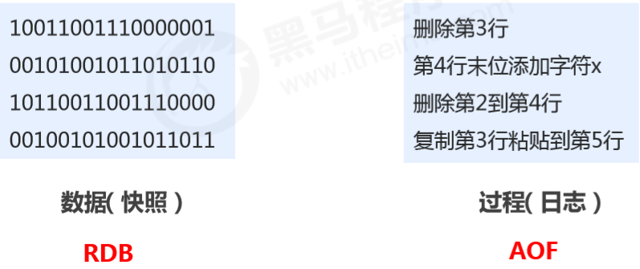
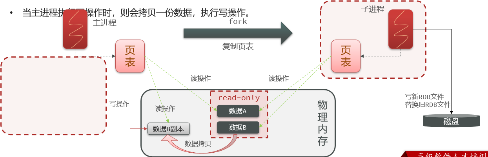
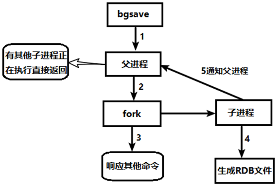
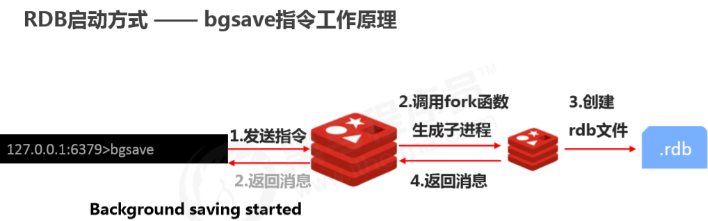
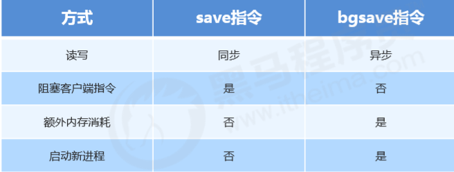
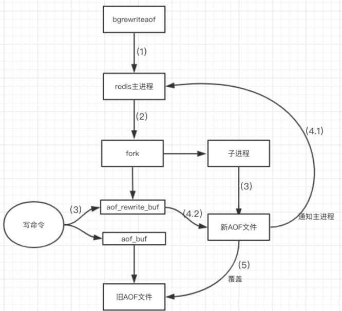

## 持久化之RDB

### 概述

持久化：

  &ensp;&ensp;**利用永久性存储介质将数据进行保存，在数据丢失情况下能够利用保存的数据进行恢复的工作机制称为持久化。** 

方式：

1. 将当前数据状态进行保存，存储数据结果，存储格式简单，**关注点在数据**。

2. 将数据的操作过程进行保存，日志形式，存储操作过程，存储格式复杂，**关注点在数据的操作过程**。 

​			

  **RDB全称Redis Database Backup file（Redis数据备份文件），也被叫做Redis数据快照。**

  **简单来说就是把内存中的所有数据都记录到磁盘中。当Redis实例故障重启后，从磁盘读取快照文件，恢复数据。**

  **快照文件称为RDB文件，默认是保存在当前运行目录。**

### 备份的执行方式

   Redis会单独创建(fork)一个子进程来进行持久化，会先将数据写入到一个临时文件中，待持久化过程结束了，再用这个临时文件替换上次持久化好的文件。 

   **整个过程中，主进程是不进行任何IO操作的**，这就确保了极高的性能。

   如果需要进行大规模数据的恢复，且对于数据恢复的完整性不是非常敏感，那RDB方式要比AOF方式更加的高效。

   **RDB的缺点是最后一次持久化后的数据可能丢失**。

### Fork

   **Fork的作用是复制一个与当前进程一样的进程。**

   新进程的所有数据(变量、环境变量、程序计数器等)数值都和原进程一致，与原进程共享内存空间，但它是一个全新的进程，并作为原进程的子进程。

   在Linux程序中，fork()会产生一个和父进程完全相同的子进程，但子进程此后会执行exec系统调用，出于效率考虑，Linux中引入了“写时复制技术"：

- 当主进程执行读操作时，访问共享内存；

- 当主进程执行写操作时，则会拷贝一份数据，执行写操作。

​	  

  

### RDB持久化流程

​	  

​	  生成rdb文件后，用新的rdb文件代替旧的rdb文件。

### 指令

#### **save指令**

   作用：**保存所有的key**

   **save指令的执行会阻塞当前Redis服务器，直到当前RDB过程完成为止，有可能会造成长时间阻塞，线上环境不建议使用。** 

   相关配置(在配置文件redis.conf中修改)

1. dbfilename  dump.rdb  

​         &ensp;&ensp;说明：设置本地数据库文件名，默认值为 dump.rdb 

​         &ensp;&ensp;经验：通常设置为dump-端口号.rdb 

2. dir  

​         &ensp;&ensp;说明：设置存储.rdb文件的位置，默认为Redis启动时命令行所在的目录下 

​         &ensp;&ensp;经验：通常设置成存储空间较大的目录中，目录名称为data 

3. rdbcompression  yes  

​         &ensp;&ensp;说明：设置存储至本地数据库时是否压缩数据，默认为yes，采用 LZF算法进行压缩

​         &ensp;&ensp;经验：通常默认为开启状态，如果设置为no，可以节省 CPU 运行时间，但会使存储的文件变的很大 

4. rdbchecksum  yes  

​         &ensp;&ensp;说明：设置是否使用CRC64算法进行数据校验，该校验过程在写文件和读文件过程均进行 

​         &ensp;&ensp;经验：通常默认为开启状态，如果设置为no，可以节约读写性过程约10%的时间消耗，但是存储有一定的数据损坏风险

#### **bgsave指令**

   作用：**手动启动在后台异步进行保存操作，但不是立即执行** 

   bgsave命令是针对save阻塞问题做的优化。

   **Redis内部所有涉及到RDB操作都采用bgsave的方式，save命令可以放弃使用。**

   相关配置

​       1.dbfilename  dump.rdb  

​       2.dir  

​       3.rdbcompression  yes  

​       4.rdbchecksum  yes  

​       5.stop-writes-on-bgsave-error  yes  

​           &ensp;&ensp;说明：后台存储过程中如果出现错误现象，是否停止保存操作 

​           &ensp;&ensp;经验：通常默认为开启状态 

​		         

#### **RDB启动方式-----save配置**

​    在配置文件redis.conf中修改

​    save  second  changes

​    作用：**规定时间范围内key的变化次数达到了指定的次数就进行持久化。如果没有达到指定次数，则重新计时。**

​    参数：

​       &ensp;&ensp;second：规定的时间范围 

​       &ensp;&ensp;changes：key的变化次数

​    例：
​       &ensp;&ensp;save  900  1             &ensp;&ensp;&ensp;&ensp;&ensp;&ensp;900秒内发生了一次变化就执行bgsave操作

​       &ensp;&ensp;save  300  10              &ensp;&ensp;&ensp;&ensp;&ensp;300秒内发生了10次变化

​       &ensp;&ensp;save  60  10000        &ensp;&ensp;&ensp;60秒内发生了10000次变化

####  **save与bgsave对比**

​	     

### rdb文件的备份

1. 先通过config  get  dir  查询rdb文件的目录 

2. 将*.rdb的文件拷贝到别的地方

3. rdb的恢复

​     &ensp;&ensp;关闭Redis

​     &ensp;&ensp;先把备份的文件拷贝到工作目录下 cp  dump2.rdb  dump.rdb

​     &ensp;&ensp;启动Redis， 备份数据会直接加载

### RDB优点

1. RDB是一个紧凑压缩的二进制文件，**存储效率较高** 

2. RDB内部存储的是redis在某个时间点的数据快照，**非常适合用于数据备份，全量复制，大规模的数据恢复等场景** 

3. RDB**恢复数据的速度要比AOF快很多**

4. 节省磁盘空间，**对数据的完整性和一致性要求不高更适合使用**

​    应用：服务器中每X小时执行bgsave备份，并将RDB文件拷贝到远程机器中，用于灾难恢复。 

### RDB缺点

1. RDB方式无论是执行指令还是利用配置，**无法做到实时持久化，具有较大的可能性丢失数据**   

2. bgsave指令每次运行要**执行fork操作创建子进程**，要牺牲掉一些性能 

3. Redis的众多版本中**没有进行RDB文件格式的版本统一**，有可能出现各版本服务之间数据格式无法兼容现象 

## 持久化之AOF

**Append Only File(仅追加文件)**

### 概述

1. AOF持久化：以独立日志的方式记录每次写操作，**将Redis执行过的所有写指令记录下来(读操作不记录)**， 只许追加文件不许改写文件重启时再重新执行AOF文件中的命令，以达到恢复数据的目的。

2. 与RDB相比可以简单描述为：**RDB是记录数据    AOF是记录数据产生的过程** 

3. AOF的主要作用是**解决了数据持久化的实时性**，目前已经是Redis持久化的主流方式。

### 持久化流程

（1）客户端的请求写命令会被append追加到AOF缓冲区内；

（2）AOF缓冲区根据AOF持久化策略 [always,everysec,no] 将操作同步到磁盘中的AOF文件中；

（3）AOF文件大小超过重写策略或手动重写时，会对AOF文件进行重写，压缩AOF文件容量；

（4）Redis服务重启时，会重新加载AOF文件，执行文件中的写操作达到数据恢复的目的；

### 写数据的三种策略

​    appendfsync  always|everysec|no

1. always(每次)

​       &ensp;&ensp;**每次写入操作均同步到AOF文件中**，数据零误差，性能较低，不建议使用。

2. everysec(每秒)

​       &ensp;&ensp;**每秒将缓冲区中的指令同步到AOF文件中**，数据准确性较高，性能较高。建议使用，也是默认配置。

​       &ensp;&ensp;在系统突然宕机的情况下本秒的数据可能丢失，**最多丢失1秒的数据**。 

3. no(系统控制)

​        &ensp;&ensp;写命令执行完先放入AOF缓冲区，由操作系统决定何时将缓冲区内容写回磁盘，整体过程不可控，可能丢失大量数据。

###  AOF功能开启 

  在配置文件中设置

​     appendonly  yes|no

​     作用：是否开启AOF持久化功能，默认不开启

​     appendfsync  always|everysec|no 

​     作用：AOF写数据策略 

​     appendfilename  filename 

​     作用：AOF持久化文件名，默认文件名为appendonly.aof，建议配置为appendonly-端口号.aof 

​     dir 

​     作用：AOF持久化文件保存路径，与RDB持久化文件保持一致即可      

### AOF重写

  描述：随着命令不断写入AOF，文件会越来越大，为了解决这个问题，Redis引入了AOF重写机制压缩文件体积。

​          AOF文件重写是将Redis进程内的数据转化为写命令同步到新AOF文件的过程。

​          **即，将对同一个数据的若干条命令的执行结果转化成最终结果对应的指令进行记录(将多条命令等效为一条命令)。** 

####  **作用：** 

1. 降低磁盘占用量，提高磁盘利用率 

2. 提高持久化效率，降低持久化写时间，提高IO性能

3. 降低数据恢复用时，提高数据恢复效率

#### **规则:** 

1. 进程内已超时的数据不再写入文件 

2. 忽略无效指令，重写时使用进程内数据直接生成，这样新的AOF文件只保留最终数据的写入命令

​       &ensp;&ensp;如del key1、 hdel key2、srem key3、set key4 111、set key4 222等

3. 对同一个数据的多条写命令合并为一条命令 

​       &ensp;&ensp;例如，lpush list1  a、lpush list1  b、 lpush list1  c   可以转化为：lpush list1 a b c。

​     &ensp;&ensp;为防止数据量过大造成客户端缓冲区溢出，对list、set、hash、zset等类型，每条指令最多写入64个元素。

####  **配置**

​       no-appendfsync-on-rewrite

​           如果为yes，则不写入aof文件只写入缓存，用户请求不会阻塞，但是在这段时间如果宕机会丢失这段时间的缓存数据。

​              （降低数据安全性，提高性能)

​           如果为no，还是会把数据往磁盘里刷，但是遇到重写操作，可能会发生阻塞。（数据安全，但是性能降低） 

####  **重写方式**

1. 手动重写

​          &ensp;&ensp;bgrewriteaof      执行该指令后，redis在后台完成重写操作

2. 自动重写

​         &ensp;&ensp;Redis会记录上次重写时的AOF大小，默认配置是当AOF文件大小是上次rewrite后大小的一倍且文件大于64M时触发。

​         &ensp;&ensp;配置文件中写入：

​             &ensp;&ensp;&ensp;auto-aof-rewrite-min-size  size                              

​        &ensp;&ensp;&ensp; **设置触发条件，当AOF文件体积超过设置的size时，则重写。size最小设置为64MB。**

​        &ensp;&ensp;&ensp;auto-aof-rewrite-percentage  percentage             

​         &ensp;&ensp;&ensp; **AOF文件比上次文件 增长超过多少百分比则触发重写。**
​     

​        &ensp;&ensp;自动重写触发比对参数(运行指令info  Persistence获取具体信息)

​            &ensp;&ensp;&ensp;aof_current_size       &ensp;&ensp;&ensp;文件当前大小

​            &ensp;&ensp;&ensp;aof_base_size          &ensp;&ensp;&ensp;设置文件基础大小

​     &ensp;&ensp;自动重写触发条件

​        &ensp;&ensp;&ensp;aof_current_size > auto-aof-rewrite-min-size                

​            &ensp;&ensp;&ensp;&ensp;&ensp;当前大小超过设定的值

​      &ensp;&ensp;&ensp;aof_current_size - aof_base_size / aof_base_size > rewrite-percentage         

​        &ensp;&ensp;&ensp;&ensp;&ensp;当前大小减去基础大小，再除以基础大小 得到的百分比超过设定的值

####  **重写流程**

​        1）bgrewriteaof触发重写，判断是否当前有bgsave或bgrewriteaof在运行，如果有，则等待该命令结束后再继续执行。

​        2）主进程fork出子进程执行重写操作，保证主进程不会阻塞。

​        3）子进程遍历redis内存中数据到临时文件，客户端的写请求同时写入aof_buf缓冲区和aof_rewrite_buf重写缓冲区，

​         &ensp;&ensp;&ensp;保证原AOF文件完整以及新AOF文件生成期间的新的数据修改动作不会丢失。

​        4）子进程写完新的AOF文件后，向主进程发信号，主进程更新统计信息。

​       &ensp;&ensp;&ensp;主进程把aof_rewrite_buf中的数据写入到新的AOF文件。

​        5）使用新的AOF文件覆盖旧的AOF文件，完成AOF重写。

​			  

​    优点：

​       &ensp;&ensp;备份机制更稳健，丢失数据概率更低。

​       &ensp;&ensp;可读的日志文本，通过操作AOF文件，可以处理误操作。

​    缺点：

​       &ensp;&ensp;比起RDB占用更多的磁盘空间。

​       &ensp;&ensp;恢复备份速度要慢。

​       &ensp;&ensp;每次读写都同步的话，有一定的性能压力。

​       &ensp;&ensp;存在个别Bug。

## 对比

|                | **RDB**                                      | **AOF**                                                  |
| -------------- | -------------------------------------------- | -------------------------------------------------------- |
| 持久化方式     | 定时对整个内存做快照                         | 记录每一次执行的命令                                     |
| 占用存储空间   | 小                                           | 大                                                       |
| 存储速度       | 慢                                           | 快                                                       |
| 数据完整性     | 不完整，两次备份之间的数据会丢失             | 相对完整，取决于刷盘策略                                 |
| 文件大小       | 会有压缩，文件体积小                         | 记录命令，文件体积很大                                   |
| 宕机恢复速度   | 很快                                         | 慢                                                       |
| 数据恢复优先级 | 低，因为数据完整性不如AOF                    | 高，因为数据完整性更高                                   |
| 系统资源占用   | 高，大量CPU和内存消耗                        | 低，主要是磁盘IO资源  但AOF重写时会占用大量CPU和内存资源 |
| 使用场景       | 可以容忍数分钟的数据丢失，追求更快的启动速度 | 对数据安全性要求较高                                     |

  **RDB 比 AOF 优秀的地方 ：**

1. RDB 文件存储的内容是经过压缩的二进制数据， 保存着某个时间点的数据集，文件很小，适合做数据的备份，灾难恢复。AOF 文件存储的是每一次写命令，类似于 MySQL 的 binlog 日志，通常会比 RDB 文件大很多。

2. 当 AOF 变得太大时，Redis 能够在后台自动重写 AOF。新的 AOF 文件和原有的 AOF 文件所保存的数据库状态一样，但体积更小。Redis 7.0 版本之前，如果在重写期间有写入命令，AOF 可能会使用大量内存，重写期间到达的所有写入命令都会写入磁盘两次。

3. 使用 RDB 文件恢复数据，直接解析还原数据即可，不需要一条一条地执行命令，速度非常快。而 AOF 则需要依次执行每个写命令，速度非常慢。也就是说，与 AOF 相比，恢复大数据集的时候，RDB 速度更快。

   

  **AOF 比 RDB 优秀的地方：**

1. RDB 的数据安全性不如 AOF，没有办法实时或者秒级持久化数据。生成 RDB 文件的过程是比较繁重的， 虽然 BGSAVE 子进程写入 RDB 文件的工作不会阻塞主线程，但会对机器的 CPU 资源和内存资源产生影响。

2. AOF 支持秒级数据丢失(取决于 fsync 策略，如果是 everysec，最多丢失 1 秒的数据)，仅仅是追加命令到 AOF 文件，操作轻量。

3. RDB 文件是以特定的二进制格式保存的，并且在 Redis 版本演进中有多个版本的 RDB，所以存在老版本的 Redis 服务不兼容新版本的 RDB 格式的问题。

## 选择

1. 对数据非常敏感，建议使用默认的AOF持久化方案 

​     &ensp;&ensp;AOF持久化策略使用everysecond，每秒钟同步一次。

​     &ensp;&ensp;采取该策略时，redis仍可以保持很好的处理性能，当出现问题时，最多丢失0-1秒内的数据。

​     &ensp;&ensp;由于AOF文件存储体积较大，所以恢复速度较慢 

2. 数据呈现阶段有效性，建议使用RDB持久化方案 

​     &ensp;&ensp;数据可以做到阶段内无丢失，且恢复速度较快，阶段点数据恢复通常采用RDB方案

3. 综合比对

​      &ensp;&ensp;如果不能承受数分钟以内的数据丢失，对业务数据非常敏感，选用AOF 

​      &ensp;&ensp;如果能承受数分钟以内的数据丢失，且追求大数据集的恢复速度，选用RDB 

​     &ensp;&ensp;灾难恢复选用RDB 

​      &ensp;&ensp;双保险策略，同时开启 RDB 和 AOF，重启后，Redis优先使用 AOF 来恢复数据，降低丢失数据的量。

