## 常用数据类型

### 概述

**redis自身是一个map，其中所有的数据都采用 key:value 的形式存储。**

**数据类型指的是存储的数据的类型，也就是value部分的类型，key部分永远都是字符串。**

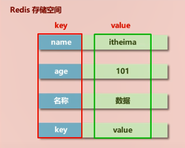

#### **数据库操作命令**

|      命令       | 作用                                                         |
| :-------------: | ------------------------------------------------------------ |
|   select  id    | 切换数据库，id的值从0到15                                    |
| mov  key  index | 移动key到指定数据库中(必须保证目标数据库中不存在该值，且原数据库中有该值)                                                 移动完成后，原数据库中该值消失 |
|     dbsize      | 查看当前数据库的key的数量                                    |
|     flushdb     | 清除当前数据库中的key                                        |
|    flushall     | 清除所有key                                                  |

#### **键(Key)**

 通用命令：

|        命令         |                             作用                             |
| :-----------------: | :----------------------------------------------------------: |
|   set  key  value   |             设置key的值，如果key已经存在，则覆盖             |
|      get  key       |           查询key的值，如果key不存在，则返回(nil)            |
|       keys  *       | 查看当前库中的所有key，也可以使用正则表达式，查找符合表达式的key的个数 |
|     exists  key     |      判断某个key是否存在，如果存在则返回1，不存在返回0       |
|      type  key      |                      查看key是什么类型                       |
|      del  key       |                        删除指定的key                         |
|     unlink  key     | 根据value选择非阻塞删除，仅将keys从keyspace元数据中删除，真正的删除会在后续异步操作。 |
|   expire  key  10   |             为指定的key设置过期时间，以秒为单位              |
|      ttl  key       |     查看key还有多少秒过期，-1表示永不过期，-2表示已过期      |
| getset  key  value  |                     设置新值，并返回旧值                     |
|    persist  key     |                     将key设置为永久有效                      |
|     random  key     |                       随机获取一个key                        |
| rename  key  newkey |             重命名，如果newkey已经存在，则会覆盖             |
|        sort         |                对所有key排序，但不改变原数据                 |

**key的设置约定：**

&ensp;&ensp;表名:主键名:主键值:字段名

&ensp;&ensp;例: set order:u_id:2942:name vkls

 &ensp;&ensp;&ensp;&ensp;&ensp;set order:u_id:2942:age 20

&ensp;&ensp;或: `set order:u_id:2942 {id:2942,name:vkls,age:20}`

### 字符串(String)

 **String类型**

   存储的数据：单个数据，最简单且最常用的数据存储类型

   存储数据的格式：一个存储空间保存一个数据

   存储内容：通常使用字符串，**如果字符串以整数的形式表示，可以作为数字进行操作**

 **命令：**

1. set key value [EX seconds | PX milliseconds|KEEPTTL] [NX | XX]  命令中的其他参数

​	&ensp;&ensp;NX：当数据库中key不存在时，可以将key-value添加到数据库

​    &ensp;&ensp;XX：当数据库中key存在时，可以将key-value添加到数据库，与NX参数互斥

​	&ensp;&ensp;EX：key的超时秒数，如果在规定时间内重新设置该值，则时间刷新。

​	&ensp;&ensp;PX：key的超时毫秒数，与EX互斥

  &ensp;&ensp;其他设置生命周期的方式：

&ensp;&ensp;&ensp;    setex key seconds value        &ensp;&ensp;&ensp;//设定key的生命周期，以秒为单位，等同于 set key value ex seconds

   &ensp;&ensp;&ensp;&ensp;&ensp;&ensp;例：setext num 100 3       &ensp;&ensp;&ensp;&ensp;//设置num的值为3，且存活100秒(如果在100秒中该值重新被设置，则数据刷新)

​    &ensp;&ensp;&ensp;&ensp;psetex key milliseconds value    //以毫秒为单位

2. 添加/修改多个数据

&ensp;&ensp;&ensp;mset key1 value1 key2 value2 ...  ( m:multiple)

3. 获取多个数据

  &ensp;&ensp;&ensp;mget key1 key2 ...  

4. 获取字符串长度

​	&ensp;&ensp;strlen key 

5. 追加信息到原始信息后部(如果原始信息不存在，则新建)，返回值为追加后的字符串长度

​	&ensp;&ensp;append key value

6. 覆盖字符串，将key中从start索引开始的字符用value覆盖，索引从0开始

​	&ensp;&ensp;setrange key start value

7. 获取子串，获取key中从start到end的字符(两边都包含)，索引从0开始

​	&ensp;&ensp;getrange key start end

**String 作为数值进行操作：**

1. string在redis内部存储默认就是一个字符串，**当遇到增减类操作incr，decr时会转成数值型进行计算**。

2. **redis所有的操作都是原子性的，采用单线程处理所有业务**，命令是一个一个执行的，因此无需考虑并发带来的影响。

3. 按数值进行操作的数据，如果原始数据不能转成数值，或超越了redis数值上限范围，将报错。

4. 数值计算的最大范围(java中long类型的最大值）：9223372036854775807   

   数值增加操作：

| 命令                          | 作用                                                         |
| ----------------------------- | ------------------------------------------------------------ |
| incr   key                    | key的值加一，如果key不存在，则创建key，并赋值为1             |
| incrby   key   increment      | key的值增加increment (increment只能为整数)                   |
| incrbyfloat   key   increment | key的值增加increment (increment的值可以是小数，也可以是整数) |

  &ensp;&ensp;&ensp;数值减少操作：

| 命令                   | 作用                                              |
| ---------------------- | ------------------------------------------------- |
| decr  key              | key的值减一，如果key不存在，则创建key，并赋值为-1 |
| decrby  key  increment | key的值减少increment                              |

**底层实现**

   **String的数据结构为简单动态字符串(Simple Dynamic String，缩写SDS)。是可以修改的字符串，内部结构实现上类似于Java的ArrayList，采用预分配冗余空间的方式来减少内存的频繁分配。**

​		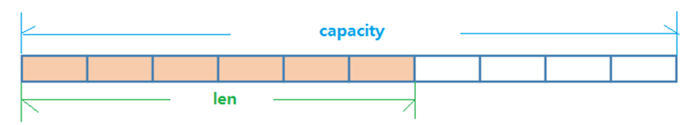

  如图中所示，内部为当前字符串实际分配的空间capacity，一般要高于实际字符串长度len。当字符串长度小于1M时，扩容都是加倍现有的空间，

  如果超过1M，扩容时一次只会多扩1M的空间。**需要注意的是字符串最大长度为512M**。

### 列表(List)

#### **简介：**

   单键多值，Redis 列表是简单的字符串列表，按照插入顺序排序。

​    可以添加一个元素到列表的头部（左边）或者尾部（右边）。

​    **它的底层实际是个双向链表，对两端的操作性能很高，通过索引的方式操作中间的节点性能会较差。**

#### **常用命令：**

 **命令中，key就代表一个list的名称，list中可以存储多个值**

1. 添加/修改数据

   lpush  key  value      &ensp;&ensp;&ensp;从list左侧添加数据

   rpush  key  value     &ensp;&ensp;&ensp;从list右侧添加

   lpush/rpush  key  value1  value2  value3 ....   &ensp;&ensp;&ensp;从左边/右边插入多个值，以空格分隔。

2. 获取数据

&ensp;&ensp;&ensp;lrange  key  start  stop          

&ensp;&ensp;&ensp;&ensp;从左侧获取数据，start 和stop为开始和结束的索引值，索引从0开始，如果stop越界，则返回start之后的所有数据，

&ensp;&ensp;&ensp;&ensp;如果start和stop都越界或者start大于stop，则返回(empty array)

&ensp;&ensp;&ensp;lrange  key  0  -1         &ensp;&ensp;&ensp;&ensp;获取所有值

&ensp;&ensp;&ensp;lindex  key  index           &ensp;&ensp;&ensp;从列表左侧根据索引获取单个数据

 &ensp;&ensp;&ensp;llen  key             &ensp;&ensp;&ensp;       返回列表中数据的个数

&ensp;&ensp;&ensp;rpoplpush  key1  key2     &ensp;&ensp;从列表key1右边拿出一个值，插入到key2的左边，并返回该值

3. 获取并移除数据

​       &ensp;&ensp;lpop  key  [count]         &ensp;&ensp;&ensp;返回左侧开始count个数据并移除，默认count为1

​       &ensp;&ensp;rpop  key  [count]          &ensp;&ensp;&ensp;返回右侧开始count个数据并移除，默认count为1

4. 插入和更新数据

​      &ensp;&ensp;linsert  key  before/after  value  newvalue	&ensp;&ensp;&ensp;在value的前面或后面插入newvalue

​      &ensp;&ensp;lset  key  index  newvalue   &ensp;&ensp;&ensp;将列表中索引为index的数值更新为newvalue

5. 阻塞获取数据

​       &ensp;&ensp;blpop  key1  [key2]  time        如果有数据，则立刻返回；如果没有数据，则等待time秒，time秒后依然没有数据，则返回(nil)

​      &ensp;&ensp;brpop key1  [key2]   time   &ensp;&ensp;从右侧开始，...

6. 移除指定的数据

​       &ensp;&ensp;lrem  key  count  value     &ensp;&ensp;&ensp;从左侧开始删除count个value

​       &ensp;&ensp;&ensp;例：lrem  list1 3  a           &ensp;&ensp;&ensp;从左侧开始，删除3个a     

####  **注意事项：**

​     &ensp;**1.list中保存的数据都是string类型的**，数据总容量是有限的，最多2^32-1个元素(4294967295)。

​     &ensp;2.list具有索引的概念，但是操作数据时通常以队列的形式进行入队出队操作，或以栈的形式进行入栈出栈操作

​     &ensp;3.list可以对数据进行分页操作，通常第一页的信息来自于list，第2页及更多的信息通过数据库的形式加载       

#### **数据结构：** 

​     1.List的数据结构为快速链表quickList。

​     2.首先在列表元素较少的情况下会使用一块连续的内存存储，这个结构是ziplist，也即是压缩列表。

​     &ensp;&ensp;它**将所有的元素紧挨着一起存储，分配的是一块连续的内存**。**当数据量比较多的时候才会改成quicklist。**

​     3.因为普通的链表需要的附加指针空间太大，会比较浪费空间。

​     &ensp;&ensp;比如这个列表里存的只是int类型的数据，结构上还需要两个额外的指针prev和next。

​     &ensp;&ensp;Redis将链表和ziplist结合起来组成了quicklist。也就是**将多个ziplist使用双向指针串起来使用。**

​     &ensp;&ensp;这样既满足了快速的插入删除性能，又不会出现太大的空间冗余。

​		   

### 集合(Set)

#### **简介：**

​    Set对外提供的功能与list类似是一个列表的功能，特殊之处在于set是可以**自动排重**的。

​    并且Set提供了判断某个成员是否在一个集合内的功能。

​    **Set是String类型的无序集合。它底层其实是一个value为null的Hash表**，所以添加、删除、查找的复杂度都是O(1)。

​    与hash存储结构完全相同，仅存储键，不存储值（nil）。

​		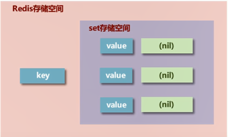

#### **常用命令：**

​    sadd  key  member1  [member2]        &ensp;&ensp;&ensp;添加一个或多个数据，如果已经存在，则忽略

​    smembers key                                 &ensp;&ensp;&ensp;获取全部数据

​    srem  key  member1  [member2]         &ensp;&ensp;&ensp;删除集合中的一个或多个元素

​    scard  key                                      &ensp;&ensp;&ensp;返回该集合中的元素个数

​    sismember  key  member                  &ensp;&ensp;&ensp;判断集合中是否包含指定数据  如果存在返回1，不存在返回0

​    srandmember  key  [n]                      &ensp;&ensp;&ensp;随机取出n个值(原集合中的数据不变)，如果没有n选项，则默认为1

​    spop  key                                       &ensp;&ensp;&ensp;随机获取集合中的一个元素并移除

​    sinter  key1  [key2]                            &ensp;&ensp;&ensp;&ensp;求带个集合的交集

​    sunion  key1  [key2]                          &ensp;&ensp;&ensp;求两个集合的并集

​    sdiff  key1  [key2]                       &ensp;&ensp; &ensp;&ensp;&ensp;求key1减去key2的部分   

​    sinterstore  key3  key1  [key2]             &ensp;&ensp;&ensp;将两个集合的交集存储到key3中    

​    sunionstore  key3  key1  [key2]           &ensp;&ensp;&ensp;将两个集合的并集存储到key3中       

​    sdiffstore  key3  key1  [key2]              &ensp;&ensp;&ensp;将key1减key2的差集存储到key3中    

​    smove key1  key2  value         			&ensp;&ensp;&ensp;将key1中的value移动到key2中   

 注意：**Set类型不允许数据重复，只有第一次创建时有效，再对该key进行赋值时无效**

####  **数据结构：**

   **Set的数据结构是dict字典，字典是用哈希表实现的。所有的value都指向同一个内部值。**

### 哈希(Hash)

#### **简介：**

   Redis Hash 是一个键值对集合。

   Redis Hash是一个String类型的field和value的映射表，Hash特别适合用于存储对象。

   类似Java里面的Map<String，Object>，用户ID为查找的key，存储的value用户对象包含姓名，年龄，生日等信息，

​       如果用普通的key/value结构来存储，主要有以下2种存储方式：

​       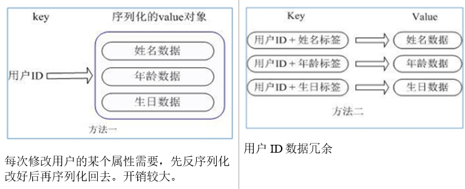

   **通过 key(用户ID) + field(属性标签) 就可以操作对应属性数据了，既不需要重复存储数据，也不会带来序列化和并发修改控制问题。**

​       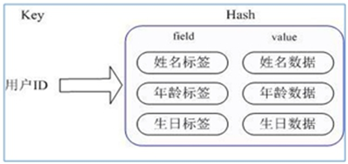

​          

​         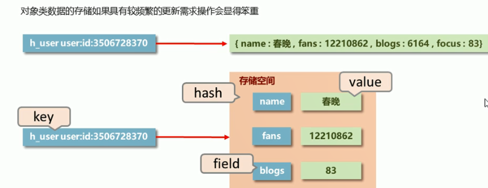

#### **常用命令：**

​      hset  key  field  value              &ensp;&ensp;&ensp;给 key 集合中的  field 键赋值 value 

​      hget  key  field1 [field2]            &ensp;&ensp;取出 key集合中的 field 字段对应的值 

​      hmset  key1  field1  value1  field2  value2 ...    &ensp;&ensp;&ensp;批量设置hash的值

​      hexists  key1  field               &ensp;&ensp;&ensp;查看哈希表 key 中，给定域 field 是否存在。 

​      hkeys  key                           &ensp;&ensp;&ensp;列出该hash集合的所有field

​      hvals   key                          &ensp;&ensp;&ensp;列出该hash集合的所有value

​      hincrby  key  field  increment   &ensp;&ensp;&ensp;为哈希表 key 中的字段 field 的值加上增量increment

​      hsetnx   key  field value         &ensp;&ensp;&ensp;将哈希表 key 中的字段 field 的值设置为 value ，当且仅当字段 field 不存在时.

​      hdel  key  field1  [field2] ...      &ensp;&ensp;&ensp;删除数据

​      hlen  key                            &ensp;&ensp;&ensp;获取key中字段的个数

**注意事项：**

​    1.**Hash类型下的value只能存储字符串，不允许存储其他数据类型，不存在嵌套现象。如果数据未获取到，对应的值为（nil）**

​    2.每个 Hash 可以存储 2^32-1 个键值对

​    3.Hash类型十分贴近对象的数据存储形式，并且可以灵活添加删除对象属性。

​    &ensp;&ensp;&ensp;但hash设计初衷不是为了存储大量对象而设计的，切记不可滥用，更不可以将Hash作为对象列表使用。

​    4.hgetall操作可以获取全部属性，如果内部field过多，遍历整体数据效率就很会低，有可能成为数据访问瓶颈。

#### **数据结构：**

​    Hash类型对应的数据结构是两种：ziplist（压缩列表），hashtable（哈希表）。

​    当field-value长度较短且个数较少时，使用ziplist，否则使用hashtable。

### 有序集合(Zset)

#### **简介：**

​    有序集合zset与普通集合set非常相似，是一个没有重复元素的字符串集合。

​     **但zset在set的存储结构基础上添加了可排序字段score。** 集合中的成员是唯一的，但是score的值可以是重复的。

​         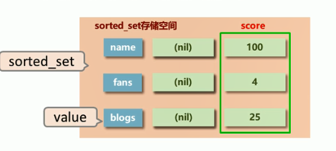

常用命令：

​    zadd  key  score1  member1  [score2  member]     &ensp;&ensp;&ensp;添加数据

   &ensp;&ensp;例: zadd  name  90  vkls   85  cly

​    zrange  key  start  stop [withscores]                    &ensp;&ensp;&ensp;&ensp;&ensp;获取升序排列后的member   [withscores]选项可显示数据

​    zrevrange key  start  stop [withscores]                 &ensp;&ensp;&ensp;获取降序排列后的member  

​    zrem  key  member1  [member2...]                    &ensp;&ensp;&ensp;&ensp;&ensp;&ensp;&ensp;删除member

​    zincrby  key  increment  member                     &ensp;&ensp;&ensp;&ensp;为member的score加上增量

​    zcount  key  min  max                                  &ensp;&ensp;&ensp;统计分数在该区间内的元素个数 

​    zrank   key  memeber 											&ensp;&ensp;&ensp;返回member对应的索引值(排序后，索引从0开始)

​    zscore key member                      						&ensp;&ensp;&ensp;获得member的score值

​    zrangebyscore  key  min  max  [withscores] [limit] &ensp;&ensp;&ensp;&ensp;获取符合条件的member，limit用于限定输出符合条件的member

   &ensp;&ensp;例:zrangebyscore  scores  30  50  limit 0 3 withscores &ensp;&ensp;&ensp;获取scores中score的值在30-50之间的前三个member

​    zrevrangebyscore  key  max  min  [withscores]           &ensp;&ensp;&ensp;从大到小 ...                             

​    zremrangebyrank  key  start  stop 								&ensp;&ensp;&ensp;删除符合索引条件的member

​    zremrangebyscore  key  min  max		 						&ensp;&ensp;&ensp;删除符合score条件的member

​    zpopmax  key  [count]                                        &ensp;&ensp;&ensp;按从大到小的顺序移除coun个值

​    zpopmin  key  [count]                                          &ensp;&ensp;&ensp;按从小到大的顺序移除count个值

####     **注意：**

​       &ensp;1.min与max用于限定搜索查询的条件

​       &ensp;2.start与stop用于限定查询范围，作用于索引，表示开始和结束索引

​       &ensp;3.offset与count用于限定查询范围，作用于查询结果，表示开始位置和数据总量

​     zcard  key                               &ensp;&ensp;&ensp;获取scores中的member总量

​     zcount  key  min  max                &ensp;&ensp;&ensp;符合条件的member数量   

​     zinterstore  key3  numkeys  key1 [key2...]         &ensp;&ensp;&ensp;&ensp;将key1和key2中公共member的值相加存储到key3中

​     zunionstore  key3  numkeys  key1  [key2...]       &ensp;&ensp;&ensp;将key1和key2中所有的memeber合并存储到key3中

​			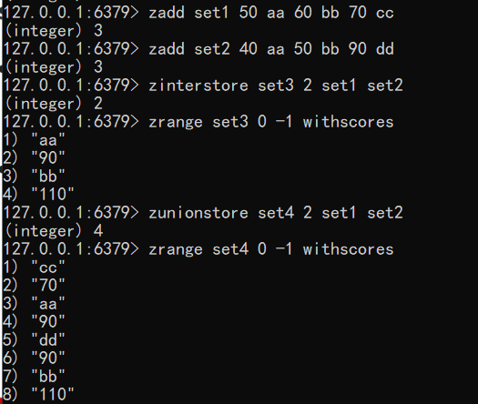

#### **注意事项：**

​    1.score保存的数据存储空间是64位，如果是整数范围是-9007199254740992~9007199254740992

​    2.score保存的数据也可以是一个双精度的double值，但由于双精度浮点数的特征，可能会丢失精度

​    3.sorted_set 底层存储还是基于set结构的，因此数据不能重复。

​         如果重复添加相同的数据，score值将被反复覆盖，保留最后一次修改的结果。

#### **数据结构：**

  有序集合（zset）同样使用了两种不同的存储结构，分别是 zipList(压缩列表)和 skipList(跳跃列表)，当 zset 满足以下条件时使用压缩列表：

​     1.成员的数量小于128 个

​     2.每个 member （成员）的字符串长度都小于 64 个字节。

#### **压缩列表(zipList)**

  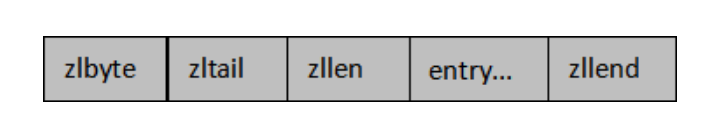

每一部分在内存中都是紧密相邻的，并承担着不同的作用，介绍如下：

- zlbytes     一个无符号整数，表示当前 ziplist 占用的总字节数；

- zltail        ziplist中最后一个entry的偏移量. 用于快速定位最后一个entry, 以快速完成pop等操作

- zllen        指ziplist中 entry 的数量。当 zllen 比  2^16-2 大时，需要完全遍历 entry 列表来获取 entry 的总数目。

- entry       用来存放具体的数据项（score和member），长度不定，可以是字节数组或整数，entry 会根据成员的数量自动扩容。

- zlend       是一个单字节的特殊值，其值全为F，等于 255，起到标识 ziplist 内存结束点的作用。

  例：ZADD salary 3500.0 xh 3200.0 xm

​        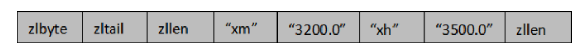

​       当 zset 使用压缩列表保存数据时，entry 的第一个节点保存 member，第二个节点保存 score。

​       依次类推，集合中的所有成员最终会按照 score 从小到大排列。

  **Entry结构：**

​     1.一般结构 `<prevlen> <encoding> <entry-data>`

​		   `prevlen`：前一个entry的大小；

​			`encoding`：不同的情况下值不同，用于表示当前entry的类型和长度；

​			`entry-data`：真是用于存储entry表示的数据；

​     2.在entry中存储的是int类型时，encoding和entry-data会合并在encoding中表示，此时没有entry-data字段；

​        redis中，在存储数据时，会先尝试将string转换成int存储，节省空间；

​        此时entry结构：`<prevlen> <encoding>`

​     **prevlen编码**

​        当前一个元素长度小于254（255用于zlend）的时候，prevlen长度为1个字节，值即为前一个entry的长度，如果长度大于等于254的时候，prevlen用5个字节表示，第一字节设置为254，后面4个字节存储一个小端的无符号整型，表示前一个entry的长度。

​     **encoding编码**

​        encoding的长度和值根据保存的是int还是string，还有数据的长度而定；

​        前两位用来表示类型，当为“11”时，表示entry存储的是int类型，其它表示存储的是string；

#### **跳跃表**

  跳跃列表（skipList）又称“跳表”是一种基于链表实现的随机化数据结构，其**插入、删除、查找的时间复杂度均为 O(logN)。**

  跳跃表的缺点就是**需要的存储空间比较大，属于利用空间来换取时间的数据结构。**

  特点：

- 由许多层结构组成，每一层都是一个有序的链表。

- 每个节点包含两个指针，一个指向同一链表中的下一个节点，一个指向下一层的同一个节点，最底层 (Level 1) 的链表包含所有元素。

- 如果一个元素出现在 Level i 的链表中，则它在 Level i 之下的链表也都会出现，即，高层是底层的子集。

  

​		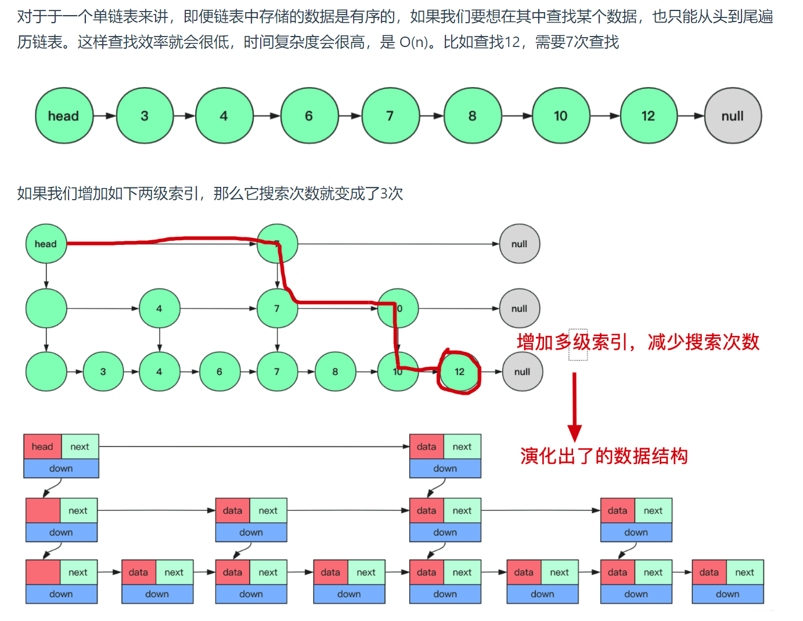

查找：

   跳表的查找会从顶层链表的头部元素开始，然后遍历该链表，直到找到元素大于或等于目标元素的节点。

​    如果当前元素正好等于目标，那么就直接返回它；从头结点开始，如果下一个元素小于目标元素，则走到下一个元素；

   如果下一个元素大于目标元素，则从当前元素处垂直下降到下一层。

   可以把查找的过程总结为一条二元表达式（下一个元素是否小于目标元素？下一个：下一层）

插入：

   插入元素的时候，最底层是一定会插入的，至于上一层是否插入，则通过抛硬币的方式(随机)决定，如果为正，

   则插入上一层，然后再次抛硬币，如果还是正，则再往上一层插入，如果为反，则该元素的插入到此结束。

   假设原来有：

​              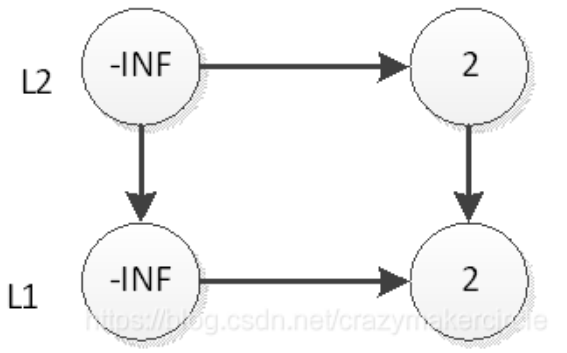

  现在插入元素33，先在底层插入：

​        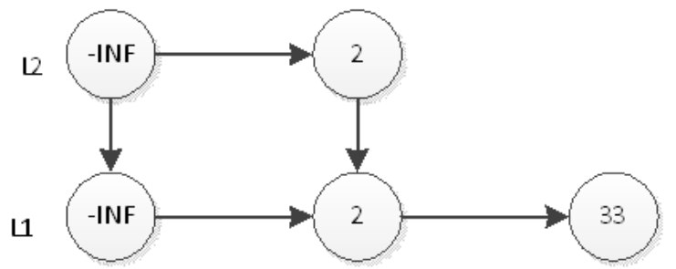

  然后抛硬币，结果是反面，那么元素33的插入操作就结束了。

  接下来，插入一个新元素55，首先在L1插入55，插入后如下图：

​     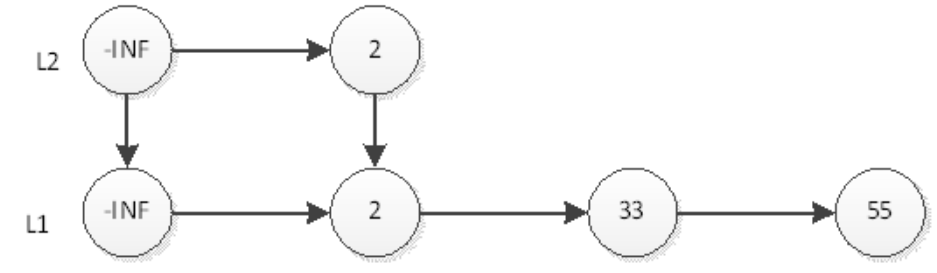

   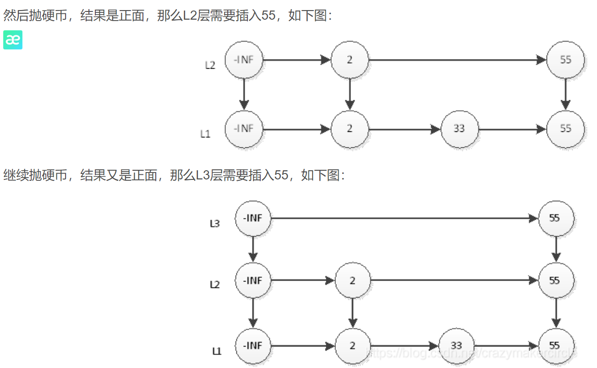

​    不可能无限的进行层数增长。除了根据一种随机算法得到的层数之外，为了不让层数过大，

​     还会有一个最大层数MAX_LEVEL限制，随机算法生成的层数不得大于该值。

## 新数据类型

### Bitmaps

#### **简介：**

   合理地使用操作位能够有效地提高内存使用率和开发效率。

   Redis提供了Bitmaps这个“数据类型”可以实现对位的操作：

​    （1）Bitmaps本身不是一种数据类型， 实际上它就是字符串（key-value），但是它可以对字符串的位进行操作。

​    （2）Bitmaps单独提供了一套命令， 所以在Redis中使用Bitmaps和使用字符串的方法不太相同。 

​			 可以把Bitmaps想象成一个以位为单位的数组， 数组的每个单元只能存储0和1， 数组的下标在Bitmaps中叫做偏移量。

#### **操作:**

​      getbit  key  offset                    &ensp;&ensp;&ensp;获取指定key对应偏移量上的bit值

​      setbit  key  offset  value          &ensp;&ensp;&ensp;&ensp;设置指定key对应偏移量上的bit值，value只能是1或0，偏移量从0开始

​      bitcount key [start end]             &ensp;&ensp;&ensp;统计key中指定范围内的1的个数

​               &ensp;&ensp;&ensp;&ensp;&ensp;&ensp;&ensp;&ensp;&ensp;&ensp;&ensp;&ensp;&ensp;&ensp;&ensp;&ensp;&ensp;&ensp;&ensp;&ensp;&ensp;&ensp;&ensp;&ensp;范围包含start和end，单位为字节，即8位，且可以为负数，-1表示最后一位

​      bitop operation  outkey key1 [key2]   &ensp;&ensp;&ensp;对指定key按位进行逻辑运行，并将结果保存到outkey中

​          &ensp;&ensp;&ensp;&ensp;&ensp;&ensp;&ensp;&ensp;&ensp;&ensp;&ensp;&ensp;&ensp;&ensp;&ensp;&ensp;&ensp;&ensp;&ensp;&ensp;&ensp;&ensp;&ensp;&ensp;&ensp;&ensp;&ensp;&ensp;&ensp;&ensp;&ensp;&ensp;&ensp;&ensp;op 的取值有and、or、not、xor

​      bitpos key                               &ensp;&ensp;&ensp;查找bit数组中指定范围内第一个0或第一个1出现的位置，从左往右数                                           

  例：

​         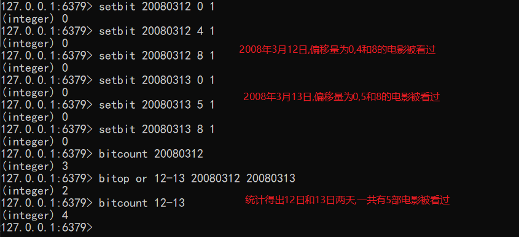

   

### HyperLogLog

#### **简介：**

   **基数：基数就是数据去重后元素个数。基数估计就是在误差可接受的范围内，快速计算基数。**

​      例：{1,3,5,7,5,7,8}   &ensp;&ensp;基数集:{1,3,5,7,8}  &ensp;&ensp;基数:5

​             {1,1,1,1,4}      &ensp;&ensp;基数集:{1,4}        &ensp;&ensp;基数:2

   Redis HyperLogLog 是用来做基数统计的算法，

   HyperLogLog 的优点是，**在输入元素的数量或者体积非常非常大时，计算基数所需的空间总是固定的、并且是很小的。**

   在 Redis 里面，每个 HyperLogLog 键只需要花费 12 KB 内存，就可以计算接近 2^64 个不同元素的基数。

   但是，因为 HyperLogLog 只会根据输入元素来计算基数，而不会储存输入元素本身，所以 HyperLogLog **不能返回输入的各个元素**。

####  **常用命令：**

​     pfadd  key  element [element...]            &ensp;&ensp;&ensp;添加元素，如果添加完后key估计的近似基数发生变化，则返回1，否则返回0

​     pfcount  key  [key ...]                           &ensp;&ensp;&ensp;统计key的基数，也可以一起统计多个key的基数

​     pfmerge  destkey  key1 [key2...]              &ensp;&ensp;&ensp;将一个key或多个key合并后的结果存储在destkey中 

​     例：

​          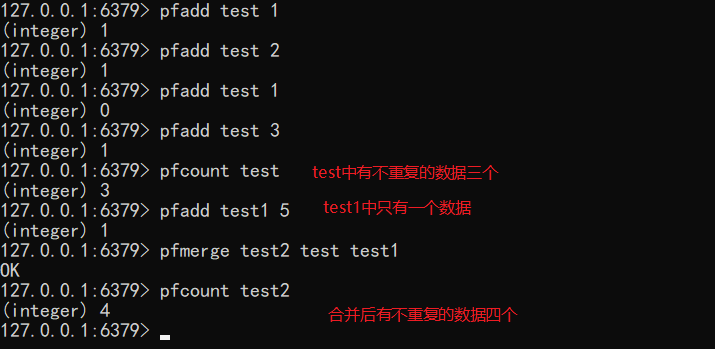

  

####   **注意事项：**

​      1.**用于进行基数统计，不是集合，不保存数据，只记录数量而不是具体数据。**

​      2.核心是基数估算算法，最终数值存在一定误差

​     &ensp;&ensp;误差范围：基数估计的结果是一个带有 0.81% 标准错误的近似值

​      3.使用空间极小，每个hyperloglog key占用了12K的内存用于标记基数

​      4.pfadd命令不是一次性分配12K内存使用，会随着基数的增加内存逐渐增大

​      5.pfmerge命令合并后占用的存储空间为12K，无论合并之前数据量是多少

### Geospatial

#### **简介：**

   GEO，Geographic，地理信息的缩写。该类型，就是元素的2维坐标，在地图上就是经纬度。

   redis基于该类型，提供了经纬度设置，查询，范围查询，距离查询，经纬度Hash等常见操作。

#### **常用命令：**

​    1.geoadd  key  longitude  latitude  member1  [longitude  latitude member2 ...] 

​      &ensp;&ensp;作用：

​		&ensp;&ensp;&ensp;将指定的地理空间位置(维度，经度，名称)添加到key中，可同时添加多个地理位置。

​       &ensp;&ensp;例：

​       &ensp;&ensp;&ensp;geoadd china:city  106.50  29.53  chongqing  114.05  22.52  shenzhen  116.38  39.90  beijing

​      &ensp;&ensp;注意：

​		&ensp;&ensp;&ensp;两极无法直接添加，一般会下载城市数据，直接通过 Java 程序一次性导入。

​		&ensp;&ensp;&ensp;有效的经度从 -180 度到 180 度。有效的纬度从 -85.05112878 度到 85.05112878 度。

​		&ensp;&ensp;&ensp;当坐标位置超出指定范围时，该命令将会返回一个错误。

​		&ensp;&ensp;&ensp;已经添加的数据，是无法再次往里面添加的。

​    2.geopos  key  member [member...]                 

​     &ensp;&ensp;获得指定地区的坐标值。

​     &ensp;&ensp;该命令返回一个数组，数组中的每个项都由两个元素组成：给定位置元素的经度和纬度。

​    &ensp;&ensp;当给定的位置元素不存在时，对应的数组项为空值。

​    3.geodist  key  member1  member2  [unit] 

​     &ensp;&ensp;计算两个地理位置之间的直线距离，如果有一个member不存在，则返回空值。

​    &ensp;&ensp;unit的取值为 m(米)，km(千米)，mi(英里)，ft(英尺)，默认为米

​    4.georadius  key  longitude  latitude  radius  m|km|ft|mi  [withcoord] [withdist] [withhash] [count] 

​      &ensp;&ensp;以给定的经纬度为中心，找到给定半径内的元素

​      &ensp;&ensp;参数：

​       &ensp;&ensp;&ensp;withdish：在返回位置元素的同时， 将位置元素与中心之间的距离也一并返回。 

​      &ensp;&ensp;&ensp;&ensp; &ensp;&ensp;&ensp;&ensp;&ensp;&ensp;&ensp;&ensp;距离的单位和用户给定的范围单位保持一致。

​     &ensp;&ensp;&ensp;withcoord：将位置元素的经度和维度也一并返回。

​      &ensp;&ensp;&ensp;withhash：以 52 位有符号整数的形式，返回位置元素经过原始 geohash 编码的有序集合分值。 

​       &ensp;&ensp;&ensp;count：显示前count个匹配到的元素。

​		&ensp;&ensp;&ensp;asc:  根据中心的位置，按照从近到远的方式返回位置元素。

​        &ensp;&ensp;&ensp;desc: 根据中心的位置，按照从远到近的方式返回位置元素。           

​    5.georadiusbymember  key  member  radius m|km|ft|mi [withcoord] [withdist] [withhash] [count count] 

​    &ensp;&ensp;该命令和 georadius 命令一样， 都可以找出位于指定范围内的元素， 但是该函数的中心点由给定的位置元素决定。

​    6.geohash  key  member  [member ...] 

   &ensp;&ensp;返回一个或多个位置元素的Geohash表示值

   &ensp;&ensp;该命令返回的geohash的位置与用户给定的元素的位置是一一对应的

  **其底层是使用的Sorted Set，GEO 中存储的地理位置信息的经纬度数据通过 GeoHash 算法转换成了一个整数，这个整数作为 SortedSet 的 score(权重参数)使用。**

