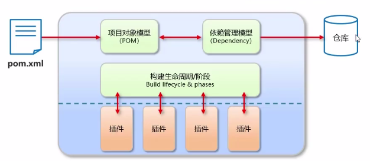
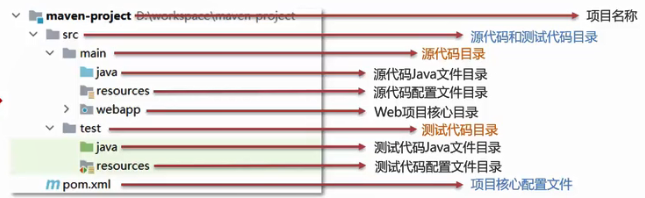
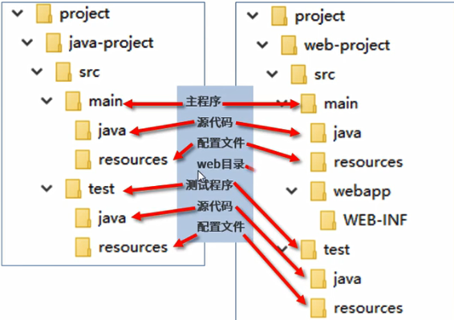
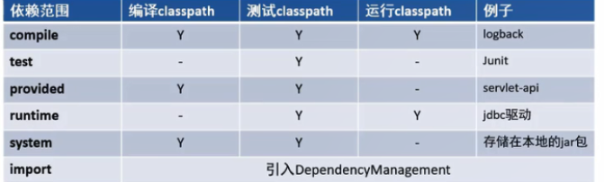

## 基础知识

### 介绍

   Apache Maven是一个项目管理和构建工具，它基于项目对象模型(POM)的概念，<Badge text="beta" type="warning"/>

   通过一小段描述信息来管理项目的构建、报告和文档。

<!-- more -->


  官网：http://maven.apache.org/

  下载：http://maven.apache.org/download.cgi

###   作用

1. 标准化的项目结构

&ensp;&ensp;    所有IDE使用Maven构建的项目结构完全一样，所有IDE创建的Maven项目可以通用

2. 标准化的构建流程(编译，测试，打包，发布...)

3. 方便的依赖管理

&ensp;&ensp;   即，管理项目所依赖的第三方资源(jar包，插件等)


### 模型

​         

### 项目结构

​       


### 仓库

​     本地仓库(Local Repository)：就是自己计算机上的一个目录，存放各种jar包

​     远程仓库(Remote Repository)：非本机电脑上的仓库，为本地仓库提供资源，可分为

​      &ensp;&ensp;中央仓库(Central Repository)：由Maven团队维护，存储所有资源的，全球唯一的仓库

​      &ensp;&ensp;私服：一般由公司团队搭建的私有仓库，保存具有版权的资源，包含购买或自主研发的jar包
​     

​    **当在项目中使用坐标引入需要的jar包时，首先会查找本地仓库中是否有对应的jar包，如果有，则直接引用**

​    **如果没有，则去中央仓库中下载对应的jar包到本地仓库。**


## 安装与配置

###     下载

&ensp;&ensp;在官网下载压缩包并解压缩

### 配置环境变量

&ensp;&ensp;配置变量名为MAVEN_HOME，变量值为bin文件夹所在目录

   &ensp;&ensp;&ensp;例：D:\software\intellij\apache-maven-3.8.4

&ensp;&ensp;在PATH变量中添加%MAVEN_HOME%\bin

&ensp;&ensp;在cmd中使用命令mvn -version 来验证安装是否成功

###     配置本地仓库

&ensp;&ensp;修改文件夹conf/settings.xml文件中的`<localRepository>`标签，选择一个文件夹作为本地仓库

&ensp;&ensp;&ensp;例：

```xml
<localRepository>

	  D:\software\intellij\apache-maven-3.8.4\mvn_resp

</localRepository>
```

&ensp;&ensp;&ensp;**(conf指的是从官网下载的压缩包中的文件夹；mvn_resp是新建文件夹)**    

###     配置阿里云私服

 &ensp;&ensp;&ensp;修改conf/settings.xml中的`<mirrors>`标签，添加如下子标签

```xml
<mirror>
                
    <id>alimaven</id>
                
    <name>aliyun maven</name>
                
    <url>http://maven.aliyun.com/nexus/content/groups/public/</url>
                
    <mirrorOf>central</mirrorOf>
           
</mirror>
```

###     配置jdk版本

&ensp;&ensp;将下列代码放入到`<profiles>   </profiles>`标签中

```xml
<profile>
  				
    <id>jdk-1.8</id>
  				
    <activation>
        			
        <activeByDefault>true</activeByDefault>
        			
        <jdk>1.8</jdk>
  				
    </activation>
  				
    <properties>
      				
        <maven.compiler.source>1.8</maven.compiler.source>
      				
        <maven.compiler.target>1.8</maven.compiler.target>
      				
        <maven.compiler.compilerVersion>1.8</maven.compiler.compilerVersion>
  				
    </properties>
		  
</profile>
```

## 基本使用

###     常用命令

​		**对工程执行相关的构建命令时，要在工程的pom.xml文件所在的目录下执行**

​        **compile：**

​          &ensp;&ensp;编译源程序或或测试程序

​          &ensp;&ensp;主程序编译： mvn compile              

​          &ensp;&ensp;测试程序编译： mvn test-compile    

​		   &ensp;&ensp;主程序编译结果存放的目录： target/class

​           &ensp;&ensp;测试程序编译结果存放的目录： target/test-class

​        **clean**          &ensp;&ensp;&ensp;清理target目录

​        **test**             &ensp;&ensp;&ensp;测试

​        **package**     &ensp;&ensp;&ensp;打包(java项目打包成jar文件，web项目打包成war文件)

​        **install**：

​         &ensp;&ensp;&ensp;将打包好的文件(即构建过程中生成的jar包)存放到本地仓库，

​         &ensp;&ensp;&ensp;该jar包在本地仓库中的存放路径是根据pom.xml文件中的坐标生成的

​         &ensp;&ensp;&ensp;该操作还会将项目中的pom.xml文件转换为xxx.pom文件一起存入本地仓库，所以如果想看一个jar包原始的pom.xml

&ensp;&ensp;&ensp;&ensp;&ensp;&ensp;文件，只需查看对应的xxx.pom文件即可，它们只是名字发生了改变，实际上是同一个文件

###     生命周期

​        为了让构建过程自动完成，maven设定了三个生命周期，生命周期中的每一个环节对应构建过程中的一个操作

​           1.clean：清理工作

​          &ensp;&ensp;&ensp;pre-clean        执行一些需要在clean之前完成的工作

​         &ensp;&ensp;&ensp;clean              移除上一次构建生成的文件

​        &ensp;&ensp;&ensp;post-clean       执行一些需要在clean之后立刻完成的工作

​           2.default：核心工作  如：编译，测试，打包，安装等

​       &ensp;&ensp;&ensp;compile           编译项目的源代码

​       &ensp;&ensp;&ensp;test                使用合适的单元测试框架运行测试

​       &ensp;&ensp;&ensp;package         将编译后的代码打包成文件，如jar，war或ear文件

​       &ensp;&ensp;&ensp;install             安装项目到本地仓库，这样其他项目也可以将该项目作为依赖

​           3.site：产生报告，发布站点等

​       &ensp;&ensp;&ensp;pre-site          执行一些需要在生成站点文档之前完成的工作

​        &ensp;&ensp;&ensp;site                生成项目的站点文档

​       &ensp;&ensp;&ensp;post-site         执行一些需要在生成站点文档之后完成的工作，并且为部署做准备

​       &ensp;&ensp;&ensp;deploy-site     将生成的站点文档部署到特定的服务器上

​       **同一生命周期内，执行后面的命令，前边的命令会自动执行，** 即，如果执行install命令，则compile，test，package命令会自动执行。

​        在项目工程的pom.xml文件所在目录中打开powershell或者在cmd中切换到当前目录，输入mvn compile，则开始编译。

###    Maven坐标详解

 **坐标：**

​      &ensp;&ensp;Maven中的坐标是资源的唯一表示

​      &ensp;&ensp;使用坐标来定义项目或引入项目中需要的依赖

​      &ensp;&ensp;Maven坐标的主要组成：

​     &ensp;&ensp;&ensp;&ensp;groupld：定义当前Maven项目隶属组织名称(通常是域名反写)

​    &ensp;&ensp;&ensp;&ensp;artifactld：定义当前Maven项目或项目中一个模块名称(通常是模块名称)

​     &ensp;&ensp;&ensp;&ensp;version：定义当前项目版本号   

###    插件和目标

 **插件：**

​       &ensp;&ensp;maven的核心程序仅仅负责宏观调度，不做具体工作。具体工作是由maven插件完成的。

​        &ensp;&ensp;例如：编译就是由maven-compiler-plugin-3.1.jar插件来执行的

 **目标：**

​       &ensp;&ensp;一个插件可以对应多个目标，而每一个目标都和生命周期中的某个环节对应

​      &ensp;&ensp;Default生命周期中有compile和test-compile两个和编译相关的环节，这两个环节对应compile和test-compile两个

  &ensp;&ensp;&ensp;目标，而这两个目标都是由maven-compiler-plugin-3.1.jar插件来完成的。

###      java工程与web工程项目结构

​		 


## 依赖管理

### 依赖范围

​    通过设置坐标的依赖范围，可以设置对应jar包的作用范围：

  &ensp;&ensp;&ensp;&ensp;&ensp;&ensp;&ensp;&ensp;&ensp;&ensp;&ensp;&ensp;&ensp;&ensp;&ensp;&ensp;&ensp;&ensp;&ensp;main目录&ensp;&ensp;&ensp;&ensp;&ensp;&ensp;&ensp;&ensp;test目录&ensp;&ensp;&ensp;&ensp;&ensp;&ensp;&ensp;部署到服务器

​             

​	使用`<scope> </scope>`标签设置

​    默认值为compile

​	部署到服务器：即，该jar包会不会参于打包，如果参与，则会和war包一起部署到服务器上，如果不参与，则不会部署到服务器上。

​    provided：Tomcat服务器中已经有的，不需要再导入(如 servlet-api，jsp-api);

​         &ensp;&ensp;&ensp;&ensp;&ensp;&ensp;&ensp;&ensp;&ensp;&ensp;所以也不会部署到服务器上，如果再部署到服务器，可能会引起冲突。

### 依赖的传递性

1. 概念

​     &ensp;&ensp;A依赖B，B依赖C，那么在A没有配置对C的依赖的情况下，A里面能不能直接使用C?

2. 传递的原则

​     &ensp;&ensp;在A依赖B，B依赖C的前提下，C能否传递到A，取决于B依赖C时使用的依赖范围

​      &ensp;&ensp;如果B依赖C时使用compile，则可以传递

​       &ensp;&ensp;如果B依赖C时使用test或provided，则不能传递  所以如果A需要这样的jar包，就必须明确配置依赖

3. 依赖的冲突

​	&ensp;&ensp;如果A依赖B，B依赖D的1.2版本，同时A又依赖C，C依赖D的2.3版本，如果B和C对D的依赖都是compile，就可能导致

&ensp;&ensp;&ensp;在A中D版本的冲突。如果A不想用D的1.2版本，就需要把它排除掉。配置依赖的排除就是阻止某些jar包的传递。

  &ensp;&ensp;&ensp;配置方式：

 &ensp;&ensp;&ensp;&ensp;&ensp;在`<dependency> </dependency>`标签里面配置`<exclusion> </exclusion>`标签，如果需要排除多个则使用

&ensp;&ensp;&ensp;&ensp;&ensp;`<exclusions>`

```xml
<dependency>
                  		
    ...
                        
    <exclusions>
                        	
        ...
                           
        <exclusion>
                            	
            <groupId>......</groupId>          //配置要排除的依赖的坐标
                                
            <artifactId>......</artifactId>       //不需要配置版本号
                            
        </exclusion>
                            
        ...
                        
    </exclusions>   
                        
    ...
                  
</dependency>
```


## 继承

 定义：maven工程之间，A工程继承B工程，本质上是A的pom.xml中的配置继承了B的pom.xml文件中的配置

 作用：让父工程统一管理依赖信息的版本

 背景：

​        对一个比较大型的项目进行了模块拆分，一个project下面创建了多个module，每一个module都需要配置自己的依赖信息

​        在每个module维护各自的依赖信息时容易发生出入，不方便统一管理。

​        在使用每一个框架内的不同jar包时，它们应该是同一个版本，所以整个项目使用的框架版本需要统一。

​        使用框架时所需要的jar包组合(或者说依赖信息组合)需要经过长期摸索，最终确定一个可用的组合。这个可用的组合在新项目中不应该再重新摸索。

​        通过在父工程中为整个项目维护依赖信息的组合就解决了上述问题。

 操作：

​        1.创建一个普通的maven工程，创建好后修改打包方式

​           &ensp;&ensp;**只有打包方式为pom的Maven工程才能管理其他工程，该工程称为父工程，不写业务代码，而是专门管理其他工程。**

```xml
<groupId>com.vkls.maven</groupId>
               
<artifactId>01-maven-parent</artifactId>
               
<version>1.0-SNAPSHOT</version>
               
<packaging>pom</packaging>   
```

​         2.从新创建的父工程的根目录中(即pom.xml文件所在的目录)进入cmd，创建三个子maven工程(或称为模块工程)

​         3.创建完成后，父工程的pom.xml文件中会自动添加`<modules>` 标签 

```xml
 <modules>
                    
     <module>01-maven-module</module>    //01，02，03为创建的三个子工程
                    
     <module>02-maven-module</module>
                    
     <module>03-maven-module</module>
                
</modules>
```

​         4.在子工程的pom.xml文件中，会自动添加`<parent>`标签

​			&ensp;&ensp;如果子工程的groupId和version与父工程相同，则在子工程中可以省略不写

```xml
<parent>
                     
    <groupId>com.vkls.maven>    //即父工程的坐标
                     
    <artifactId>01-maven-parent</artifactId>
                     
    <version>1.0-SNAPSHOT</version>
                 
</parent>
```

​		  5.在父工程的pom.xml文件中使用`<dependencyManagement>`标签统一管理依赖信息

​               &ensp;&ensp;即使在父工程中配置了对依赖的管理，子工程中需要使用哪个依赖还是要明确配置

​               &ensp;&ensp;但在子工程中配置时可以没有`<version>`，子工程采用父工程中配置的`<version>`，

​               &ensp;&ensp;如果子工程配置了`<version>`，则以子工程中配置的版本号为准

```xml
<dependencyManagement>
                  		
    <dependencies>
                  				
        <dependency>
                                		
            <groupId>org.springframework</groupId>
                                    	
            <artifactId>spring-core</artifactId>
                                    	
            <version>4.0.0.RELEASE</version>
								
        </dependency>
								
        <dependency>	
										
            <groupId>org. springframework</groupId>
										
            <artifactId>spring-beans</artifactId>
										
            <version>4.0.0.RELEASE</version>
								
        </dependency>
								
        <dependency>
										
            <groupId>org.springframework</groupId>
										
            <artifactId>spring-context</artifactId>
										
            <version>4.0.0.RELEASE</version>
								
        </dependency>
					   
    </dependencies>
				  
</dependencyManagement>
```

自定义标签：

​     可以在`<properties>`标签中创建自定义标签，标签名可自定义，标签值就是属性值，使用${  } 进行引用，类似于C语言中的宏定义。

​     自定义标签在父工程和子工程中都可以配置

​        例： 

```xml
<properties>

   	 <vkls.version>4.0.0.RELEASE</vkls.version>

</properties>
```

​         将依赖引用中的`<version>`标签使用该标签替换，如果需要修改版本号就只修改这一标签内的值即可。


## 聚合

1. 好处

   一键执行Maven命令，很多构建命令都可以在"总工程"中一键执行

   以mvn install为例：maven要求有父工程时先安装父工程；有依赖的工程时，先安装被依赖的工程。

   如果我们自己考虑这些规则就会很麻烦，但在工程聚合之后，在总工程中执行mvn install可以一键完成安装，

   而且会自动按照正确的顺序执行。

   配置聚合之后，各个模块工程会在总工程中展示一个列表，让项目中的各个模块一目了然。

 2.配置

​    在总工程(即父工程)中配置`<modules>`标签即可  

```xml
<modules>
                    
    <module>01-maven-module</module>    //01，02，03为创建的三个子工程
                    
    <module>02-maven-module</module>
                    
    <module>03-maven-module</module>
           
</modules>
```


