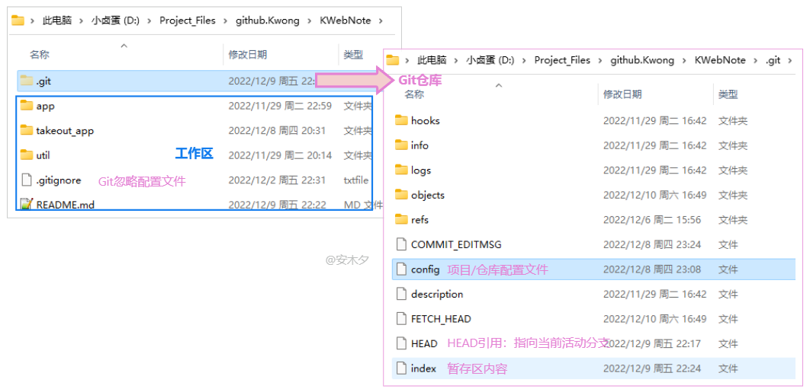
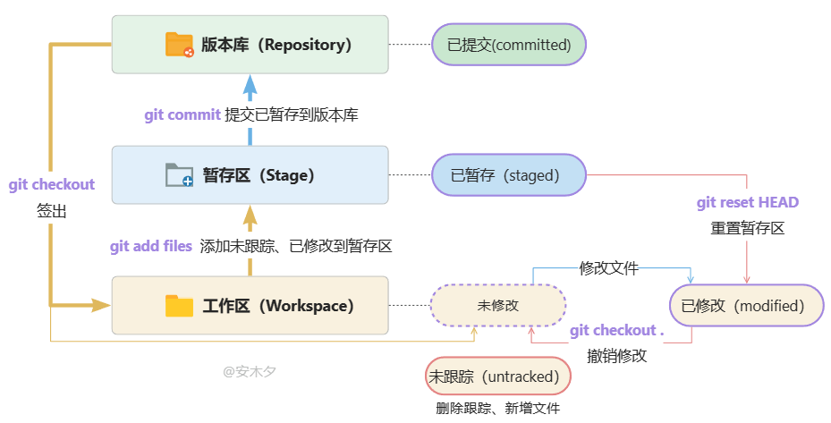
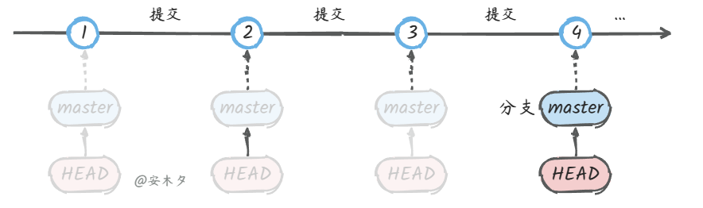
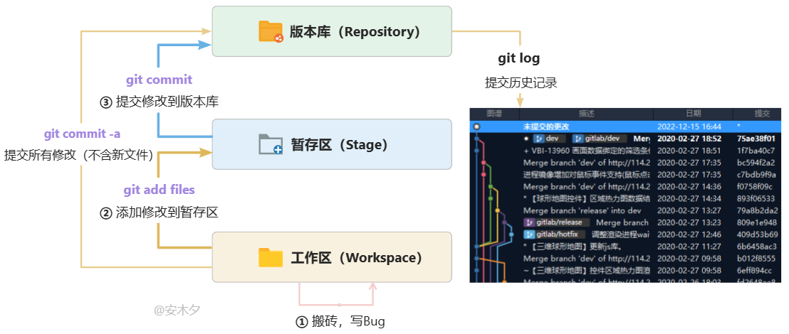
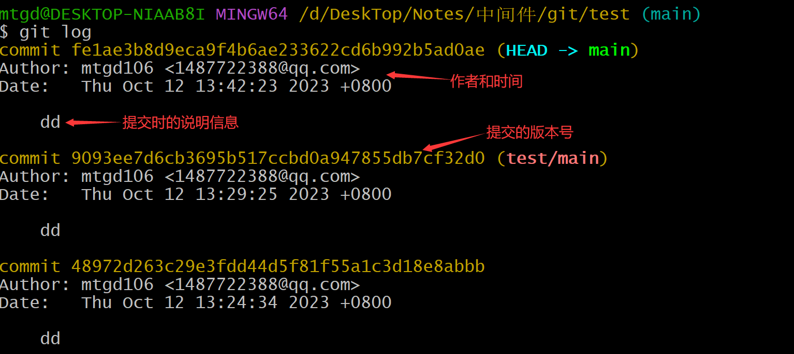
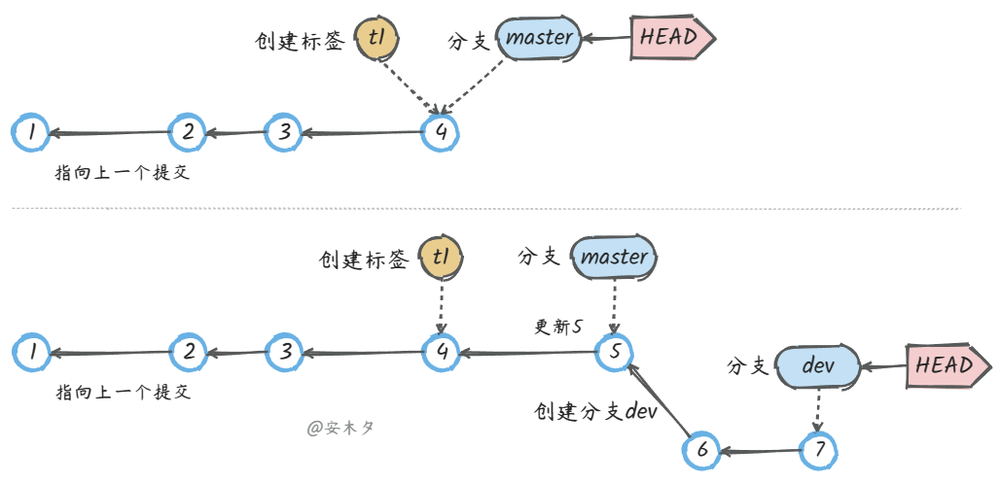
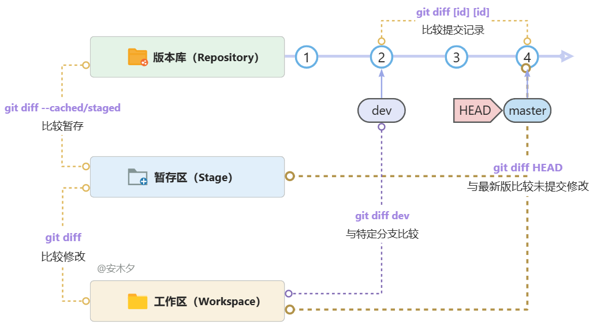

## 基本概念

#### **工作区**

电脑上写代码的地方，在这里新增文件、修改文件内容，或删除文件

#### **暂存区(stage/index)**

临时存放文件的修改，实际上它只是一个文件(.git/index)，保存待提交的文件列表信息

用`git add` 命令可以将工作区的修改保存到暂存区中。

#### **版本库/仓库(Repository)**

Git的管理仓库，管理版本的数据库，记录文件/目录状态的地方，所有内容的修改记录(版本)都在这里。

就是工作区目录下的隐藏文件夹`.git`，包含暂存区、分支、历史记录等信息。

用 `git commit` 命令可以将暂存区的内容正式提交到版本库。

​    

#### **服务端/远程仓库**

服务端的版本库，专用的Git服务器，为多人共享提供服务，承担中心服务器的角色。本地版本库通过push指令把代码推送到服务端版本库。

#### **分支**

分支是从主线分离出去的“副本”，可以独立操作而互不干扰，仓库初始化就有一个默认主分支`master`。

#### **头**

HEAD类似一个“指针”，指向当前活动 **分支的最新版本**。


#### **提交(Commit)**

把暂存区的所有变更的内容提交到当前仓库的活动分支。


#### **推送(Push)**

将本地仓库的版本推送到服务端(远程)仓库，与他人共享。


#### **拉取(Pull)**

从服务端(远程)仓库获取更新到本地仓库，获取他人共享的更新。


#### **获取(Fetch)**

从服务端(远程)仓库更新，作用同拉取(Pull)，区别是不会自动合并，需要手动合并。


#### **冲突(Conflict)**

多人对同一文件的工作副本进行更改，并将这些更改合并到仓库时就会面临冲突，需要人工合并处理


#### **合并(Merge)**

对有冲突的文件进行合并操作，Git会自动合并变更内容，无法自动处理的冲突内容会提示人工处理。


#### **标签(Tags)**

标签指的是某个分支某个特定时间点的状态，可以理解为提交记录的别名，常用来标记版本。


## 使用流程

- 0、**准备仓库**：创建或从服务端克隆一个仓库。

  

- 1、**写代码**：在工作目录中添加、修改代码。

- 2、**暂存**(git add)：将需要进行版本管理的文件放入暂存区域。

- 3、**提交**(git commit)：将暂存区域的文件提交到Git仓库。

- 4、**推送**(git push)：将本地仓库推送到远程仓库，同步版本库。

- 5、**获取更新**(fetch/pull)：从服务端更新到本地，获取他人推送的更新，与他人协作、共享。

​    


## 文件状态

1. 修改之后还没有被add(添加到暂存区)过的文件处于untracked状态

2. add之后文件处于staged状态，此时等待commite

3. commit之后文件处于unmodified(未修改)，这里之所以是unmodified是因为文件会跟仓库中的文件对比

4. 当unmodified的文件被修改则会变为modified状态

5. modified之后的文件add之后将继续变为staged状态

6. unmodifed的文件还有一种可能是已经不再需要了，那么可以remove它不再追踪变为untracked状态

​      


## .gitignore文件

在工作区根目录下创建“`.gitignore`”文件，文件中配置不需要进行版本管理的文件、文件夹。

“`.gitignore`”文件本身是被纳入版本管理的，可以共享。有如下规则：

- `#` 符号开头为注释。

- 可以使用Linux通配符。

  - 星号(*)代表任意多个字符，

    

  - 问号(?)代表一个字符，

  - 方括号( [abc] )代表可选字符范围，

  - 大括号( {string1,string2,...} )代表可选的字符串等。

- 感叹号(`!`)开头：表示例外规则，将不被忽略。

- 路径分隔符(/f) **开头**：，表示要**忽略根目录下的文件f。**

- 路径分隔符(f/) **结尾**：，表示要**忽略文件夹f下面的所有文件。**

```shell
#为注释

*.txt #忽略所有“.txt”结尾的文件

!lib.txt #lib.txt除外

/temp #仅忽略项目根目录下的temp文件,不包括其它目录下的temp，如不包括“src/temp”

build/ #忽略build/目录下的所有文件

doc/*.txt #会忽略 doc/notes.txt 但不包括 doc/server/arch.txt
```


## git使用

### 创建仓库

创建本地仓库的方法有两种：

- 一种是创建全新的仓库：`git init`，会在当前目录初始化创建仓库。

- 另一种是克隆远程仓库：`git clone [url]`

### 暂存区

| **指令**                              | **描述**                                           |
| :------------------------------------ | :------------------------------------------------- |
| git add [file1] [file2]               | 添加文件到暂存区，包括修改的文件、新增的文件       |
| git add [dir]                         | 同上，添加目录到暂存区，包括子目录                 |
| git add .                             | 同上，添加**所有**修改、新增文件（未跟踪）到暂存区 |
| git rm [file]                         | 删除工作区文件，并且将这次删除放入暂存区           |
| git mv [file-original] [file-renamed] | 修改文件名，并且将这次修改放入暂存区               |

### 提交commit

git commit 提交是以时间顺序被保存到数据库中的，就如游戏关卡一样，每一次提交(commit)就会产生

一条记录：id + 描述 + 快照内容。

- **commit id**：根据修改的文件内容采用摘要算法（SHA1）计算出不重复的40位字符，这么长是因为Git是分布式的，要保证唯一性、完整性，一般本地指令中可以只用前几位（6）。

- **描述**：针对本次提交的描述说明，建议准确填写，就跟代码中的注释一样，很重要。

- **快照**：就是完整的版本文件，以对象树的结构存放在仓库下`\.git\objects`目录里，这也是Git效率高的秘诀之一。

多次提交就形成了一条时间线，每次提交完，会移动当前分支`master`、`HEAD`的“指针”位置。

​	

|        **指令**         |                           **描述**                           |
| :---------------------: | :----------------------------------------------------------: |
| git commit -m   '说明'  | 提交变更，`-m`表示设置提交的描述信息，如果不带该参数则会进入编辑模式 |
|      git commit -a      | 参数`-a`，表示直接从工作区提交到版本库，略过了`git add`步骤，不包括新增的文件 |
|    git commit [file]    |                 提交暂存区的指定文件到仓库区                 |
| git commit --amend  -m  | 使用一次新的`commit`，替代上一次提交，会修改`commit`的`hash`值（id） |
|      git log -n20       |        查看日志(最近20条)，不带参数`-n`则显示所有日志        |
| git log -n20 --oneline  |        参数“`--oneline`”可以让日志输出更简洁（一行）         |
|  git log -n20 --graph   |              参数“`--graph`”可视化显示分支关系               |
| git log --follow [file] |                    显示某个文件的版本历史                    |
|    git blame [file]     |               以列表形式显示指定文件的修改记录               |
|       git reflog        | 查看所有可用的历史版本记录（实际是HEAD变更记录），包含被回退的记录（**重要**） |
|       git status        | 查看工作区的文件状态，如果只是在工作区中修改，还没有添加到暂存区，则提示信息是红色的；                                   如果已经添加到了暂存区，但没有提交到本地仓库，则提示信息是绿色的。使用参数`-s`输出简要信息 |

   

   通过`git log`指令可以查看提交记录日志，可以很方便的查看每次提交修改了哪些文件，改了哪些内容，从而进行恢复等操作。

​      


### git的指针引用

Git中最重要的就是提交记录了，其他如**标签**、**分支**、**HEAD** 都是对提交记录的“指针”引用，指向这些提交记录。

- 提交记录之间也存在“指针”引用，每个提交都会指向其上一个提交。

- **标签**：就是对某一个提交记录的**固定**的"指针"引用，取一个别名更容易记忆一些关键节点。存储在工作区根目录下`.git\refs\tags`。
- **分支**：也是指向某一个提交记录的“指针”引用，“指针”位置可变，如提交、更新、回滚。存储在工作区根目录下`.git\refs\heads`。
- **HEAD**：指向当前活动分支(最新提交)的一个“指针”引用，存储在“`.git/HEAD`”文件中，存储的内容为“`ref: refs/heads/master`”。

​     

- `HEAD`始终指向当前活动分支，多个分支只能有一个处于活动状态。

- 标签`t1`在某一个提交上创建后，就不会变了；而分支、`HEAD`的位置会改变。
- **Github上创建的仓库默认主分支名字是“`main`”，本地创建的仓库默认主分支名字为“`master`”。**


### 唯一标识id

每一次提交都有一个唯一标识，主要就是提交的`hash`值`commit id`，在很多指令中会用到，如版本回退、拣选提交等，都需要指定一个commit id。

使用唯一标识有两种方式：

- 首先就是`commit id`，一个40位编码，指令中使用的时候可以只输入前几位（6位）即可。

- 还有一种就是HEAD~n，是基于当前HEAD位置的一个相对坐标。

  - HEAD &ensp;&ensp;表示当前分支的最新版本，是比较常用的参数。

  - HEAD^ &ensp;&ensp;表示上一个版本，HEAD^^ &ensp;表示上上一个版本。
  - HEAD~ 或 HEAD~1 &ensp;&ensp;表示上一个版本，以此类推，HEAD^10  &ensp;表示最近第10个版本。
  - HEAD@{2} 在 git reflog 日志中标记的提交记录索引。

通过`git log`、`git reflog`可以查看历史日志，可以看到每次提交的唯一编号（hash）。

区别是 **`git reflog`可以查看所有操作的记录(实际上是HEAD变更的记录)，包括被撤销回退的提交记录。**  


### 比较命令

`git diff` 用来比较不同文件版本之间的差异。

| **指令**                 | **描述**                                                     |
| :----------------------- | :----------------------------------------------------------- |
| **git diff**             | 查看暂存区和工作区的差异                                     |
| git diff [file]          | 同上，指定文件                                               |
| git diff --cached        | 查看已暂存的改动，就是暂存区与新版本`HEAD`进行比较           |
| git diff --staged        | 同上                                                         |
| git diff --cached [file] | 同上，指定文件                                               |
| git diff HEAD            | 查看已暂存的+未暂存的所有改动，就是与最新版本`HEAD`进行比较  |
| git diff HEAD~           | 同上，与上一个版本比较。`HEAD~`表示上一个版本，`HEAD~10`为最近第10个版本 |
| git diff [id] [id]       | 查看两次提交之间的差异                                       |
| git diff [branch]        | 查看工作区和分支直接的差异                                   |

   

### 远程仓库

| **指令**                              | **作用**                                                     |
| :------------------------------------ | :----------------------------------------------------------- |
| git clone [git地址]                   | 从远程仓库克隆到本地（当前目录）                             |
| git remote -v                         | 查看所有远程仓库，不带参数`-v`只显示名称                     |
| git remote show [remote]              | 显示某个远程仓库的信息                                       |
| git remote add [name] [url]           | 增加一个新的远程仓库，并命名                                 |
| git remote rename [old] [new]         | 修改远程仓库名称                                             |
| git remote rm [remote-name]           | 删除远程仓库                                                 |
|                                       |                                                              |
| **git pull**                          | 拉取与当前分支同名的远程分支(需先关联远程分支)                                                                            克隆项目时，本地分支会自动与远程仓库建立追踪关系，可以使用默认的origin来替代远程仓库名 |
| git pull [remote]   [branch]          | 拉取远程仓库上的指定分支，并于当前分支合并                   |
| **git pull [remote] [branch]:[test]** | 拉取远程仓库上的指定分支，并与本地的test分支合并             |
| git pull --rebase                     | 使用rebase的模式进行合并                                     |
| git fetch [remote]                    | 获取远程仓库的所有变动到本地仓库，不会自动合并，需要手动合并 |
|                                       |                                                              |
| **git push**                          | **推送当前分支到远程仓库的同名分支**                         |
| git push [remote] [branch]            | **推送本地指定分支到远程仓库的同名分支**                     |
| git push [remote] [test]:[branch]     | 推送本地test分支到远程仓库的指定分支                         |
| git push [remote] --force/-f          | 强行推送当前分支到远程仓库，即使有冲突。                     |
| git push [remote] --all               | 推送所有分支到远程仓库                                       |
| git push –u                           | 参数`–u`表示与远程分支建立关联，第一次执行的时候用，后面就不需要了 |


### push/pull

`git push`、`git pull`是团队协作中最常用的指令，用于同步本地、服务端的更新，与他人协作。

**🔸推送**（push）：推送本地仓库到远程仓库。

- 如果推送的更新与服务端存在冲突，则会被拒绝，`push`失败。一般是有其他人推送了代码，导致文件冲突，可以先`pull`代码，在本地进行合并，然后再`push`。


**🔸拉取**（pull）：从服务端仓库更新到本地仓库。

- `git pull`：拉取服务端的最新提交到本地，并与本地合并，合并过程同分支的合并。

- `git fetch`：拉取服务端的最新提交到本地，不会自动合并，也不会更新工作区。

- git pull =  git fetch  + git merge


