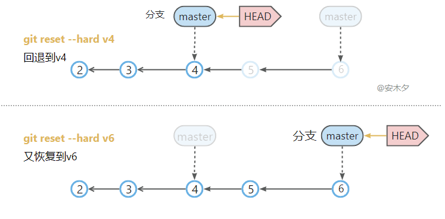
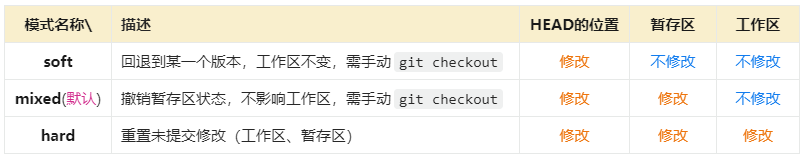
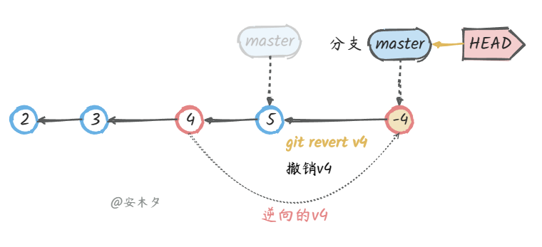
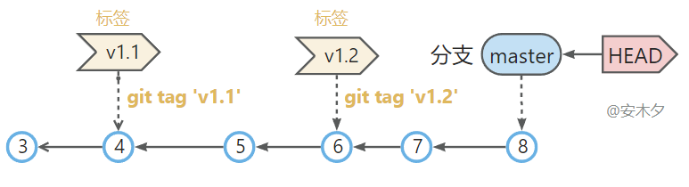
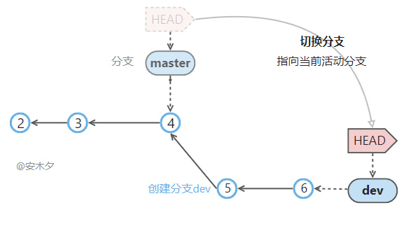
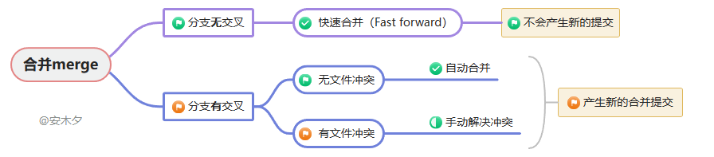
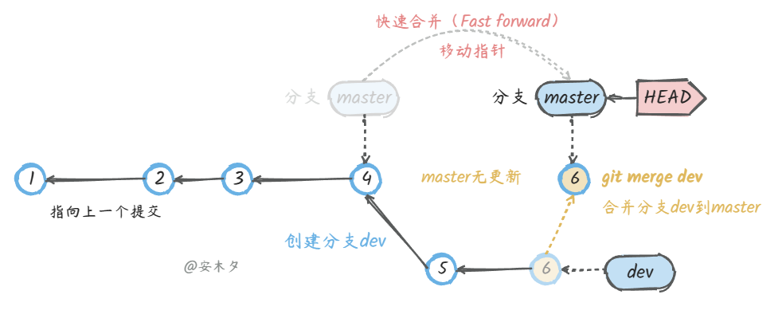
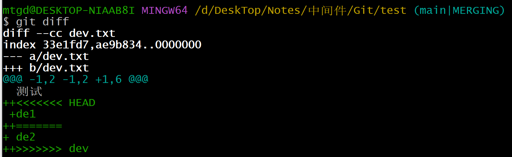
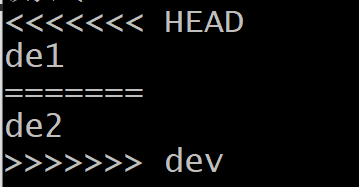

## 撤销

### 撤销指令

| 指令                        | 描述                                                         |
| --------------------------- | ------------------------------------------------------------ |
| git checkout .              | 撤销工作区的（未暂存）所有修改，把暂存区的内容(相当于上一个版本)恢复到工作区。 |
| git checkout --[fileName]   | 撤销工作区中某一个文件的修改，回到暂存区中的状态             |
| git checkout HEAD .         | 撤销工作区、暂存区的修改，用`HEAD`指向的当前分支最新版本替换工作区、暂存区 |
| git checkout HEAD [file]    | 同上，`file`指定文件                                         |
|                             |                                                              |
| git reset                   | 撤销暂存区状态，同`git reset HEAD`，不影响工作区             |
| git reset HEAD [file]       | 同上，指定文件`file`，`HEAD`可省略                           |
| git reset [commitId]        | 回退到指定版本，清空暂存区，不影响工作区。工作区需要手动`git checkout`签出 |
| git reset --soft [commit]   | 移动分支`master`、`HEAD`到指定的版本，不影响暂存区、工作区，需手动`git checkout`签出更新 |
| git reset --hard HEAD       | 撤销工作区、暂存区的修改，用当前最新版                       |
| git reset --hard HEAD^      | 回退到上一个版本                                             |
| git reset --hard HEAD~      | 回退到上一个版本，并重置工作区、暂存区内容。                 |
| git reset --hard [commitid] | 回退到某一个指定的版本                                                                                                                                                  每提交一个新版本，Git就会把它们自动串成一条时间线，所以通过指定版本号就可以回退到某一个特定的版本 |

**撤销有2种情况：**

1. 文件修改后，还没有放到暂存区，使用撤销修改就能回到和版本库一模一样的状态。(前提是暂存区的内容已经提交到版本库中)

2. 文件的修改已经添加到暂存区了，接着又作了修改，撤销修改就回到添加暂存区后的状态。(上一次的修改还没有提交到版本库中)


### 回退版本reset

  `reset`是专门用来撤销修改、回退版本的指令，支持的场景比较多，参数组合也比较多。简单理解就是**移动`master`分支 和 `HEAD`的“指针”地址。**

  如下图：

- 回退版本`git reset --hard v4` 或 `git reset --hard HEAD~2`，`master`、`HEAD`会指向`v4`这个版本的提交，`v5`、`v6`版本就被废弃了。
- 也可以重新恢复到`v6`版本：`git reset --hard v6`，就是移动`master`、`HEAD`的“指针”地址

​      

  `reset`有三种模式，对应三种参数：`mixed`(默认模式)、`soft`、`hard`。三种参数的主要区别就是对工作区、暂存区的操作不同。

- `mixed`为默认模式，参数可以省略。

- 只有`hard`模式会重置工作区、暂存区，一般用这个模式会多一点。

​     

  **穿梭前，用`git log`可以查看提交历史，以便确定要回退到哪个版本。要重返未来，用`git reflog`查看命令历史，以便确定要回到未来的哪个版本。**


### 撤销提交revert

  安全的撤销某一个提交记录，基本原理就是产生一个新的提交，用原提交的逆向操作来完成撤销操作。

  这不同于`reset`，`reset`是回退版本，revert只是用于撤销某一次历史提交，操作是比较安全的。

​     

  如上图：

- 想撤销`v4`的修改，执行`git revert v4`，会产生一个新的提交`v-4`，是`v4`的逆向操作。

- 同时更新`maser`、`HEAD`“指针”位置，以及工作区内容。
- 如果已`push`则重新`push`即可


## 标签管理

  **标签**（Tags）指的是某个分支某个特定时间点的状态，**是对某一个提交记录的的固定“指针”引用**。

​     一经创建，不可移动，存储在工作区`.git\refs\tags`目录下。可以理解为**是某一次提交(编号)的别名，常用来标记版本**。

​     所以发布时，一般都会打一个版本标签，作为该版本的快照，指向对应提交`commit`。

​    当项目达到一个关键节点，希望永远记住那个特别的提交快照，就可以使用 `git tag`给它打上标签。

​     比如今天完成了V1.1版本的开发、测试，并成功上线了，那就可给今天最后这个提交打一个标签“V1.1”，便于版本管理。

​    默认标签是打在最新提交的commit上的，如果想要在以前的提交上打标签则带上提交编号(即，commit id)：

  &ensp;&ensp;`git tag v0.9 f52c633`

​     

| **指令**                          | **描述**                                                   |
| :-------------------------------- | :--------------------------------------------------------- |
| git tag                           | 查看标签列表                                               |
| git tag -l 'a*'                   | 查看名称是“a”开头的标签列表，带查询参数                    |
| git show [tagname]                | 查看标签信息                                               |
| **git tag** [tagname]             | 创建一个标签，默认标签是打在最新提交的commit上的           |
| git tag [tagname] [commit id]     | 在指定commit上创建一个tag                                  |
| git tag -a v5.1 -m '这是v5.1版本' | 创建标签`v5.1`，`-a`指定标签名，`-m`指定说明文字           |
| git tag -d [tagname]              | 删除本地标签                                               |
| git checkout v5.1.1039            | 切换标签，同切换分支                                       |
| git push [remote] [tagname]       | 推送标签到仓库，因为标签不会默认随代码的推送而推送到服务端 |
| git push [remote] --tags          | 提交所有tag                                                |

  **标签总是和某个commit挂钩，如果这个commit既出现在master分支，又出现在dev分支，那么在这两个分支上都可以看到这个标签。**


## 分支

### 分支Branch

在实际项目中，一般会建几个主线分支。

- **master**：作为主分支，存放稳定的代码，就是开发后测试通过的代码，不允许随便修改和合并。

- **开发分支**：用于团队日常开发，比如团队计划10月份开发10个功能并发版，则在此分支上进行，不影响主分支的稳定。
- **功能A分支**：开发人员根据自己的需要，可以创建一些临时分支用于特定功能的开发，开发完毕后再合并到开发分支，并删除该分支。

**分支**就是指向某一个提交记录的“指针”引用，因此创建分支是非常快的，不管仓库多大。

当运行`git branch dev`创建了一个名字为`dev`的分支时，Git实际上是在`.git\refs\heads`下创建一个`dev`的引用文件（没有扩展名）

| **指令**                                           | **描述**                                                     |
| :------------------------------------------------- | :----------------------------------------------------------- |
| git branch                                         | 列出本地所有分支，星号表示活动分支   参数 `-v` 显示详细列表，下同 |
| git branch -r                                      | 列出远程所有分支                                             |
| git branch -a                                      | 列出本地所有分支和远程所有分支，会用不同颜色区分             |
| git branch [branch-name]                           | 在本地新建一个分支，但依然停留在当前分支                     |
| git branch [branch] [commit]                       | 在本地新建一个分支，指向指定的`commit id`                    |
| git branch --track [branch] [remote/branch]        | 在本地新建一个分支，与指定的远程分支建立关联                 |
| git branch -d dev                                  | 删除`dev`分支，-D(大写)强制删除                              |
| git branch --set-upstream [branch] [remote/branch] | 在现有分支与指定的远程分支之间建立跟踪关联                   |
|                                                    |                                                              |
| git checkout -b dev                                | 新建一个分支，并切换到新创建的分支                           |
| git checkout -b dev1 dev                           | 从本地`dev`分支创建一个 `dev1`分支，并切换到dev1分支         |
| **git checkout -b dev1 origin/dev**                | 从远程仓库origin 的`dev`分支创建本地`dev1`分支，并切换到dev1分支 |
| git checkout [branch-name]                         | 切换到指定分支，并更新工作区                                 |
| git merge [branch]                                 | 合并指定分支到当前分支  参数`--no-ff`禁用快速合并模式        |
| git push origin --delete [branch-name]             | 删除远程分支                                                 |
| git rebase master                                  | 将当前分支变基合并到`master`分支                             |
|                                                    |                                                              |
| ✅switch：新的分支切换指令                          | 切换功能和`checkout`一样，`switch`只单纯的用于切换           |
| git switch master                                  | 切换到已有的`master`分支                                     |
| git switch -c dev                                  | 创建并切换到新的`dev`分支                                    |


### 分支的切换

  代码仓库可以有多个分支，**`master`为默认的主分支，但只有一个分支在工作状态**。

  所以要操作不同分支，需要切换到该分支，**`HEAD`就是指向当前正在活动的分支。**	

​     

   使用 `git checkout dev`切换分支时，干了两件事：

​      &ensp;①、`HEAD`指向`dev`：修改`HEAD`的“指针”引用，指向`dev`分支。

​	   &ensp;②、还原工作空间：把`dev`分支内容还原到工作空间。

   此时的活动分支就是`dev`了，后续的提交都会更新到`dev`分支。

  **切换时还没提交的代码怎么办？**

- 如果修改（包括未暂存、已暂存）和待切换的分支没有冲突，则切换成功，且未提交的修改会一起带过去。

- 如果有冲突，则会报错，提示先提交或隐藏。


### 合并&冲突

  把两个分支的修改内容合并到一起，常用的合并指令`git merge [branch]`，将分支`[branch]`合并到当前分支。

  根据要合并的内容的不同，具体合并过程就会有多种情况：

​     


#### **分支无交叉**

  从main分支创建dev分支，如果**在两个分支中都进行了新增或删除文件的操作，但操作的不是同一个文件**，这种情况就是分支无交叉。

  此时，在main分支中合并dev分支不会出现冲突。

  注意：

&ensp;&ensp;1.**合并 dev 到 master前，要先切换到master分支**

&ensp;&ensp;2.**两个分支做出修改之后都要进行提交**(如果main分支的修改在没有提交之前就进行合并，则会被强制提交)

&ensp;&ensp;3.**main分支合并dev分支后文件处于commit状态**，还需要push到远程仓库。

**快速合并(Fast forward)**

  如下图，`master`分支没有任何提交，“`git merge dev`”合并分支`dev`到`master`，此时合并速度就非常快，直接移动

  `master`的“指针”引用到`dev`即可。这就是快速合并(Fast forward)，不会产生新的提交。

​      


#### **分支有交叉**

**无文件冲突**

  如果main分支和dev分支对同一个文件进行了修改，但修改的内容没有冲突，此时就可以进行合并。

  即，**假设main分支将test.txt文件的一行内容修改为123，dev分支将test文件的同一行的内容修改为12345，此时，**

&ensp;&ensp;&ensp;&ensp;**是没有冲突的，如果进行合并，则合并之后的内容为12345。而如果dev分支将内容改为了124，此时合并的话就会**

&ensp;&ensp;&ensp;&ensp;**出现冲突。**

​        

**有文件冲突(以下实验中，main分支和dev分支在同一个工作区)**

1. 从main分支创建dev分支后，如果**两个分支将同一个文件的同一个位置修改为了不同的内容**，此时合并则会出现冲突(此时，分支的状态变成了

   main|MERGING)：

```shell
#合并报错：
 Auto-merging dev.txt
 CONFLICT (content): Merge conflict in dev.txt
 Automatic merge failed; fix conflicts and then commit the result.
 
#此时，也可以使用下面的命令回到merge之前
git reset --merge 
```

2. 此时，执行`git diff`命令，就可以看到发生冲突的地方在哪里：

​      

​     Git用 <<<<<，`=======`，>>>>>标记出不同分支的内容，其中 <<<HEAD 是指主分支修改的内容，>>>>dev 是指dev上修改的内容。

   

3. 在main分支中查看发生冲突的文件dev.txt(vim dev.txt)：

​      

​      此时，人为决定保留哪一部分内容就可以了。

4. 保存好内容后，执行 `git add .` 和 `git commit -m ' '` 命令将修改提交，此时分支状态就会变回main。

5. 创建dev分支后，如果dev分支做出修改后还没有commit，则此时切换到main分支的话，是能看到dev分支做出的

   修改的，如果dev分支提交了修改，则在main分支中就看不到了。**原因应该是两个分支在同一个工作区，即，使用的是同一个目录。**


