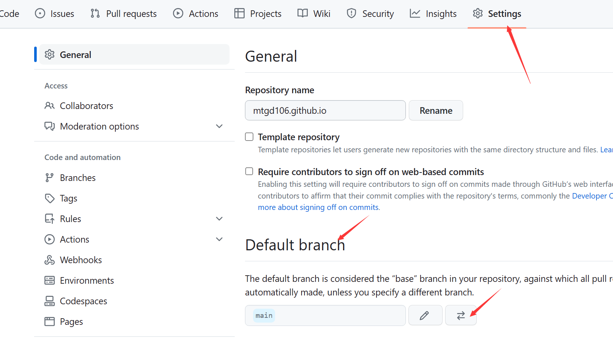
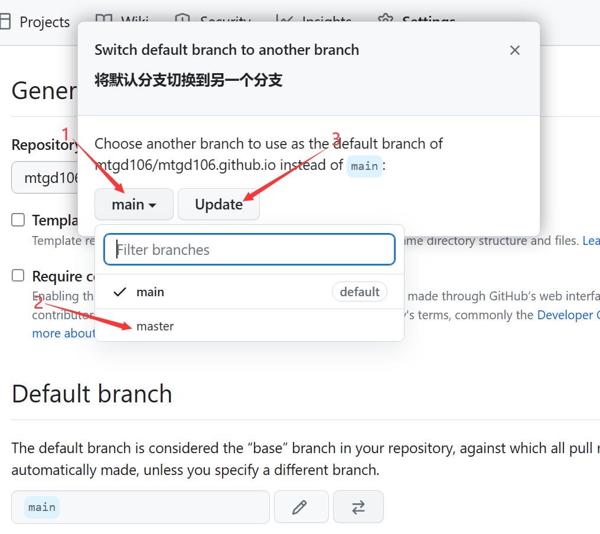
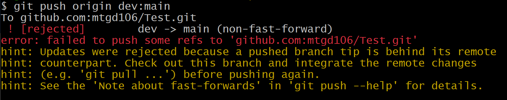
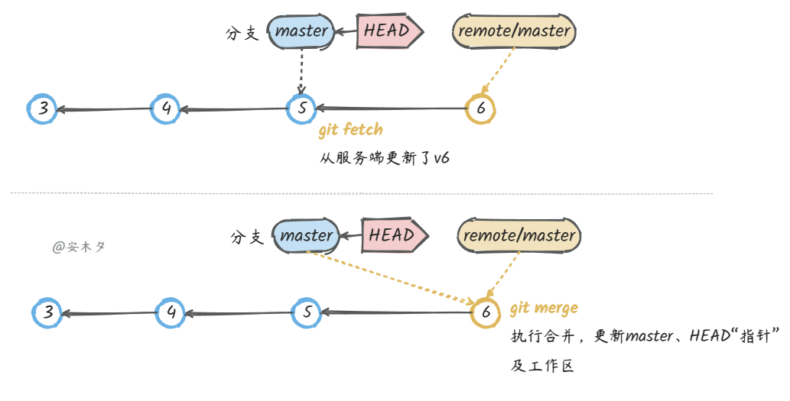

### 同时配置Github和Gitee

1.github和gitee可以使用不同的名称和邮箱

   ```bash
$ git config --global --unset user.name "你的名字"
$ git config --global --unset user.email "你的邮箱"
   ```


2.生成两对公钥和私钥

```bash
$ ssh-keygen -t rsa -C 'github邮箱号' -f ~/.ssh/id_rsa_github
$ ssh-keygen -t rsa -C 'gitee邮箱号' -f ~/.ssh/id_rsa_gitee
```

 **生成的文件在`C:\Users\用户名\.ssh`中。**


3.把公钥添加到Gitee和Github上

&ensp;&ensp;后缀名为.pub的文件为公钥


4.生成配置文件

&ensp;&ensp;在.ssh目录下，创建config文件(文件名就叫config，没有后缀)

```bash
# gitee
Host gitee.com
HostName gitee.com
PreferredAuthentications publickey
IdentityFile ~/.ssh/id_rsa_gitee

# github
Host github.com
HostName github.com
PreferredAuthentications publickey
IdentityFile ~/.ssh/id_rsa_github

```


5.测试

```bash
$ ssh -T git@gitee.com
$ ssh -T git@github.com
```

&ensp;&ensp;如果出现successfully即为成功。


### 推送项目到Github

 1.在项目的根目录下进入git bash

 2.执行 gin init 进行初始化，得到 .git 目录

 3.执行 `git add . `,将变更加入到暂存区中

 4.执行 git commit -m '提交信息'

 5.在git中绑定一个远程仓库

```bash
git remote add 别名 "链接地址"

#这个链接地址就代表仓库的位置，别名和链接地址就类似于域名和ip地址的关系，这个别名一般为 origin

# 输入命令 git remote -v 可以看到添加的仓库信息
```

&ensp;&ensp;例：添加远程仓库，并起一个别名为origin

```bash
git remote add origin git@github.com:mtgd106/mtgd106.github.io.git    #使用的仓库地址为仓库的SSH链接地址。
```


6.执行 `git push origin master` ,将项目内容推送到Github仓库的master分支(本地的分支也要是master分支)

  


### 更改默认分支

 **问题：**

&ensp;&ensp;在Github中，将默认分支改为了main，因为Github认为master有主人的意思，所以将master改为了main；

&ensp;&ensp;而在本地创建仓库时(git init)，默认的分支为master，所以，如果直接将本地项目推送到Github，则项目代码会保存到

&ensp;&ensp;仓库的master分支，而不是保存到默认的main分支。

&ensp;&ensp;如果直接打开仓库地址，则默认展现的main分支上的代码，如果想要查看master分支上的代码，还需要手动切换分支。

 **解决：**

​    1.在本地git init时将默认分支修改成main

```bash
git --version  //查看版本

git config --global init.defaultBranch main  //将默认分支修改成main

git init    //会在本地项目文件夹内创建.git文件夹

git add .  //将文件的变更添加到暂存区

git commit -a [描述的内容]    //将文件提交到本地仓库

git pull --rebase origin main    //拉取github上的readme.md

git push origin main   //上传代码
```

​        

   2.在github上将默认分支修改成master

​        

​            

  

   3.其他方法

​     1.当在Github中新创建了一个仓库之后，里面只有一个README.md文件(如果不添加其他文件的话)，这时，可以先将

&ensp;&ensp;该仓库的内容拉取到本地，会得到一个 .git文件夹和一个README.md 文件，且**默认分支名已经变为了main**。

   &ensp;&ensp;需要注意：当用git clone命令拉取时，会将仓库的名称一起拉取下来。

​	&ensp;&ensp;&ensp;例，假设仓库名称为test，当在 d:/vkls 目录下拉取时，就会在该目录下得到test目录，test目录中才是项目代码。

​     2.当想将该目录推送到Github时，就可以执行以下代码：

```bash
1. git add .

2. git commit -m '提交'

3. git push  git@github.com:mtgd106/Test.git 
```


### 命令简写

  在命令行窗口输入`git config --global -e` ，命令行窗口会直接进入到配置文件中，通过命令行方式进行编辑。

  配置内容：

```shell
[alias]
	st = status
	co = checkout
	br = branch
	mg = merge
	ci = commit
	rm = remote
```


### 报错

1.LF will be replaced by CRLF the next time Git touches it

&ensp;&ensp;原因：Dos/Windows平台默认换行符：回车(CR) +换行(LF)，即'\r\n'

&ensp;&ensp;&ensp;&ensp;&ensp;&ensp;&ensp;&ensp;&ensp;Mac/Linux平台默认换行符：换行(LF)，即'\n'

   &ensp;&ensp;服务器一般都是Linux系统进行管理，所以从Windows系统提交文件到Linux系统时会有替换换行符的需求。

   方法：

   &ensp;&ensp;1.适用于Windows系统，且一般为Windows默认设置，会在提交时对换行符进行CRLF - LF的转换，检出时又会进行LF - CRLF的转换。

```bash
#提交时转换为LF，检出时转换为CRLF
git config --global core.autocrlf true
```

​     2.适用于Linux系统，所有换行符都会进行CRLF - LF转换，但操作时不会转换回CRLF。

```bash
#提交时转换为LF，检出时不转换
git config --global core.autocrlf input
```


2.non-fast-forward

  

  原因：

​    **别人将代码上传到远程仓库后，你没有及时地同步到本地，但是你同时又添加了一些内容，以致于你在提交时，**

&ensp;**它会检测到你之前从远程仓库拉取的时候的仓库状态和现在的不一样。**

&ensp;**于是，它为了安全起见拒绝了你的提交（然后就报了这个错误）。**

  方法：先合并之前的历史，再进行提交

​     1.先把git的东西fetch到本地，然后merge后再push

```bash
#先抓取远程仓库的更新到本地，然后与本地仓库合并，这样就可以使远程仓库和本地仓库一致了，然后就可以提交修改了。
git fetch origin master

git merge origin FETCH_HEAD 
```

​    2.git pull --rebase origin master

​      重定基，可以使历史更加统一，使提交历史趋向于一条直线。


### 问答

#### **git clone 和 git pull 的区别**

**git clone：**

   &ensp;&ensp;1.从远程服务器克隆一个一模一样的版本库(仓库)到本地，**复制的是整个版本库**，叫做git clone。

​    &ensp;&ensp;&ensp;即，将一个库复制到本地，是一个本地从无到有的过程。**包括里面的日志信息，项目里的分支，也可以直接切换、**

&ensp;&ensp;&ensp;&ensp;**使用里面的分支等。**

  &ensp;&ensp;git clone是远程操作的第一步，通常是从远程主机克隆一个版本库。

```bash
 git clone '远程仓库地址(ssh/http)'   
```

&ensp;&ensp;2.该命令**会在本地生成一个目录，与远程主机的版本库同名。**

 &ensp;&ensp;&ensp;&ensp;如果想要使用不同的目录名，可以使用git clone 命令的第二个参数设置本地目录名：

```bash
git clone '仓库地址' '本地目录名'
```


**git pull：**

  &ensp;&ensp;在本地有版本库的情况下，从远程服务器获取到一个branch的更新到本地，并更新本地库。

  &ensp;&ensp;即，**取回服务器上某个分支的更新，再与本地的指定分支进行合并。**

```bash
git pull origin next:master   		#获取远程服务器origin上next分支的更新，然后和本地的master分支合并
```

   &ensp;&ensp;如果远程分支是与当前分支合并，则冒号后面的部分可以省略。

   &ensp;&ensp;该命令相当于： `git fetch origin` + `git merge origin/next`


**区别：**

   1.是否需要本地初始化仓库

>  git clone是将整个工程复制下来，所以不需要本地是仓库（即没有.git文件夹）

>    git pull需要先初始化本地文件夹作为一个仓库

   2.切换分支的问题

>    clone出的项目可以自由切换远端已有的分支。

>   pull只能操作当前拉取的分支，不能切换到其他分支。

  3.push的问题

>  clone下来的项目可以直接指定分支推送到远程仓库

>  pull下来的项目需要先执行 git remote add  name  url 命令来添加远程仓库，然后才能push


**适用场景**：

  &ensp;&ensp;通常情况下，远程操作的第一步，是使用git clone从远程主机克隆一个版本库到本地。

  &ensp;&ensp;**本地修改代码后，每次从本地push到远程仓库之前都要先进行git pull操作，保证push到远程仓库时没有版本冲突。**

  &ensp;&ensp;在某些场合，git会自动在本地和远程分支之间，建立一种追踪关系。比如，在git clone 的时候，所有本地分支默认

&ensp;&ensp;&ensp;&ensp;与远程主机的同名分支建立追踪关系。也就是，Git 会自动创建一个名为 master 的本地分支来跟踪 origin/master。   

  &ensp;git也可以手动建立追踪：

```bash
git branch --set-upstream-to=origin/远程分支名称 本地分支名称
```

  


#### **pull和fetch的区别**

  两者都是从服务端获取更新，主要区别是`fetch`不会自动合并，不会影响当前工作区内容。

```bash
git pull = git fetch + git merge
```

- 如下面图中，`git fetch`只获取了更新，并未影响`master`、`HEAD`的位置。

- 要更新`master`、`HEAD`的位置需要手动执行`git merge`合并。

​     


